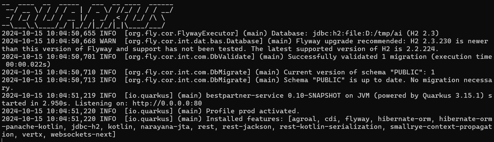

[](https://confluence.jetbrains.com/display/ALL/JetBrains+on+GitHub)

BestPartner project
======================
## 說明
1. 該專案為一個AI應用大平台，可動態建立 AI agent 並支援多種 AI 模型
2. 各API範例可參考Postman Collection: [連結](https://github.com/a09090443/bestpartner/blob/master/docs/postman/basepartner.postman_collection.json)

## 功能
1. 支援 OpenAI 及 Ollama 平台
2. 支援 Chroma 及 Milvus 向量資料庫
3. 可由資料庫設定 LLM 模型並可動態切換

## 目錄結構
```
bestpartner
├─bestpartner-service
└─src
├─main
│  ├─docker
│  ├─java
│  │  └─tw
│  │      └─zipe
│  │          └─basepartner
│  ├─kotlin
│  │  └─tw
│  │      └─zipe
│  │          └─basepartner
│  │              ├─assistant
│  │              ├─builder
│  │              │  ├─aigcmodel
│  │              │  └─vector
│  │              ├─config
│  │              │  ├─chatmodel
│  │              │  ├─embedding
│  │              │  └─vector
│  │              ├─dto
│  │              ├─entity
│  │              ├─enumerate
│  │              ├─form
│  │              ├─model
│  │              ├─properties
│  │              ├─provider
│  │              ├─repository
│  │              ├─resource
│  │              ├─service
│  │              ├─tool
│  │              └─util
│  └─resources
│      └─db
│          └─migration
├─docs
├─ .gitignore
├─ build.gradle.kts
├─ gradle.properties
├─ gradlew
├─ gradlew.bat
├─ README.md
└─ settings.gradle.kts
```

## 事前準備
模組平台:

選擇1. 安裝 Ollama 並下載 LLM models
- Ollama 安裝: [連結](https://blog.darkthread.net/blog/ollam-open-webui/)
- Docker compose 運行: [連結](https://blog.darkthread.net/blog/ollam-open-webui/)

選擇2. OpenAI 申請 api key [官網](https://openai.com/)

向量資料庫(建議使用 docker 並可擇一使用):

預設使用InMemoryEmbeddingStore

安裝 Chroma
- Chroma 安裝: [連結](https://cookbook.chromadb.dev/core/install/#chroma-jsts-client)

安裝 Milvus
- Milvus 安裝: [連結](https://www.milvus-io.com/getstarted/standalone/install_standalone-docker)

## 開發環境
* OpenJDK 21
* Ollama latest
* LLM models
* Chroma latest
* Milvus latest
* Kotlin 2.0.10
* Quarkus 3.15.1
* Langchain4j 0.35.0
* Gradle latest
* Postman latest
* H2 Database latest

## 程式執行注意事項
- 目前使用H2 Database，可在application.properties中設定
- 初始化資料庫可使用Flyway，可在application.properties中設定，quarkus.flyway.migrate-at-start = true

## 程式打包執行
1. 切換至 bestpartner-service 目錄,執行 gradle clean build -x test -Dquarkus.package.type=uber-jar -Dquarkus.profile=${profile}
- ${profile} 可取代 dev, sit, prod
2. 打包完成後，jar file產生位置:bestpartner-service/build/bestpartner-service-0.10-SNAPSHOT-runner.jar
3. 執行 java -jar bestpartner-service-0.10-SNAPSHOT-runner.jar
4. 運行畫面:(http://localhost)


## 開發紀錄
* 2024.10.23 BestPartner 0.1.1 版本完成
  + 新增 Chroma、Milvus 向量資料庫支援
  + 新增 RAG 功能
  + 新增 H2 Database 支援

---
* 2024.10.15 BestPartner 0.1.0 初版完成

## 版權聲明
可以免費學習使用，個人可以免費是接取使用，商業應用請聯絡作者授權，測試文件皆為自行建立或者網路公開資料。

## 備註
* Langchain4j 官網說明:[連結](https://docs.langchain4j.dev/)
* 如有有興趣想討論，或有任何想法想加入開發，可跟我聯絡，信箱:zipe.daden@gmail.com
* 目前以 h2 database 為預設資料庫，之後會支援 Mysql 資料庫
