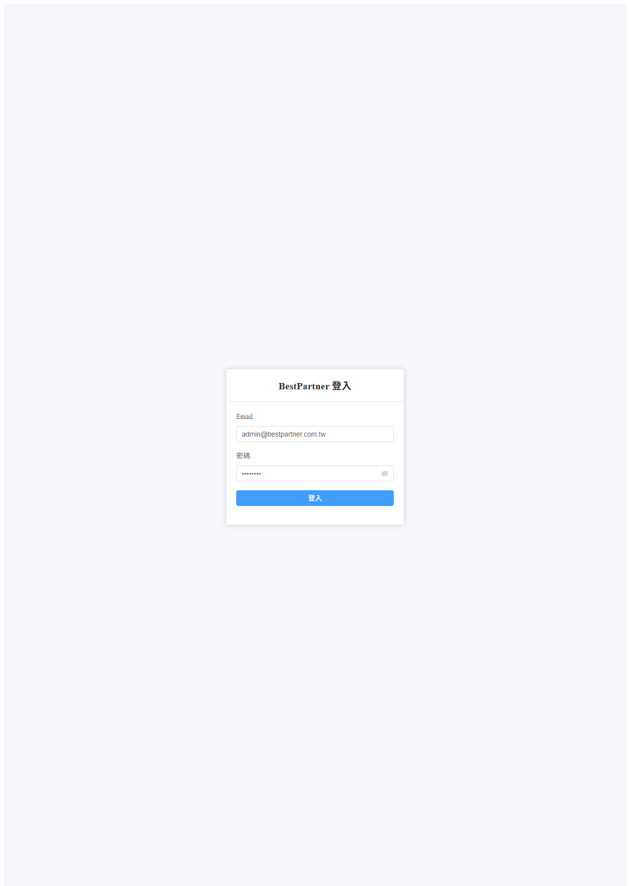
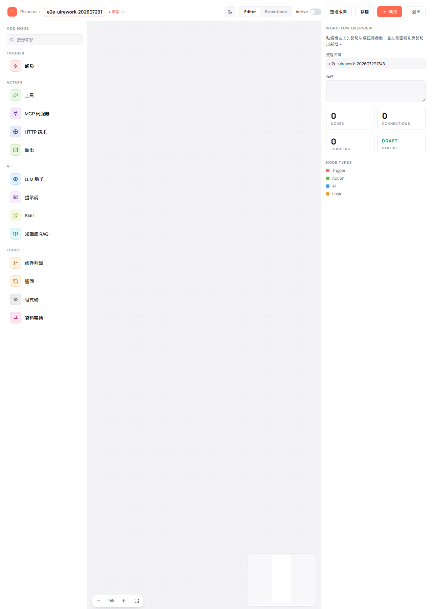

# 登入與登出

> 適用版本：0.1.8-SNAPSHOT ｜ 畫面擷取自 E2E 驗證：202607291748

BestPartner 的所有功能都需要登入後才能使用。本章說明如何登入、登入後會看到什麼，以及在哪裡登出。

---

## 登入系統

**使用情境**：每天開始使用系統時，或登出後要重新進入時。

1. 開啟系統網址，畫面會顯示「BestPartner 登入」卡片。在 **Email** 欄輸入你的帳號信箱、**密碼** 欄輸入密碼。

   > Email 欄會檢查格式，必須輸入完整的電子郵件位址（例如 `admin@bestpartner.com.tw`），只填帳號名稱無法送出。

   

2. 點藍色的 **登入** 按鈕。

**完成後你會看到**：畫面自動切換到「我的 Workflow」清單頁，右上角出現 **登出** 連結，代表已經登入成功。

> 💡 未登入時直接輸入受保護的網址（例如流程清單或編輯畫面），系統會自動把你帶回登入頁；登入後才會回到原本要去的地方。

---

## 登出

**使用情境**：離開座位、或要換一個帳號使用時。

登出入口有兩個，都在畫面右上角：

| 你在哪一頁 | 登出位置 |
|-----------|---------|
| 我的 Workflow 清單頁 | 右上角的 **登出** |
| 流程編輯畫面 | 工具列最右側的 **登出** |

**完成後你會看到**：畫面回到登入頁。此時再輸入受保護的網址也會被帶回登入頁，必須重新登入。

> ⚠️ **在編輯畫面登出前請先存檔。** 若流程有尚未存檔的變更，系統會先跳出「尚未存檔」確認視窗，詢問「有未存變更，確定要登出嗎？」——選「取消」會留在編輯畫面且維持登入狀態，可以繼續編輯；選確認才會登出，**未存檔的變更會遺失**。

> 📷 **待補畫面**：登出後回到登入頁的畫面、以及「尚未存檔」確認視窗 — 目前 E2E 證據未涵蓋（J1-05～J1-08 於最近幾輪未執行）。

---

## 登入失敗時

帳號或密碼錯誤時，畫面會停留在登入頁並顯示錯誤訊息，不會進入系統。請確認：

- Email 是否輸入完整（含 `@` 與網域）
- 密碼是否正確（右側的眼睛圖示可切換顯示密碼，用來確認有沒有打錯）

> 📷 **待補畫面**：帳密錯誤時的錯誤提示 — 目前 E2E 證據未涵蓋（J1-04 於最近幾輪未執行）。
