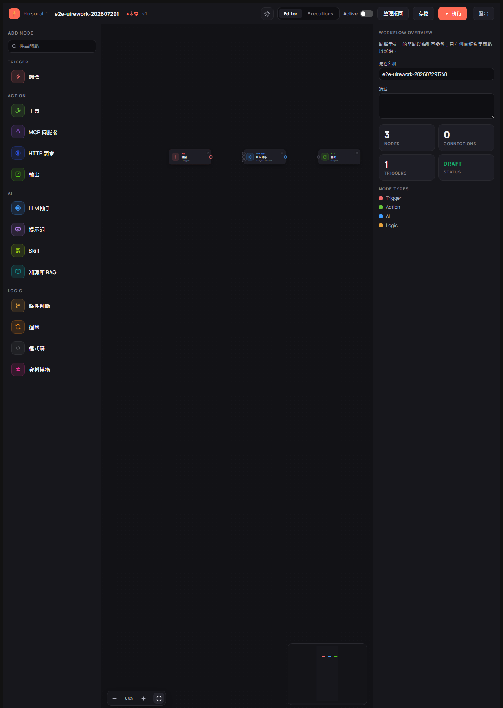
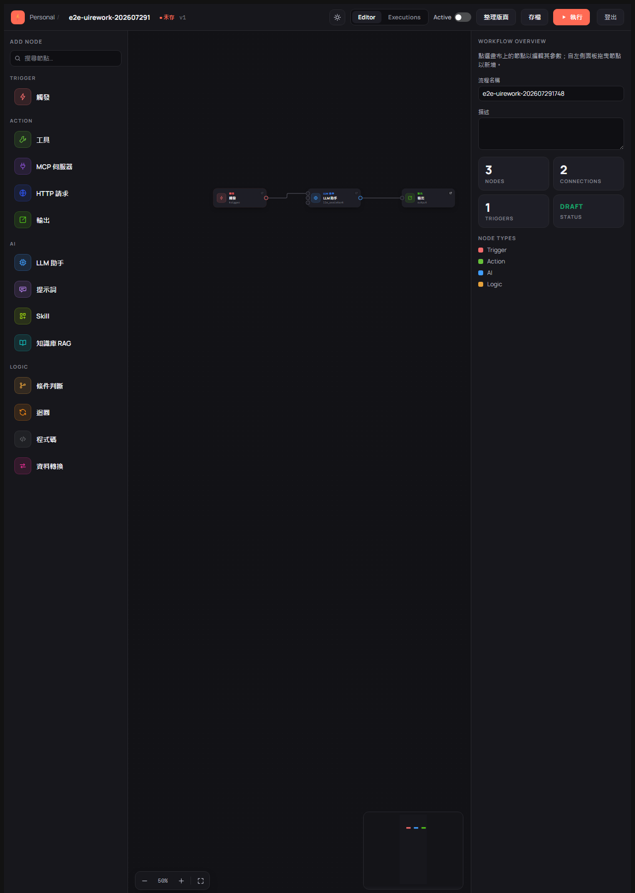
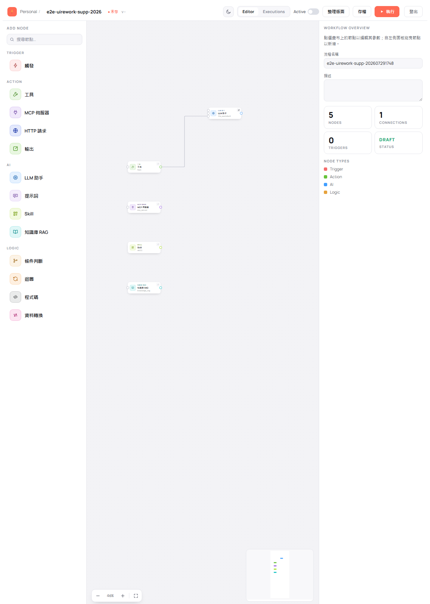
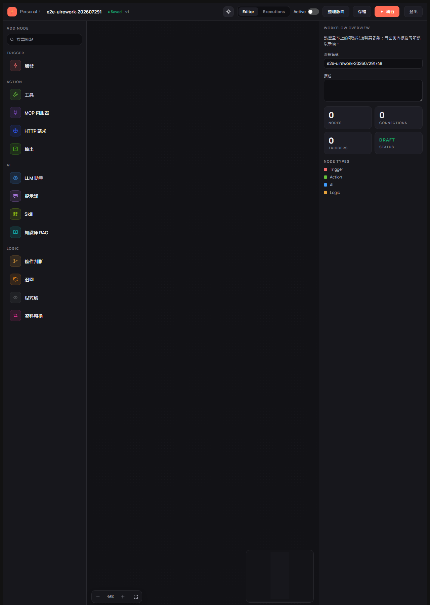

# 在畫布上編輯流程

> 適用版本：0.1.8 ｜ 畫面擷取自 E2E 驗證：202607291748

流程編輯畫面是你組裝 AI 流程的地方：從左邊拖出節點、用線把它們串起來、存檔。本章說明畫面各區塊的用途與基本操作。

---

## 認識編輯畫面

畫面分成四個區塊：

| 區塊 | 位置 | 用途 |
|------|------|------|
| 工具列 | 最上方 | 返回流程清單、流程名稱、存檔狀態、深淺色切換、Editor／Executions 切換、Active 開關、整理版面、存檔、執行、登出 |
| 節點面板（ADD NODE） | 左側 | 可用的節點清單，依 TRIGGER／ACTION／AI／LOGIC 分類；上方有搜尋框 |
| 畫布 | 中央 | 放置節點與拉線的地方，左下角是縮放列，右下角是縮圖導覽 |
| 流程總覽（WORKFLOW OVERVIEW） | 右側 | 流程名稱、描述、節點數、連線數、觸發點數與狀態；點選節點後這裡會換成該節點的設定表單 |

可用的節點共 13 種，依用途分成四類：

- **TRIGGER**：觸發
- **ACTION**：工具、MCP 伺服器、HTTP 請求、輸出
- **AI**：LLM 助手、提示詞、Skill、知識庫 RAG
- **LOGIC**：條件判斷、迴圈、程式碼、資料轉換

---

## 加入節點

**使用情境**：開始組裝流程，或替既有流程補上一個步驟。

1. 在左側節點面板找到要用的節點（也可以在上方搜尋框輸入關鍵字過濾）。
2. 把它**拖曳**到中央畫布上想放的位置後放開。

**完成後你會看到**：畫布出現一張節點卡，右側總覽面板的 `NODES` 數字增加；放入「觸發」節點時 `TRIGGERS` 也會加一。

> 💡 每張流程至少要有一個 **觸發** 節點才能啟用與執行，通常也會用 **輸出** 節點決定最後要回傳什麼。

---

## 連接節點

**使用情境**：決定流程的先後順序——先做什麼、再做什麼。

1. 把游標移到來源節點**右側**的圓點上，按住不放。
2. 拖到目標節點**左側**的圓點上放開。

**完成後你會看到**：兩節點之間出現一條連線，右側總覽的 `CONNECTIONS` 數字增加。

> 💡 **LLM 助手節點左側有多個圓點**，由上到下分別是一般輸入、提示輸入與工具輸入，用途不同（見下一節與 [節點設定](04-node-settings.md)）。連錯埠時系統會擋下並顯示提示，連線不會建立。

---

## 幫 LLM 助手加上能力

**使用情境**：希望 AI 回答時能查資料、呼叫工具或參考知識庫。

工具、MCP 伺服器、Skill、知識庫 RAG 這四種節點**不是流程的一個步驟**，而是掛在 LLM 助手上的「能力」。做法是把它們拖到畫布後，從它右側的圓點拉線到 **LLM 助手的工具埠**（左側最下方的圓點）。

**完成後你會看到**：連線建立，`CONNECTIONS` 加一。執行流程時，這些能力節點**不會**像一般步驟那樣單獨亮起或產生自己的執行結果——它們是由 LLM 助手在需要時自行使用。

> 💡 同一個 LLM 助手可以同時掛多個能力節點，也可以同時掛多個知識庫。
> ⚠️ 只有工具、MCP 伺服器、Skill、知識庫 RAG 可以連到工具埠。連其他節點時會出現提示「**僅工具、MCP、Skill、知識庫節點可連到 LLM 的工具埠**」，連線不會建立。

---

## 存檔

**使用情境**：畫好或改好流程後保存。

點工具列的 **存檔**。

**完成後你會看到**：畫面出現「已存檔」提示，流程名稱旁的標記由「未存」變成「Saved」，版本號加一（例如 v1 → v2）。

> 💡 **草稿允許不完整。** 上圖中畫面同時出現橘色提示「節點 vug4Am1m 缺少必填欄位：工具名稱」，但存檔仍然成功——這是刻意的設計，讓你可以先把流程畫完、之後再回頭補設定。這些缺漏會在**啟用或執行時**被擋下，詳見 [檢查與啟用流程](05-validate-activate.md)。
>
> （圖中的流程名稱為測試資料，實際請自行命名。）

> ⚠️ 離開編輯畫面前若有未存變更，系統會跳出「尚未存檔」確認視窗詢問「有未存變更，確定要離開嗎？」。選「取消」可留下來繼續編輯。

---

## 調整版面與檢視

這些操作只影響你看到的畫面，不會改變流程內容：

| 想做什麼 | 怎麼做 |
|---------|--------|
| 放大／縮小畫布 | 畫布左下角縮放列的 **−** ／ **＋**，中間顯示目前的百分比 |
| 讓所有節點剛好入鏡 | 縮放列最右側的**適應視窗**按鈕 |
| 自動排列節點位置 | 工具列的 **整理版面** |
| 切換深色／淺色 | 工具列的月亮／太陽圖示 |

> 💡 深淺色偏好會被記住，下次進編輯畫面時自動套用；離開編輯畫面到清單頁或登入頁時則一律為淺色。
> 本手冊的截圖同時包含淺色與深色畫面，配色不同不影響操作位置。
