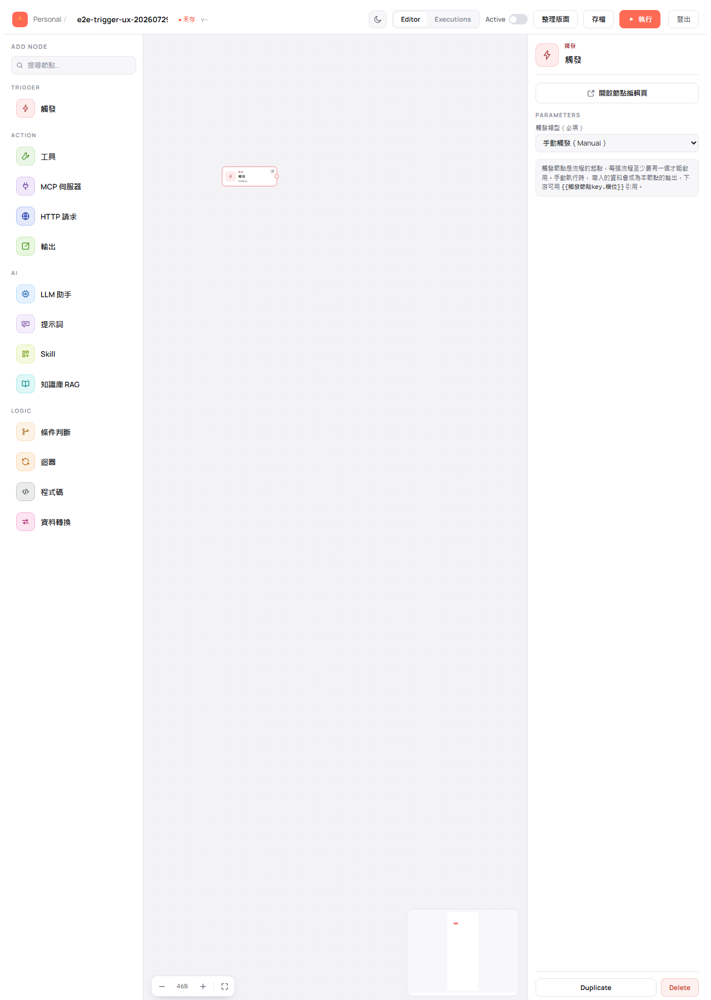
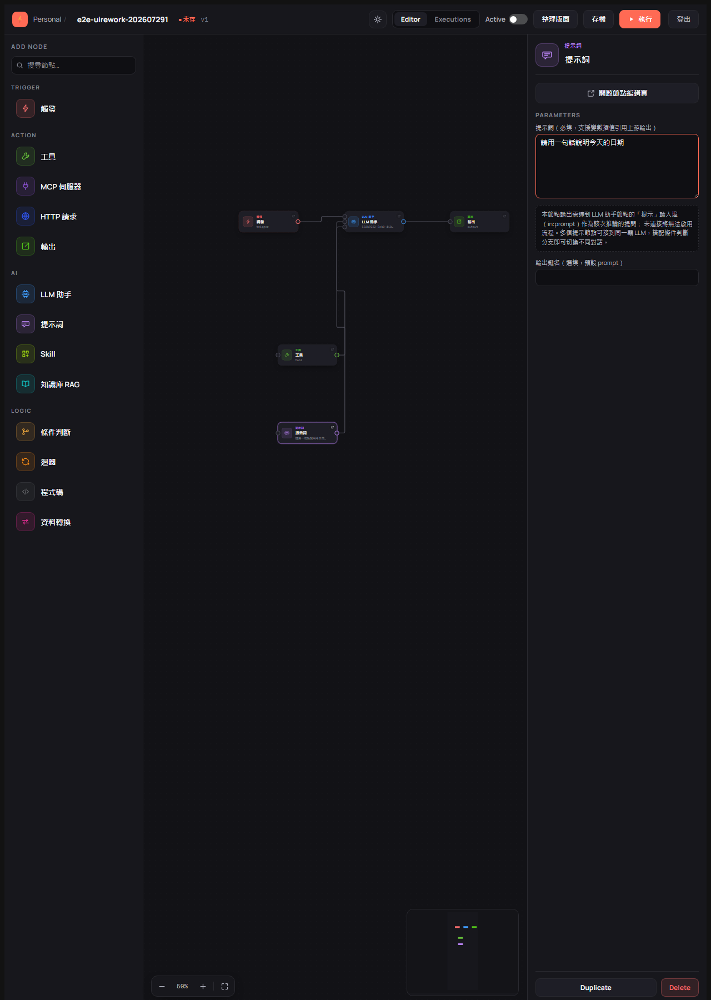
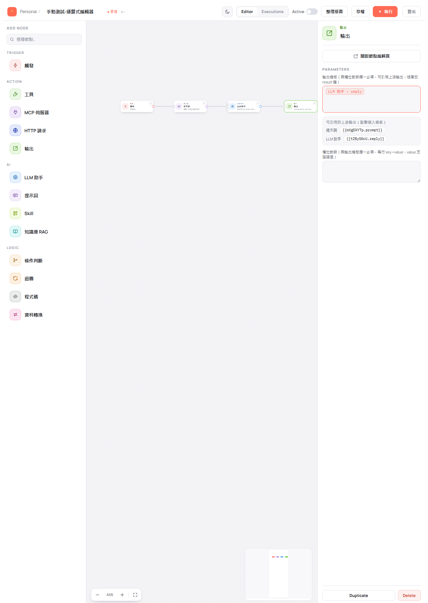
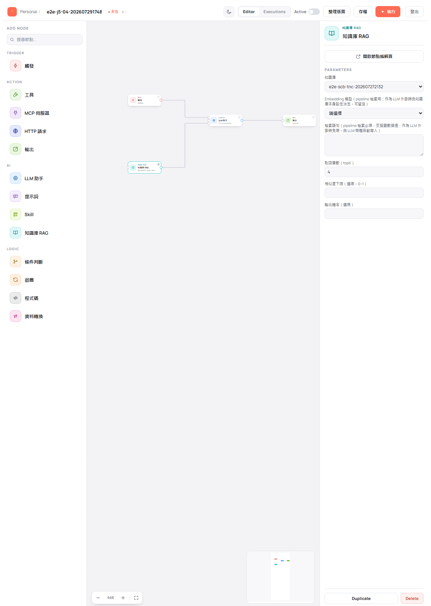
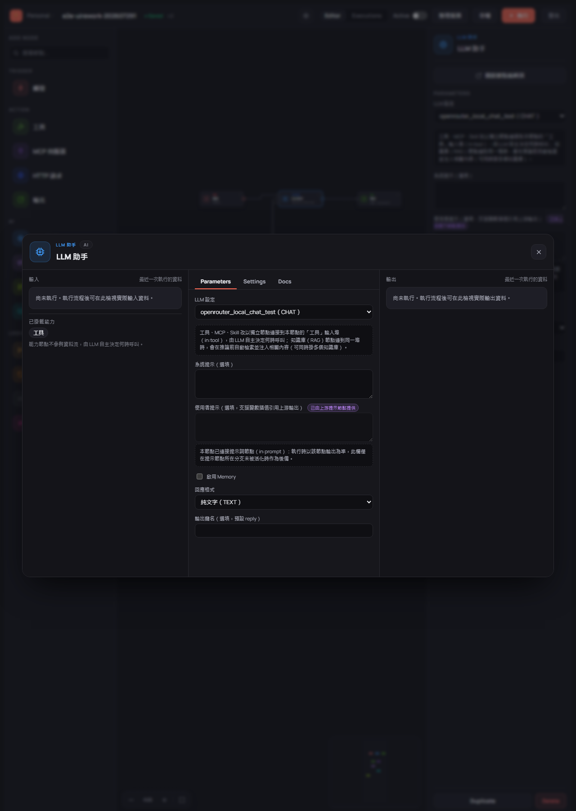
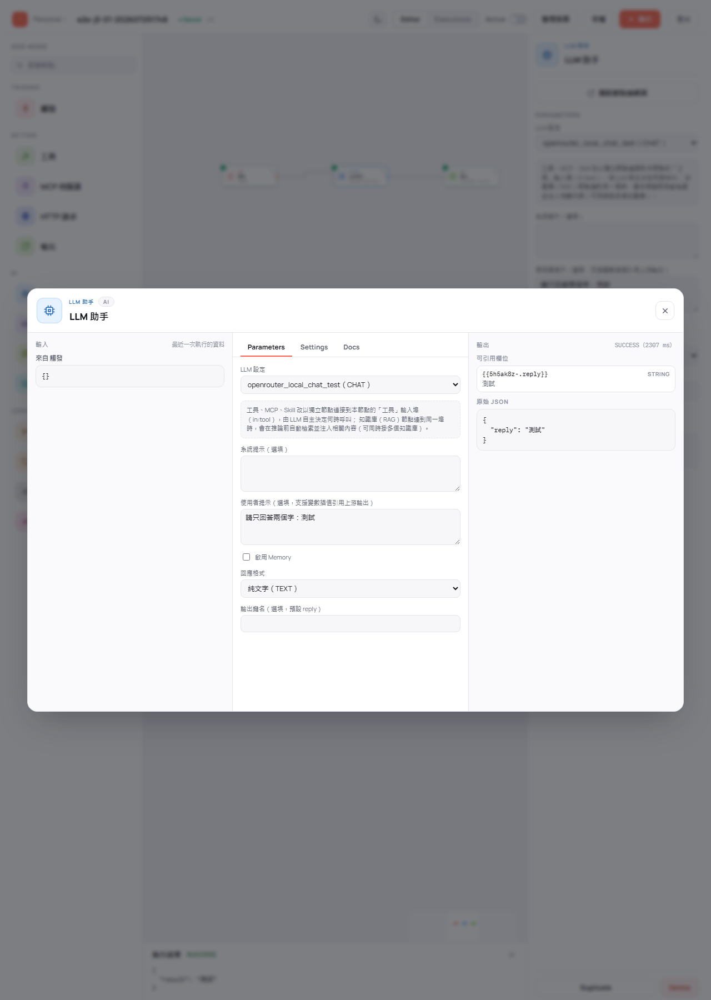

# 設定節點

> 適用版本：0.1.8-SNAPSHOT ｜ 畫面擷取自 E2E 驗證：202607291748

節點放上畫布後還要告訴它「要做什麼」。本章說明在哪裡設定節點，以及常用節點各有哪些欄位。

---

## 兩種設定方式

| 方式 | 怎麼開 | 適合什麼時候 |
|------|--------|------------|
| 右側設定面板 | **點一下**畫布上的節點 | 快速改一兩個欄位 |
| 節點編輯頁（全畫面） | **雙擊**節點卡、點節點卡右上角的展開圖示，或點設定面板上方的 **開啟節點編輯頁** | 要一併看這個節點的輸入與輸出資料 |

兩邊改的是同一份設定，改完會即時互相同步，並在工具列標記為「未存」——**記得存檔**。

設定面板最下方還有兩個按鈕：**Duplicate**（複製一個相同設定的節點）與 **Delete**（刪除這個節點）。

---

## 觸發：流程的起點

點選觸發節點，設定面板只有一個欄位 **觸發類型（必填）**，預設值為 **手動觸發（Manual）**，拖進畫布時就已經填好，通常不需要更動。

**完成後你會看到**：面板下方的說明「觸發節點是流程的起點，每張流程至少要有一個才能啟用。手動執行時，帶入的資料會成為本節點的輸出，下游可用 `{{觸發節點key.欄位}}` 引用。」

> 💡 下拉選單中的 WEBHOOK、CRON 目前為停用狀態，代表尚未開放。

---

## LLM 助手：讓 AI 回答

點選 LLM 助手節點，主要欄位如下：

| 欄位 | 說明 |
|------|------|
| **LLM 設定** | 要使用哪一組已建立的 AI 模型設定（必填） |
| 系統提示（選填） | 給 AI 的角色設定，例如「你是一位嚴謹的助理」 |
| 使用者提示（選填） | 這次要問 AI 的問題；支援引用上游節點的輸出 |
| 啟用 Memory | 是否讓這個節點記住對話脈絡 |
| 回應格式 | 純文字（TEXT）等 |
| 輸出鍵名（選填） | 這個節點輸出的欄位名稱，預設為 `reply` |

> 💡 面板中間的說明指出：工具、MCP、Skill 改以獨立節點連到本節點的「工具」輸入埠，由 LLM 自主決定何時呼叫；知識庫（RAG）節點連到同一埠時，會在推論前自動檢索並注入相關內容（可同時掛多個知識庫）。掛法見 [在畫布上編輯流程](03-canvas-editing.md#幫-llm-助手加上能力)。

> ⚠️ 若這個 LLM 助手已經接上提示詞節點，「使用者提示」欄旁會出現 **已由上游提示節點提供** 標記，並說明「本節點已連接提示詞節點（in:prompt）：執行時以該節點輸出為準，此欄僅在提示節點所在分支未被活化時作為後備。」欄位仍可編輯，但**執行時以提示詞節點為準**。

---

## 提示詞：把問題獨立成一個節點

提示詞節點只有兩個欄位：**提示詞（必填）** 與 **輸出鍵名（選填，預設 prompt）**。

**完成後你會看到**：面板說明「本節點輸出需連到 LLM 助手節點的『提示』輸入埠（in:prompt）作為該次推論的提問；未連接將無法啟用流程。多個提示節點可接到同一顆 LLM，搭配條件判斷分支即可切換不同對話。」

> ⚠️ 提示詞節點**一定要連到 LLM 助手的提示埠**，否則流程無法啟用、執行也會被擋下。

---

## 輸出：決定流程最後回傳什麼

輸出節點的兩個主要欄位是**擇一必填**：

| 欄位 | 說明 |
|------|------|
| **輸出模板** | 自由撰寫的文字，中間可插入其他節點的輸出 |
| **欄位對映** | 每行一組 `key=value`，value 同樣可以插入其他節點的輸出 |

兩個都沒填時，面板上方會顯示橘色提示 **缺少必填欄位：範本 或 欄位對應（擇一）**，下方也會提醒「輸出模板與欄位對映至少要填一個，否則流程執行到本節點會失敗。」

**引用上游節點的輸出**：面板中間的「可引用的上游輸出（點擊插入模板）」會列出畫布上其他節點可用的欄位，例如「提示詞」「LLM 助手」。**點一下就會插入到模板游標處**，不需要自己記代碼。

---

## 引用會顯示成色塊

在輸出模板中插入引用後，畫面上不會顯示一串代碼，而是渲染成可讀的色塊，例如 **LLM 助手 › reply**。

> 💡 **把節點改名後，色塊上的名稱會跟著變**，引用本身不會失效——你可以放心替節點取好記的名字。
> 💡 若引用的節點已被刪除，色塊會以紅色虛線標示，提醒你這個引用抓不到資料。

---

## 知識庫 RAG：讓 AI 參考你的文件

點選知識庫 RAG 節點，欄位如下：

| 欄位 | 說明 |
|------|------|
| **知識庫** | 要查詢哪一個已建立的知識庫（必填） |
| Embedding 模型 | 作為 LLM 外掛時可留空，由知識庫本身的設定決定 |
| 檢索語句 | 作為 LLM 外掛時免填，由 LLM 的問題自動帶入 |
| 取回筆數（topK） | 一次取回幾段相關內容，預設 4 |
| 相似度下限（選填，0-1） | 低於此相似度的內容不採用 |
| 輸出鍵名（選填） | 這個節點輸出的欄位名稱 |

> 💡 這個節點有兩種用法，**必填欄位不一樣**：
> - **掛在 LLM 助手的工具埠**（如上圖）：只需要選知識庫，檢索語句與 Embedding 模型都免填。
> - **當成流程中的一個步驟**（接一般輸入埠）：需要另外填檢索語句。

---

## 節點編輯頁：一次看懂輸入、設定與輸出

雙擊節點卡會開啟全畫面的節點編輯頁，分成三欄：

| 欄位 | 內容 |
|------|------|
| 左：輸入 | 這個節點最近一次執行時收到的資料，以及掛在它身上的能力節點 |
| 中：分頁 | **Parameters**（設定欄位）／**Settings**（節點代碼、型別、必填檢核）／**Docs**（這個節點的用法說明） |
| 右：輸出 | 這個節點最近一次執行產生的資料 |

流程還沒執行過時，左右兩欄會顯示「尚未執行。執行流程後可在此檢視實際資料。」執行過之後，就會換成真實資料：

**完成後你會看到**：右欄標示執行狀態與耗時（例如 `SUCCESS（2307 ms）`）、可引用欄位（例如 `{{5h5ak8z-.reply}}`）與原始 JSON；左欄則顯示資料「來自 觸發」。

> ⚠️ **想看執行後的資料，請不要先關掉底部的執行結果面板**——關閉會清空本次執行的暫存資料，節點編輯頁就沒有東西可顯示了。
> 💡 在節點編輯頁的名稱欄打字時按 <kbd>Delete</kbd> 只會刪字，不會刪掉節點。

> 📷 **待補畫面**：工具、MCP 伺服器、Skill 三種節點的設定面板 — 這些表單已由 E2E 驗證通過（J6-02），但本手冊尚未取得可引用的單獨畫面。
