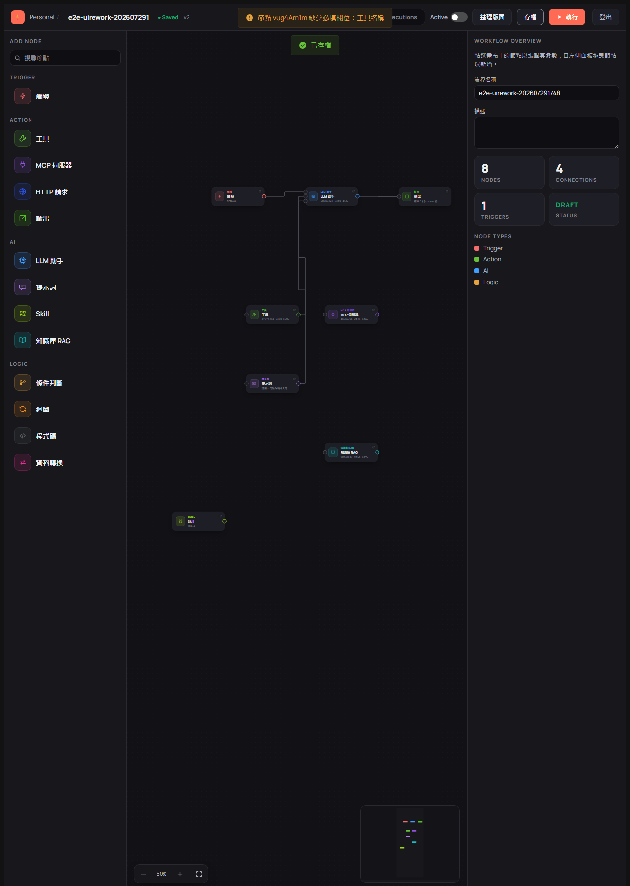
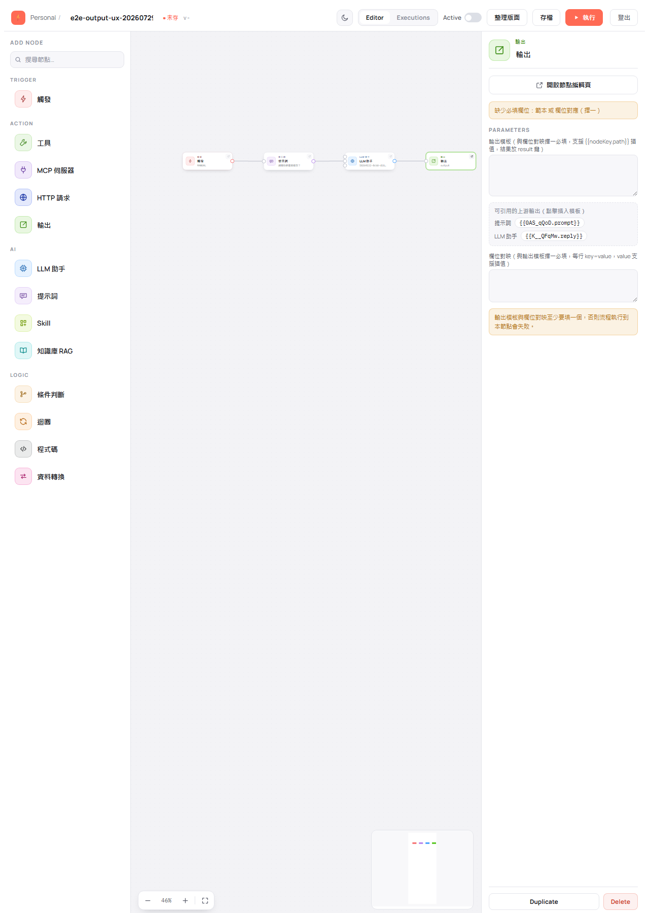

# 檢查與啟用流程

> 適用版本：0.1.8-SNAPSHOT ｜ 畫面擷取自 E2E 驗證：202607291748

流程在三個時機會被檢查：**存檔**、**啟用**、**執行**。三者的嚴格程度不同，理解這點可以省下很多「為什麼存得起來卻跑不動」的困惑。

---

## 三個時機，三種嚴格程度

| 時機 | 檢查什麼 | 沒過會怎樣 |
|------|---------|-----------|
| 存檔 | 只擋結構性錯誤（例如節點設定格式不正確） | 大部分缺漏都放行，讓你先存草稿 |
| 啟用（Active 開關） | 完整檢查，確保「啟用＝可執行」 | 開關維持關閉，狀態仍是草稿，並顯示原因 |
| 執行 | 與啟用同一套檢查 | 執行結果顯示失敗與原因，不會真的跑 |

---

## 存檔時：缺漏會提醒，但不擋你

草稿允許不完整。存檔時若某個節點還缺必填欄位，畫面上方會出現橘色提示（例如「節點 vug4Am1m 缺少必填欄位：工具名稱」），但**存檔仍然成功**。



> 💡 這是刻意設計：讓你可以先把流程畫完再回頭補設定。但這些缺漏會在啟用或執行時被擋下。

---

## 邊填邊看：面板上的必填提示

不必等到執行才知道哪裡沒填。點選節點時，設定面板上方就會顯示這個節點還缺什麼。例如輸出節點兩個欄位都空著時，會顯示 **缺少必填欄位：範本 或 欄位對應（擇一）**。



---

## 啟用流程

**使用情境**：流程已經測試沒問題，要正式啟用。

在編輯畫面工具列把 **Active** 開關打開（流程清單頁每一列也有 **啟用** 按鈕）。

啟用前系統會逐項檢查，**任何一項不過都會擋下，開關維持關閉、狀態仍是草稿**：

| 檢查項目 | 沒過的意思 |
|---------|-----------|
| 至少要有一個觸發節點 | 流程沒有起點 |
| 節點之間不能繞成循環 | 流程會無限繞圈 |
| 每個節點的必填欄位都要填 | 訊息會指出是哪個節點、缺哪些欄位 |
| Skill 節點必須掛到某個 LLM 助手的工具埠 | 有 Skill 節點孤零零放著沒接 |
| 提示詞節點必須連到某個 LLM 助手的提示埠 | 有提示詞節點沒接 |
| 每個 LLM 助手都要有提問來源 | 「使用者提示」空白、也沒有提示詞節點連進來 |

> 💡 **停用（把開關關回去）不做這些檢查**，所以你不會因為流程被改壞而卡在「關不掉」的狀態。

> 📷 **待補畫面**：Active 開關啟用成功、以及啟用被擋下時的畫面 — 目前僅有 2026-07-29 編輯器改版**前**的截圖，與現行介面不符，故不引用（來源：J4-04／J4-05 於 202607272132 週期）。

---

## 執行時被擋下：訊息會告訴你原因

若流程沒啟用就直接執行，或啟用後又被改壞，執行會在真正跑之前被擋下。底部的執行結果面板會顯示 **FAILED** 與**具體原因**，包含是哪一個節點出問題。


上圖的訊息是：

```
PROMPT node "vEEBjQOT" must be connected to an LLM assistant nodes prompt input port (in:prompt)
```

意思是：代碼為 `vEEBjQOT` 的提示詞節點沒有連到 LLM 助手的提示埠。修法是把它連上，或刪掉這個用不到的節點。

常見訊息的中文對照見 [常見提示訊息與排除方式](99-troubleshooting.md)。

---

## 同一張流程被兩邊同時修改

若你和同事（或你自己開了兩個分頁）先後儲存同一張流程，後存的一方會被擋下並提示流程已被其他人修改，請重新載入。

發生時請**重新載入頁面取得最新版本**，再把你的修改重做一次——直接再按存檔並不會成功。

> 📷 **待補畫面**：版本衝突提示 — 目前 E2E 證據未涵蓋（J7-02 於最近幾輪未執行）。
