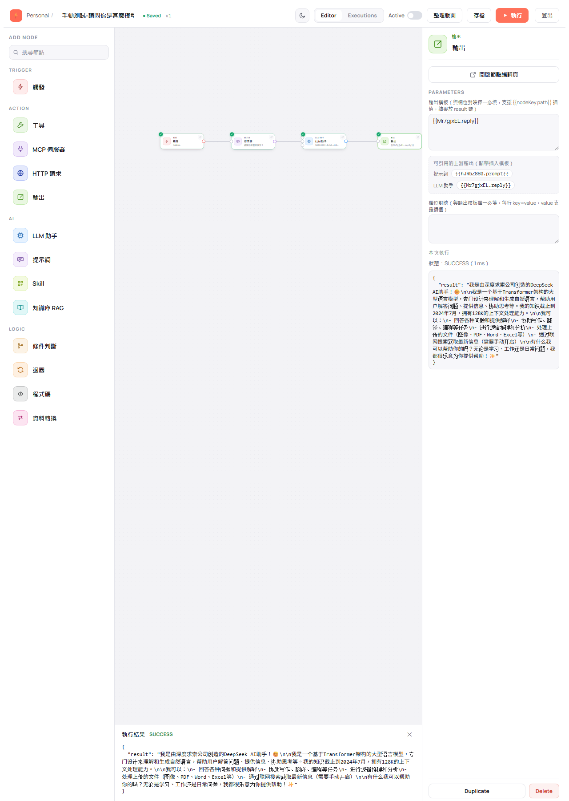
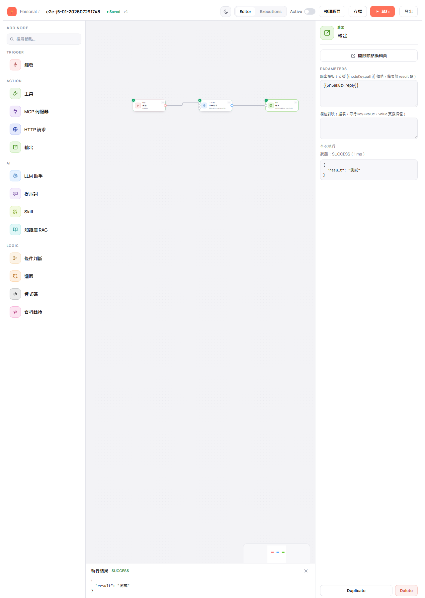
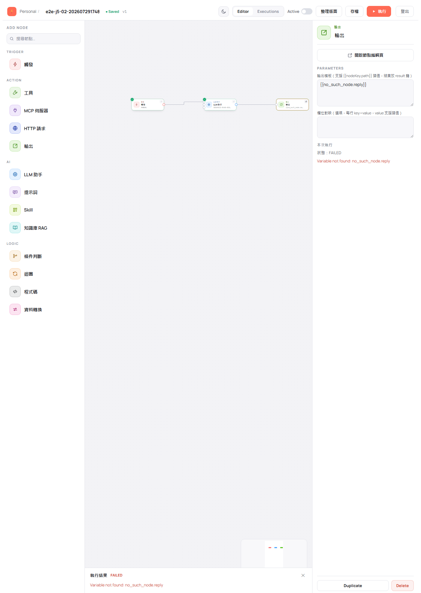
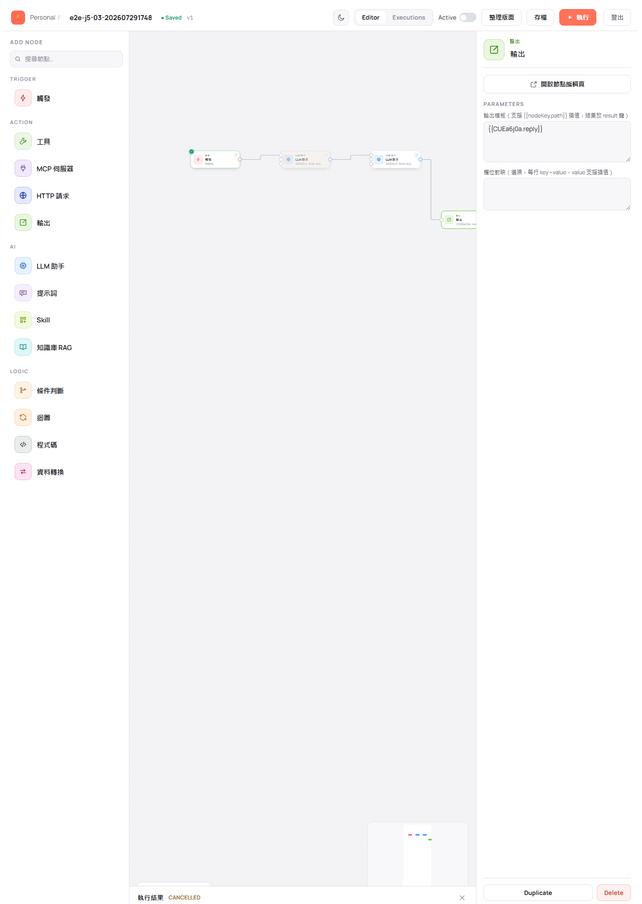

# 執行流程與查看結果

> 適用版本：0.1.8-SNAPSHOT ｜ 畫面擷取自 E2E 驗證：202607291748、202607302129

流程畫好、設定填完後就可以執行。本章說明怎麼跑、怎麼看結果，以及流程有多個觸發點時如何指定從哪裡開始。

---

## 執行一張流程

**使用情境**：想立刻看看流程跑起來是什麼結果。

1. 在編輯畫面工具列點橘色的 **執行** 按鈕。

2. 節點會依序亮起：正在跑的節點會標示執行中，跑完的節點左上角出現綠色勾號。畫面下方同時展開**執行結果**面板，即時顯示進度。

**完成後你會看到**：所有節點都掛上綠勾，執行結果面板標示 **SUCCESS**，並顯示流程的最終輸出內容。

> 💡 流程不需要先啟用也能執行——草稿狀態就能按執行鈕測試。

---

## 查看單一節點的執行結果

執行結束後，**點選任何一個節點**，右側設定面板下方會多出「本次執行」區塊，顯示該節點的狀態、耗時與輸出資料。

> 💡 想同時看某個節點的輸入與輸出，雙擊該節點開啟節點編輯頁（見 [設定節點](04-node-settings.md#節點編輯頁一次看懂輸入設定與輸出)）。
> ⚠️ 關閉底部的執行結果面板會清空本次執行的暫存資料，節點上的狀態與資料也會一併消失。要查看資料請先看完再關。
>
> （圖中的流程名稱為測試資料，實際請自行命名。）

---

## 某個節點失敗時

流程中任何一個節點失敗，執行就會停在那裡。

**你會看到**：失敗的節點在畫布上以紅框標示，右側「本次執行」顯示 **FAILED** 與錯誤原因，底部執行結果面板同樣標示 FAILED 並附上訊息。

上圖的原因是輸出模板引用了一個不存在的節點，訊息為 `Variable not found: no_such_node.reply`。修法是重新用面板上的「可引用的上游輸出」重新插入正確的引用。

---

## 中途停止執行

執行期間，工具列的執行鈕會變成 **停止**。點它即可中止。

**你會看到**：執行結果面板標示 **CANCELLED**，已經跑完的節點保留結果，還沒輪到的節點則不會執行。

> 💡 直接關掉執行結果面板或離開頁面，也會讓這次執行以取消作收。

---

## 流程有多個觸發點時

一張流程可以有多個觸發點，各自帶一條分支（例如「客服進線」與「每日報表」）。這種情況下，執行時要指定**這次要從哪一個入口開始**。

1. 點工具列的 **執行**，畫面中央跳出「選擇要執行的觸發點」視窗，列出所有觸發節點的名稱，並說明「只會執行該觸發點的流程，其餘觸發點不啟動」。

   

2. 點你要執行的那一個。

**完成後你會看到**：只有該觸發點那條分支的節點依序亮起並掛上綠勾，**另一個觸發點與它獨有的下游節點會呈灰階**，表示本次未執行。

> 💡 **更快的做法**：直接點觸發節點卡右上角的執行圖示，就會以該觸發點開跑，不會再跳選擇視窗。
> 💡 流程只有一個觸發點時不會跳選擇視窗，點執行就直接開始。
> 💡 換一個觸發點再執行時，上一輪的灰階標記會清掉，改成這一輪未執行的那條。

> ⚠️ 畫布上完全沒有觸發節點時，點執行會提示「**流程尚無觸發節點，請先加入觸發節點**」，不會開始執行。

---

## 查看歷史執行

工具列的 **Executions** 分頁可切換到執行紀錄檢視。

> 📷 **待補畫面**：Executions 分頁的內容 — 目前 E2E 證據未涵蓋。
