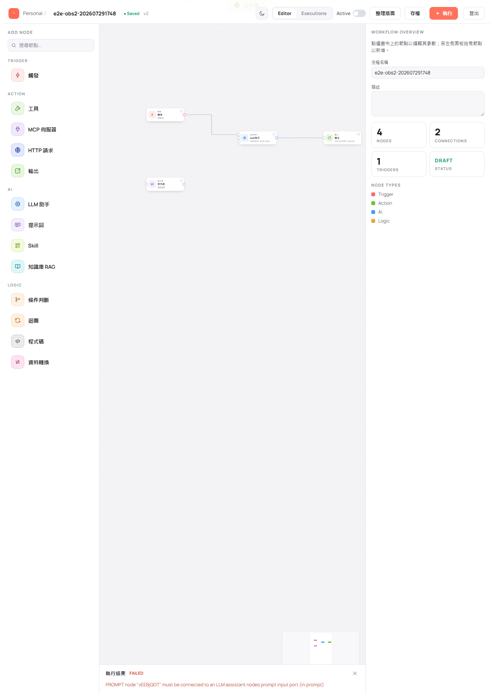

# 常見提示訊息與排除方式

> 適用版本：0.1.8 ｜ 訊息文字取自 E2E 驗證：202607291748、202607302129

畫面上的提示分兩種來源，長相不同但意思互通：

- **編輯時的即時提示**（中文）：拉線、填欄位當下就跳出來，通常是橘色浮動提示或面板上的橘色框。
- **啟用／執行時的回應訊息**（英文）：系統回傳的訊息，會指名是哪一個節點出問題，節點代碼是像 `vEEBjQOT` 這樣的 8 碼字串（顯示於節點編輯頁的 Settings 分頁）。

---

## 編輯與連線

| 你看到的訊息 | 意思 | 怎麼處理 |
|------------|------|---------|
| 僅工具、MCP、Skill、知識庫節點可連到 LLM 的工具埠 | 你把不能當「能力」的節點拉到了 LLM 助手的工具埠 | 工具埠只接工具／MCP 伺服器／Skill／知識庫 RAG。其他節點請改接一般輸入埠 |
| 僅提示詞節點可連到 LLM 的提示埠 | 你把非提示詞節點拉到了 LLM 助手的提示埠 | 提示埠只接提示詞節點 |
| 節點 xxxxxxxx 缺少必填欄位：〇〇 | 該節點還有必填欄位沒填 | 點該節點，在右側面板補上橘色提示指出的欄位 |
| 缺少必填欄位：範本 或 欄位對應（擇一） | 輸出節點的兩個欄位都空著 | 兩者擇一填寫即可，見 [設定節點](04-node-settings.md#輸出決定流程最後回傳什麼) |
| 有未存變更，確定要離開嗎？／確定要登出嗎？（標題：尚未存檔） | 你有還沒存檔的修改 | 想保留就選「取消」，回去按存檔；確定不要了再繼續 |
| 流程尚無觸發節點，請先加入觸發節點 | 畫布上沒有觸發節點就按了執行 | 從左側節點面板拖一個「觸發」進畫布並接上下游 |

---

## 啟用與執行

| 你看到的訊息 | 意思 | 怎麼處理 |
|------------|------|---------|
| `Node xxxxxxxx is missing required config fields: ...` | 指定節點缺必填欄位，冒號後是欄位名；`a\|b` 代表兩者擇一 | 找到該節點補齊欄位再試 |
| `An active workflow must contain a Trigger node` | 要啟用的流程沒有觸發節點 | 加入觸發節點 |
| `SKILL node "xxxxxxxx" must be connected to an LLM assistant node's tool input port (in:tool)` | 有 Skill 節點沒掛到任何 LLM 助手 | 把它連到 LLM 助手的工具埠，或刪掉不需要的節點 |
| `PROMPT node "xxxxxxxx" must be connected to an LLM assistant node's prompt input port (in:prompt)` | 有提示詞節點沒接上 LLM 助手 | 連到 LLM 助手的提示埠，或刪掉該節點 |
| `LLM assistant node "xxxxxxxx" must have userPrompt filled, or a PROMPT node connected to its prompt input port (in:prompt)` | 這個 LLM 助手沒有提問來源 | 在該節點填「使用者提示」，或接一個提示詞節點進提示埠 |
| `Variable not found: 〇〇.〇〇` | 輸出模板或欄位對映引用了不存在的節點或欄位 | 用面板上的「可引用的上游輸出」重新點選插入，不要手打 |
| `Config of node xxxxxxxx is invalid: ...` | 該節點的設定格式不正確 | 檢查該節點是否被填入非預期的欄位或格式 |
| `Workflow has been modified by another session, please reload` | 同一張流程被另一處先存檔了 | 重新載入頁面取得最新版本，再重做你的修改 |

執行結果面板顯示 FAILED 時的實際樣子：

---

## 其他常見狀況

| 狀況 | 原因 | 怎麼處理 |
|------|------|---------|
| 剛建立的流程按 F5 後變成空白畫布 | 新流程在第一次存檔前還沒真正建立 | 畫好第一版先按 **存檔**，之後再從清單頁開啟 |
| 執行完後點節點看不到執行資料 | 底部的執行結果面板被關掉了，本次執行的暫存資料會一併清空 | 重新執行一次，看完資料再關面板 |
| 能力節點（工具／MCP／Skill／知識庫）執行時沒有亮起 | 這是正常的：它們不是流程步驟，而是由 LLM 助手在需要時自行使用 | 不需處理。想確認有沒有生效，看 LLM 助手節點的輸出內容 |
| 執行時另一條分支整條灰掉 | 你在觸發點選擇視窗選了其中一個入口，其餘觸發點本次不啟動 | 不需處理。要跑另一條就再執行一次並改選 |
| 流程狀態一直是 DRAFT | Active 開關的檢查沒通過 | 依訊息修正後再開啟，見 [檢查與啟用流程](05-validate-activate.md) |
