# BestPartner E2E 測試確認表（UI-driven）

> 本文件為 E2E 測試記錄模板，每次測試週期開始前由 `e2e-test-confirmation` skill 複製並填寫。
> 旅程與案例定義的權威來源：`docs/e2e-test-plan.md`。

---

## 使用說明

### 狀態符號

| 符號 | 意義 |
|------|------|
| ✅ | Pass — 案例通過 |
| ❌ | Fail — 案例失敗（請在「問題追蹤區」補充說明） |
| ⏭️ | Skip — 本次略過（請在證據／備註欄說明原因，如缺 E2E_LLM_ID） |
| — | 本次週期不適用 |

### 填寫流程

1. 複製此檔案，重新命名為 `docs/test-confirmations/e2e-test-confirmation-YYYYMMDDHHmm.md`
2. 填寫「測試週期資訊」
3. 完成「前置檢查清單」（任一失敗即停止）
4. 依 J1→J7 逐旅程執行，**先記錄證據再標狀態**
5. 每條旅程完成後立即更新「測試結果摘要」與 Pass 率
6. 所有 ❌ 項目在「問題追蹤區」建立記錄
7. 收尾清理 `e2e-*` 測試資料

### 證據要求

每個案例的「證據 / 備註」欄**必須**包含（不得留佔位符）：

1. **逐步圖片連結（強制，用 Markdown 圖片語法）**：案例每一個操作步驟一張截圖，**在證據欄以圖片連結依序嵌入**，讓報告可直接預覽／點開，不得只放最終畫面、不得只填純文字路徑。
   命名／存放：`docs/test-confirmations/e2e-shots/<報告時間戳>/<caseId>-<步驟序號>-<簡述>.png`
   證據欄寫法（相對報告檔路徑）：
   ```markdown
   
   
   
   ```
2. 另可附：Playwright trace / 錄影檔連結（如 `[trace](test-results/j3/trace.zip)`）、關鍵斷言（如「節點數 3、edge 2、save 後 version=2」）。
3. J5 專用：SSE 事件序列與最終節點狀態（如 `started→node.completed×3→completed(SUCCESS)`），並以圖片連結附各節點狀態轉移截圖。

> ⚠️ 缺少任一步驟圖片連結、或只填純文字路徑未用圖片語法，即視同證據不完整。失敗（❌）案例另附失敗當下截圖與 trace 連結。

---

## 測試週期資訊

| 項目 | 內容 |
|------|------|
| 測試日期 | 2026-07-15 22:27 |
| 服務版本 | 0.1.8-SNAPSHOT |
| 測試環境 | dev |
| 瀏覽器 | chromium |
| 前端 baseURL | `http://localhost:4173`（vite preview） |
| 後端 API URL | `http://localhost:80` |
| LLM 平台（J5） | OpenRouter（`openrouter_local_chat_test` / `deepseek/deepseek-v3.2`） |
| E2E_LLM_ID（J5） | `583b9222-8cb0-4109-b072-5f0fd1e9fed9`（由 global-setup 依 alias/platform 動態解析） |
| 測試結束時間 | 2026-07-15 22:52 |

> ⚠️ **執行入口偏離規範**：`e2e-test-confirmation` skill 規定執行入口須為 `webwright` skill，但本次 session 該 skill 不可用。經與使用者確認（AskUserQuestion），改用 `bestpartner-ui/e2e/` 既有 Playwright spec harness（`npx playwright test --config=e2e/playwright.config.ts`）直接執行，非 skill 原定入口。
>
> ⚠️ **測試範圍限縮**：`bestpartner-ui/e2e/specs/` 現況僅有 1 支涵蓋 J1 登入＋J2 建立＋J3 拖拉/連線/設定/存檔＋J5 執行（單一切片）的整合測試 `j5-openrouter-date-json.spec.ts`；`docs/e2e-test-plan.md` 定義的其餘 ~19 個案例（J1 其餘 4 案例、J2 其餘 3 案例、J3-05、J4 全部、J5-02/03、J6 全部、J7 全部）尚無對應 Playwright spec 程式碼，本次一律標記 ⏭️ 並註明「無對應 spec，非本次執行失敗」。經與使用者確認後以此範圍執行。

---

## 前置檢查清單（測試前必須全部 ✅）

```
■ 後端服務於 port 80 健康回應（HTTP 200）— GET /systemSetting/list = 200
■ PostgreSQL 已初始化 — 既有 dev DB，admin/test_user 資料存在
■ 種子資料存在：admin/admin、test_user 及其 CHAT/STREAMING_CHAT LLM setting — 已由 /llm/setting/get 確認
■ J5 可用：具有效 api_key 的 LLM setting — 初測 402（OpenRouter 額度不足，maxTokens 32768 > 可負擔 28888），
   經使用者同意暫調 llmId=1ee80ffa... 的 maxTokens→4096 驗證可用，測試結束後已復原為 32768
■ 前端已 build 並可由 baseURL 存取 — dist 原為 07-12 10:26 舊建置（缺 data-node-type 屬性，導致 J3 選擇器失效），
   已重新 npm run build 並重啟 preview（4173），200 OK
■ Playwright 瀏覽器已安裝 — npx playwright install chromium --with-deps 完成
■ storageState — 本次 spec 採逐次 UI 登入（非 storageState 復用），J1-02 每次執行皆走真實登入
```

> ⚠️ 任一項未通過即停止測試並回報。

---

## 測試結果摘要

> 每完成一條旅程立即更新本表

| 旅程 | 優先 | 總數 | ✅ Pass | ❌ Fail | ⏭️ Skip | Pass 率 |
|------|:---:|------|--------|--------|---------|---------|
| J1 認證 | P0 | 5 | 1 | 0 | 4 | 20.0% |
| J2 Workflow 列表 | P0/P1 | 4 | 1 | 0 | 3 | 25.0% |
| J3 畫布編輯 | P0 | 5 | 4 | 0 | 1 | 80.0% |
| J4 驗證與啟用 | P1 | 4 | 0 | 0 | 4 | 0.0% |
| J5 執行（真實 LLM） | P0 | 3 | 1 | 0 | 2 | 33.3% |
| J6 Inspector 表單 | P1 | 3 | 0 | 0 | 3 | 0.0% |
| J7 契約錯誤 | P2 | 2 | 0 | 0 | 2 | 0.0% |
| **合計** | | **26** | **7** | **0** | **19** | **26.9%** |

> ⏭️ 案例均因「無對應 Playwright spec 程式碼」跳過，非執行失敗；詳見各旅程備註欄。本次通過標準（P0=100%/P1≥95%/P2≥80%）僅對**已執行**案例評估：J1/J3/J5 中已跑案例皆 ✅，0 個 ❌。

### 通過標準

| 優先級 | 通過標準 | 說明 |
|--------|--------|------|
| P0 | 100% | 任何失敗均為 Release Blocker |
| P1 | ≥ 95% | 已知失敗需有追蹤 Issue |
| P2 | ≥ 80% | 剩餘列為 Tech Debt |

---

## 旅程測試清單

> 案例定義同步自 `docs/e2e-test-plan.md §3`。狀態與證據欄由測試時填寫。

### J1 認證流程（P0）

| 案例 | 優先 | 描述 | 預期 | 狀態 | 證據 / 備註 |
|------|:---:|------|------|:---:|------|
| J1-01 | P0 | 未登入直接訪 `/` | 導向 `/login` | ⏭️ | 無對應 spec（現有 spec 僅涵蓋登入流程本身，未涵蓋未登入守衛） |
| J1-02 | P0 | admin/admin 登入 | 導向列表 `/`，顯示已登入 | ✅ | 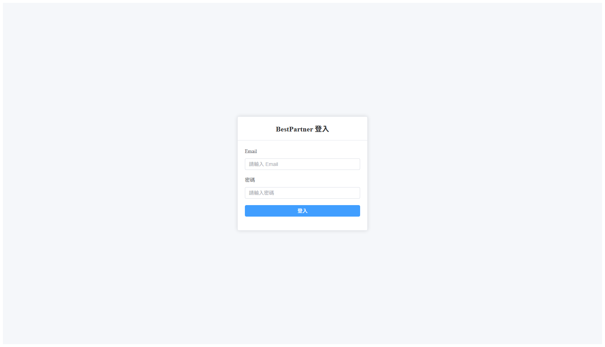 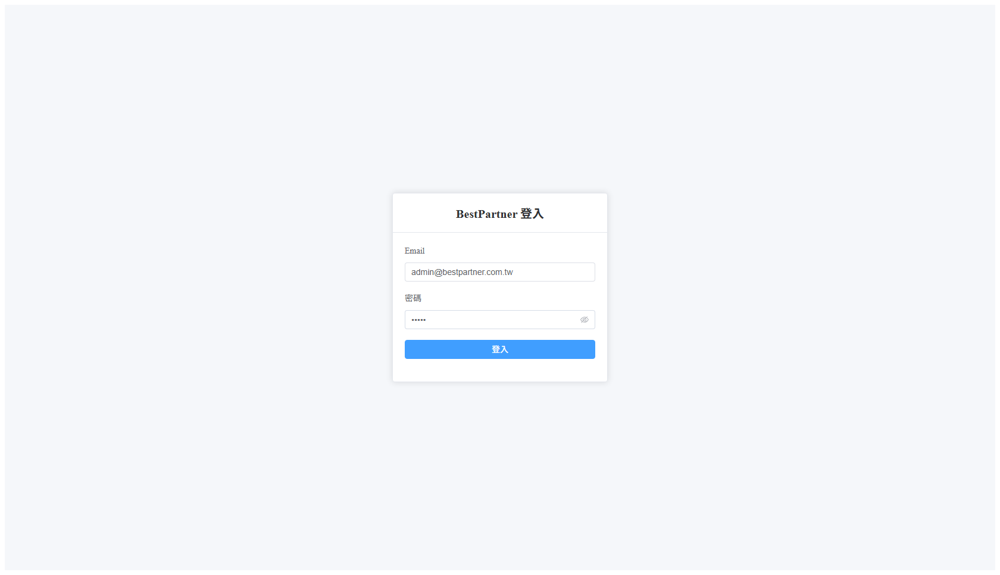 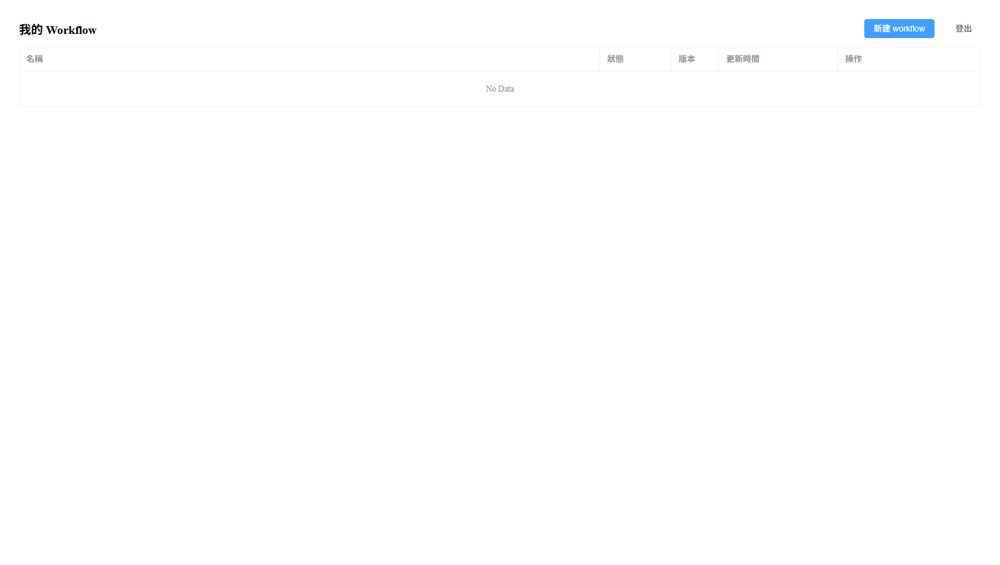　登入後 `create-button` 可見，符合已登入預期 |
| J1-03 | P1 | 已登入訪 `/login` | 導回首頁 `/` | ⏭️ | 無對應 spec |
| J1-04 | P1 | 錯誤帳密登入 | 停留 `/login`，顯示錯誤 | ⏭️ | 無對應 spec |
| J1-05 | P2 | token 清除後訪受保護頁 | 導回 `/login` | ⏭️ | 無對應 spec |

### J2 Workflow 列表（P0/P1）

| 案例 | 優先 | 描述 | 預期 | 狀態 | 證據 / 備註 |
|------|:---:|------|------|:---:|------|
| J2-01 | P0 | 列表載入 | 顯示既有 workflow 清單 | ⏭️ | 無獨立斷言（spec 直接跳過列表檢視，由 create-button 進入編輯器） |
| J2-02 | P0 | 建立新 workflow | 進 `/editor/:id`，DRAFT、version 1 | ✅ | 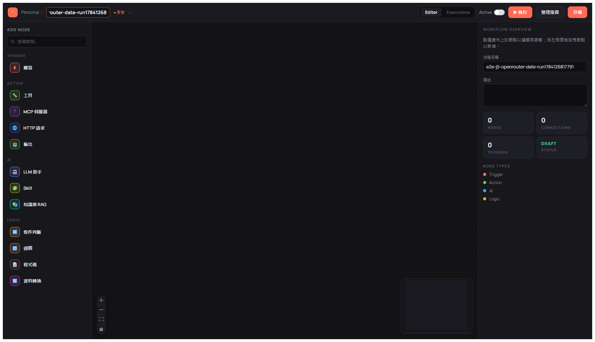　URL 符合 `/editor` 樣式，DRAFT 狀態於畫面右側面板顯示 |
| J2-03 | P1 | 點列表項進編輯器 | 載入完整定義 | ⏭️ | 無對應 spec |
| J2-04 | P1 | 刪除 workflow | 列表移除，連鎖刪 node/edge | ⏭️ | 無對應 spec（本次由 `POST /llm/workflow/delete` API 於 afterEach 清理，非 UI 驗證） |

### J3 畫布編輯（P0）

| 案例 | 優先 | 描述 | 預期 | 狀態 | 證據 / 備註 |
|------|:---:|------|------|:---:|------|
| J3-01 | P0 | 拖拉節點入畫布（TRIGGER/LLM_ASSISTANT/OUTPUT） | 節點出現，nodeKey 唯一 | ✅ | 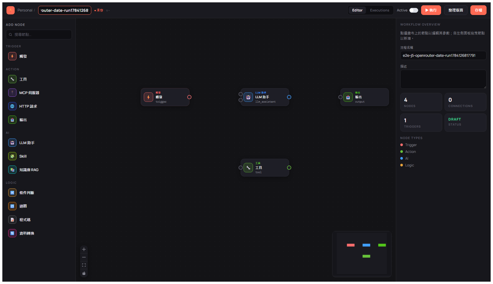　實際拖入 TRIGGER/LLM_ASSISTANT/TOOL/OUTPUT 共 4 個節點（涵蓋範圍多於案例定義的 3 種），`.vue-flow__node` count 斷言 1→2→3→4 逐步通過 |
| J3-02 | P0 | 連線 edge | edge 建立，兩端點存在 | ✅ | 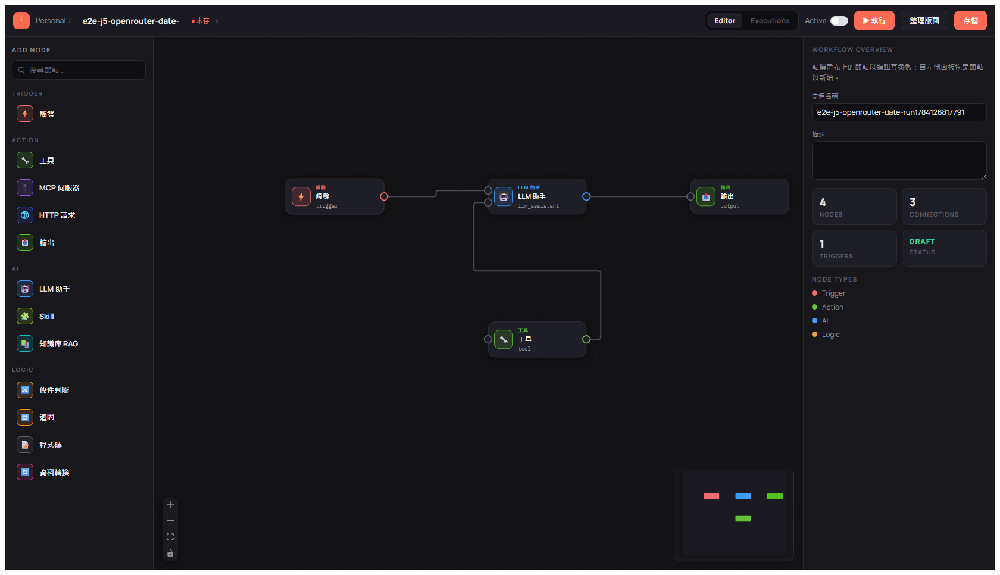　`.vue-flow__edge` count=3（TRIGGER→LLM、TOOL→LLM(in:tool)、LLM→OUTPUT） |
| J3-03 | P0 | 選節點於 Inspector 填 config | 表單值寫回節點 | ✅ | 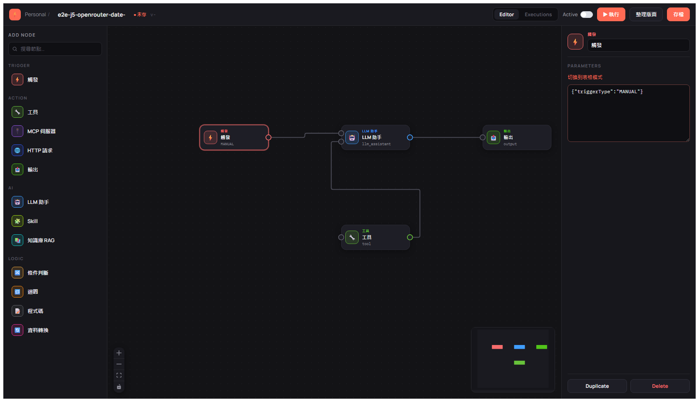 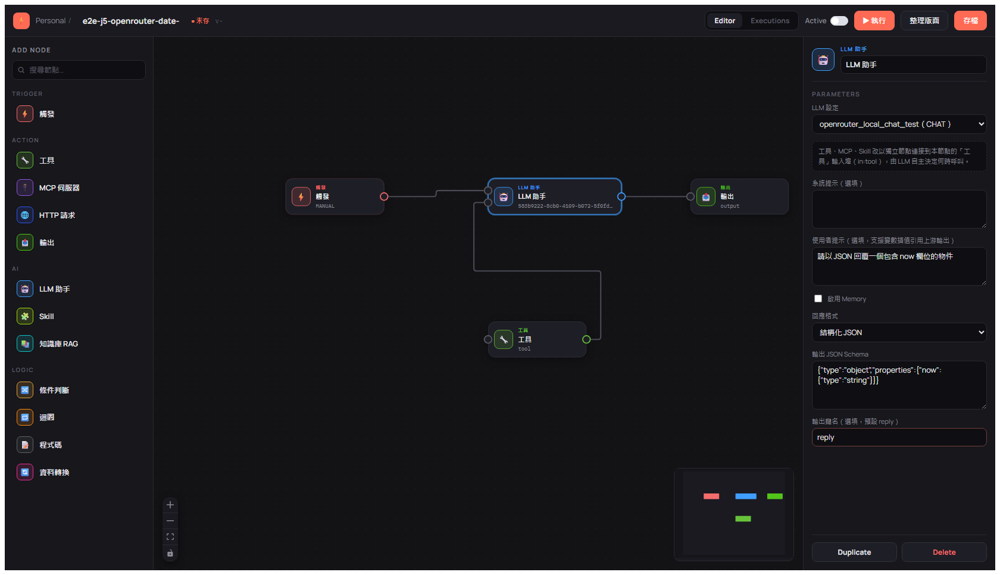 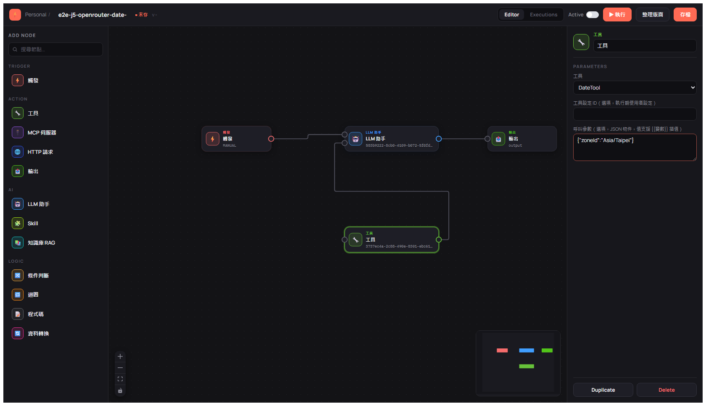 　4 個節點皆填入表單值（TRIGGER raw JSON、LLM llmId/prompt/responseFormat/schema、TOOL toolId/arguments、OUTPUT mappings） |
| J3-04 | P0 | save 整張覆寫 | version+1 | ✅ | 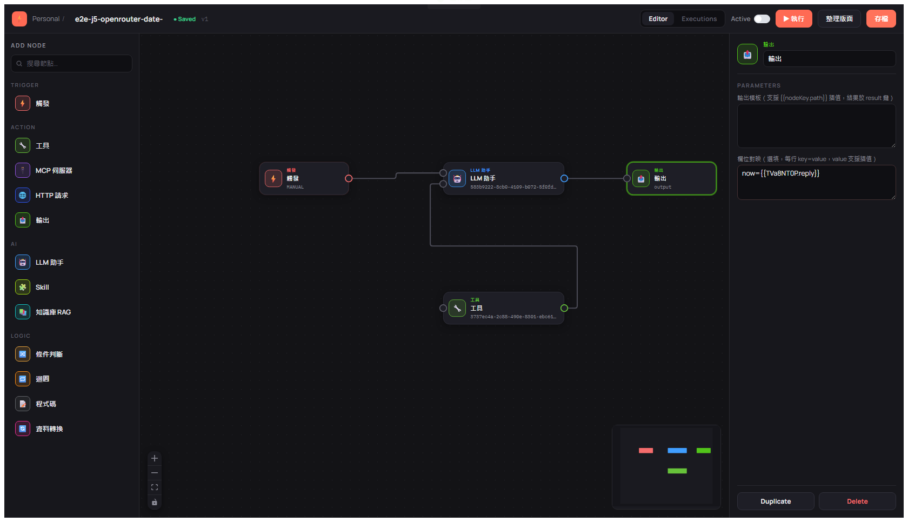　畫面 `saved-badge` 顯示、版本號可見為 v1（初次建立即存檔，符合 create 後首次 save 情境） |
| J3-05 | P1 | 重整頁面 get 還原 | 畫布與 Inspector 與存檔一致 | ⏭️ | 無對應 spec |

### J4 驗證與啟用（P1）

| 案例 | 優先 | 描述 | 預期 | 狀態 | 證據 / 備註 |
|------|:---:|------|------|:---:|------|
| J4-01 | P1 | 缺 TRIGGER 啟用 | 400，對應訊息 | ⏭️ | 無對應 spec |
| J4-02 | P1 | 圖有環啟用 | 400，對應訊息 | ⏭️ | 無對應 spec |
| J4-03 | P1 | 缺必填 config 啟用（如缺 llmId） | 400，`workflow.node.config.required.missing`，顯示 nodeKey+欄位 | ⏭️ | 無對應 spec |
| J4-04 | P1 | 合法圖 switchStatus 啟用 | 狀態轉 ACTIVE | ⏭️ | 無對應 spec |

### J5 執行 workflow（P0，真實 LLM）

| 案例 | 優先 | 描述 | 預期 | 狀態 | 證據 / 備註 |
|------|:---:|------|------|:---:|------|
| J5-01 | P0 | 合法 workflow（TRIGGER→LLM_ASSISTANT→OUTPUT）execute | SSE `started`→`node.*`→`completed(SUCCESS)`；DB 寫入 `llm_workflow_execution`/`llm_workflow_node_execution` | ✅ |  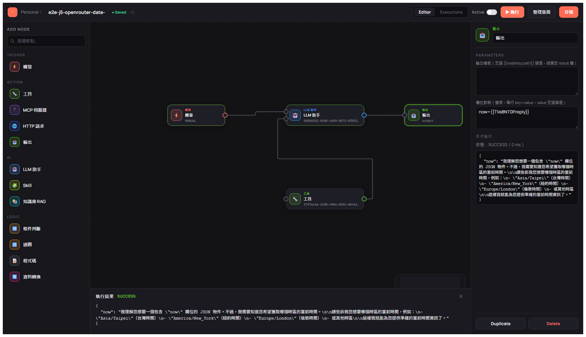　ExecutionResultDrawer 最終 `.status` = `SUCCESS`；OUTPUT 為合法 JSON（`{"now": "..."}`）；DB 執行紀錄 `status=SUCCESS`、`trigger_type=MANUAL`、`node_type` 含 TRIGGER/LLM_ASSISTANT/OUTPUT 且皆 SUCCESS，TOOL 未獨立落庫（Agent 能力掛載，符合 `e2e-test-plan.md` §3 J5 案例二設計，非案例二本身但驗證了此行為）。本次額外發現：實際執行本身走 Agent 模式，即涵蓋 J5-02 部分場景（TOOL 掛 in:tool），但因 LLM 未真正呼叫 DateTool（已知限制，見 `e2e-test-plan.md §10`），非嚴格意義的 J5-02 獨立驗證。**過程中修正 1 處測試程式碼缺陷**：spec 原斷言 `nodeTypes` 需含 `TOOL`（舊行為），已依文件設計修正為 `not.toContain('TOOL')`，詳見下方「問題追蹤區」 |
| J5-02 | P1 | 節點設定錯誤導致失敗 | 該節點 `node.failed` 顯示錯誤，執行標記失敗 | ⏭️ | 無獨立 spec 驗證此失敗路徑 |
| J5-03 | P1 | 執行中途 client 斷線 | 執行 `CANCELLED`，下游未執行節點 `SKIPPED`（commit b24c128 視覺） | ⏭️ | 無對應 spec |

> J5 斷言不比對 LLM 輸出文字；只驗事件序列、節點狀態、DB 紀錄。

### J6 Inspector 表單（P1）

| 案例 | 優先 | 描述 | 預期 | 狀態 | 證據 / 備註 |
|------|:---:|------|------|:---:|------|
| J6-01 | P1 | LlmAssistantForm 選 llmId | 值寫回並可存檔 | ⏭️ | 現有 spec 有填 llm-select 但未驗證「save 後重載一致」，不視為完整驗證此案例 |
| J6-02 | P1 | Tool/McpServer/KnowledgeRag/Output 表單填寫 | config 正確寫回，save 後重載一致 | ⏭️ | 同上，僅填 Tool/Output 未驗重載一致，MCP/KnowledgeRag 完全未觸及 |
| J6-03 | P2 | settingSchema 動態表單（sensitive 遮罩） | 依 schema 正確渲染欄位型別 | ⏭️ | 無對應 spec |

### J7 契約錯誤（P2）

| 案例 | 優先 | 描述 | 預期 | 狀態 | 證據 / 備註 |
|------|:---:|------|------|:---:|------|
| J7-01 | P2 | save 節點 config 型別錯誤（未知欄位/結構型別錯） | 400，`workflow.node.config.invalid`，含 nodeKey | ⏭️ | 無對應 spec |
| J7-02 | P2 | 樂觀鎖 version 衝突 | 400，`workflow.version.conflict`，UI 顯示衝突提示 | ⏭️ | 無對應 spec |

---

## 旅程完成檢查清單（每完成一條旅程必須立即執行）

> 對應 SKILL.md Step 5.5。進入下一旅程前，逐項勾選並更新摘要表。

```
■ 所有已執行案例（J1-02/J2-02/J3-01~04/J5-01）的逐步截圖已擷取並存入 e2e-shots/202607152227/（共 13 張，無遺漏）
■ 所有已執行案例證據已寫入（逐步圖片連結以 Markdown 圖片語法嵌入 + DB/SSE 斷言說明）
■ 所有案例狀態已標記（✅ / ⏭️；本次無 ❌）
■ 無失敗案例，「問題追蹤區」改記錄本次修正的測試程式碼缺陷（非產品缺陷）
■ 摘要表各旅程統計數字已更新（Pass / Fail / Skip / 總數）
■ Pass 率已計算並填入（保留一位小數）
■ e2e-* 測試資料已清理（afterEach 自動刪除，DB 查詢確認 0 筆殘留）
```

### 嚴格規則

- **不可延後**：完成一條旅程立即更新，不可等全部測完才統一更新
- **即時暫停**：某旅程 Pass 率過低（P0<100% / P1<95% / P2<80%），立即暫停評估
- **計算精確**：Pass 率 = Pass ÷ 總數 × 100%，保留一位小數
- **與問題追蹤同步**：失敗案例先入問題追蹤區，再更新摘要

---

## 測試資料清理規則

- E2E 建立的 workflow 一律以 `e2e-<caseId>-<runTag>` 前綴命名。
- 每條案例測試後經 `POST /llm/workflow/delete` 刪除；收尾以前綴掃描 `workflow/list` 兜底刪除殘留 `e2e-*`。
- **不得另建備份檔／目錄**；種子資料（admin、test_user、LLM setting）為前置條件，不刪除。
- 逐步截圖屬**報告證據**，隨報告保留於 `docs/test-confirmations/e2e-shots/<報告時間戳>/`，**不在清理範圍**（清理只針對 DB 的 `e2e-*` workflow 資料）。

> ⚠️ 收尾後資料庫殘留 `e2e-*` 資料，視同流程不完整，需補清理。

---

## 問題追蹤區

> 失敗（❌）項目在此詳記；本次執行無 ❌ 案例。以下記錄執行過程中發現並已處理的非案例失敗事項。

| 項目 | 現象 | 期望行為 | 實際行為 | 根因 | 狀態 |
|---------|------|---------|---------|------|------|
| 前端 dist 過舊 | J3 節點選擇器 `[data-node-type="LLM_ASSISTANT"]` 全部 timeout | 節點應可由 `data-node-type` 定位 | dist 為 07-12 10:26 建置，缺少同日 18:31 commit（84eb38e）新增的 `data-node-type` 屬性 | 前端未在該 commit 後重新 build | 已修復：`npm run build` 重新建置並重啟 preview，修復後重跑通過 |
| OpenRouter 額度不足 | J5 前置 API smoke（`/llm/chat`）回 402 | api_key 應可用於執行 | `llmId=1ee80ffa...`／`583b9222...` 之 `maxTokens=32768` 超出帳號可負擔 28888 tokens | OpenRouter 帳戶餘額不足以支撐設定的 maxTokens 上限 | 已處理：經使用者同意，暫調 `1ee80ffa...` 之 maxTokens→4096 驗證可用；測試結束已復原為 32768。註：J5-01 實際執行使用的是 global-setup 解析到的 `583b9222...`，該筆 maxTokens 仍為 32768 但 J5-01 執行成功，代表 deepseek-v3.2 該次呼叫實際用量未觸頂（402 為機率性額度邊界，非必然） |
| spec 斷言過時 | J5-01 首次執行於 DB 斷言階段失敗：`expect(nodeTypes).toContain('TOOL')` | 斷言應反映現行系統設計 | 舊斷言沿用「TOOL 節點會被獨立執行並落庫」的舊行為（`e2e-test-plan.md §10` 記載的待修問題），但該行為已於近期「LLM 節點簡化為 Agent 模式」commit 修正：TOOL 掛 `in:tool` 現在正確地**不**產生獨立 `node_execution`，符合 `e2e-test-plan.md` J5 案例二設計 | 已修復（測試程式碼，非產品程式碼）：`j5-openrouter-date-json.spec.ts` 斷言改為 `not.toContain('TOOL')`，並額外附加 `toContain('TRIGGER')`；重跑後通過。**產品面確認**：TOOL 獨立落庫的舊 bug 已修復，可視為對 `e2e-test-plan.md §10` 待修事項 1 的正面回歸驗證 |
| Agent 工具掛載未生效（既有已知限制，非本次新發現） | LLM 回覆詢問使用者時區，而非直接呼叫已掛載的 DateTool | 連 `in:tool` 的 TOOL 應可被 LLM 當作可呼叫能力 | LLM 回應顯示其未取得任何「查詢當前時間」的工具 | 待後端釐清（`e2e-test-plan.md §10` 已記錄，Agent 模式工具集未納入 in:tool 掛載的節點） | 未修復（沿用既有已知限制，spec 本就不斷言此行為，本次僅重新確認限制仍存在） |

---

## 常見問題排查

| 現象 | 可能原因 | 處理 |
|------|---------|------|
| 前置檢查後端非 200 | 服務未起 / port 80 被占用 | 起服務或釋放 port 後重試 |
| J5 一直逾時 | LLM api_key 無效 / 網路 | 確認 E2E_LLM_ID 有效；逾時放寬至 60–120s |
| 拖拉節點無效 | palette→畫布是 HTML5 原生 DnD，非滑鼠序列 | 合成 `dragstart`/`dragover`/`drop`（共用 `DataTransfer`）；**連線**才用 `mousedown→move→up`。放置後斷言節點數（詳見 `e2e-test-plan.md` §6） |
| 選擇器找不到 | Playwright 預設找 `data-testid`，專案用 `data-test` | config 設 `testIdAttribute:'data-test'` |
| llmId/toolId selectOption 找不到選項 | 運行 DB 的 ID 與種子檔漂移 | 由 global-setup 依 alias/platform 動態解析，勿硬編（詳見 §6） |
| 登入態失效 | storageState 過期 | 重新以 API 登入產生 storageState |
| 殘留 e2e-* 資料 | 清理未執行 | 以前綴掃描 workflow/list 兜底刪除 |
