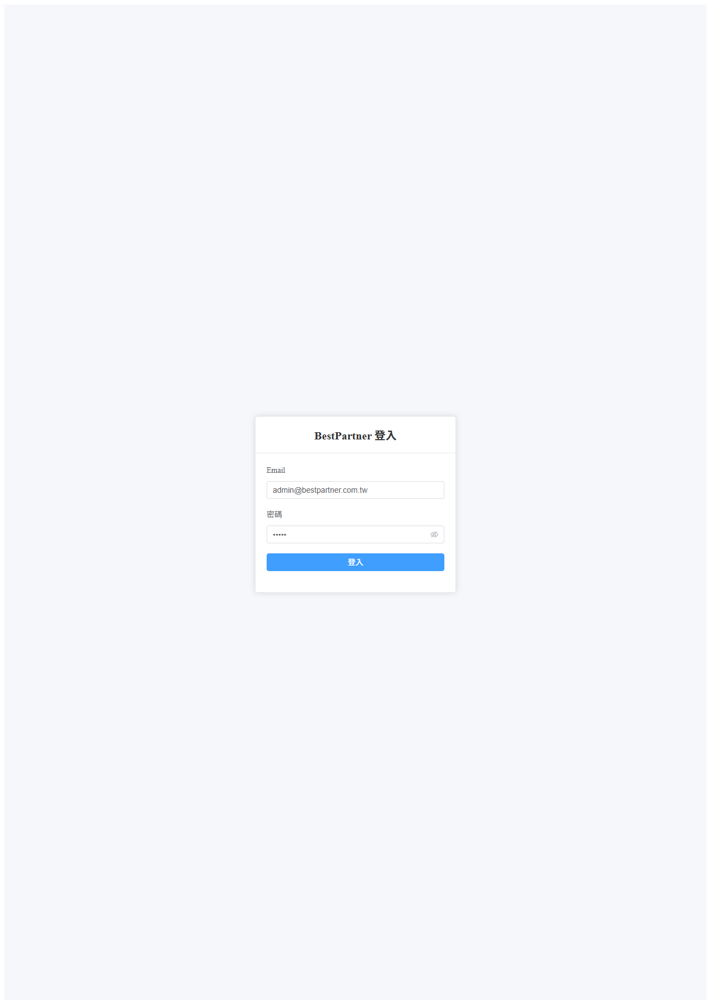
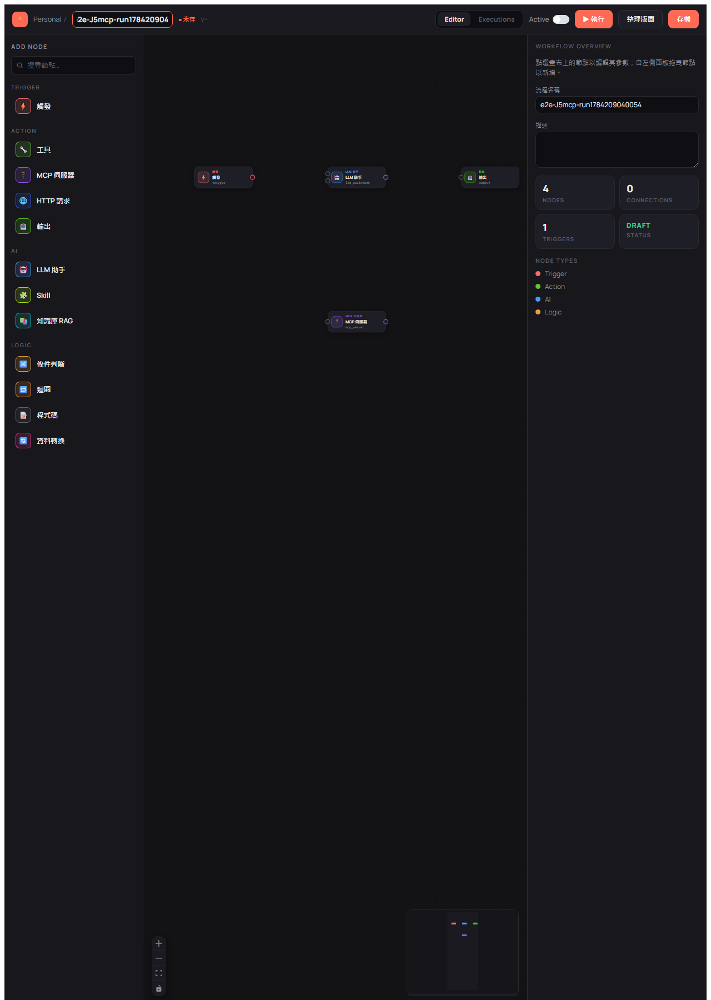
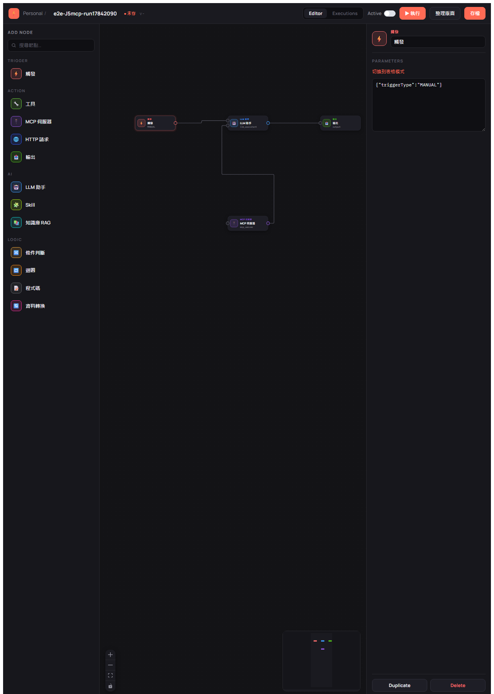
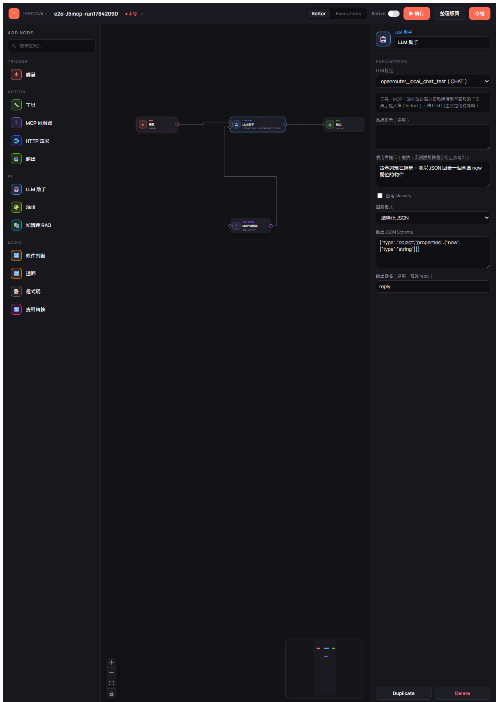
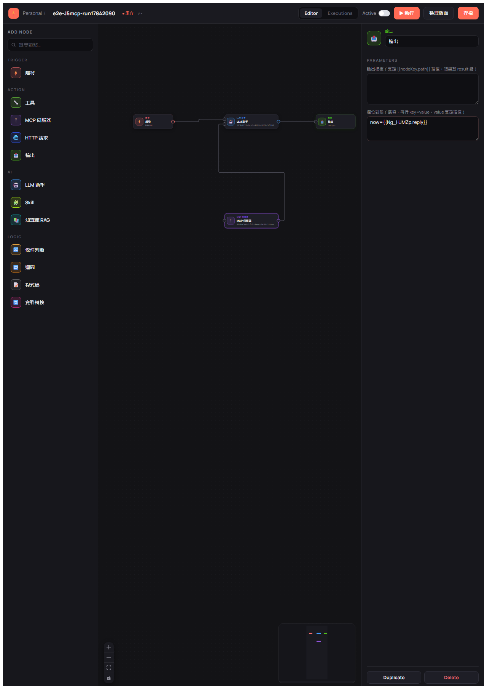
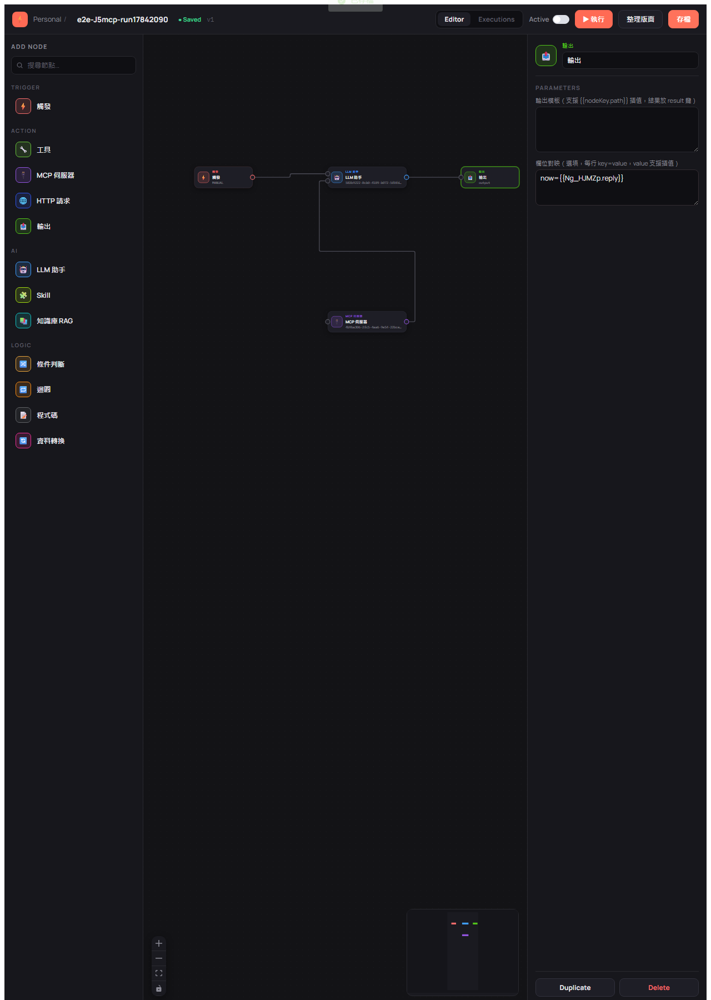
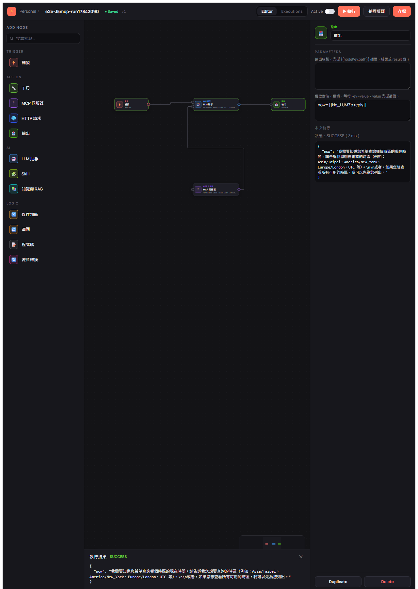

# BestPartner E2E 測試確認表（UI-driven）

> 本文件為 E2E 測試記錄模板，每次測試週期開始前由 `e2e-test-confirmation` skill 複製並填寫。
> 旅程與案例定義的權威來源：`docs/e2e-test-plan.md`。

---

## 使用說明

### 狀態符號

| 符號 | 意義 |
|------|------|
| ✅ | Pass — 案例通過 |
| ❌ | Fail — 案例失敗（請在「問題追蹤區」補充說明） |
| ⏭️ | Skip — 本次略過（請在證據／備註欄說明原因，如缺 E2E_LLM_ID） |
| — | 本次週期不適用 |

### 填寫流程

1. 複製此檔案，重新命名為 `docs/test-confirmations/e2e-test-confirmation-YYYYMMDDHHmm.md`
2. 填寫「測試週期資訊」
3. 完成「前置檢查清單」（任一失敗即停止）
4. 依 J1→J7 逐旅程執行，**先記錄證據再標狀態**
5. 每條旅程完成後立即更新「測試結果摘要」與 Pass 率
6. 所有 ❌ 項目在「問題追蹤區」建立記錄
7. 收尾清理 `e2e-*` 測試資料

### 證據要求

每個案例的「證據 / 備註」欄**必須**包含（不得留佔位符）：

1. **逐步圖片連結（強制，用 Markdown 圖片語法）**：案例每一個操作步驟一張截圖，**在證據欄以圖片連結依序嵌入**，讓報告可直接預覽／點開，不得只放最終畫面、不得只填純文字路徑。
   命名／存放：`docs/test-confirmations/e2e-shots/<報告時間戳>/<caseId>-<步驟序號>-<簡述>.png`
   證據欄寫法（相對報告檔路徑）：
   ```markdown
   
   
   
   ```
2. 另可附：Playwright trace / 錄影檔連結（如 `[trace](test-results/j3/trace.zip)`）、關鍵斷言（如「節點數 3、edge 2、save 後 version=2」）。
3. J5 專用：SSE 事件序列與最終節點狀態（如 `started→node.completed×3→completed(SUCCESS)`），並以圖片連結附各節點狀態轉移截圖。

> ⚠️ 缺少任一步驟圖片連結、或只填純文字路徑未用圖片語法，即視同證據不完整。失敗（❌）案例另附失敗當下截圖與 trace 連結。

---

## 測試週期資訊

| 項目 | 內容 |
|------|------|
| 測試日期 | 2026-07-16 21:21 |
| 服務版本 | 0.1.8-SNAPSHOT |
| 測試環境 | dev |
| 瀏覽器 | chromium |
| 前端 baseURL | `http://localhost:4173`（vite preview） |
| 後端 API URL | `http://localhost:80` |
| LLM 平台（J5） | OpenRouter（`openrouter_local_chat_test`） |
| E2E_LLM_ID（J5） | `583b9222-8cb0-4109-b072-5f0fd1e9fed9`（依 alias 解析；`/llm/chat` smoke 200 驗證 api_key 可用） |
| MCP Server（本次旅程） | `date`（`mcpId=4b9ba306-2fc5-4aa6-9e54-22bce834e021`，STDIO `java -jar D:/MCP/date.jar`，jar 實體存在） |
| 測試結束時間 | 2026-07-16 21:42 |

> 執行入口：`e2e-test-confirmation` skill 規定的 **webwright** skill（code-as-action、Node Playwright chromium headless、viewport 1280×1800）。操作記錄與原始截圖位於 scratchpad `webwright-e2e-202607162121/final_runs/run_1~3/`（run_3 為通過版；run_1/run_2 失敗根因見問題追蹤區）。因本機無 Python Playwright，依 webwright 工作區契約以 Node 腳本（`final_script.mjs`）實作，Firefox 預設改為使用者指定的 chromium。

> 本次週期範圍（使用者指定）：單一垂直切片旅程 **TRIGGER → LLM_ASSISTANT ←in:mcp← MCP_SERVER(date) → OUTPUT(JSON)**，涵蓋 J1-02、J2-02、J3-01～04、J5-01（MCP 變體）；其餘案例本次標 ⏭️／—。

---

## 前置檢查清單（測試前必須全部 ✅）

```
■ 後端服務於 port 80 健康回應（HTTP 200）— GET /systemSetting/list = 200（服務先停後重啟）
■ PostgreSQL 已初始化 — 既有 dev DB，/llm/setting/get 回傳種子 LLM setting
■ 種子資料存在：admin/admin 登入成功（JWT 取得）、OpenRouter CHAT setting 存在
■ J5 可用：E2E_LLM_ID=583b9222-8cb0-4109-b072-5f0fd1e9fed9，/llm/chat smoke 回 200
■ 前端已重新 npm run build（vue-tsc 通過）並以 preview 供應，GET http://localhost:4173 = 200
■ Playwright chromium 已安裝（npx playwright install chromium 為 no-op）
■ storageState — 本次走逐步 UI 真實登入（J1-02），不使用 storageState 復用
■ date MCP 前置：mcpId=4b9ba306-2fc5-4aa6-9e54-22bce834e021，D:/MCP/date.jar 存在（24.8 MB）
```

> ⚠️ 任一項未通過即停止測試並回報。

---

## 測試結果摘要

> 每完成一條旅程立即更新本表

| 旅程 | 優先 | 總數 | ✅ Pass | ❌ Fail | ⏭️ Skip | Pass 率 |
|------|:---:|------|--------|--------|---------|---------|
| J1 認證 | P0 | 5 | 2 | 0 | 3 | 40.0% |
| J2 Workflow 列表 | P0/P1 | 4 | 1 | 0 | 3 | 25.0% |
| J3 畫布編輯 | P0 | 5 | 4 | 0 | 1 | 80.0% |
| J4 驗證與啟用 | P1 | 4 | 0 | 0 | 4 | 0.0% |
| J5 執行（真實 LLM） | P0 | 3 | 1 | 0 | 2 | 33.3% |
| J6 Inspector 表單 | P1 | 3 | 0 | 0 | 3 | 0.0% |
| J7 契約錯誤 | P2 | 2 | 0 | 0 | 2 | 0.0% |
| **合計** | | **26** | **8** | **0** | **18** | **30.8%** |

> ⏭️ 案例均為「本次週期範圍外」（使用者指定單一畫布垂直切片旅程：TRIGGER → LLM ←in:tool← MCP(date) → OUTPUT JSON），非執行失敗。通過標準（P0=100%/P1≥95%/P2≥80%）僅對**已執行**案例評估：8 個已執行案例全 ✅、0 ❌。

### 通過標準

| 優先級 | 通過標準 | 說明 |
|--------|--------|------|
| P0 | 100% | 任何失敗均為 Release Blocker |
| P1 | ≥ 95% | 已知失敗需有追蹤 Issue |
| P2 | ≥ 80% | 剩餘列為 Tech Debt |

---

## 旅程測試清單

> 案例定義同步自 `docs/e2e-test-plan.md §3`。狀態與證據欄由測試時填寫。

### J1 認證流程（P0）

| 案例 | 優先 | 描述 | 預期 | 狀態 | 證據 / 備註 |
|------|:---:|------|------|:---:|------|
| J1-01 | P0 | 未登入直接訪 `/` | 導向 `/login` | ✅ | 　本次旅程首步即驗證：未登入 goto `/` 被導向 `/login`（waitForURL /\/login/ 通過），與 J1-02 共用步驟 1 截圖 |
| J1-02 | P0 | admin/admin 登入 | 導向列表 `/`，顯示已登入 | ✅ |   　登入後 `create-button` 可見 |
| J1-03 | P1 | 已登入訪 `/login` | 導回首頁 `/` | ⏭️ | 本次週期範圍外（使用者指定單一畫布旅程） |
| J1-04 | P1 | 錯誤帳密登入 | 停留 `/login`，顯示錯誤 | ⏭️ | 本次週期範圍外 |
| J1-05 | P2 | token 清除後訪受保護頁 | 導回 `/login` | ⏭️ | 本次週期範圍外 |

### J2 Workflow 列表（P0/P1）

| 案例 | 優先 | 描述 | 預期 | 狀態 | 證據 / 備註 |
|------|:---:|------|------|:---:|------|
| J2-01 | P0 | 列表載入 | 顯示既有 workflow 清單 | ⏭️ | 本次由 `create-button` 直接進編輯器，未對列表內容獨立斷言 |
| J2-02 | P0 | 建立新 workflow | 進 `/editor/:id`，DRAFT、version 1 | ✅ | 　URL 進 `/editor`，右側 Overview 顯示 DRAFT 狀態，命名 `e2e-J5mcp-run1784209040054` |
| J2-03 | P1 | 點列表項進編輯器 | 載入完整定義 | ⏭️ | 本次週期範圍外 |
| J2-04 | P1 | 刪除 workflow | 列表移除，連鎖刪 node/edge | ⏭️ | 本次由 `POST /llm/workflow/delete` API 於收尾清理執行（成功），非 UI 操作驗證 |

### J3 畫布編輯（P0）

| 案例 | 優先 | 描述 | 預期 | 狀態 | 證據 / 備註 |
|------|:---:|------|------|:---:|------|
| J3-01 | P0 | 拖拉節點入畫布（TRIGGER/LLM_ASSISTANT/OUTPUT） | 節點出現，nodeKey 唯一 | ✅ | 　實際拖入 TRIGGER/LLM_ASSISTANT/**MCP_SERVER**/OUTPUT 共 4 節點（本次旅程以 MCP_SERVER 取代 TOOL），`.vue-flow__node` count 逐步斷言 1→2→3→4 |
| J3-02 | P0 | 連線 edge | edge 建立，兩端點存在 | ✅ | 　逐條斷言 edge count 1→2→3：TRIGGER→LLM(in:main)、MCP→LLM(**in:tool** 能力埠)、LLM→OUTPUT；Overview 面板顯示 4 NODES / 3 CONNECTIONS |
| J3-03 | P0 | 選節點於 Inspector 填 config | 表單值寫回節點 | ✅ |    　TRIGGER raw `{"triggerType":"MANUAL"}`；LLM llmId=583b9222…/responseFormat=JSON/schema/outputKey=reply；MCP mcpId=4b9ba306…(date)+toolName=getTodayDate；OUTPUT mappings `now={{Ng_HJMZp.reply}}` |
| J3-04 | P0 | save 整張覆寫 | version+1 | ✅ | 　`saved-badge` 顯示、版本 v1（create 後首次存檔情境） |
| J3-05 | P1 | 重整頁面 get 還原 | 畫布與 Inspector 與存檔一致 | ⏭️ | 本次週期範圍外 |

### J4 驗證與啟用（P1）

| 案例 | 優先 | 描述 | 預期 | 狀態 | 證據 / 備註 |
|------|:---:|------|------|:---:|------|
| J4-01 | P1 | 缺 TRIGGER 啟用 | 400，對應訊息 | ⏭️ | 本次週期範圍外（未操作啟用流程） |
| J4-02 | P1 | 圖有環啟用 | 400，對應訊息 | ⏭️ | 本次週期範圍外 |
| J4-03 | P1 | 缺必填 config 啟用（如缺 llmId） | 400，`workflow.node.config.required.missing`，顯示 nodeKey+欄位 | ⏭️ | 未操作啟用流程；但 run_2 於 **execute** 觸發同款驗證（MCP 缺 toolName → 400 `Node _f3kU0yN is missing required config fields: toolName`），意外對此驗證邏輯做了正面確認，詳見問題追蹤區 |
| J4-04 | P1 | 合法圖 switchStatus 啟用 | 狀態轉 ACTIVE | ⏭️ | 本次週期範圍外（以 DRAFT 直接 execute） |

### J5 執行 workflow（P0，真實 LLM）

| 案例 | 優先 | 描述 | 預期 | 狀態 | 證據 / 備註 |
|------|:---:|------|------|:---:|------|
| J5-01 | P0 | 合法 workflow（TRIGGER→LLM_ASSISTANT→OUTPUT）execute | SSE `started`→`node.*`→`completed(SUCCESS)`；DB 寫入 `llm_workflow_execution`/`llm_workflow_node_execution` | ✅ |  　**MCP 變體**（TRIGGER→LLM←in:tool←MCP(date)→OUTPUT）：ExecutionResultDrawer 最終 `.status`=`SUCCESS`；OUTPUT 為合法 JSON（keys=`now`）；DB：execution `status=SUCCESS`/`trigger_type=MANUAL`，node_execution=[TRIGGER:SUCCESS, LLM_ASSISTANT:SUCCESS, OUTPUT:SUCCESS]，**MCP_SERVER 未獨立落庫**（純能力節點，符合設計）。額外觀察：LLM 回覆主動提及可查詢/列出時區，顯示 date MCP 工具集**有掛載生效**（對照 §10 舊記錄 TOOL 掛載未生效，MCP 路徑正常），惟該次未實際呼叫工具（斷言本不比對輸出文字） |
| J5-02 | P1 | 節點設定錯誤導致失敗 | 該節點 `node.failed` 顯示錯誤，執行標記失敗 | ⏭️ | 本次週期範圍外（run_2 的 400 為 execute 前置驗證擋下，非 node.failed 路徑） |
| J5-03 | P1 | 執行中途 client 斷線 | 執行 `CANCELLED`，下游未執行節點 `SKIPPED`（commit b24c128 視覺） | ⏭️ | 本次週期範圍外 |

> J5 斷言不比對 LLM 輸出文字；只驗事件序列、節點狀態、DB 紀錄。缺 E2E_LLM_ID 時 J5-01/J5-03 標 ⏭️。

### J6 Inspector 表單（P1）

| 案例 | 優先 | 描述 | 預期 | 狀態 | 證據 / 備註 |
|------|:---:|------|------|:---:|------|
| J6-01 | P1 | LlmAssistantForm 選 llmId | 值寫回並可存檔 | ⏭️ | J3-03 已填 llm-select 且存檔+執行成功（值確實寫回），但未驗「save 後重載一致」，不視為完整驗證 |
| J6-02 | P1 | Tool/McpServer/KnowledgeRag/Output 表單填寫 | config 正確寫回，save 後重載一致 | ⏭️ | 本次填了 McpServerForm（mcp-select/tool-name）與 OutputForm（mappings），execute 成功間接證明 config 正確寫回後端，但未驗重載一致；Tool/KnowledgeRag 未觸及 |
| J6-03 | P2 | settingSchema 動態表單（sensitive 遮罩） | 依 schema 正確渲染欄位型別 | ⏭️ | 本次週期範圍外 |

### J7 契約錯誤（P2）

| 案例 | 優先 | 描述 | 預期 | 狀態 | 證據 / 備註 |
|------|:---:|------|------|:---:|------|
| J7-01 | P2 | save 節點 config 型別錯誤（未知欄位/結構型別錯） | 400，`workflow.node.config.invalid`，含 nodeKey | ⏭️ | 本次週期範圍外 |
| J7-02 | P2 | 樂觀鎖 version 衝突 | 400，`workflow.version.conflict`，UI 顯示衝突提示 | ⏭️ | 本次週期範圍外 |

---

## 旅程完成檢查清單（每完成一條旅程必須立即執行）

> 對應 SKILL.md Step 5.5。進入下一旅程前，逐項勾選並更新摘要表。

```
■ 所有已執行案例（J1-01/J1-02/J2-02/J3-01~04/J5-01）逐步截圖已存入 e2e-shots/202607162121/（共 13 張，無遺漏）
■ 所有案例證據已寫入（逐步圖片連結以 Markdown 圖片語法嵌入 + DB/斷言說明）
■ 所有案例狀態已標記（✅ / ⏭️；本次無 ❌）
■ 無失敗案例；「問題追蹤區」記錄 run_1/run_2 兩次測試腳本層級失敗與根因（非產品缺陷）
■ 摘要表各旅程統計數字已更新（Pass / Fail / Skip / 總數）
■ Pass 率已計算並填入（保留一位小數）
■ e2e-* 測試資料已清理（run_3 收尾 API 刪除 e2e-J5mcp-run1784209040054，DB 查詢確認 0 筆殘留）
```

### 嚴格規則

- **不可延後**：完成一條旅程立即更新，不可等全部測完才統一更新
- **即時暫停**：某旅程 Pass 率過低（P0<100% / P1<95% / P2<80%），立即暫停評估
- **計算精確**：Pass 率 = Pass ÷ 總數 × 100%，保留一位小數
- **與問題追蹤同步**：失敗案例先入問題追蹤區，再更新摘要

---

## 測試資料清理規則

- E2E 建立的 workflow 一律以 `e2e-<caseId>-<runTag>` 前綴命名。
- 每條案例測試後經 `POST /llm/workflow/delete` 刪除；收尾以前綴掃描 `workflow/list` 兜底刪除殘留 `e2e-*`。
- **不得另建備份檔／目錄**；種子資料（admin、test_user、LLM setting）為前置條件，不刪除。
- 逐步截圖屬**報告證據**，隨報告保留於 `docs/test-confirmations/e2e-shots/<報告時間戳>/`，**不在清理範圍**（清理只針對 DB 的 `e2e-*` workflow 資料）。

> ⚠️ 收尾後資料庫殘留 `e2e-*` 資料，視同流程不完整，需補清理。

---

## 問題追蹤區

> 本次無 ❌ 案例。以下記錄執行過程中（webwright run_1 / run_2）發現並已處理的事項。

| 項目 | 現象 | 期望行為 | 實際行為 | 根因 | 狀態 |
|---------|------|---------|---------|------|------|
| run_1：OUTPUT 節點拖放座標超出可視畫布（測試腳本缺陷） | 連線斷言失敗（edge 數 0），Overview 顯示 4 NODES / 0 CONNECTIONS | 4 節點皆落在可視畫布內、handle 可點 | OUTPUT 拖至 x=1160，落在右側 Workflow Overview 面板（x≈950 起）底下，handle 被面板攔截 pointer 事件 | 腳本座標未考慮 1280 寬視窗下右側面板佔位 | 已修復（run_2 起座標整體左移：350/590/590/830） |
| run_2：execute 回 HTTP 400 — MCP 節點缺 toolName（測試腳本缺陷＋行為釐清） | ExecutionResultDrawer 顯示 FAILED / HTTP 400；後端 `ServiceException: Node _f3kU0yN is missing required config fields: toolName`（WorkflowEngine.validateForExecution → validateNodes:328） | 原以為 toolName 僅於「啟用」時驗（DRAFT 存檔允許缺席），能力掛載節點可留空 | **execute 前置驗證（validateForExecution）同樣逐節點驗必填欄位**，即使 MCP 為 in:tool 純能力掛載（Agent 模式實際不使用 toolName，僅聚合 mcpId）也須填 | MCP_SERVER 必填契約為 `mcpId`+`toolName`（nodeRequiredFields），execute 與啟用共用驗證 | 已修復（run_3 填 `toolName=getTodayDate`，以 MCP STDIO 協議向 date.jar 查得 6 個 tools）。**產品面觀察**：驗證擋下時 UI 僅顯示「HTTP 400」，未顯示後端訊息中的 nodeKey 與缺漏欄位，對使用者除錯不友善，建議列入 UI 改善候選 |
| MCP 工具掛載生效確認（正面觀察，非問題） | J5-01 LLM 回覆主動詢問時區並提及「可為您列出所有可用時區」 | 連 in:tool 的 MCP 工具集應可被 LLM 感知/呼叫 | LLM 明確感知 date MCP 工具集（知道可查時區清單），惟該次對話選擇先反問使用者而未實際呼叫工具 | — | 與 `e2e-test-plan.md §10` 舊記錄「TOOL 掛載未生效（LLM 稱未取得工具）」對照：**MCP 路徑掛載正常**；TOOL 路徑是否仍有問題待另行驗證 |

---

## 常見問題排查

| 現象 | 可能原因 | 處理 |
|------|---------|------|
| 前置檢查後端非 200 | 服務未起 / port 80 被占用 | 起服務或釋放 port 後重試 |
| J5 一直逾時 | LLM api_key 無效 / 網路 | 確認 E2E_LLM_ID 有效；逾時放寬至 60–120s |
| 拖拉節點無效 | palette→畫布是 HTML5 原生 DnD，非滑鼠序列 | 合成 `dragstart`/`dragover`/`drop`（共用 `DataTransfer`）；**連線**才用 `mousedown→move→up`。放置後斷言節點數（詳見 `e2e-test-plan.md` §6） |
| 選擇器找不到 | Playwright 預設找 `data-testid`，專案用 `data-test` | config 設 `testIdAttribute:'data-test'` |
| llmId/toolId selectOption 找不到選項 | 運行 DB 的 ID 與種子檔漂移 | 由 global-setup 依 alias/platform 動態解析，勿硬編（詳見 §6） |
| 登入態失效 | storageState 過期 | 重新以 API 登入產生 storageState |
| 殘留 e2e-* 資料 | 清理未執行 | 以前綴掃描 workflow/list 兜底刪除 |
