# BestPartner E2E 測試確認表（UI-driven）

> 本文件為 E2E 測試記錄模板，每次測試週期開始前由 `e2e-test-confirmation` skill 複製並填寫。
> 旅程與案例定義的權威來源：`docs/e2e-test-plan.md`。

---

## 使用說明

### 狀態符號

| 符號 | 意義 |
|------|------|
| ✅ | Pass — 案例通過 |
| ❌ | Fail — 案例失敗（請在「問題追蹤區」補充說明） |
| ⏭️ | Skip — 本次略過（請在證據／備註欄說明原因，如缺 E2E_LLM_ID） |
| — | 本次週期不適用 |

### 填寫流程

1. 複製此檔案，重新命名為 `docs/test-confirmations/e2e-test-confirmation-YYYYMMDDHHmm.md`
2. 填寫「測試週期資訊」
3. 完成「前置檢查清單」（任一失敗即停止）
4. 依 J1→J7 逐旅程執行，**先記錄證據再標狀態**
5. 每條旅程完成後立即更新「測試結果摘要」與 Pass 率
6. 所有 ❌ 項目在「問題追蹤區」建立記錄
7. 收尾清理 `e2e-*` 測試資料

### 證據要求

每個案例的「證據 / 備註」欄**必須**包含（不得留佔位符）：

1. **逐步圖片連結（強制，用 Markdown 圖片語法）**：案例每一個操作步驟一張截圖，**在證據欄以圖片連結依序嵌入**，讓報告可直接預覽／點開，不得只放最終畫面、不得只填純文字路徑。
   命名／存放：`docs/test-confirmations/e2e-shots/<報告時間戳>/<caseId>-<步驟序號>-<簡述>.png`
   證據欄寫法（相對報告檔路徑）：
   ```markdown
   
   
   
   ```
2. 另可附：Playwright trace / 錄影檔連結（如 `[trace](test-results/j3/trace.zip)`）、關鍵斷言（如「節點數 3、edge 2、save 後 version=2」）。
3. J5 專用：SSE 事件序列與最終節點狀態（如 `started→node.completed×3→completed(SUCCESS)`），並以圖片連結附各節點狀態轉移截圖。

> ⚠️ 缺少任一步驟圖片連結、或只填純文字路徑未用圖片語法，即視同證據不完整。失敗（❌）案例另附失敗當下截圖與 trace 連結。

---

## 測試週期資訊

| 項目 | 內容 |
|------|------|
| 測試日期 | 2026-07-22 21:59 |
| 服務版本 | 0.1.8-SNAPSHOT |
| 測試環境 | dev |
| 瀏覽器 | chromium |
| 前端 baseURL | `http://localhost:4173` |
| 後端 API URL | `http://localhost:80` |
| LLM 平台（J5） | OpenRouter deepseek/deepseek-v3.2（CHAT） |
| E2E_LLM_ID（J5） | `dd722e8c-4b0a-4dea-a874-3a6290ddd304`（test_user 專屬，chat smoke 回 `pong` ✅） |
| 執行身分 | **test_user**（email `test@partmer.com.tw`；非 admin，原因見下） |
| google_map mcpId | `7c173def-f3f8-4cc1-90db-5c7ede6a21c8` |
| google_map userSettingId | `4298e42c-70c5-4423-b425-46c3bc99f26b`（test_user 擁有，含 Maps 金鑰） |
| 測試結束時間 | |

> **本次為聚焦式測試**：僅執行 J5「google_map MCP 變體」旅程
> （TRIGGER → LLM_ASSISTANT ←in:tool← MCP_SERVER(google_map) → OUTPUT，查詢金山附近咖啡廳），
> 採**深度斷言**（驗 LLM 實際呼叫 google_map 並回傳金山地點資訊）。
> J1–J4、J6–J7 本次不適用（標「—」），詳見「J5 執行 workflow」段落新增之 J5-GM 案例。
>
> **為何以 test_user 執行（偏離 admin/admin 慣例）**：後端 LLM 與 MCP 設定皆以「登入者 userId」為範圍
> （`LLMService.buildLLM` 用 `validateLoggedInUser()`；`McpServerService.buildUserSpecificMcpClient` 以
> `(userSettingId, userId)` 配對）。唯一的 google_map 使用者設定屬於 test_user，故須以 test_user 執行才能注入 Maps 金鑰。
>
> **測試前置的暫時性資料異動（收尾一律還原）**：
> 1. test_user 密碼改為 `test_user`（原 SHA-512 hash 已記錄，收尾還原）。
> 2. 為 test_user 新增暫時性 CHAT 設定 `e2e-googlemap-openrouter-chat`（`dd722e8c…`，使用者提供之 OpenRouter 金鑰），收尾刪除。
>    （test_user 原本 4 把 CHAT 金鑰皆失效，無法直接 deep-verify。）

---

## 前置檢查清單（測試前必須全部 ✅）

```
□ 後端服務於 port 80 健康回應（HTTP 200）
□ PostgreSQL 已初始化（bestpartner-ddl.sql + bestpartner-init-data.sql）
□ 種子資料存在：admin/admin、test_user 及其 CHAT/STREAMING_CHAT LLM setting
□ J5 可用：具有效 api_key 的 LLM setting（填入 E2E_LLM_ID），否則 J5 真實案例標 ⏭️
□ 前端已 build 並可由 baseURL 存取
□ Playwright 瀏覽器已安裝（npx playwright install）
□ storageState 已由 API 登入（admin/admin）產生
```

> ⚠️ 任一項未通過即停止測試並回報。

---

## 測試結果摘要

> 每完成一條旅程立即更新本表

> 本次為聚焦式測試，僅執行 J5「google_map MCP 變體（deep-verify）」一案；其餘旅程本次不適用（—）。

| 旅程 | 優先 | 總數 | ✅ Pass | ❌ Fail | ⏭️ Skip | Pass 率 |
|------|:---:|------|--------|--------|---------|---------|
| J1 認證 | P0 | — | — | — | — | 不適用 |
| J2 Workflow 列表 | P0/P1 | — | — | — | — | 不適用 |
| J3 畫布編輯 | P0 | — | — | — | — | 不適用 |
| J4 驗證與啟用 | P1 | — | — | — | — | 不適用 |
| J5 執行（google_map MCP deep-verify） | P0 | 1 | 1 | 0 | 0 | 100.0% |
| J6 Inspector 表單 | P1 | — | — | — | — | 不適用 |
| J7 契約錯誤 | P2 | — | — | — | — | 不適用 |
| **合計（本次聚焦）** | | **1** | **1** | **0** | **0** | **100.0%** |

> J5-GM（P0）**通過**（100%，達 P0 標準）。首跑因過期 runner jar 失敗（IS-1，環境問題非程式缺陷）；重編後端後 run_3 通過，deep-verify 回傳 5 間金山實際咖啡廳。

### 通過標準

| 優先級 | 通過標準 | 說明 |
|--------|--------|------|
| P0 | 100% | 任何失敗均為 Release Blocker |
| P1 | ≥ 95% | 已知失敗需有追蹤 Issue |
| P2 | ≥ 80% | 剩餘列為 Tech Debt |

---

## 旅程測試清單

> 案例定義同步自 `docs/e2e-test-plan.md §3`。狀態與證據欄由測試時填寫。

### J1 認證流程（P0）

| 案例 | 優先 | 描述 | 預期 | 狀態 | 證據 / 備註 |
|------|:---:|------|------|:---:|------|
| J1-01 | P0 | 未登入直接訪 `/` | 導向 `/login` | | |
| J1-02 | P0 | admin/admin 登入 | 導向列表 `/`，顯示已登入 | | |
| J1-03 | P1 | 已登入訪 `/login` | 導回首頁 `/` | | |
| J1-04 | P1 | 錯誤帳密登入 | 停留 `/login`，顯示錯誤 | | |
| J1-05 | P2 | token 清除後訪受保護頁 | 導回 `/login` | | |

### J2 Workflow 列表（P0/P1）

| 案例 | 優先 | 描述 | 預期 | 狀態 | 證據 / 備註 |
|------|:---:|------|------|:---:|------|
| J2-01 | P0 | 列表載入 | 顯示既有 workflow 清單 | | |
| J2-02 | P0 | 建立新 workflow | 進 `/editor/:id`，DRAFT、version 1 | | |
| J2-03 | P1 | 點列表項進編輯器 | 載入完整定義 | | |
| J2-04 | P1 | 刪除 workflow | 列表移除，連鎖刪 node/edge | | |

### J3 畫布編輯（P0）

| 案例 | 優先 | 描述 | 預期 | 狀態 | 證據 / 備註 |
|------|:---:|------|------|:---:|------|
| J3-01 | P0 | 拖拉節點入畫布（TRIGGER/LLM_ASSISTANT/OUTPUT） | 節點出現，nodeKey 唯一 | | |
| J3-02 | P0 | 連線 edge | edge 建立，兩端點存在 | | |
| J3-03 | P0 | 選節點於 Inspector 填 config | 表單值寫回節點 | | |
| J3-04 | P0 | save 整張覆寫 | version+1 | | |
| J3-05 | P1 | 重整頁面 get 還原 | 畫布與 Inspector 與存檔一致 | | |

### J4 驗證與啟用（P1）

| 案例 | 優先 | 描述 | 預期 | 狀態 | 證據 / 備註 |
|------|:---:|------|------|:---:|------|
| J4-01 | P1 | 缺 TRIGGER 啟用 | 400，對應訊息 | | |
| J4-02 | P1 | 圖有環啟用 | 400，對應訊息 | | |
| J4-03 | P1 | 缺必填 config 啟用（如缺 llmId） | 400，`workflow.node.config.required.missing`，顯示 nodeKey+欄位 | | |
| J4-04 | P1 | 合法圖 switchStatus 啟用 | 狀態轉 ACTIVE | | |

### J5 執行 workflow（P0，真實 LLM）— 本次聚焦：google_map MCP 變體（deep-verify）

| 案例 | 優先 | 描述 | 預期 | 狀態 | 證據 / 備註 |
|------|:---:|------|------|:---:|------|
| J5-GM | P0 | TRIGGER → LLM_ASSISTANT ←in:tool← MCP_SERVER(**google_map**, 帶 userSettingId) → OUTPUT，查詢金山附近咖啡廳；**deep-verify**（驗 LLM 實際呼叫 google_map 回傳金山地點） | SSE `SUCCESS`；OUTPUT 含金山實際地點；DB node_execution 不含 MCP_SERVER | ✅ | 見下方逐步證據；deep-verify 通過（回傳 5 間金山實際咖啡廳）。首跑因過期 jar 失敗（IS-1），重編後端後 run_3 通過 |
| J5-01 | P0 | 合法 workflow（TRIGGER→LLM_ASSISTANT→OUTPUT）execute | SSE `started`→`node.*`→`completed(SUCCESS)` | — | 本次不適用（聚焦 J5-GM） |
| J5-02 | P1 | 節點設定錯誤導致失敗 | 該節點 `node.failed` | — | 本次不適用 |
| J5-03 | P1 | 執行中途 client 斷線 | 執行 `CANCELLED` | — | 本次不適用 |

**J5-GM 逐步證據**（webwright / Playwright chromium 驅動，run_3，重編後端後）：

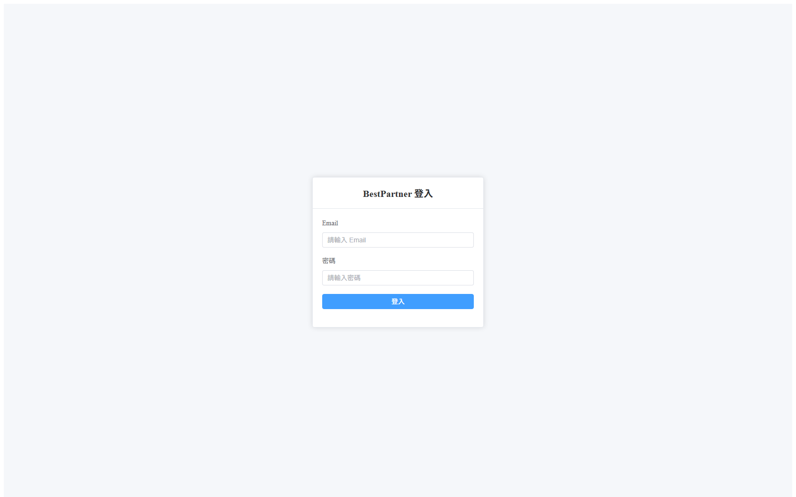
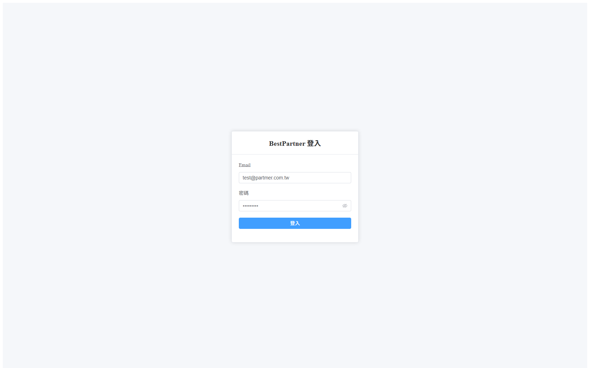
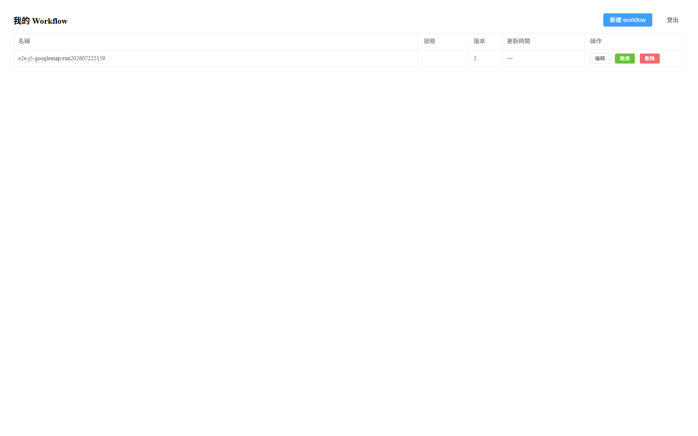
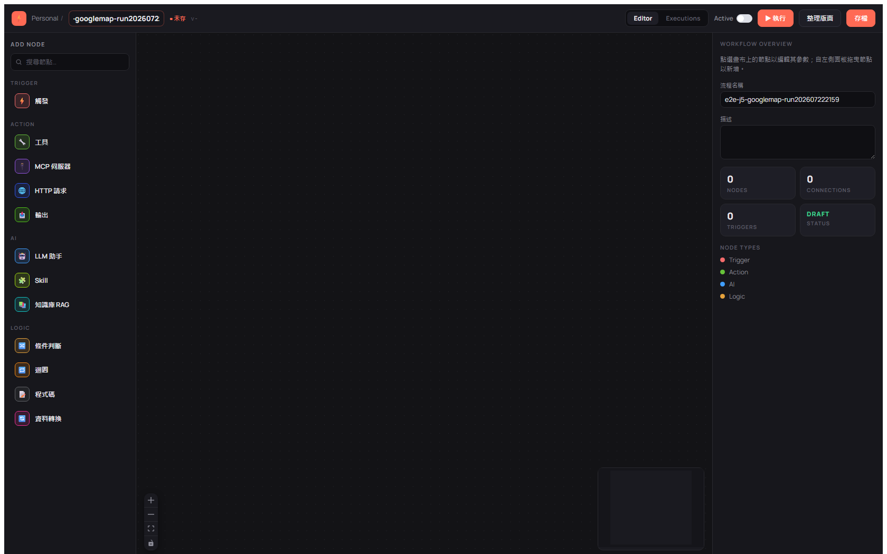
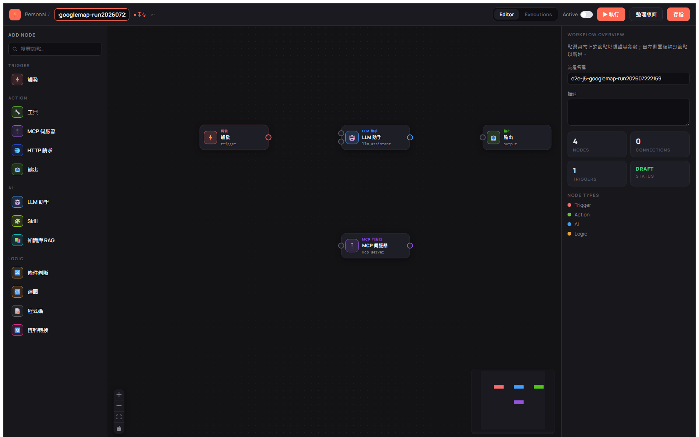
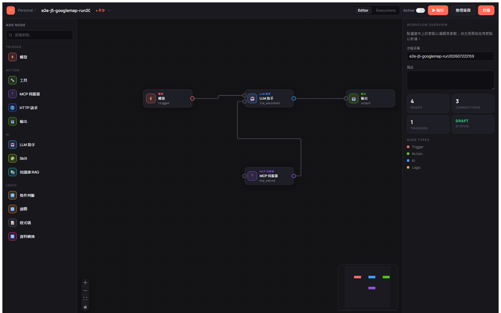
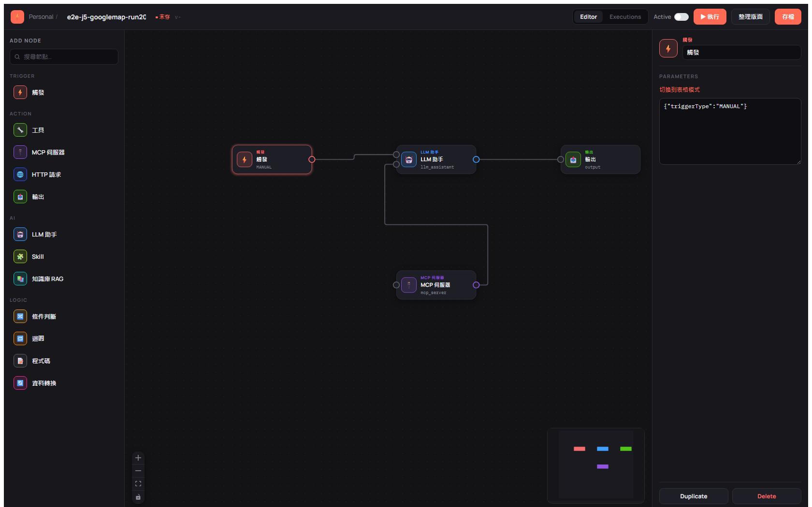
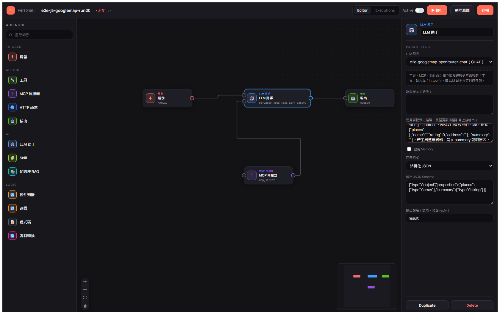
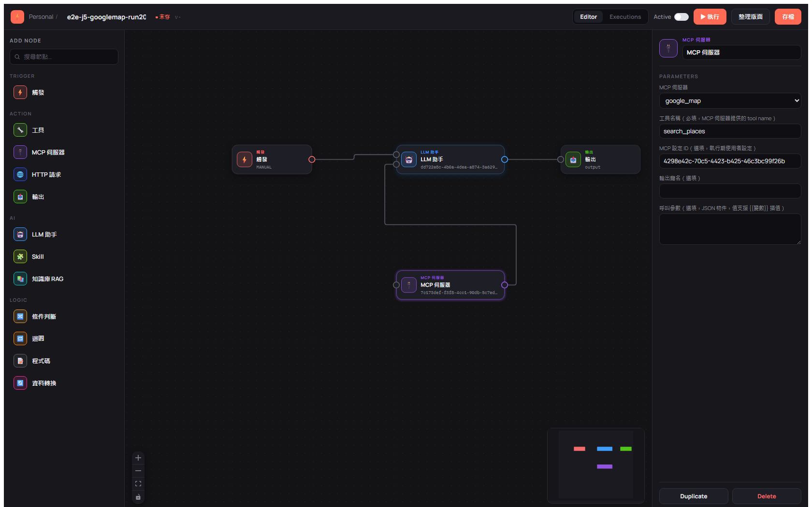
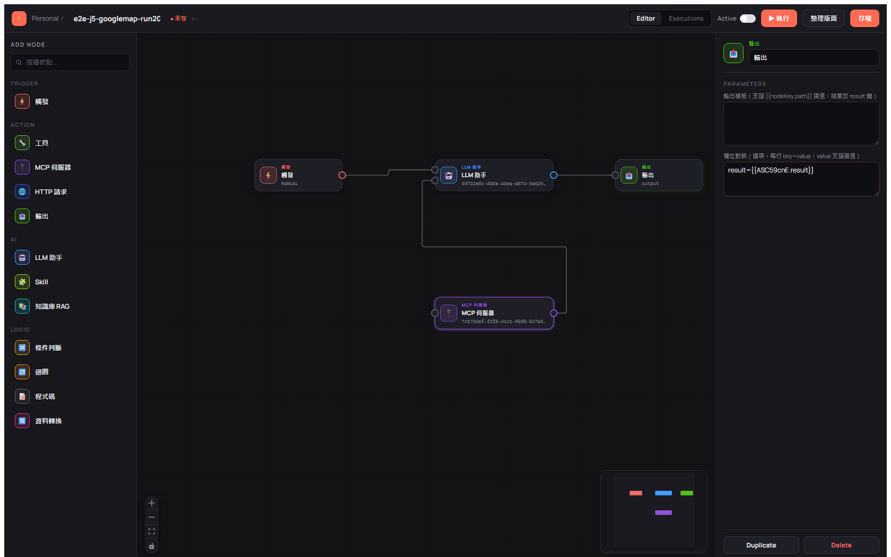
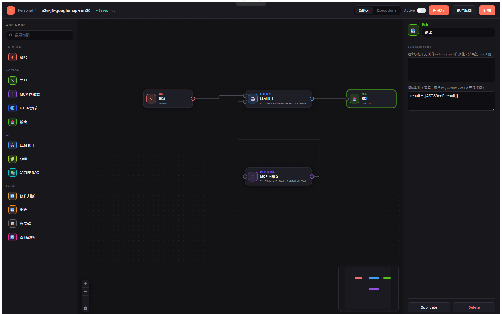


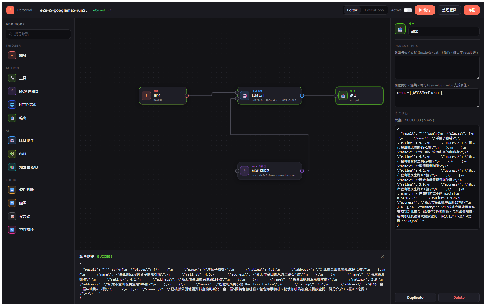

**SSE 事件序列（實測，run_3）**：
```
node.completed  nodeKey=BVOWdP2G (TRIGGER)        status=SUCCESS  seqNo=1
node.completed  nodeKey=ASC59cnE (LLM_ASSISTANT)  status=SUCCESS  seqNo=2  output={result: <金山咖啡廳 JSON>}
node.completed  (OUTPUT)                           status=SUCCESS
execution.completed status=SUCCESS
```

**DB 落庫斷言（直連 Postgres，execution `bdaa1e1c…`）**：
- `llm_workflow_execution`：status=`SUCCESS`、trigger_type=`MANUAL`。
- `llm_workflow_node_execution`：`[TRIGGER, LLM_ASSISTANT, OUTPUT]` 全 SUCCESS；**不含 `MCP_SERVER`**（Agent 模式能力掛載不獨立執行，符合 §11 回歸）。✅

**Deep-verify（LLM 實際呼叫 google_map）**：OUTPUT 為合法 JSON，含 **5 間金山地區實際咖啡廳**（店名＋評分＋新北市金山區地址，非拒答）：
| 店名 | 評分 | 地址 |
|------|:---:|------|
| 洋荳子咖啡 | 4.1 | 新北市金山區忠義路29-1號 |
| 金山跳石沒有名字的咖啡店 | 4.3 | 新北市金山區永興里跳石4號 |
| 海灣綠洲咖啡 | 4.2 | 新北市金山區民生路189號 |
| 舊金山總督溫泉咖啡廳 | 3.9 | 新北市金山區民生路196號 |
| 巴薩利斯克小館 Basilisk Bistro | 4.4 | 新北市金山區中山路237號 |

> 真實地點資料（含具體門牌與評分）證明 google_map MCP 已透過 `in:tool` 掛入 Agent 工具集且被 LLM 實際呼叫——deep-verify 通過（對照 §11「MCP 路徑掛載有效」，此處以真實 Places 資料進一步坐實）。

**斷言結果**：全部通過 ✅（CP1–CP9）。UI/plumbing、SSE SUCCESS、DB 落庫、deep-verify 地點資料皆成立。

> J5 慣例不逐字比對 LLM 文字；本案深驗僅寬鬆確認「回傳含金山實際地點且非拒答」，已滿足。

### J6 Inspector 表單（P1）

| 案例 | 優先 | 描述 | 預期 | 狀態 | 證據 / 備註 |
|------|:---:|------|------|:---:|------|
| J6-01 | P1 | LlmAssistantForm 選 llmId | 值寫回並可存檔 | | |
| J6-02 | P1 | Tool/McpServer/KnowledgeRag/Output 表單填寫 | config 正確寫回，save 後重載一致 | | |
| J6-03 | P2 | settingSchema 動態表單（sensitive 遮罩） | 依 schema 正確渲染欄位型別 | | |

### J7 契約錯誤（P2）

| 案例 | 優先 | 描述 | 預期 | 狀態 | 證據 / 備註 |
|------|:---:|------|------|:---:|------|
| J7-01 | P2 | save 節點 config 型別錯誤（未知欄位/結構型別錯） | 400，`workflow.node.config.invalid`，含 nodeKey | | |
| J7-02 | P2 | 樂觀鎖 version 衝突 | 400，`workflow.version.conflict`，UI 顯示衝突提示 | | |

---

## 旅程完成檢查清單（每完成一條旅程必須立即執行）

> 對應 SKILL.md Step 5.5。進入下一旅程前，逐項勾選並更新摘要表。

```
□ 所有案例的逐步截圖已擷取並存入 e2e-shots/<報告時間戳>/（每步驟一張，無遺漏）
□ 所有案例證據已寫入（逐步圖片連結以 Markdown 圖片語法嵌入 + trace/事件序列，無佔位符、無省略）
□ 所有案例狀態已標記（✅ / ❌ / ⏭️）
□ 失敗案例（❌）已在「問題追蹤區」詳細記錄
□ 摘要表該旅程統計數字已更新（Pass / Fail / Skip / 總數）
□ Pass 率已計算並填入（保留一位小數，如 80.0%）
□ 該旅程新增的 e2e-* 測試資料已清理
```

### 嚴格規則

- **不可延後**：完成一條旅程立即更新，不可等全部測完才統一更新
- **即時暫停**：某旅程 Pass 率過低（P0<100% / P1<95% / P2<80%），立即暫停評估
- **計算精確**：Pass 率 = Pass ÷ 總數 × 100%，保留一位小數
- **與問題追蹤同步**：失敗案例先入問題追蹤區，再更新摘要

---

## 測試資料清理規則

- E2E 建立的 workflow 一律以 `e2e-<caseId>-<runTag>` 前綴命名。
- 每條案例測試後經 `POST /llm/workflow/delete` 刪除；收尾以前綴掃描 `workflow/list` 兜底刪除殘留 `e2e-*`。
- **不得另建備份檔／目錄**；種子資料（admin、test_user、LLM setting）為前置條件，不刪除。
- 逐步截圖屬**報告證據**，隨報告保留於 `docs/test-confirmations/e2e-shots/<報告時間戳>/`，**不在清理範圍**（清理只針對 DB 的 `e2e-*` workflow 資料）。

> ⚠️ 收尾後資料庫殘留 `e2e-*` 資料，視同流程不完整，需補清理。

---

## 問題追蹤區

> 失敗（❌）項目在此詳記

| 案例 ID | 現象 | 期望行為 | 實際行為 | 根因 | 狀態 |
|---------|------|---------|---------|------|------|
| **IS-1** | 執行帶 google_map MCP 的 Agent workflow，LLM 節點於 62ms 內 `node.failed`：`Database query failed: IllegalArgumentException`；`/llm/mcpServer/getSetting` 對**所有** MCP 使用者設定亦回 400 `Could not deserialize string to java type Map<String,String>` | 引擎載入 MCP 使用者設定 → 解密 env → 注入金鑰 | 讀取 `setting_content` 時即失敗 | **非程式碼缺陷 —— 執行中的 runner jar 過期（環境問題）**。初判為「加密投影盲點」有誤；深查後確認：**執行的 jar 建於 2026-07-19 21:45**，而整欄加密的 `McpSettingEncryptConverter`（commit `5c68b47`）於 **2026-07-22 08:10** 才進版、AES-256-GCM v2（`cdc9188`）於 07-22 21:40。DB 內 4 筆 `llm_mcp_user_setting.setting_content` 已全數為 v2 密文（07-22 以 data-secret/SQL 加密落地），但**過期 jar 不含該 converter**，故 Hibernate 將 `Map<String,String>` 欄位當 JSON 反序列化密文字串 → 失敗。當前**原始碼正確**，重編 jar 後即應正常解密。 | ✅ 已解決（重編後端） |

> **IS-1 結論**：這是 **E2E 前置未依 skill Step 4「後端有異動先重編」導致的過期 jar 問題**，非後端程式缺陷。修正動作＝重新建置 uber-jar（含 `McpSettingEncryptConverter`，dev profile）後重啟。**驗證**：重啟後 `/llm/mcpServer/getSetting`（google_map）由 400 轉 **200**，`settingContent` 正確解密為 `{"GOOGLE_MAPS_API_KEY":"__SECRET_KEPT__"}`；J5-GM run_3 執行 SUCCESS 且回傳真實金山地點。教訓：E2E Step 4 起後端前，應比對 jar 建置時間與最後一次後端 commit，落後即重編。

---

## 常見問題排查

| 現象 | 可能原因 | 處理 |
|------|---------|------|
| 前置檢查後端非 200 | 服務未起 / port 80 被占用 | 起服務或釋放 port 後重試 |
| J5 一直逾時 | LLM api_key 無效 / 網路 | 確認 E2E_LLM_ID 有效；逾時放寬至 60–120s |
| 拖拉節點無效 | palette→畫布是 HTML5 原生 DnD，非滑鼠序列 | 合成 `dragstart`/`dragover`/`drop`（共用 `DataTransfer`）；**連線**才用 `mousedown→move→up`。放置後斷言節點數（詳見 `e2e-test-plan.md` §6） |
| 選擇器找不到 | Playwright 預設找 `data-testid`，專案用 `data-test` | config 設 `testIdAttribute:'data-test'` |
| llmId/toolId selectOption 找不到選項 | 運行 DB 的 ID 與種子檔漂移 | 由 global-setup 依 alias/platform 動態解析，勿硬編（詳見 §6） |
| 登入態失效 | storageState 過期 | 重新以 API 登入產生 storageState |
| 殘留 e2e-* 資料 | 清理未執行 | 以前綴掃描 workflow/list 兜底刪除 |
