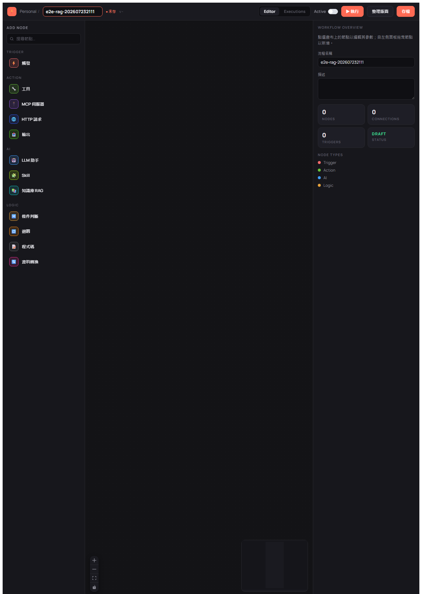
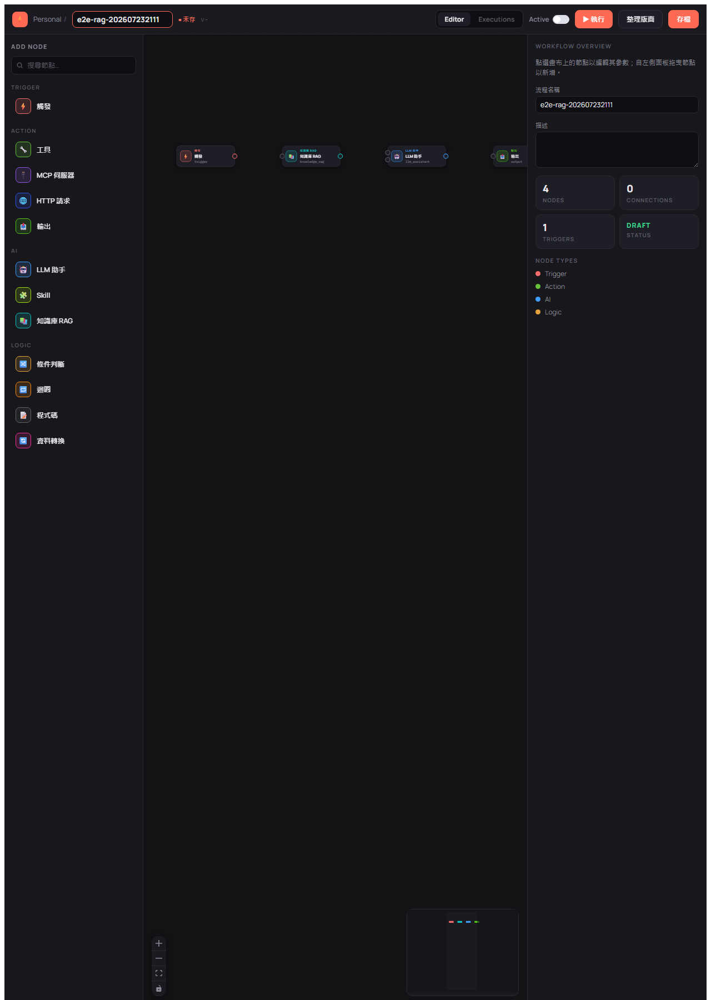
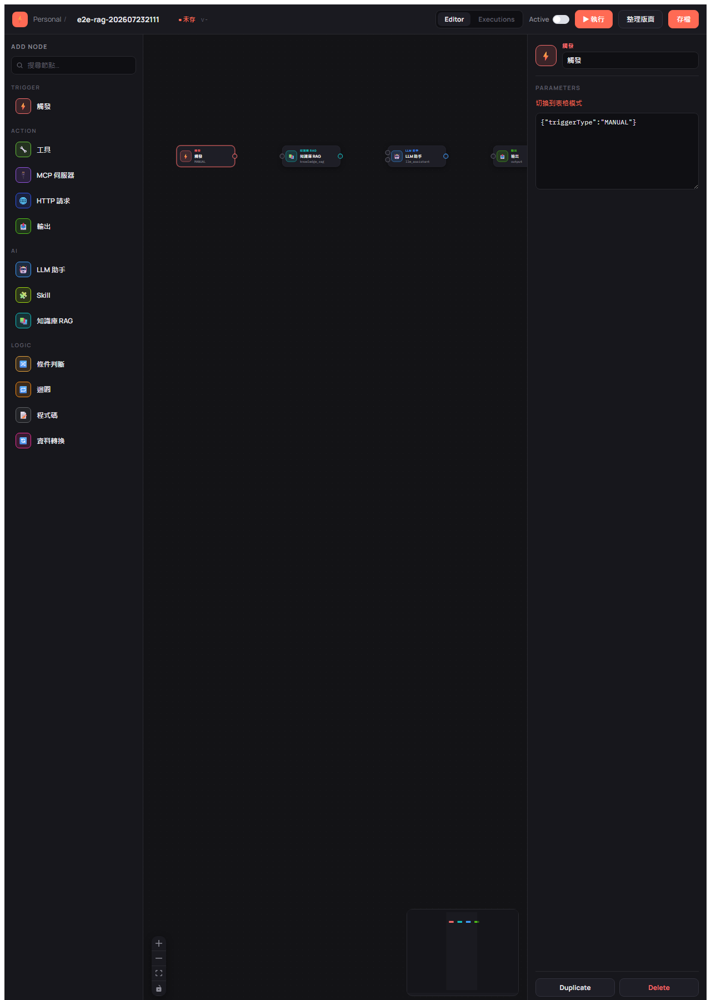
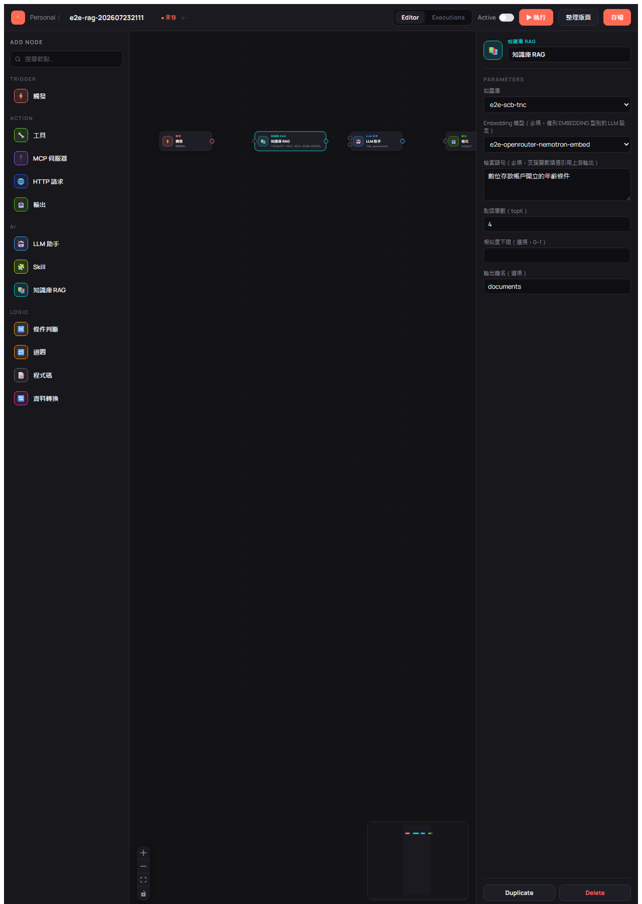
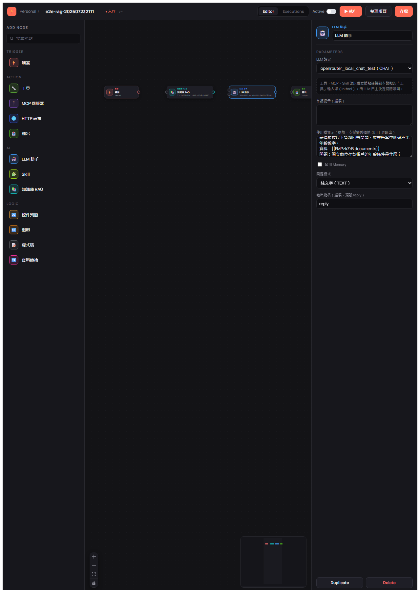
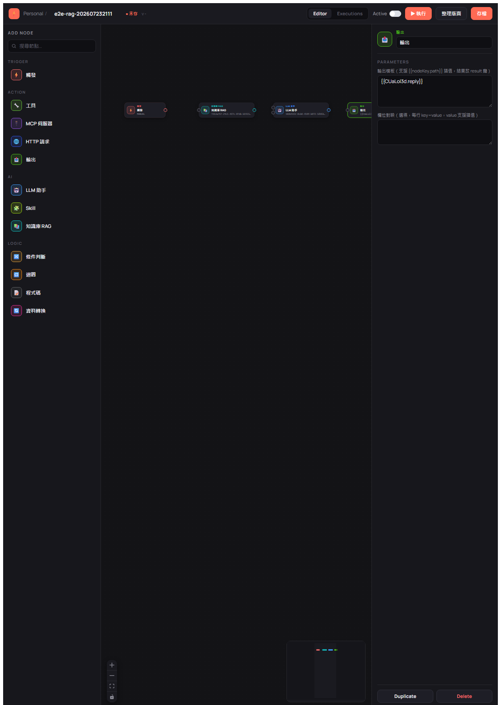
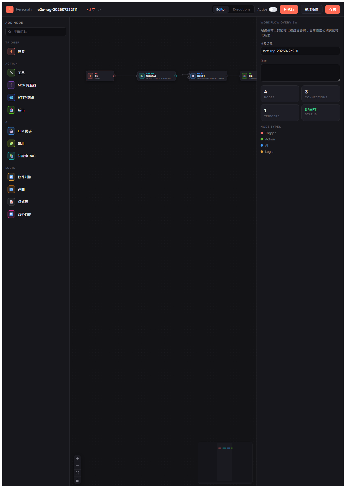
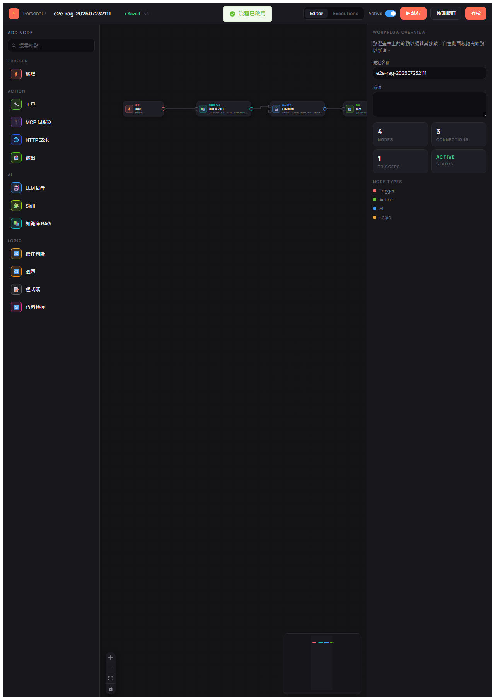
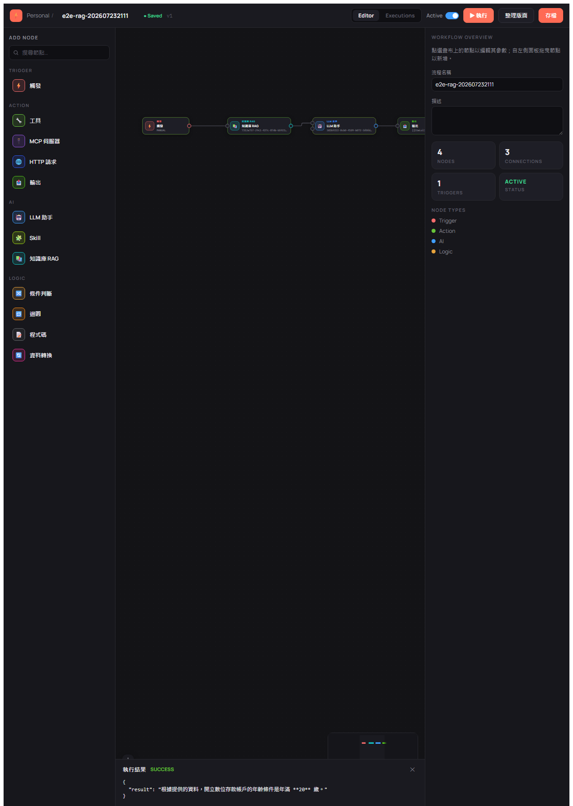

# BestPartner E2E 測試確認表（UI-driven）

> 本文件為 E2E 測試記錄，依 `e2e-test-confirmation` skill 由模板 `e2e-test-checklist.md` 複製產出。
> 旅程與案例定義的權威來源：`docs/e2e-test-plan.md`。

---

## 本次聚焦：RAG 端到端（LLM 接 Milvus 向量查詢並驗證正確性）

本週期為**聚焦式單一主旅程**（比照既有 `e2e-test-confirmation-202607222159.md` 的聚焦寫法），
驗證完整 RAG 能力：PDF → Milvus embedding → workflow `TRIGGER → KNOWLEDGE_RAG → LLM_ASSISTANT → OUTPUT`
→ **斷言 LLM 輸出與 PDF 原文事實相符**。

- 測試素材：`docs/rag/doc/scb/tw-online-tnc.pdf`（渣打 — 數位存款帳戶特別約定條款）
- **主斷言**：查詢「開立數位存款帳戶的年齡條件」→ LLM 回覆須含「二十歲 / 20」（原文：二、開戶條件 1.「年滿二十歲」）
- 前置（無 UI，走 API）：Milvus 向量庫設定、上傳 PDF 建知識庫、解析 embedding/chat LLM
- UI（webwright）：登入 → 建 workflow → 拖 4 節點 → Inspector 設定 → 連線 → 存檔 → 啟用 → 執行 → 斷言結果

> ⚠️ 標準 J5 規定「不比對 LLM 輸出文字」；本次為 **RAG 正確性測試**，刻意擴充為比對輸出事實，
> 屬本旅程的核心目的（見「RAG 正確性斷言」表）。此旅程覆蓋既有 J1（登入）/J2（建 workflow）/
> J3（畫布編輯）/J4（啟用）/J5（執行）/J6（KnowledgeRag+Output 表單）；J7 本次不適用（—）。

---

## 使用說明（狀態符號）

| 符號 | 意義 |
|------|------|
| ✅ | Pass — 案例通過 |
| ❌ | Fail — 案例失敗（見「問題追蹤區」） |
| ⏭️ | Skip — 本次略過（證據欄說明原因） |
| — | 本次週期不適用 |

---

## 測試週期資訊

| 項目 | 內容 |
|------|------|
| 測試日期 | 2026-07-23 21:11 |
| 服務版本 | 0.1.8-SNAPSHOT |
| 測試環境 | dev |
| 瀏覽器 | chromium |
| 前端 baseURL | `http://localhost:4173`（npm run preview） |
| 後端 API URL | `http://localhost:80` |
| 向量資料庫 | Milvus（localhost:19530，已啟動；collection `e2e_scb_tnc`，dim 2048） |
| Embedding 模型 | OpenRouter `nvidia/nemotron-3-embed-1b:free`（dim 2048，實測輸出 2048）；embeddingModelId `b90f289b-f4c8-4ffd-93de-a5bcb5dfad58` |
| Chat LLM 平台 / ID | OpenRouter `deepseek/deepseek-v3.2`；llmId `583b9222-8cb0-4109-b072-5f0fd1e9fed9`（`/llm/chat` 驗證回「測試」✅） |
| knowledgeId | `7312a757-29c1-437c-87db-b5923433e120` |
| embeddingStoreId | `99288b7f-cecb-44e9-94bd-194cc483c8d2` |
| 測試結束時間 | 2026-07-23 21:55 |

---

## 前置檢查清單（測試前必須全部 ✅）

```
[✅] Milvus 於 localhost:19530 可連（TCP OPEN）
[✅] 後端服務於 port 80 健康回應（/systemSetting/list HTTP 200）
[✅] PostgreSQL 已初始化（docker postgres-db），種子資料存在（admin、6 平台、5 LLM setting）
[✅] EMBEDDING 型 LLM setting：改用 OpenRouter nemotron-3-embed-1b（原 DB 僅有 OLLAMA bge-m3，
     但本機無 Ollama；OpenRouter embedding 端點實測可用，維度 2048）
[✅] CHAT 型 LLM setting：OpenRouter deepseek-v3.2（api_key 有效，/llm/chat 200）
[✅] 前端已 build（dist fresh）並可由 http://localhost:4173 存取（HTTP 200）
[  ] webwright / Playwright chromium 可用（Phase B 開始時確認）
```

> 前置調整說明：原規劃 embedding 用 OpenAI，但 DB 無 OpenAI 設定、本機亦無 Ollama。
> 依使用者指示改用 **OpenRouter `nvidia/nemotron-3-embed-1b:free`**。已實測 OpenRouter
> `/api/v1/embeddings` 端點可用（模型頁 200、輸出維度穩定 2048），後端 `OpenrouterModelBuilder`
> 以 `OpenAiEmbeddingModel` 對接該端點，故 Milvus collection 維度設 2048 對齊。

---

## RAG 正確性斷言（本次核心）

| # | 查詢問題 | 預期關鍵字 | API sanity（Phase A-8） | UI 執行輸出（Phase B-17） | 狀態 |
|---|---------|-----------|------------------------|--------------------------|:---:|
| 主 | 開立數位存款帳戶的年齡條件？ | 二十歲 / 20 | ✅ Top-1 片段含「…年滿**二十歲**自然人」 | ✅ LLM 輸出「…年滿 **20** 歲」 | ✅ |
| 備1 | 電子文件及紀錄保存期限？ | 五年 | （備援，未觸發） | — | — |

---

## 旅程測試清單（RAG 流程對映 J1–J6）

### Phase A — API 前置（無 UI）

| 步驟 | 描述 | 預期 | 狀態 | 證據 / 備註 |
|------|------|------|:---:|------|
| A-3 | `POST /login` 取 JWT | 200，取得 token | ✅ | admin@bestpartner.com.tw，`data` 為 JWT |
| A-4 | 建立 EMBEDDING 型 LLM setting | 取得 embeddingModelId 與維度 | ✅ | OpenRouter nemotron，dim 2048，`b90f289b…`，apiKey 落地為 `__SECRET_KEPT__` |
| A-5 | 驗證 CHAT 型 LLM setting | 取得可用 llmId | ✅ | deepseek-v3.2 `583b9222…`，`/llm/chat` 回「測試」 |
| A-6 | `POST /llm/vector/save` 建 Milvus 向量庫 | 取得 embeddingStoreId | ✅ | MILVUS `e2e_scb_tnc` dim 2048，`99288b7f…` |
| A-7 | `POST /llm/vector/uploadFiles` 上傳 PDF | 取得 knowledgeId | ✅ | 7.7s 完成，knowledgeId `7312a757…` |
| A-8 | `POST /llm/vector/getDataFromEmbeddingStore` sanity | 片段含「二十歲」 | ✅ | 回 3 片段，Top-1＝「立約人應為…年滿**二十歲**自然人」，`含「二十歲」:true` |

### Phase B — UI 驅動 workflow（webwright）

| 案例 | 對映 | 描述 | 預期 | 狀態 | 證據 / 備註 |
|------|:---:|------|------|:---:|------|
| B-09 | J1 | 瀏覽器 admin 登入 | 導向列表 `/` | ✅ | 登入後 url=`/`；  |
| B-10 | J2 | 建立新 workflow `e2e-rag-202607232111` | 進 `/editor`，DRAFT | ✅ | create-button→`/editor`，命名 e2e-rag-202607232111； |
| B-11 | J3 | 拖入 TRIGGER/KNOWLEDGE_RAG/LLM_ASSISTANT/OUTPUT（HTML5 DnD） | 4 節點出現，各有 nodeKey | ✅ | node count=4，keys t2Z1BQNu/FMPzkZrB/CUaLol3d/NxUCiDOI； |
| B-12 | J3/J6 | Inspector 設定各節點 config | 值寫回 | ✅ | TRIGGER=MANUAL、RAG(knowledge/embedding/query/documents)、LLM(deepseek-v3.2/userPrompt引用`{{FMPzkZrB.documents}}`/reply)、OUTPUT(`{{CUaLol3d.reply}}`)；    |
| B-13 | J3 | 連線 trigger→rag→llm→output | 3 條 edge | ✅ | edge count=3； |
| B-14 | J3 | 存檔 | saved-badge，version 1 | ✅ | saved-badge 出現，DB workflow `5d06a981…` version=1； |
| B-15 | J4 | 啟用 workflow | 狀態 ACTIVE | ✅ | active-toggle→switchStatus 通過驗證，DB status=ACTIVE； |
| B-16 | J5 | 執行 workflow | finalStatus SUCCESS，各節點 SUCCESS | ✅ | execution `648efca6…` SUCCESS（有起訖）；4 node execution 全 SUCCESS（trigger/rag/llm/output）； |
| B-17 | RAG | 斷言 finalOutput 含「二十歲/20」 | 內容與 PDF 相符 | ✅ | finalOutput=`{"result":"根據提供的資料，開立數位存款帳戶的年齡條件是年滿 **20** 歲。"}`，含「20」；與 PDF「年滿二十歲」一致；證據同 B16-01 |

---

## 測試結果摘要

| 階段 | 總數 | ✅ | ❌ | ⏭️ | Pass 率 |
|------|------|----|----|----|---------|
| Phase A（API 前置） | 6 | 6 | 0 | 0 | 100.0% |
| Phase B（UI 執行 + 斷言） | 9 | 9 | 0 | 0 | 100.0% |
| **合計** | **15** | **15** | **0** | **0** | **100.0%** |

> **結論**：LLM 接 Milvus 向量查詢的 RAG 端到端流程通過。使用者的核心驗證需求
> 「先確認 PDF 內容決定關鍵字、再確認 LLM 最後查到的資訊是否符合」已達成——
> 以 PDF 原文「立約人應為…年滿**二十歲**自然人」為斷言依據，LLM 經 workflow
> （Milvus + nemotron embedding 檢索 → deepseek-v3.2 作答）回覆「開立數位存款帳戶的
> 年齡條件是年滿 **20** 歲」，語意與原文事實一致。API sanity 與 UI 執行雙重驗證皆通過。

---

## 問題追蹤區

| 案例 ID | 現象 | 期望行為 | 實際行為 | 根因 | 狀態 |
|---------|------|---------|---------|------|------|
| | | | | | |

---

## 測試資料清理

```
[✅] 刪除測試 workflow（/llm/workflow/delete，DB 殘留 e2e-rag-% = 0）
[✅] 刪除知識庫向量與 metadata（/llm/vector/deleteData；llm_knowledge/doc/doc_slice = 0）
[✅] 刪除測試 embedding LLM 設定（/llm/setting/delete b90f289b，含 api_key 一併移除）
[✅] 刪除測試向量庫設定（DB vector_store_setting e2e-milvus-scb-tnc）
[✅] 移除 Milvus 測試 collection（e2e_scb_tnc，REST drop）
[✅] 刪除暫存明文金鑰檔（scratchpad/or_key.txt）
[✅] 後端（80）+ 前端（4173）服務已關閉
```

> 保留項（非清理範圍）：截圖證據於 `e2e-shots/202607232111/`；其餘 Milvus collection
> 與既有 5 筆 LLM 設定為測試前既存資料，未更動。
