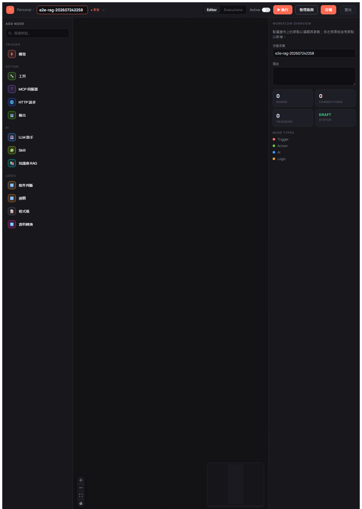
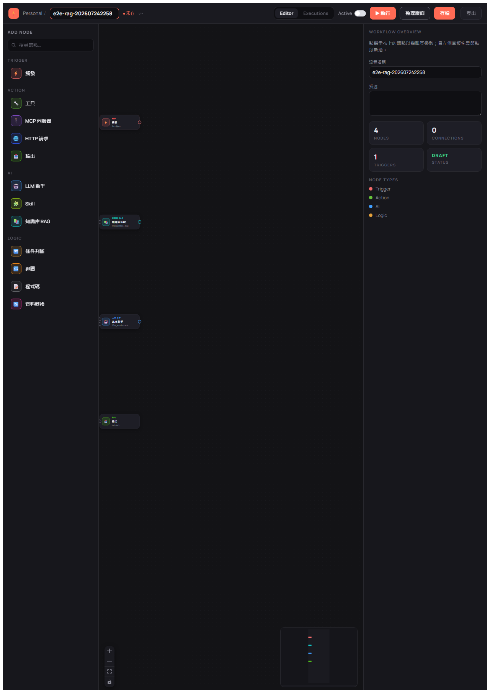
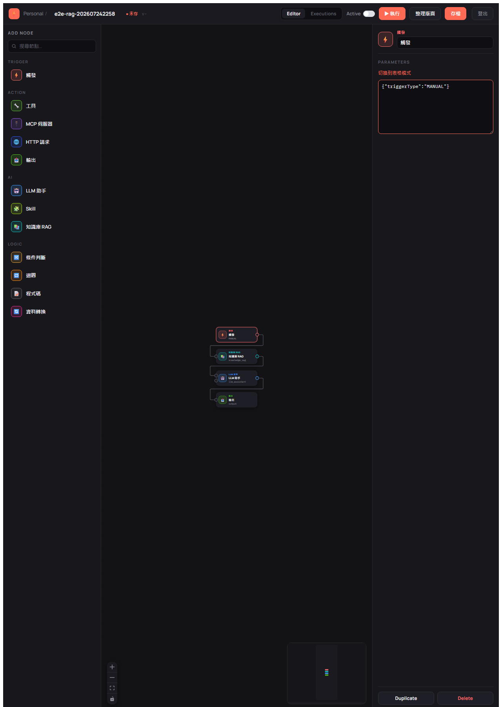
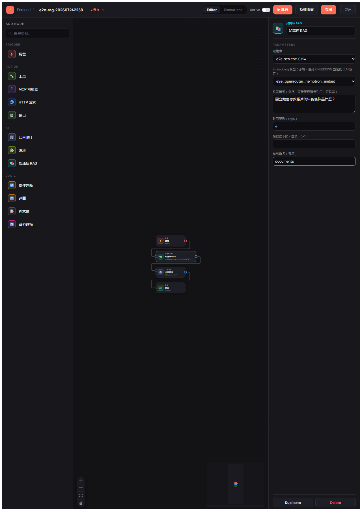
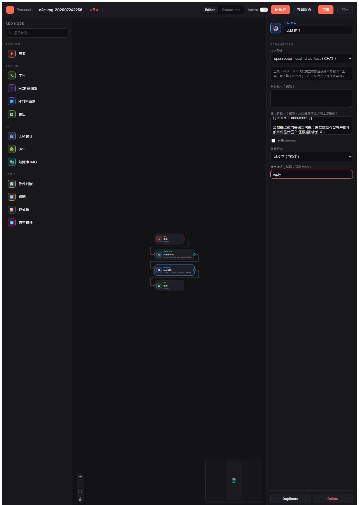
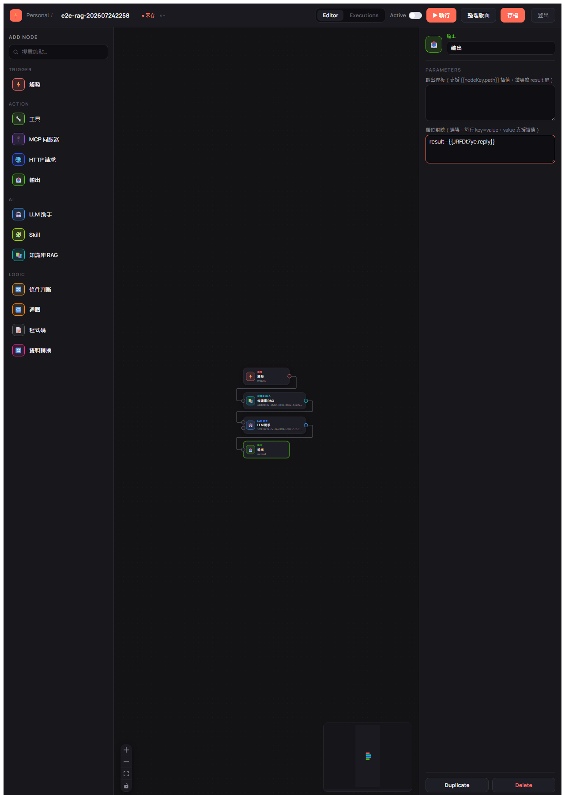
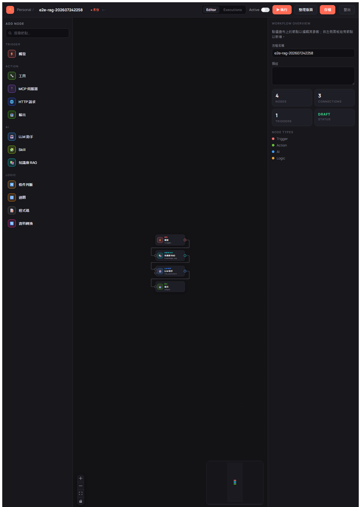
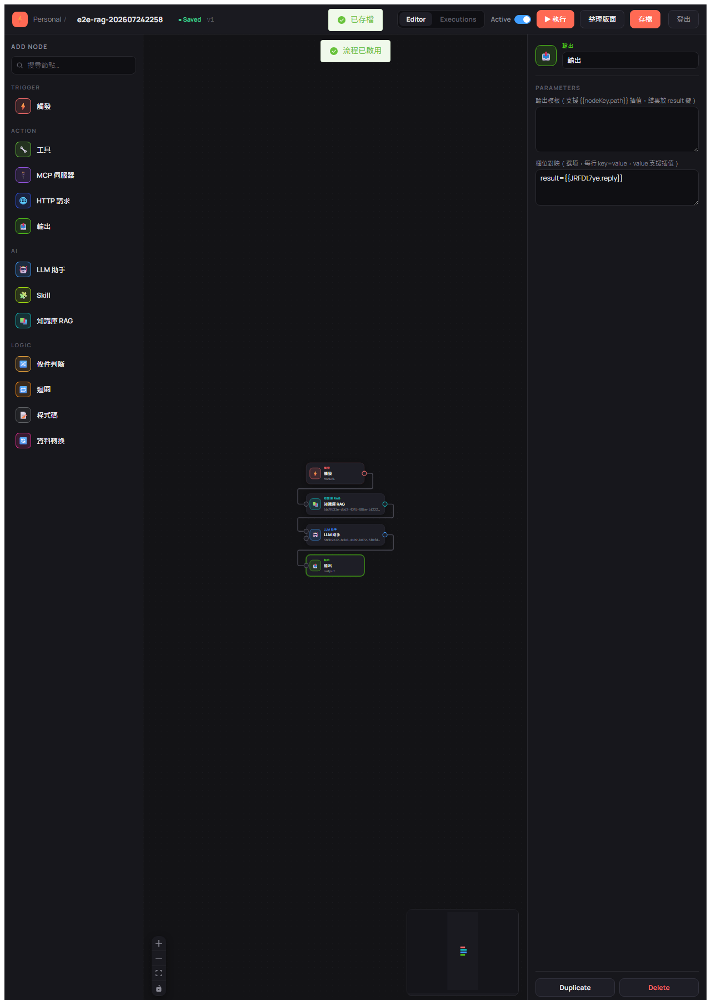
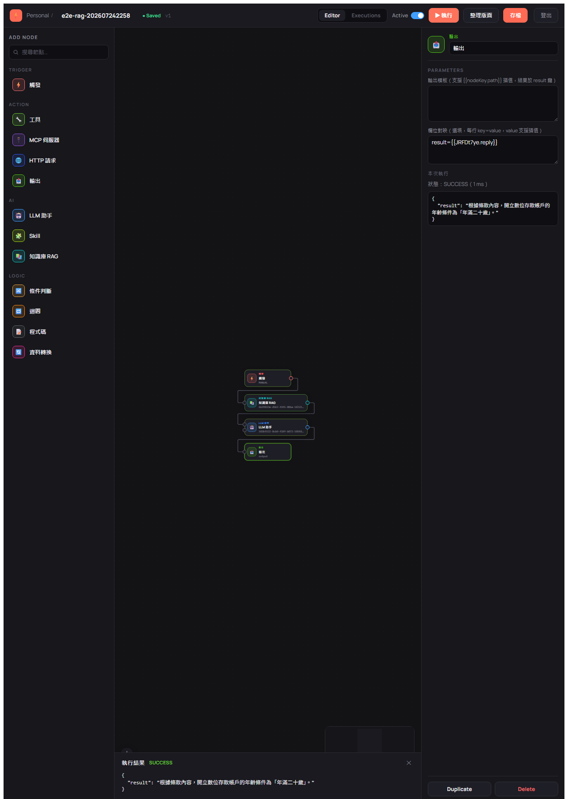

# BestPartner E2E 測試確認表（UI-driven）

> 本文件為 E2E 測試記錄，依 `e2e-test-confirmation` skill 由模板 `e2e-test-checklist.md` 複製產出。
> 旅程與案例定義的權威來源：`docs/e2e-test-plan.md`。
> 本次為**重跑 `e2e-test-confirmation-202607232111.md` 的聚焦 RAG 主旅程**，依使用者指示
> **不清理測試資料**（保留供使用者手動測試一次）。

---

## 本次聚焦：RAG 端到端（LLM 接 Milvus 向量查詢並驗證正確性）

驗證完整 RAG 能力：PDF → Milvus embedding → workflow `TRIGGER → KNOWLEDGE_RAG → LLM_ASSISTANT → OUTPUT`
→ **斷言 LLM 輸出與 PDF 原文事實相符**。

- 測試素材：`docs/rag/doc/scb/tw-online-tnc.pdf`（渣打 — 數位存款帳戶特別約定條款）
- **主斷言**：查詢「開立數位存款帳戶的年齡條件」→ LLM 回覆須含「二十歲 / 20」（原文：一、「立約人應為…年滿二十歲自然人」）
- 前置（無 UI，走 API）：Milvus 向量庫設定、上傳 PDF 建知識庫、解析 embedding/chat LLM
- UI（webwright）：登入 → 建 workflow → 拖 4 節點 → Inspector 設定 → 連線 → 存檔 → 啟用 → 執行 → 斷言結果

> ⚠️ 標準 J5 規定「不比對 LLM 輸出文字」；本次為 **RAG 正確性測試**，刻意擴充為比對輸出事實，
> 屬本旅程的核心目的（見「RAG 正確性斷言」表）。此旅程覆蓋既有 J1/J2/J3/J4/J5/J6；J7 本次不適用（—）。

---

## 使用說明（狀態符號）

| 符號 | 意義 |
|------|------|
| ✅ | Pass — 案例通過 |
| ❌ | Fail — 案例失敗（見「問題追蹤區」） |
| ⏭️ | Skip — 本次略過（證據欄說明原因） |
| — | 本次週期不適用 |

---

## 測試週期資訊

| 項目 | 內容 |
|------|------|
| 測試日期 | 2026-07-24 22:58 |
| 服務版本 | 0.1.8-SNAPSHOT |
| 測試環境 | dev |
| 瀏覽器 | chromium |
| 前端 baseURL | `http://localhost:4173`（npm run preview，dist 已重建含 WorkflowEditorView 未提交變更） |
| 後端 API URL | `http://localhost:80` |
| 向量資料庫 | Milvus（localhost:19530，已啟動；collection `e2e_scb_tnc_0724`，dim 2048） |
| Embedding 模型 | OpenRouter `nvidia/nemotron-3-embed-1b:free`（dim 2048）；embeddingModelId `3b624ce5-963f-48d5-9389-e333937c8bc8` |
| Chat LLM 平台 / ID | OpenRouter `deepseek/deepseek-v3.2`；llmId `583b9222-8cb0-4109-b072-5f0fd1e9fed9`（`/llm/chat` 驗證回「測試」✅） |
| knowledgeId | `6b39833e-d562-4345-886e-5f222e6d722c` |
| embeddingStoreId | `b8828b60-4080-4422-8ea8-79281e65f6bf` |
| 登入帳號 | admin@bestpartner.com.tw（密碼由使用者提供，非種子預設；未變更 DB） |
| workflowId / executionId | `42ff65fc-2658-44d8-adb6-19e9560f7630`（ACTIVE, v1）／ `9e6b9ee8-3dbe-4605-97e8-f1957744f9da`（SUCCESS） |
| 測試結束時間 | 2026-07-24 23:12 |

---

## 前置檢查清單（測試前必須全部 ✅）

```
[✅] Milvus 於 localhost:19530 可連（docker milvus-standalone 運行中）
[✅] 後端服務於 port 80 健康回應（/systemSetting/list HTTP 200，profile dev）
[✅] PostgreSQL 已初始化（docker postgres-db），種子資料存在（admin、6 平台、5 LLM setting）
[✅] admin 登入可用（DB admin 密碼非種子預設，經使用者提供密碼登入 200，未變更 DB）
[✅] EMBEDDING 型 LLM setting：新建 OpenRouter nemotron-3-embed-1b（本機無 Ollama；維度 2048）
[✅] CHAT 型 LLM setting：OpenRouter deepseek-v3.2（api_key 有效，/llm/chat 200）
[✅] 前端已重新 build（dist fresh）並可由 http://localhost:4173 存取（HTTP 200）
[✅] webwright / Playwright chromium 可用（Phase B 開始時確認）
```

> 前置調整說明：embedding 沿用 202607232111 的選型——本機無 Ollama，改用 OpenRouter
> `nvidia/nemotron-3-embed-1b:free`（維度 2048），Milvus collection 維度對齊 2048。

---

## RAG 正確性斷言（本次核心）

| # | 查詢問題 | 預期關鍵字 | API sanity（Phase A-8） | UI 執行輸出（Phase B-17） | 狀態 |
|---|---------|-----------|------------------------|--------------------------|:---:|
| 主 | 開立數位存款帳戶的年齡條件？ | 二十歲 / 20 | ✅ Top-1 片段含「…年滿**二十歲**自然人」 | ✅ LLM 輸出「…年齡條件為「**年滿二十歲**」」 | ✅ |

---

## 旅程測試清單（RAG 流程對映 J1–J6）

### Phase A — API 前置（無 UI）

| 步驟 | 描述 | 預期 | 狀態 | 證據 / 備註 |
|------|------|------|:---:|------|
| A-3 | `POST /login` 取 JWT | 200，取得 token | ✅ | admin@bestpartner.com.tw，`data` 為 JWT（token 634 字元） |
| A-4 | 建立 EMBEDDING 型 LLM setting | 取得 embeddingModelId 與維度 | ✅ | OpenRouter nemotron，dim 2048，`3b624ce5…`，apiKey 落地為 `__SECRET_KEPT__` |
| A-5 | 驗證 CHAT 型 LLM setting | 取得可用 llmId | ✅ | deepseek-v3.2 `583b9222…`，`/llm/chat` 回「測試」 |
| A-6 | `POST /llm/vector/save` 建 Milvus 向量庫 | 取得 embeddingStoreId | ✅ | MILVUS `e2e_scb_tnc_0724` dim 2048，`b8828b60…` |
| A-7 | `POST /llm/vector/uploadFiles` 上傳 PDF | 取得 knowledgeId | ✅ | 完成，knowledgeId `6b39833e…` |
| A-8 | `POST /llm/vector/getDataFromEmbeddingStore` sanity | 片段含「二十歲」 | ✅ | 回多片段，Top-1＝「立約人應為…年滿**二十歲**自然人」，`含「二十歲」:true` |

### Phase B — UI 驅動 workflow（webwright）

| 案例 | 對映 | 描述 | 預期 | 狀態 | 證據 / 備註 |
|------|:---:|------|------|:---:|------|
| B-09 | J1 | 瀏覽器 admin 登入 | 導向列表 `/` | ✅ | 登入後 create-button 可見；  |
| B-10 | J2 | 建立新 workflow `e2e-rag-202607242258` | 進 `/editor`，DRAFT | ✅ | create-button→`/editor`，命名 e2e-rag-202607242258； |
| B-11 | J3 | 拖入 TRIGGER/KNOWLEDGE_RAG/LLM_ASSISTANT/OUTPUT（HTML5 DnD） | 4 節點，各有 nodeKey | ✅ | node count=4，ragKey `sImK701J`、llmKey `JRFDt7ye`； |
| B-12 | J3/J6 | Inspector 設定各節點 config | 值寫回 | ✅ | TRIGGER=MANUAL、RAG(knowledge `6b39833e`/embedding `3b624ce5`/query/outputKey=documents)、LLM(deepseek-v3.2/userPrompt 引用 `{{sImK701J.documents}}`/reply)、OUTPUT(`result={{JRFDt7ye.reply}}`)；    |
| B-13 | J3 | 連線 trigger→rag→llm→output | 3 條 edge | ✅ | tidy 後 connectVerify，edge count=3； |
| B-14 | J3 | 存檔 | saved-badge，version 1 | ✅ | saved-badge 出現，version v1，DB workflow `42ff65fc…` version=1； |
| B-15 | J4 | 啟用 workflow | 狀態 ACTIVE | ✅ | active-toggle→switchStatus 通過驗證，DB status=ACTIVE； |
| B-16 | J5 | 執行 workflow | finalStatus SUCCESS，各節點 SUCCESS | ✅ | drawer status SUCCESS；DB execution `9e6b9ee8…` SUCCESS/MANUAL；4 node_execution 全 SUCCESS（trigger/rag/llm/output）；  |
| B-17 | RAG | 斷言 finalOutput 含「二十歲/20」 | 內容與 PDF 相符 | ✅ | finalOutput=`{"result":"根據條款內容，開立數位存款帳戶的年齡條件為「年滿二十歲」。"}`，含「二十」；與 PDF「年滿二十歲」一致； |

---

## 測試結果摘要

| 階段 | 總數 | ✅ | ❌ | ⏭️ | Pass 率 |
|------|------|----|----|----|---------|
| Phase A（API 前置） | 6 | 6 | 0 | 0 | 100.0% |
| Phase B（UI 執行 + 斷言） | 9 | 9 | 0 | 0 | 100.0% |
| **合計** | **15** | **15** | **0** | **0** | **100.0%** |

> **結論**：LLM 接 Milvus 向量查詢的 RAG 端到端流程通過。以 PDF 原文「立約人應為…年滿**二十歲**
> 自然人」為斷言依據，LLM 經 workflow（Milvus + nemotron embedding 檢索 → deepseek-v3.2 作答）
> 回覆「開立數位存款帳戶的年齡條件為『年滿**二十歲**』」，語意與原文事實一致。API sanity 與 UI 執行雙重驗證皆通過。

---

## 後續：改為「問題驅動檢索」（動態 RAG query）— 架構釐清與驗證

> 使用者提出：RAG 流程不應把檢索 query 寫死，應由 LLM／執行時的問題去驅動檢索。
> 經查證與調整後驗證如下。

### 架構釐清（本系統實際支援）

| 模式 | 誰主導檢索 | 支援情況 |
|------|-----------|---------|
| (a) Pipeline RAG（前置檢索） | `KNOWLEDGE_RAG` 節點先做**向量相似度搜尋取 topK**（非讀全部）→ 注入 LLM prompt | ✅ workflow 唯一做法 |
| (b) Assistant 內掛 RAG | `/llm/customAssistantChat` 帶 `knowledgeId`，服務層 langchain4j `RetrievalAugmentor` 每次以當下訊息自動檢索 | ✅ 僅 chat 端點，workflow 節點無 |
| (c) Agentic RAG（LLM 自主呼叫檢索工具） | LLM function-calling 自行決定何時查 | ❌ 無現成節點 |

> `LLM_ASSISTANT` 節點本身無 knowledge/retriever 整合（`LlmAssistantExecutor` 無相關程式），
> 故 workflow 內 RAG 必經 `KNOWLEDGE_RAG` 節點。原 E2E 採 (a) 並非錯誤，但檢索 query 為寫死字串。

### 調整：query 改插值引用 TRIGGER 的 inputPayload

- `KNOWLEDGE_RAG.query`：`開立數位存款帳戶的年齡條件是什麼？`（寫死）→ **`{{PFgnkbtB.question}}`**
- `LLM_ASSISTANT.userPrompt`：問題部分同樣改引用 `{{PFgnkbtB.question}}`
- workflow 存檔 version 1 → **2**（樂觀鎖通過）

### 驗證：同一 workflow、不同執行時問題 → 不同檢索 → 不同正確答案（API 帶 inputPayload）

| 執行時 `inputPayload.question` | executionId | 檢索命中 | LLM 輸出 | 狀態 |
|------|------|------|------|:---:|
| 開立數位存款帳戶的年齡條件是什麼？ | `082c2697…` | 條款第一條第1點 | 「…年齡條件為『年滿**二十歲**』…」 | ✅ SUCCESS |
| 電子文件及紀錄的保存期限是多久？ | `77b95612…` | 條款第6點 | 「…保存期限至少應為…**五年**以上…」 | ✅ SUCCESS |

> 證明檢索確由執行時傳入的問題驅動，不再寫死。四節點皆 SUCCESS，SSE 事件序列
> `execution.started → node.*(×4) → execution.completed(SUCCESS)`。

### ⚠️ 連帶限制（重要）：UI「▶ 執行」按鈕無法驅動動態 query

前端 `executeWorkflow`（`api/workflowExecution.ts`）送出的 body **只有 `{id}`、不含 `inputPayload`**，
UI 也無填入 inputPayload 的欄位。故 query 改為 `{{PFgnkbtB.question}}` 後，
**從 UI 執行按鈕會失敗**：

- 實測不帶 inputPayload 執行 → `KNOWLEDGE_RAG` 節點 `node.failed`，錯誤
  `Variable not found: PFgnkbtB.question`，執行 `FAILED`（executionId `599bba08…`）。

> 結論：動態 query 版本**只能經 API／程式化觸發並帶 `inputPayload` 執行**（如上兩例）；
> 若要維持「UI 執行按鈕可跑」，query 需為寫死字串（原 (a) 版）。此為前端目前無 inputPayload
> 輸入介面的產品限制，非後端問題。

---

## 問題追蹤區

| 案例 ID | 現象 | 期望行為 | 實際行為 | 根因 | 狀態 |
|---------|------|---------|---------|------|------|
| | | | | | |

---

## 測試資料清理

> ⚠️ **本次依使用者指示不清理資料**，保留下列資源供使用者手動測試一次：

```
[ 保留 ] 測試 workflow e2e-rag-202607242258（供手動執行）
[ 保留 ] 知識庫向量與 metadata（knowledgeId 6b39833e…）
[ 保留 ] 測試 embedding LLM 設定（3b624ce5…，OpenRouter nemotron）
[ 保留 ] 測試向量庫設定（vector_store_setting b8828b60…，e2e-milvus-scb-tnc-0724）
[ 保留 ] Milvus 測試 collection（e2e_scb_tnc_0724，dim 2048）
[✅] 刪除暫存明文金鑰檔（scratchpad/or_key.txt、jwt.txt）— 收尾執行
[ 保留 ] 後端（80）+ 前端（4173）服務——依使用者後續指示保留運行，供手動測試
```

> 截圖證據於 `e2e-shots/202607242258/`。

---

## 後續手動測試指引（本次刻意保留資料）

> 全部資源已保留於 PostgreSQL（docker `postgres-db`）與 Milvus（docker `milvus-standalone`），
> 服務關閉不影響資料；重啟服務即可續測。

### 保留資源清單

| 資源 | 值 |
|------|----|
| Workflow | `e2e-rag-202607242258`（id `42ff65fc-2658-44d8-adb6-19e9560f7630`，**ACTIVE**、v1） |
| 知識庫 knowledgeId | `6b39833e-d562-4345-886e-5f222e6d722c`（標籤 e2e-scb-tnc-0724） |
| Embedding 設定 | `3b624ce5-963f-48d5-9389-e333937c8bc8`（OpenRouter nemotron-3-embed-1b，dim 2048） |
| Milvus collection | `e2e_scb_tnc_0724`（dim 2048） |
| 向量庫設定 | `b8828b60-4080-4422-8ea8-79281e65f6bf`（e2e-milvus-scb-tnc-0724） |
| Chat LLM | `583b9222-8cb0-4109-b072-5f0fd1e9fed9`（deepseek-v3.2） |

### 手動啟動與操作

> ⚠️ 本 workflow 現為**動態 query**（`{{PFgnkbtB.question}}`），**不可用 UI「▶ 執行」按鈕**
> （UI 不帶 inputPayload，會 `Variable not found` 而 FAILED）。請以 **API 帶 inputPayload** 執行。

```bash
# 後端（bestpartner-service/）
java -Dquarkus.profile=dev -jar build/bestpartner-service-0.1.8-SNAPSHOT-runner.jar

# 1) 登入取 JWT
TOKEN=$(curl -s -X POST http://localhost:80/login/ -H "Content-Type: application/json" \
  -d '{"email":"admin@bestpartner.com.tw","password":"<你的密碼>"}' | sed -E 's/.*"data":"([^"]+)".*/\1/')

# 2) 帶問題執行（換 question 即換檢索目標）
curl -sN -X POST http://localhost:80/llm/workflow/execute \
  -H "Content-Type: application/json" -H "Authorization: Bearer $TOKEN" \
  -d '{"id":"42ff65fc-2658-44d8-adb6-19e9560f7630","inputPayload":{"question":"開立數位存款帳戶的年齡條件是什麼？"}}'
```

- 換問題只需改 `inputPayload.question`，檢索與作答會跟著變（已驗：年齡→二十歲、保存期限→五年）。
- 前端 `npm run preview`（4173）仍可用來**檢視**畫布定義，但執行請走上述 API。
- 若日後想從 UI 按鈕直接跑，需把 `KNOWLEDGE_RAG.query` 改回寫死字串（或前端補 inputPayload 輸入介面）。

### 手動測完後的清理（需要時）

```
- 刪 workflow：/llm/workflow/delete（id 42ff65fc…）
- 刪向量與知識庫：/llm/vector/deleteData（knowledgeId 6b39833e…）
- 刪 embedding 設定：/llm/setting/delete（3b624ce5…）
- 刪向量庫設定 + Milvus collection e2e_scb_tnc_0724
```
