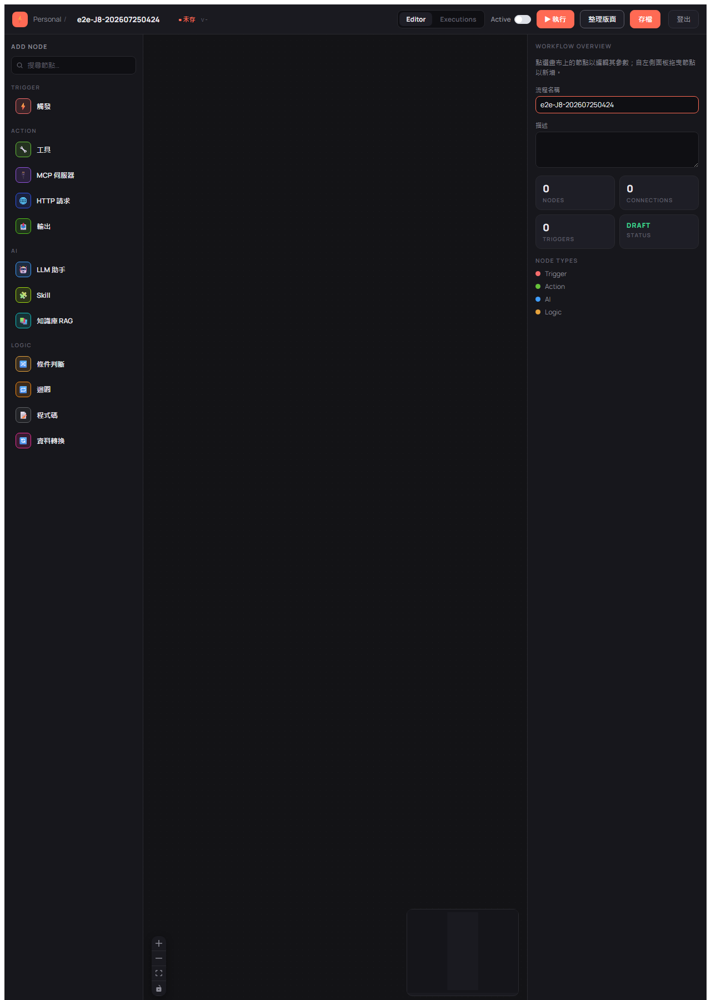
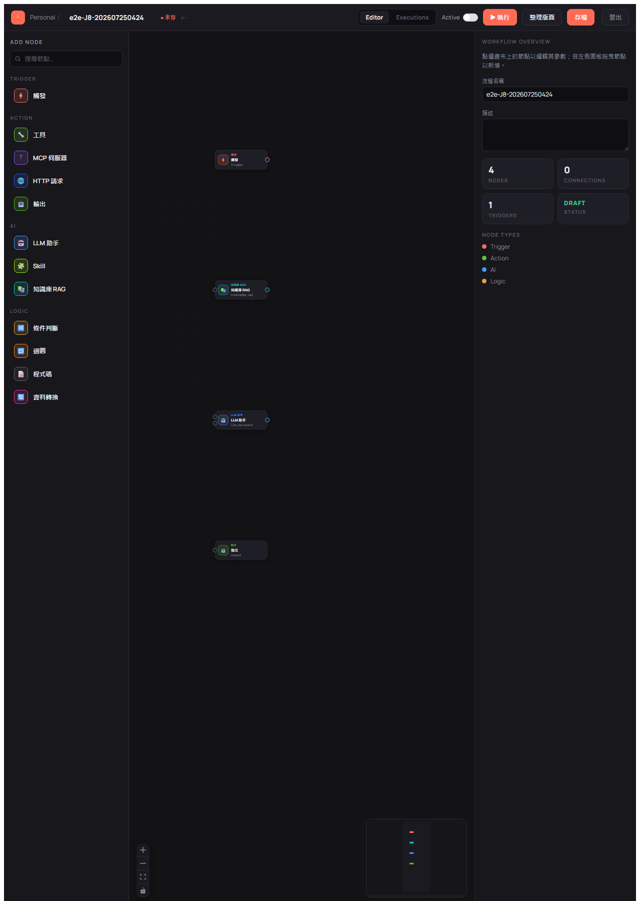
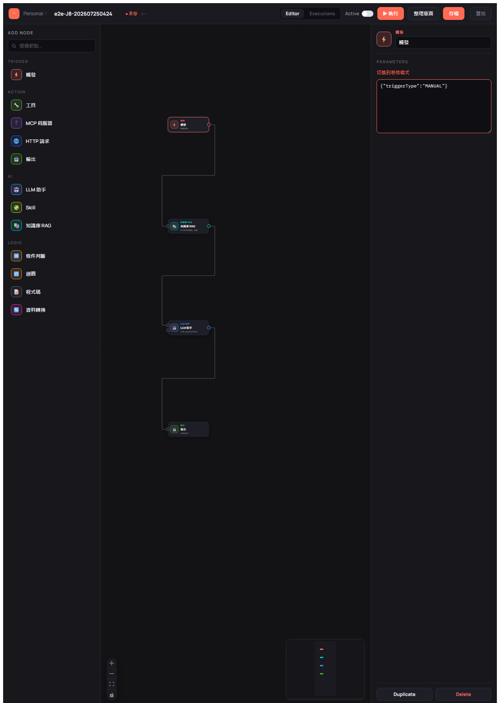
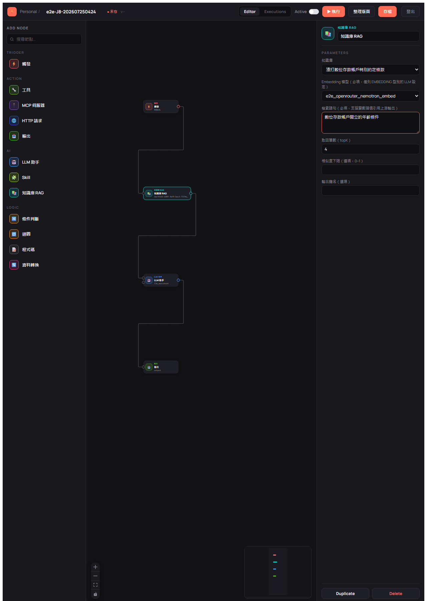
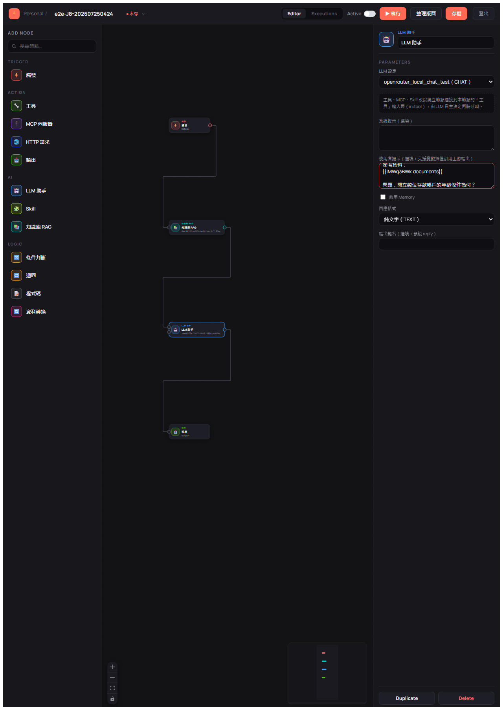
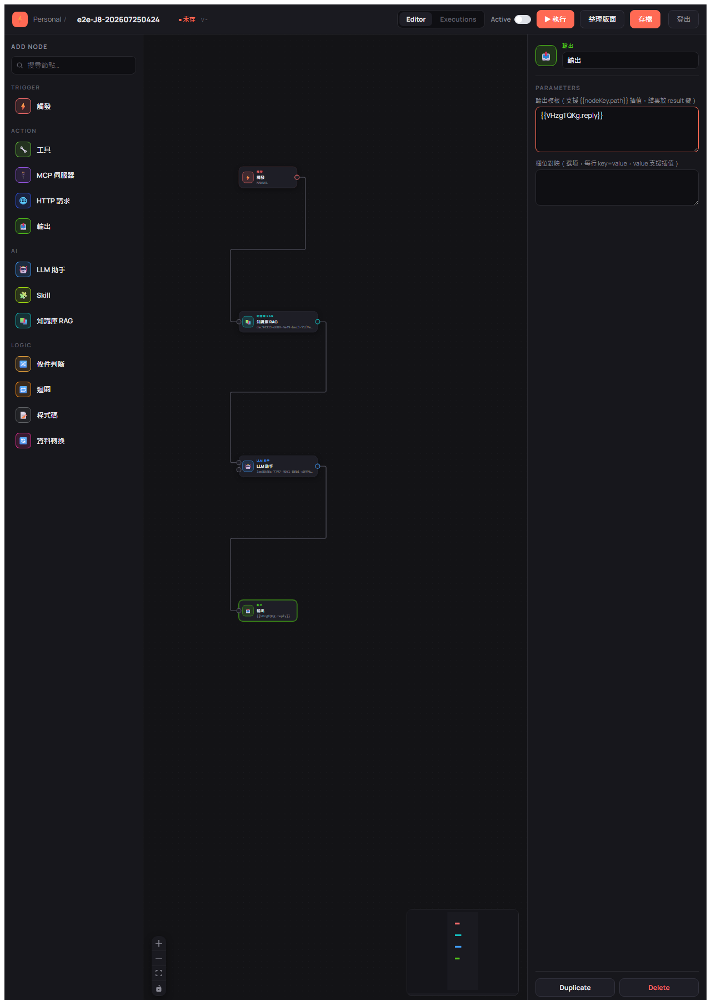
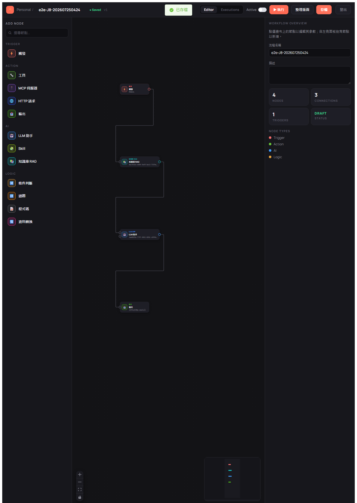
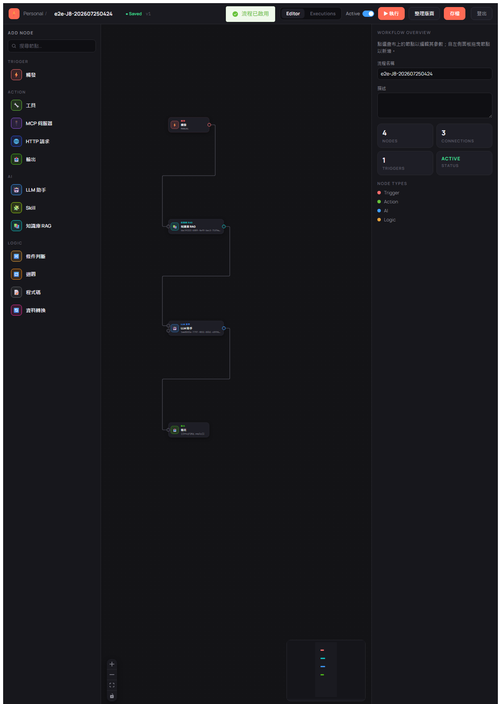
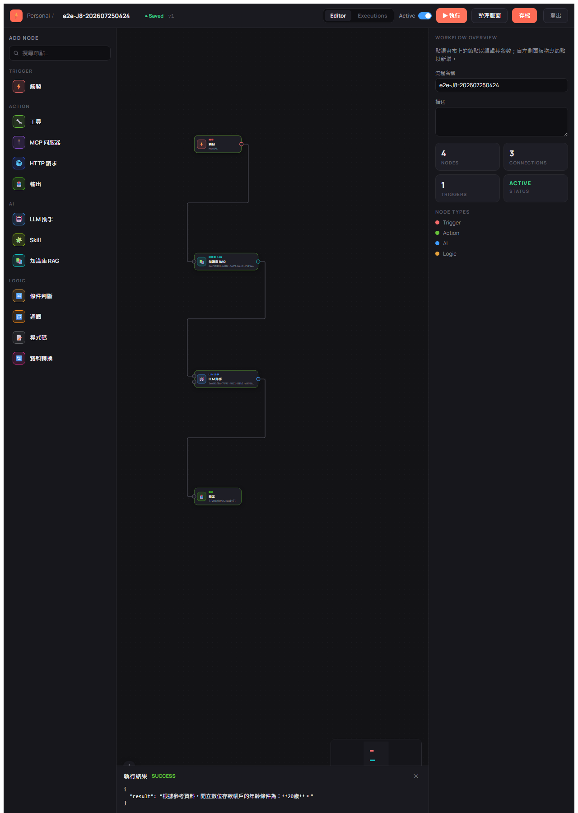

# BestPartner E2E 測試確認表（UI-driven）

> 本文件為 E2E 測試記錄模板，每次測試週期開始前由 `e2e-test-confirmation` skill 複製並填寫。
> 旅程與案例定義的權威來源：`docs/e2e-test-plan.md`。

---

## 使用說明

### 狀態符號

| 符號 | 意義 |
|------|------|
| ✅ | Pass — 案例通過 |
| ❌ | Fail — 案例失敗（請在「問題追蹤區」補充說明） |
| ⏭️ | Skip — 本次略過（請在證據／備註欄說明原因，如缺 E2E_LLM_ID） |
| — | 本次週期不適用 |

### 填寫流程

1. 複製此檔案，重新命名為 `docs/test-confirmations/e2e-test-confirmation-YYYYMMDDHHmm.md`
2. 填寫「測試週期資訊」
3. 完成「前置檢查清單」（任一失敗即停止）
4. 依 J1→J7 逐旅程執行，**先記錄證據再標狀態**
5. 每條旅程完成後立即更新「測試結果摘要」與 Pass 率
6. 所有 ❌ 項目在「問題追蹤區」建立記錄
7. 收尾清理 `e2e-*` 測試資料

### 證據要求

每個案例的「證據 / 備註」欄**必須**包含（不得留佔位符）：

1. **逐步圖片連結（強制，用 Markdown 圖片語法）**：案例每一個操作步驟一張截圖，**在證據欄以圖片連結依序嵌入**，讓報告可直接預覽／點開，不得只放最終畫面、不得只填純文字路徑。
   命名／存放：`docs/test-confirmations/e2e-shots/<報告時間戳>/<caseId>-<步驟序號>-<簡述>.png`
   證據欄寫法（相對報告檔路徑）：
   ```markdown
   
   
   
   ```
2. 另可附：Playwright trace / 錄影檔連結（如 `[trace](test-results/j3/trace.zip)`）、關鍵斷言（如「節點數 3、edge 2、save 後 version=2」）。
3. J5 專用：SSE 事件序列與最終節點狀態（如 `started→node.completed×3→completed(SUCCESS)`），並以圖片連結附各節點狀態轉移截圖。

> ⚠️ 缺少任一步驟圖片連結、或只填純文字路徑未用圖片語法，即視同證據不完整。失敗（❌）案例另附失敗當下截圖與 trace 連結。

---

## 測試週期資訊

| 項目 | 內容 |
|------|------|
| 測試日期 | 2026-07-25 |
| 服務版本 | 0.1.8-SNAPSHOT |
| 測試環境 | dev |
| 瀏覽器 | chromium（webwright / Playwright） |
| 前端 baseURL | `http://localhost:4173`（vite preview） |
| 後端 API URL | `http://localhost:80`（dev profile，root `.env` 載入 OpenRouter 密鑰） |
| 本次範圍 | **僅 J8 知識庫 RAG（LLM 使用 RAG 的 workflow）完整 5 案例**；J1–J7 本週期不適用（標 —） |
| LLM 平台（J8 CHAT） | OpenRouter `deepseek/deepseek-v3.2`，maxTokens 4096（原 gpt-5.5-pro/32768 因金鑰額度不足暫改，收尾還原） |
| E2E_LLM_ID（J8 CHAT） | `1ee80ffa-7797-4051-8fb1-c0996159b408`（admin 名下 `openrouter_local_chat_test`） |
| E2E_EMBEDDING_ID（J8） | `3b624ce5-963f-48d5-9389-e333937c8bc8`（OpenRouter `nvidia/nemotron-3-embed-1b:free`，dim 2048） |
| 執行身分 | admin（`admin@bestpartner.com.tw`，user `c88f57c8…`；設定擁有者＝執行身分） |
| Milvus | milvusdb/milvus:v2.5.5 standalone（docker，19530，healthy） |
| 測試結束時間 | 2026-07-25 04:44（後端 port 80 + 前端 4173 已關閉） |

---

## 前置檢查清單（測試前必須全部 ✅）

```
✅ 後端服務於 port 80 健康回應（GET /systemSetting/list → 200）
✅ PostgreSQL 已初始化（postgres-db 容器，localhost:5432/pgdb，schema bestpartner）
✅ 種子資料存在：admin（密碼非預設，已向使用者取得）、test_user、既有 OpenRouter LLM setting
✅ J8 可用：embedding `3b624ce5`（nemotron dim 2048）+ CHAT `1ee80ffa`（deepseek-v3.2）api_key 驗證通過
✅ 前端已 build（dist）並由 vite preview 提供，baseURL http://localhost:4173 → 200
✅ Milvus standalone 健康（docker，19530 LISTENING）— 原未啟動，本次以 docs/docker/milvus compose 拉起
✅ 後端 runner jar（Jul 22 23:32）晚於最後 src/main 異動（cdc9188 crypto v2, Jul 22 21:40），無需重編
✅ webwright（Node Playwright + chromium）可用
```

> **前置調整摘要（Step 4.5 抓出）**：
> 1. Milvus 實際未啟動（與初判不符），已以專案 compose 拉起至 healthy。
> 2. admin 密碼非預設（`admin/admin` 回 401），已向使用者取得正確密碼。
> 3. CHAT 設定原為 `openai/gpt-5.5-pro` + maxTokens 32768，金鑰剩餘額度僅約 28792 tokens，OpenRouter 回 402；經使用者裁定改 `deepseek/deepseek-v3.2` + maxTokens 4096（收尾還原）。
> 4. 本次沿用 DB 既有加密金鑰，未動用明文 OpenRouter key。

> ⚠️ 任一項未通過即停止測試並回報。

---

## 測試結果摘要

> 每完成一條旅程立即更新本表

| 旅程 | 優先 | 總數 | ✅ Pass | ❌ Fail | ⏭️ Skip | Pass 率 |
|------|:---:|------|--------|--------|---------|---------|
| J1 認證 | — | — | — | — | — | 本週期不適用 |
| J2 Workflow 列表 | — | — | — | — | — | 本週期不適用 |
| J3 畫布編輯 | — | — | — | — | — | 本週期不適用 |
| J4 驗證與啟用 | — | — | — | — | — | 本週期不適用 |
| J5 執行（真實 LLM） | — | — | — | — | — | 本週期不適用 |
| J6 Inspector 表單 | — | — | — | — | — | 本週期不適用 |
| J7 契約錯誤 | — | — | — | — | — | 本週期不適用 |
| J8 知識庫 RAG | P1 | 5 | 5 | 0 | 0 | 100.0% |
| **合計（本週期範圍）** | | **5** | **5** | **0** | **0** | **100.0%** |

> 本次為聚焦式 RAG 旅程驗證（使用者指定「LLM 使用 RAG 的 workflow」）；僅執行 J8。其餘旅程沿最近整輪結果，不在本週期範圍。

### 通過標準

| 優先級 | 通過標準 | 說明 |
|--------|--------|------|
| P0 | 100% | 任何失敗均為 Release Blocker |
| P1 | ≥ 95% | 已知失敗需有追蹤 Issue |
| P2 | ≥ 80% | 剩餘列為 Tech Debt |

---

## 旅程測試清單

> 案例定義同步自 `docs/e2e-test-plan.md §3`。狀態與證據欄由測試時填寫。

### J1 認證流程（P0）

| 案例 | 優先 | 描述 | 預期 | 狀態 | 證據 / 備註 |
|------|:---:|------|------|:---:|------|
| J1-01 | P0 | 未登入直接訪 `/` | 導向 `/login` | | |
| J1-02 | P0 | admin/admin 登入 | 導向列表 `/`，顯示已登入 | | |
| J1-03 | P1 | 已登入訪 `/login` | 導回首頁 `/` | | |
| J1-04 | P1 | 錯誤帳密登入 | 停留 `/login`，顯示錯誤 | | |
| J1-05 | P1 | 列表頁登出（`logout-button`） | 清 token 導向 `/login`；重訪受保護頁被導回登入 | | |
| J1-06 | P1 | 編輯器工具列登出（無未存，`logout-button`） | 清 token 導向 `/login`；per-user 快取一併清除 | | |
| J1-07 | P1 | 編輯器有未存變更登出 → 確認框選「登出」 | 先跳「尚未存檔」確認；確認後清 token 導向 `/login` | | |
| J1-08 | P1 | 編輯器有未存變更登出 → 確認框選「取消」 | 留在編輯器且仍為登入態（token 未清） | | |
| J1-09 | P2 | token 清除後訪受保護頁 | 導回 `/login` | | |

### J2 Workflow 列表（P0/P1）

| 案例 | 優先 | 描述 | 預期 | 狀態 | 證據 / 備註 |
|------|:---:|------|------|:---:|------|
| J2-01 | P0 | 列表載入 | 顯示既有 workflow 清單 | | |
| J2-02 | P0 | 建立新 workflow | 進 `/editor/:id`，DRAFT、version 1 | | |
| J2-03 | P1 | 點列表項進編輯器 | 載入完整定義 | | |
| J2-04 | P1 | 刪除 workflow | 列表移除，連鎖刪 node/edge | | |

### J3 畫布編輯（P0）

| 案例 | 優先 | 描述 | 預期 | 狀態 | 證據 / 備註 |
|------|:---:|------|------|:---:|------|
| J3-01 | P0 | 拖拉節點入畫布（TRIGGER/LLM_ASSISTANT/OUTPUT） | 節點出現，nodeKey 唯一 | | |
| J3-02 | P0 | 連線 edge | edge 建立，兩端點存在 | | |
| J3-03 | P0 | 選節點於 Inspector 填 config | 表單值寫回節點 | | |
| J3-04 | P0 | save 整張覆寫 | version+1 | | |
| J3-05 | P1 | 重整頁面 get 還原 | 畫布與 Inspector 與存檔一致 | | |

### J4 驗證與啟用（P1）

| 案例 | 優先 | 描述 | 預期 | 狀態 | 證據 / 備註 |
|------|:---:|------|------|:---:|------|
| J4-01 | P1 | 缺 TRIGGER 啟用 | 400，對應訊息 | | |
| J4-02 | P1 | 圖有環啟用 | 400，對應訊息 | | |
| J4-03 | P1 | 缺必填 config 啟用（如缺 llmId） | 400，`workflow.node.config.required.missing`，顯示 nodeKey+欄位 | | |
| J4-04 | P1 | 合法圖 switchStatus 啟用 | 狀態轉 ACTIVE | | |

### J5 執行 workflow（P0，真實 LLM）

| 案例 | 優先 | 描述 | 預期 | 狀態 | 證據 / 備註 |
|------|:---:|------|------|:---:|------|
| J5-01 | P0 | 合法 workflow（TRIGGER→LLM_ASSISTANT→OUTPUT）execute | SSE `started`→`node.*`→`completed(SUCCESS)`；DB 寫入 `llm_workflow_execution`/`llm_workflow_node_execution` | | |
| J5-02 | P1 | 節點設定錯誤導致失敗 | 該節點 `node.failed` 顯示錯誤，執行標記失敗 | | |
| J5-03 | P1 | 執行中途 client 斷線 | 執行 `CANCELLED`，下游未執行節點 `SKIPPED`（commit b24c128 視覺） | | |

> J5 斷言不比對 LLM 輸出文字；只驗事件序列、節點狀態、DB 紀錄。缺 E2E_LLM_ID 時 J5-01/J5-03 標 ⏭️。

### J6 Inspector 表單（P1）

| 案例 | 優先 | 描述 | 預期 | 狀態 | 證據 / 備註 |
|------|:---:|------|------|:---:|------|
| J6-01 | P1 | LlmAssistantForm 選 llmId | 值寫回並可存檔 | | |
| J6-02 | P1 | Tool/McpServer/KnowledgeRag/Output 表單填寫 | config 正確寫回，save 後重載一致 | | |
| J6-03 | P2 | settingSchema 動態表單（sensitive 遮罩） | 依 schema 正確渲染欄位型別 | | |

### J7 契約錯誤（P2）

| 案例 | 優先 | 描述 | 預期 | 狀態 | 證據 / 備註 |
|------|:---:|------|------|:---:|------|
| J7-01 | P2 | save 節點 config 型別錯誤（未知欄位/結構型別錯） | 400，`workflow.node.config.invalid`，含 nodeKey | | |
| J7-02 | P2 | 樂觀鎖 version 衝突 | 400，`workflow.version.conflict`，UI 顯示衝突提示 | | |

### J8 知識庫 RAG 檢索問答（P1，真實 embedding + Milvus + 真實 LLM）

> 前端無向量庫/設定/上傳管理頁（僅 login/列表/編輯器），前置三步走 API 準備，UI 只建 workflow 與執行。
> 與 J5 差異：**有已知來源文件，斷言輸出內容與文件事實相符**（先讀文件挑唯一事實作查詢關鍵字→預期答案）。詳見 `docs/e2e-test-plan.md` §3-J8 與 §13。

| 案例 | 優先 | 描述 | 預期 | 狀態 | 證據 / 備註 |
|------|:---:|------|------|:---:|------|
| J8-01 | P1 | 前置(API)：建 EMBEDDING 設定 + Milvus 向量庫 + 上傳文件建知識庫 | 取得 embeddingModelId/embeddingStoreId/knowledgeId；`getDataFromEmbeddingStore` 檢索命中目標事實（維度須對齊） | ✅ | **API 前置（無 UI，證據為 API 請求/回應）**。① EMBEDDING 沿用 admin 既有 `3b624ce5`（nemotron dim 2048）；② `POST /llm/vector/save` 建 Milvus 庫 → `embeddingStoreId=46268b74-1282-4caf-859f-9da99a2a7498`，collection `e2e_scb_tnc_202607250424`、dim 2048、url `http://localhost:19530`；③ `POST /llm/vector/uploadFiles`（`tw-online-tnc.pdf`, seg 300/overlap 50）→ `knowledgeId=dac94333-6009-4e49-bac3-71f9ec893bc4`（embedding 無維度錯誤，2048 對齊）；④ `POST /llm/vector/getDataFromEmbeddingStore`（query「數位存款帳戶開立的年齡條件」）Top-1 命中原文：`「1. 立約人應為具中華民國國籍且未受監護宣告或輔助宣告之年滿二十歲自然人。」`→ 斷言事實「年滿二十歲 / 20」存在。 |
| J8-02 | P1 | UI 建 workflow：拖 TRIGGER/KNOWLEDGE_RAG/LLM_ASSISTANT/OUTPUT，Inspector 選知識庫/embedding/LLM，userPrompt 以 `{{<ragKey>.documents}}` 串接 | 4 節點、3 edge（nodeKey 由 `.vue-flow__node[data-id]` 讀取供插值） | ✅ | admin 登入 → `create-button` 直接進編輯器 DRAFT，改名 `e2e-J8-202607250424`。拖 4 節點（node 0→4）、連 3 主流程 edge（TRIGGER `out:main`→RAG→LLM→OUTPUT `in:main`，edge 0→3）。讀 nodeKey：ragKey=`lMWq3BWk`、llmKey=`VHzgTQKg`。Inspector：TRIGGER raw `{"triggerType":"MANUAL"}`；RAG 選知識庫 `dac94333…`/embedding `3b624ce5…`/query「數位存款帳戶開立的年齡條件」；LLM 選 `1ee80ffa…`、userPrompt 內含 `{{lMWq3BWk.documents}}`；OUTPUT template `{{VHzgTQKg.reply}}`。<br>        |
| J8-03 | P1 | 存檔 + switchStatus 啟用 | version 1；KNOWLEDGE_RAG 必填驗證通過，狀態 ACTIVE | ✅ | 存檔後 `Saved v1`；點 `active-toggle` 啟用 → overview `stat-status` = **ACTIVE**（必填驗證通過：TRIGGER triggerType、RAG knowledgeId/embeddingModelId/query、LLM llmId 皆備）。DB：`llm_workflow` `6c9c8db9…` status=ACTIVE、version=1。<br>  |
| J8-04 | P1 | execute（真實 embedding + LLM） | SSE started→node.*→completed(SUCCESS)；4 節點 node_execution 皆 SUCCESS、DB 落庫 | ✅ | 點 `run-button` → execute HTTP 200（SSE）；`result-drawer` finalStatus = **SUCCESS**，畫布 4 節點全轉綠（completed）。DB `llm_workflow_execution`：status=SUCCESS、trigger_type=MANUAL、triggered_by=admin、duration 2383ms；`llm_workflow_node_execution` 4 筆皆 SUCCESS（TRIGGER→KNOWLEDGE_RAG→LLM_ASSISTANT→OUTPUT）。<br>  |
| J8-05 | P1 | **RAG 正確性斷言**：finalOutput 與文件已知事實比對 | LLM 輸出含文件原文事實關鍵字（例：渣打 TNC「年滿二十歲」→ 輸出含「20/二十」） | ✅ | finalOutput（`output_result`）＝`{"result":"根據參考資料，開立數位存款帳戶的年齡條件為：**20歲**。"}`，命中來源 PDF 事實「立約人應為…**年滿二十歲**自然人」（20/二十）。RAG 全鏈成立：向量檢索 → context 注入 LLM → 依文件作答，異於 J5（不比對文字），此處確定性斷言通過。<br> |

> 缺有效 embedding 或 CHAT 設定即 J8 全條 skip 並標註。embedding 選型與維度對齊、憑證解密管制等陷阱見 `e2e-test-plan.md` §13。

---

## 旅程完成檢查清單（每完成一條旅程必須立即執行）

> 對應 SKILL.md Step 5.5。進入下一旅程前，逐項勾選並更新摘要表。

**J8（本週期唯一旅程）完成勾核：**
```
[x] 所有案例的逐步截圖已擷取並存入 e2e-shots/202607250424/（J8-02 8 張、J8-03 2 張、J8-04 2 張、J8-05 1 張）
[x] 所有案例證據已寫入（逐步圖片連結以 Markdown 圖片語法嵌入 + DB 落庫/finalOutput，無佔位符）
[x] 所有案例狀態已標記（J8-01~05 全 ✅）
[x] 無失敗案例（❌ 0 筆）
[x] 摘要表 J8 統計已更新（5/5/0/0）
[x] Pass 率已計算並填入（100.0%）
[x] 本輪新增 e2e-* 測試資料已清理（見下）
```

### 嚴格規則

- **不可延後**：完成一條旅程立即更新，不可等全部測完才統一更新
- **即時暫停**：某旅程 Pass 率過低（P0<100% / P1<95% / P2<80%），立即暫停評估
- **計算精確**：Pass 率 = Pass ÷ 總數 × 100%，保留一位小數
- **與問題追蹤同步**：失敗案例先入問題追蹤區，再更新摘要

---

## 測試資料清理規則

- E2E 建立的 workflow 一律以 `e2e-<caseId>-<runTag>` 前綴命名。
- 每條案例測試後經 `POST /llm/workflow/delete` 刪除；收尾以前綴掃描 `workflow/list` 兜底刪除殘留 `e2e-*`。
- **不得另建備份檔／目錄**；種子資料（admin、test_user、LLM setting）為前置條件，不刪除。
- 逐步截圖屬**報告證據**，隨報告保留於 `docs/test-confirmations/e2e-shots/<報告時間戳>/`，**不在清理範圍**（清理只針對 DB 的 `e2e-*` workflow 資料）。

> ⚠️ 收尾後資料庫殘留 `e2e-*` 資料，視同流程不完整，需補清理。

### 本輪清理結果

- **workflow**：本輪建立 2 筆（run_1 `a4a6e8af` DRAFT／run_2 `6c9c8db9` ACTIVE，同名 `e2e-J8-202607250424`）已經 `POST /llm/workflow/delete` 全數刪除（連鎖刪 node/edge/execution/node_execution）。
- **向量／知識庫**：本輪 `knowledgeId=dac94333`（含 doc/slice/Milvus 向量）經 `DELETE /llm/vector/deleteData` 清除；`vector_store_setting=46268b74` 由 DB 刪除。
- **CHAT 設定還原**：`1ee80ffa` 已還原為 `openai/gpt-5.5-pro` / maxTokens 32768（測試期間暫改 deepseek-v3.2/4096）。
- **沿用不刪**：admin 名下既有 embedding `3b624ce5`（nemotron）與 CHAT `1ee80ffa` 設定為既有資源，僅沿用。
- ⚠️ **殘留（非本輪、未處理）**：`workflow/list` 掃描發現 `e2e-rag-202607242258`（ACTIVE）為**前一週期（202607242258）**遺留的 e2e workflow，非本輪建立，**未擅自刪除**（依「不動非本人建立之標的」原則），列此提醒該週期補清或確認後刪除。
- **基礎設施**：Milvus（19530）本輪由 compose 啟動，測試後保留運行（屬 infra 非測試資料，且使用者原認為其可用）；後端 port 80 + 前端 4173 已關閉。

---

## 問題追蹤區

> 失敗（❌）項目在此詳記；本週期 0 筆失敗，以下記錄執行過程中排除的兩個阻擋點供後續參考。

| 案例 ID | 現象 | 期望行為 | 實際行為 | 根因 | 狀態 |
|---------|------|---------|---------|------|------|
| （前置） | 首次 `/llm/chat` smoke 回 400 | LLM 可回應 | OpenRouter 402「requires more credits」 | CHAT 設定 `gpt-5.5-pro`+maxTokens 32768 超出金鑰剩餘額度（僅 ~28792 tokens） | 已解：改 deepseek-v3.2/4096（使用者裁定），收尾還原 |
| J8-03/04（run_1） | 啟用停在 DRAFT、execute 回 400 | ACTIVE / SUCCESS | `Node <trigger> is missing required config fields: triggerType` | TRIGGER 無 Inspector 表單，需經 JsonConfigEditor **raw 模式**填 `{"triggerType":"MANUAL"}`（§10 已載明），run_1 漏設 | 已解：run_2 補 TRIGGER 設定後 ACTIVE + SUCCESS |

---

## 常見問題排查

| 現象 | 可能原因 | 處理 |
|------|---------|------|
| 前置檢查後端非 200 | 服務未起 / port 80 被占用 | 起服務或釋放 port 後重試 |
| J5 一直逾時 | LLM api_key 無效 / 網路 | 確認 E2E_LLM_ID 有效；逾時放寬至 60–120s |
| 拖拉節點無效 | palette→畫布是 HTML5 原生 DnD，非滑鼠序列 | 合成 `dragstart`/`dragover`/`drop`（共用 `DataTransfer`）；**連線**才用 `mousedown→move→up`。放置後斷言節點數（詳見 `e2e-test-plan.md` §6） |
| 選擇器找不到 | Playwright 預設找 `data-testid`，專案用 `data-test` | config 設 `testIdAttribute:'data-test'` |
| llmId/toolId selectOption 找不到選項 | 運行 DB 的 ID 與種子檔漂移 | 由 global-setup 依 alias/platform 動態解析，勿硬編（詳見 §6） |
| 登入態失效 | storageState 過期 | 重新以 API 登入產生 storageState |
| 殘留 e2e-* 資料 | 清理未執行 | 以前綴掃描 workflow/list 兜底刪除 |
