# BestPartner E2E 測試確認表 — KNOWLEDGE_RAG 作為 LLM 外掛（UI-driven 重測）

> 本次為**專項 E2E**：以真實瀏覽器操作驗證「KNOWLEDGE_RAG 可作為 LLM 節點外掛（`in:tool` 掛載、自動注入型 RAG、多知識庫）」，非全 J1–J8 回歸。
> 權威旅程定義：`docs/e2e-test-plan.md`；報告模板：`.claude/skills/e2e-test-confirmation/e2e-test-checklist.md`。
> **重測動機**：前一份報告 `e2e-test-confirmation-202607252225.md` 為 API 層貫穿，證據目錄雖有截圖但未被報告引用，且該批截圖顯示執行為 FAILED。詳見「§ 對前次報告（202607252225）的核對」。

---

## 測試週期資訊

| 項目 | 內容 |
|------|------|
| 測試日期 | 2026-07-27（報告時戳 202607272132） |
| 服務版本 | 0.1.8-SNAPSHOT（uber-jar 建置時間 2026-07-25 22:05，**新於所有 `src/main` 原始碼**，無需重編） |
| 測試環境 | dev（`-Dquarkus.profile=dev`） |
| 瀏覽器 | chromium（headless，viewport 1680×1050） |
| 前端 baseURL | `http://localhost:4173`（`npm run preview`，健康 200） |
| 後端 API URL | `http://localhost:80`（`/systemSetting/list` 健康 200） |
| CHAT LLM | `583b9222-8cb0-4109-b072-5f0fd1e9fed9`（alias `openrouter_local_chat_test`，OpenRouter deepseek-v3.2） |
| Embedding | `3b624ce5-963f-48d5-9389-e333937c8bc8`（alias `e2e_openrouter_nemotron_embed`，nvidia/nemotron-3-embed-1b） |
| 向量庫 | `b8828b60-4080-4422-8ea8-79281e65f6bf`（Milvus standalone，本次由 `docs/docker/milvus/docker-compose.yml` 啟動） |
| 知識庫 | `90c4deb7-fa5b-4a99-a510-3294f6bbcd10`（`e2e-scb-tnc-202607272132`，渣打數位存款條款 PDF，20 個 slice） |
| 測試結束時間 | 2026-07-27（服務已關閉，見「§ 收尾」） |

### ⚠️ 與標準 webwright 契約的偏離（誠實說明）

| 項目 | 契約要求 | 本次實作 | 理由 |
|------|---------|---------|------|
| 執行語言 | Python `playwright.firefox` | Node `@playwright/test` + chromium | 本機 `python`/`python3` 為 Windows Store stub（執行無輸出），無 Python playwright；已安裝瀏覽器僅 chromium（`ms-playwright/` 無 firefox） |
| 工作區契約 | `plan.md` / `final_runs/run_<id>/` / 逐步截圖 / `final_script_log.txt` | **完整保留** | — |
| 測試範圍 | J1–J8 全旅程 | KNOWLEDGE_RAG 外掛專項 | 使用者指定重測前次專項範圍 |

工作區：`final_runs/run_1`（Milvus 未啟動，執行 FAILED — 診斷用）、`final_runs/run_2`（正式通過）。
`plan.md` 與 run_2 的 `final_script_log.txt` 已隨證據複製至 `e2e-shots/202607272132/`。

---

## 前置檢查清單

```
✅ 後端服務 port 80 健康回應（GET /systemSetting/list → 200）
✅ 先停服務（80 / 5173 / 4173）再重啟，未對殘留服務測試
✅ PostgreSQL 已初始化，種子資料存在
✅ 前端已 build（dist 無過期，src 無檔案新於 dist/index.html）並可由 baseURL 存取
✅ Playwright 瀏覽器已安裝（chromium-1228）
✅ 登入可用（admin@bestpartner.com.tw，密碼非預設；JWT 長度 634）
✅ CHAT LLM api_key 可用（POST /llm/chat → 200，data="OK"）
✅ Embedding + 向量庫可用（getDataFromEmbeddingStore 命中目標事實，見 RAG-05）
```

> Step 4.5 資源 ID 全部由 API 動態解析（`/llm/setting/get`、`/llm/vector/getKnowledgeStore`），未硬編。

---

## 測試結果摘要

| 案例群 | 總數 | ✅ Pass | ❌ Fail | ⏭️ Skip | Pass 率 |
|--------|:---:|:---:|:---:|:---:|:---:|
| RAG 外掛專項（RAG-01 ~ RAG-05） | 5 | 5 | 0 | 0 | **100.0%** |

### 本次專項順帶覆蓋的既有旅程案例

下列旅程案例在本次專項流程中**被真實執行並留有截圖證據**，一併登錄（未執行者標 —，本次為專項非全回歸）：

| 旅程案例 | 描述 | 狀態 | 證據 |
|---------|------|:---:|------|
| J1-02 | admin 登入 → 導向列表 | ✅ | RAG-01-01 ~ 03 |
| J2-02 | 建立新 workflow → 進編輯器 | ✅ | RAG-01-04 |
| J3-01 | 拖拉節點入畫布 | ✅ | RAG-01-05 |
| J3-02 | 連線 edge | ✅ | RAG-01-06 ~ 08 |
| J3-03 | Inspector 填 config | ✅ | RAG-01-09 ~ 13 |
| J3-04 | save 整張覆寫 | ✅ | RAG-01-14 |
| J4-04 | 合法圖 switchStatus 啟用 | ✅ | RAG-02-01 |
| J5-01 | 合法 workflow execute（SSE + DB 落庫） | ✅ | RAG-03-01 ~ 04 |
| J6-02 | KnowledgeRag / Output 表單填寫 | ✅ | RAG-01-10 ~ 13 |
| J8-05 | RAG 正確性斷言（輸出含文件事實） | ✅ | RAG-05-01 |
| J1-01/03~09、J2-01/03/04、J3-05、J4-01~03、J5-02/03、J6-01/03、J7-01/02、J8-01~04 | — | — | 本次專項未涵蓋 |

---

## 驗證矩陣（RAG 外掛專項）

### RAG-01 — 建圖：KNOWLEDGE_RAG `out:main` → LLM `in:tool` 掛載並存檔

**預期**：可拖入 5 節點、連成 4 條 edge（含 **2 條 RAG→LLM `in:tool`**），UI 不報相容性錯誤，存檔成功。

**狀態**：✅

**證據（逐步截圖）**：


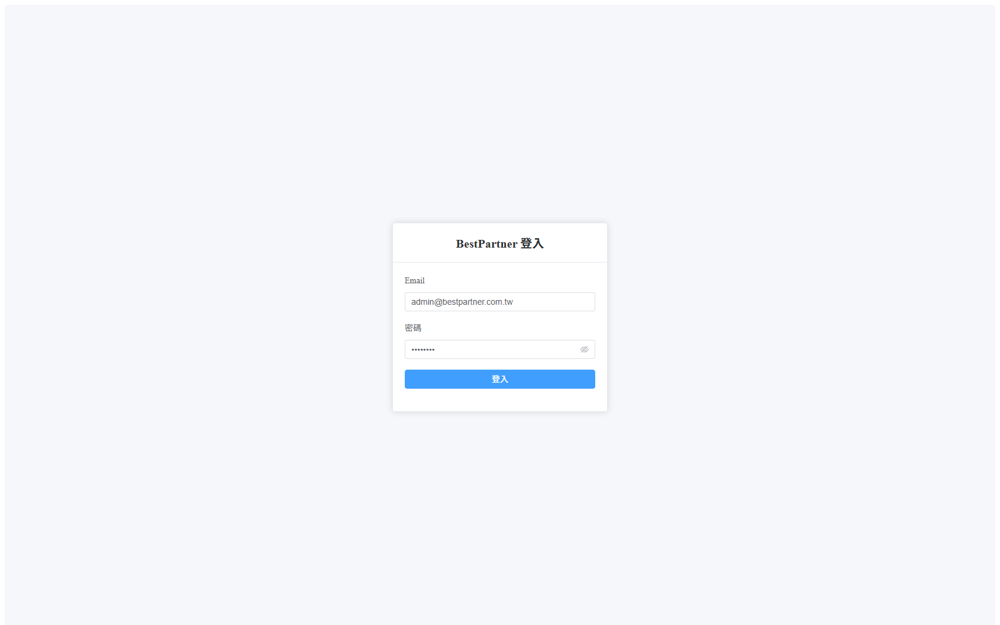
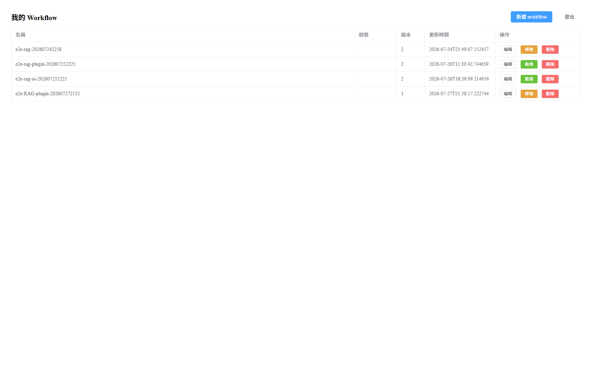

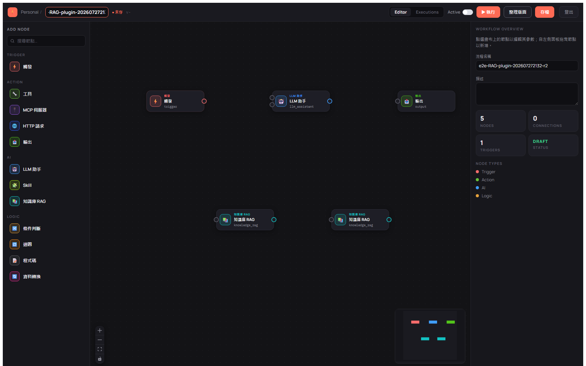


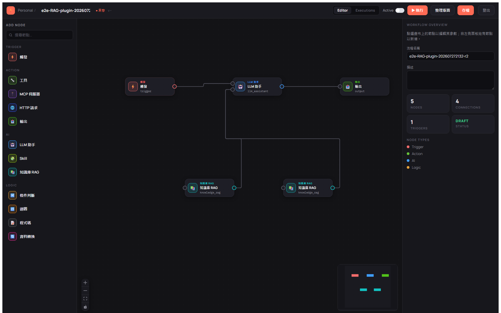
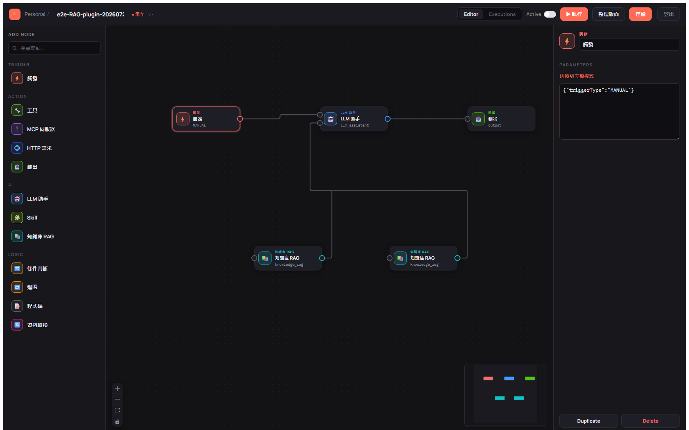
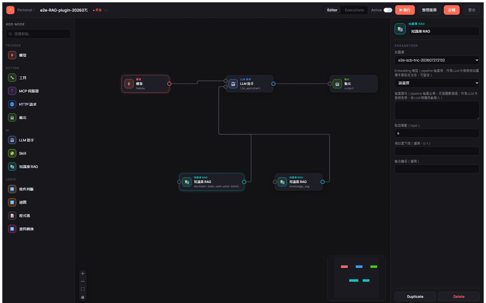
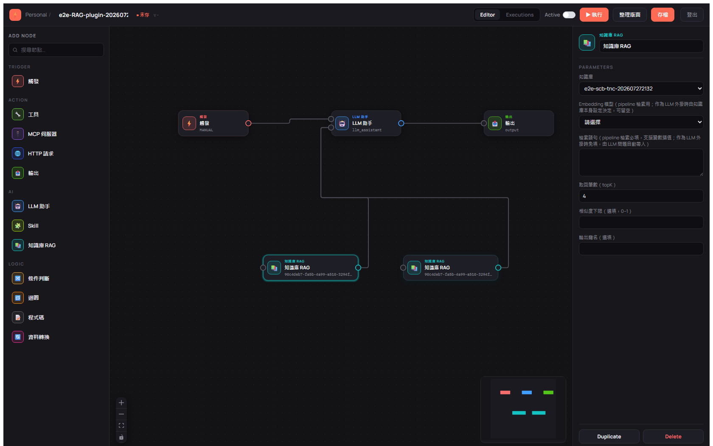
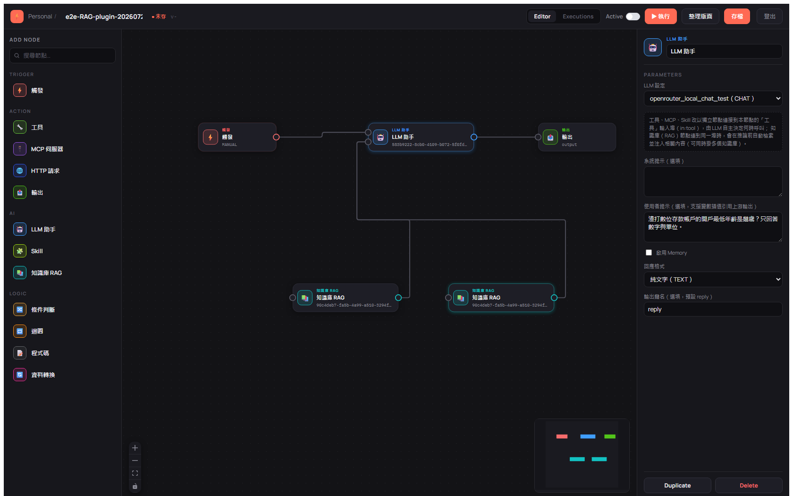
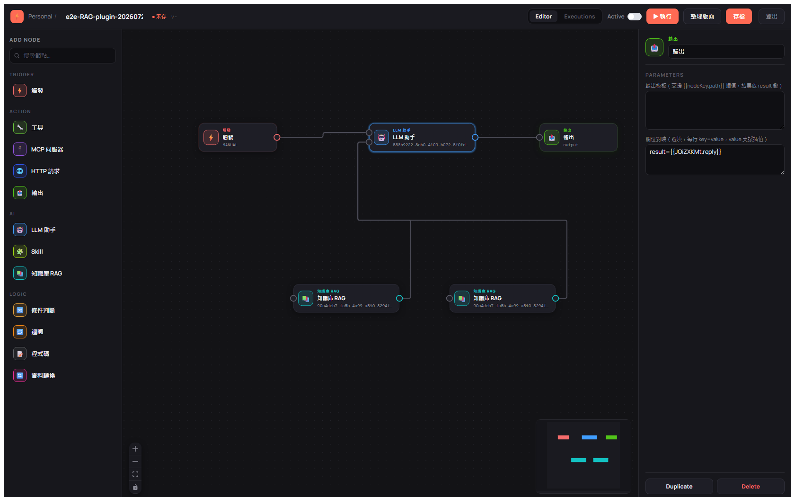


**關鍵斷言**（`final_script_log.txt`）：

```
CP3 ok: node count = 5
CP4 ok: edge count = 4, ui console errors = 0
CP6 ok: llm + output configured
CP7 ok: saved
```

- `RAG-01-08` 右側 Overview 面板顯示 **5 NODES / 4 CONNECTIONS**，兩個「知識庫 RAG」節點的 `out:main` 皆連入 LLM 助手節點**下方第二個輸入埠**（`in:tool`）。
- 拉線過程 **無 toast 相容性錯誤、瀏覽器 console error = 0** —— 即本次改動放行了 KNOWLEDGE_RAG 掛工具埠。

---

### RAG-02 — 必填契約：KNOWLEDGE_RAG 只填 `knowledgeId` 即可啟用

**預期**：兩個 RAG 節點的 `query` / `embeddingModelId` 皆留空，switchStatus 啟用不回 `REQUIRED_MISSING`。

**狀態**：✅

**證據（逐步截圖）**：

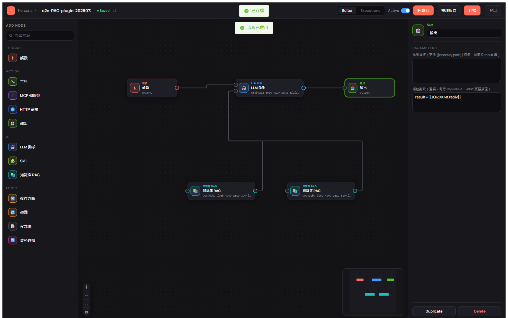

**關鍵斷言**：

```
CP5a: rag1 query="" embeddingModelId="" (皆應為空)
CP5b: rag2 query="" embeddingModelId="" (皆應為空)
CP8: active-toggle state = el-switch el-switch--small is-checked
```

- `RAG-01-10` / `RAG-01-11` 可見 RAG 表單：「知識庫」已選 `e2e-scb-tnc-202607272132`，
  「Embedding 模型」為「請選擇」（空）、「檢索語句」空白。
- `RAG-02-01` 工具列 Active 開關為**開啟（藍）**，無錯誤 toast → 新契約僅需 `knowledgeId` 成立。

---

### RAG-03 — 執行 + 自動注入路徑

**預期**：execute 成功，Drawer 反映節點狀態轉移，最終 `SUCCESS`；DB 落庫。

**狀態**：✅

**證據（逐步截圖）**：

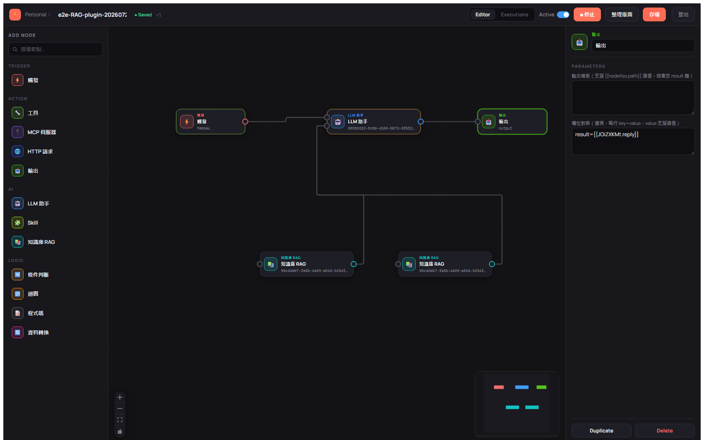
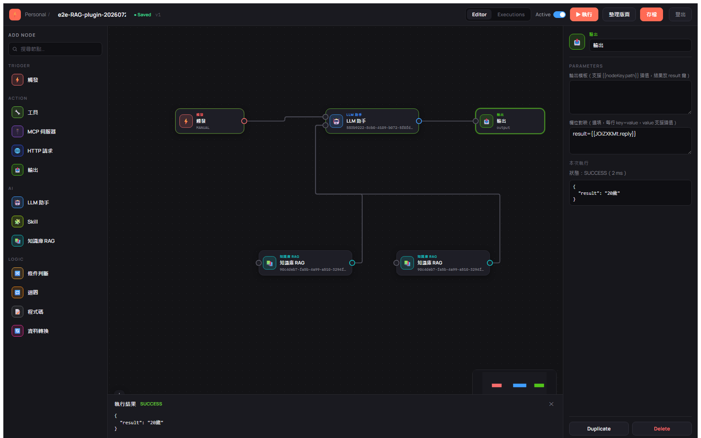


**關鍵斷言**：

```
CP9: drawer status = SUCCESS; executeHttp = 200
CP9 output: { "result": "20歲" }
```

**DB 落庫斷言**（直連 PostgreSQL）：

```
llm_workflow_execution
  id=2eaa732f-d309-4e93-aac7-4caf5430306d  workflow_id=3d32b64a-…  status=SUCCESS
  started 13:44:51.133Z → finished 13:44:53.753Z

llm_workflow_node_execution（execution_id=2eaa732f-…）
  seq 1  nezFFuhl  TRIGGER         SUCCESS     0 ms
  seq 2  JOiZXKMt  LLM_ASSISTANT   SUCCESS  2585 ms
  seq 3  exx9kUKo  OUTPUT          SUCCESS     2 ms
```

**事件序列**（由 node_execution seq 還原）：
`execution.started → trigger(SUCCESS) → llm_assistant(SUCCESS) → output(SUCCESS) → execution.completed(SUCCESS)`

---

### RAG-04 — 並存 / 純能力節點：KNOWLEDGE_RAG 不落主遍歷

**預期**：RAG 節點作能力掛載時，不產生獨立節點執行紀錄。

**狀態**：✅

**證據（逐步截圖）**：

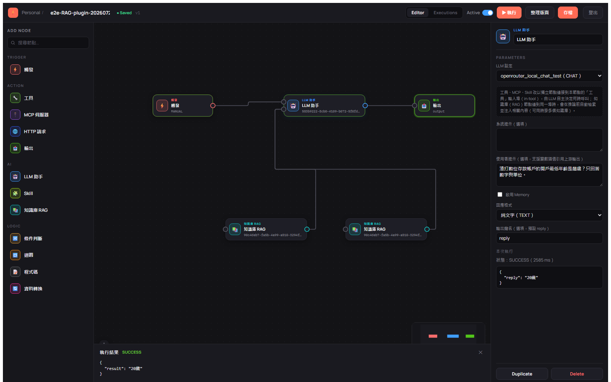
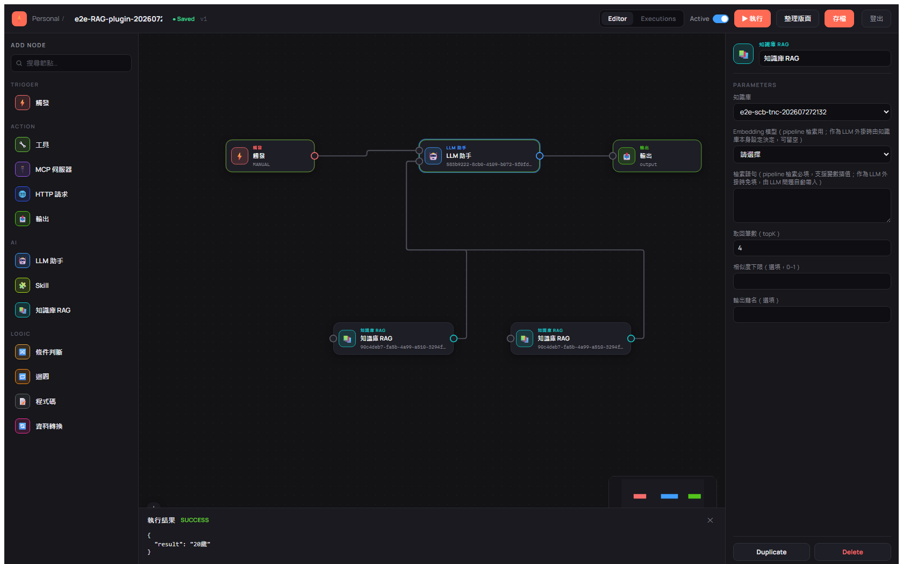
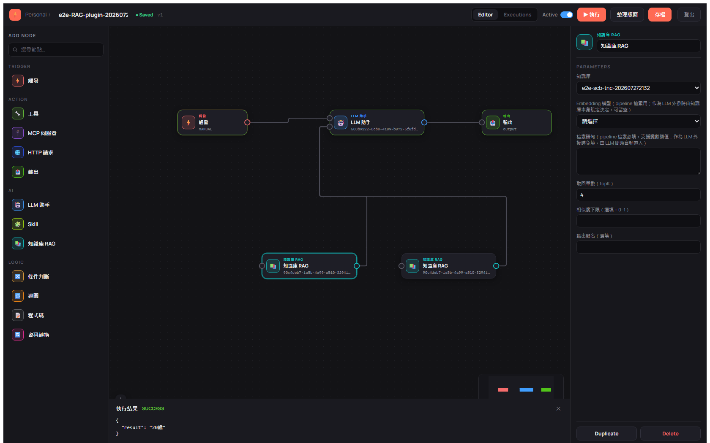

**關鍵斷言**：

```
CP10: llmHasExec=true  rag1HasExec=false  rag2HasExec=false
```

- 執行後點選 LLM 節點，Inspector 出現「本次執行」區塊（`data-test="node-exec-section"`）；
  點選兩個 RAG 節點，**該區塊皆不存在**（對照 `RAG-03-04` 的 OUTPUT 節點顯示「狀態：SUCCESS（2 ms）」）。
- DB 端一致：`llm_workflow_node_execution` 僅 3 筆，**無任何 `KNOWLEDGE_RAG` 型別紀錄**。

---

### RAG-05 — RAG 內容正確性（前次無法斷言，本次補上）

**預期**：LLM 輸出與知識庫文件事實相符，且**可與 LLM 常識答案區分**。

**狀態**：✅

**證據（逐步截圖）**：

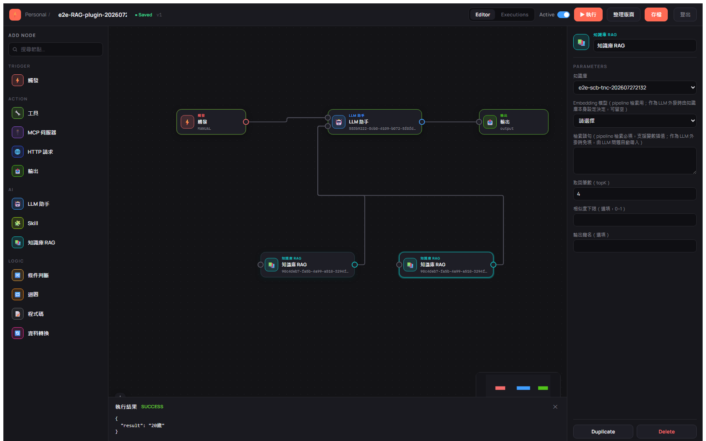

**鑑別點設計**（本次能斷言的關鍵）：

| 來源 | 「數位存款帳戶開戶最低年齡」 |
|------|------|
| 知識庫文件原文（渣打 TNC） | 「立約人應為具中華民國國籍且未受監護宣告或輔助宣告之**年滿二十歲**自然人。」 |
| LLM 常識（台灣民法成年） | 18 歲 |

- 向量檢索直驗：`getDataFromEmbeddingStore`（query「開戶最低年齡」）**首筆即命中上述原文**。
- workflow 執行輸出：`{"result": "20歲"}`。
- userPrompt 為「渣打數位存款帳戶的開戶最低年齡是幾歲？只回答數字與單位。」——**未手動插入任何知識內容**。

> 輸出為 **20歲**（文件事實）而非 **18歲**（LLM 常識），證明 RAG 內容確實被自動注入並主導了回答。
> 對照：前次報告同一問題輸出「18歲」，該報告已正確推論那是常識輸出而非 RAG 結果，本次證實此推論。

---

## 追加驗證：J4-05 / J4-07（run_3，同日補跑）

> D-01 文件同步後，新登錄的案例中有三條尚無證據（J4-05 / J4-07 / J5-05）。
> 本節補跑其中兩條 UI/驗證路徑案例（J5-05 需有效 MCP/tool 設定，仍未跑）。
> 工作區 `final_runs/run_3`，14 張逐步截圖。

### J4-05 — 非能力來源節點拉線到 LLM `in:tool` 埠應被擋

**預期**：拉線即被 `onConnect` 擋下並顯示提示，edge 不建立。

**狀態**：✅

**證據（逐步截圖）**：


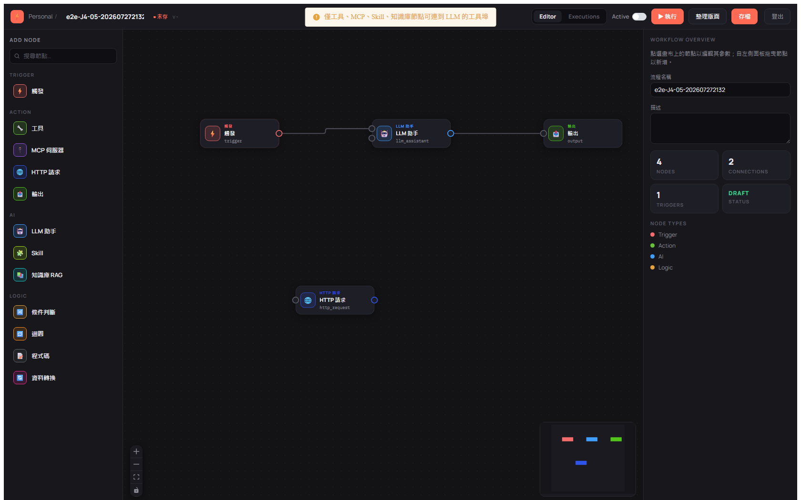

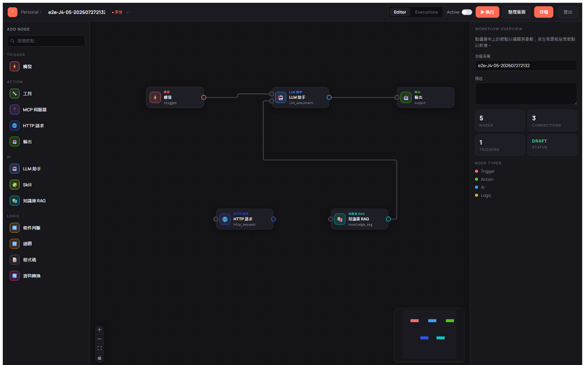

**關鍵斷言**：

```
J4-05 baseline edge count = 2
J4-05 toastVisible=true toastText="僅工具、MCP、Skill、知識庫節點可連到 LLM 的工具埠" edgeAfter=2
J4-05 control(KNOWLEDGE_RAG->in:tool) edgeAfter=3
```

- 以 `HTTP_REQUEST` 作非能力來源，`out:main` 拉向 LLM `in:tool`：toast 出現，
  Overview 維持 **4 NODES / 2 CONNECTIONS**，edge **未建立**。
- **對照組**：同一個 `in:tool` 埠改由 `KNOWLEDGE_RAG` 連入即**成功**（edge 增為 3），
  證明守衛是依白名單選擇性放行，而非一律封鎖。

> ⚠️ **文件表述需留意**：計畫原寫「存檔驗證亦回 `INCOMPATIBLE_CONNECTION`」。實測上
> `onConnect` 就已阻止 edge 建立，**經 UI 無法把不相容 edge 帶到存檔階段**；
> `validateGraph` 的 `INCOMPATIBLE_CONNECTION` 是第二層防線（針對後端載入的既有資料），
> 且該常數**只存在於前端** `useGraphValidation.ts`，後端無對應訊息。

### J4-07 — 孤兒 SKILL 節點（未連任何 LLM `in:tool`）

**預期（計畫原載）**：save / 啟用 → 400 `workflow.skill.node.not.mounted`

**狀態**：❌ **實際行為與文件不符**（缺陷在文件，非程式；詳見 D-03）

**證據（逐步截圖）**：

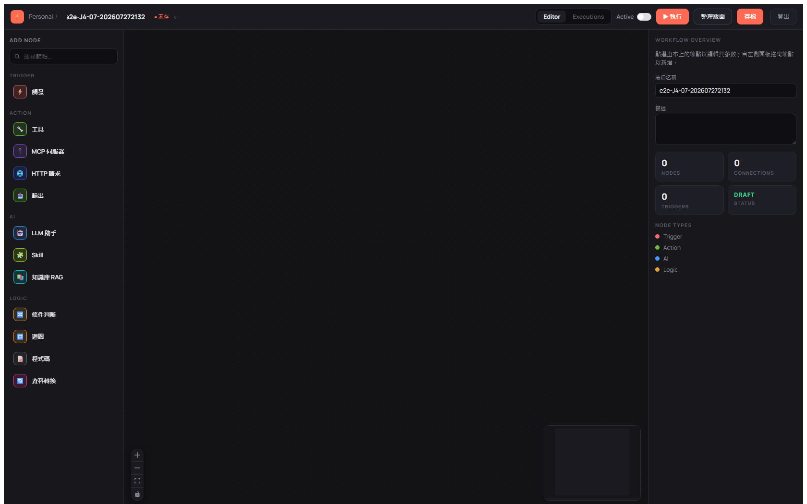


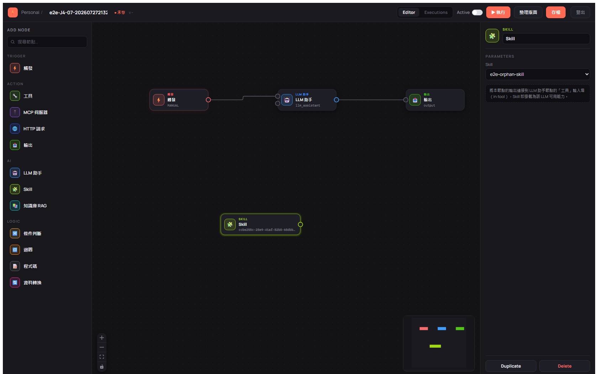
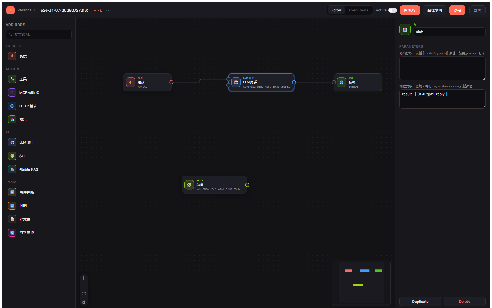
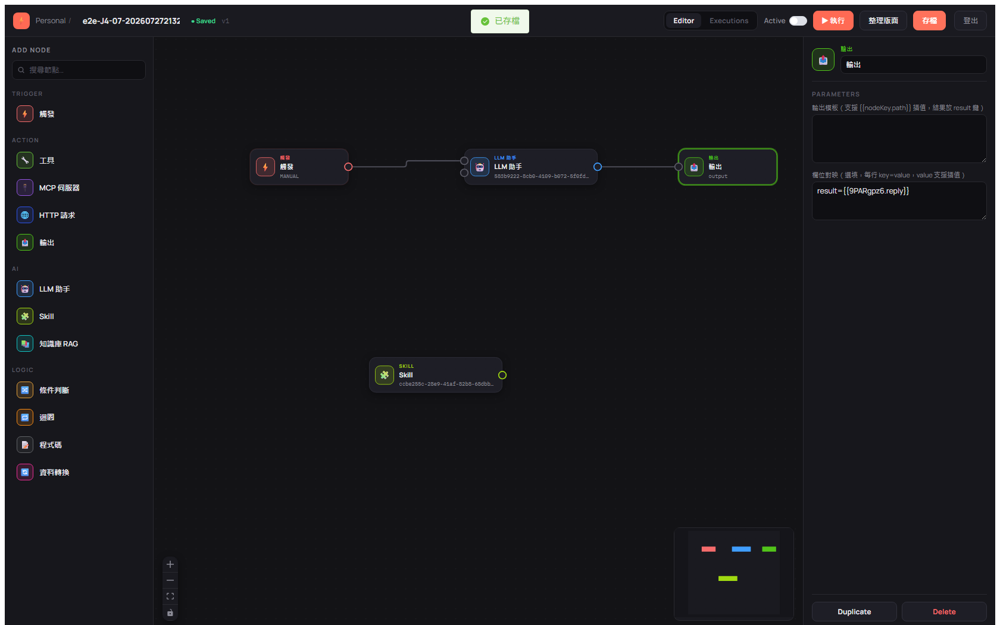
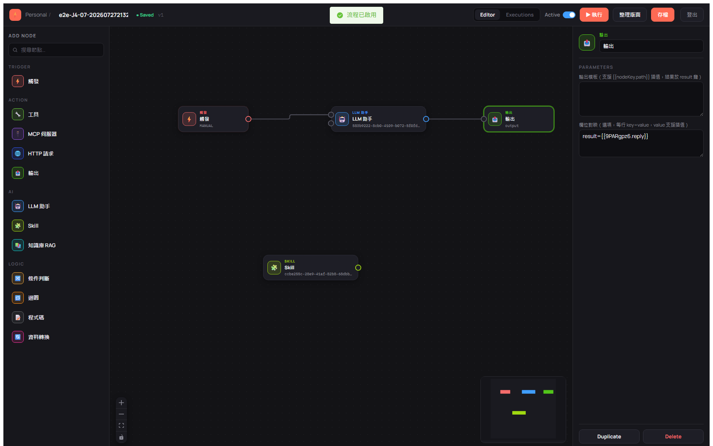
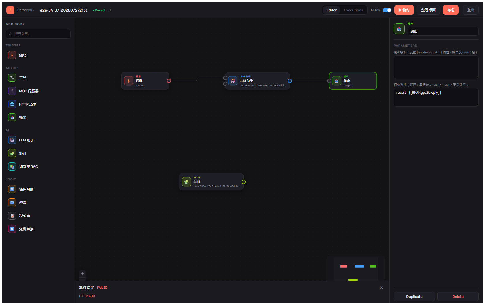

**關鍵斷言**：

```
J4-07 save     → savedBadgeVisible=true            （HTTP 200 save）
J4-07 activate → class="… is-checked" toast="流程已啟用"（HTTP 200 switchStatus）
J4-07 execute  → status="FAILED" error="HTTP 400"   （HTTP 400 execute）
```

API 層取得後端實際訊息（UI 只顯示「HTTP 400」，不帶訊息）：

```
POST /llm/workflow/execute  → HTTP 400
{"code":400,"message":"SKILL node \"Y4yxbE7e\" must be connected to an LLM assistant
 nodes tool input port (in:tool)","data":null}
```

- 訊息內容正確（`workflow.skill.node.not.mounted` + nodeKey），但**觸發時機比文件晚兩步**。
- `J4-07-07-after-activate.png` 可見：SKILL 節點明顯未連任何線，工具列卻顯示
  **「流程已啟用」＋ Active 開關為開**，workflow 狀態實際轉為 `ACTIVE`（API 確認）。

**程式碼佐證**：孤兒 SKILL 檢查位於 `WorkflowEngine.validateNodes`（`WorkflowEngine.kt:344`），
僅由 `validateForExecution` 呼叫；`WorkflowService.switchStatus`（`WorkflowService.kt:220`）
只驗「有 TRIGGER、無環、逐節點必填 config」，**不含此檢查**。

### D-03 修復內容（同日完成，含實機複驗）

**決策**：依使用者指示，把孤兒 SKILL 檢查**前移至 `switchStatus`**，讓「ACTIVE」等同「可執行」。

**實作**（避免驗證邏輯兩處分叉，比照專案既有 `validateNodeRequired` 共用模式）：

| 檔案 | 變更 |
|------|------|
| `WorkflowEngine.kt` | 規則抽為 companion 純函式 `findUnmountedSkillNodeKey(nodes, edges): String?`；`validateNodes` 改為呼叫它（保留為**執行前第二層防線**，涵蓋「啟用後才被改壞」與 DRAFT 直接 execute）；順手補 `WorkflowEdgeEntity` import，移除原本的全限定名 |
| `WorkflowService.kt` | `switchStatus(active=true)` 在「逐節點必填驗證」之後呼叫同一函式，失敗拋 `WORKFLOW_SKILL_NODE_NOT_MOUNTED`；驗證順序與 engine 一致，兩條路徑回報同一錯誤。停用（`active=false`）**不跑**圖驗證，避免使用者被卡在改不回去的狀態 |
| `WorkflowServiceTest.kt` | 新增案例 18（孤兒被擋 + 狀態仍 DRAFT）、19（已掛載可啟用，對照組）、20（孤兒仍可停用）；新增 `toolEdge()` helper |

> 未新增 i18n 訊息——`workflow.skill.node.not.mounted` 於 en_US / zh_TW 皆已存在。

**單元測試**：

```
ArchitectureTest        tests=9   failures=0
WorkflowServiceTest     tests=21  failures=0   （含新增 3 條）
WorkflowEngineTest      tests=24  failures=0
```

> ⚠️ 過程中發現 **`testGetNodeRequiredFields` 早已失敗**（斷言 `KNOWLEDGE_RAG` 必填含
> `embeddingModelId` / `query`），屬 RAG 外掛改動遺留的過時測試、非本次造成。
> 已依現行 `KnowledgeRagNodeConfig` 契約修正為「無條件必填只有 `knowledgeId`」並補 `SKILL` 斷言。

**實機複驗（run_4，修復後重跑 J4-07）**：

| 觀測點 | 修復前（run_3） | 修復後（run_4） |
|--------|---------------|---------------|
| `POST /llm/workflow/save` | 200 | 200（不變，DRAFT 容許未完成） |
| `POST /llm/workflow/switchStatus` | **200** | **400** |
| Active 開關 | `is-checked`（開） | 無 `is-checked`（維持關） |
| UI 提示 | 「流程已啟用」（綠） | `SKILL node "F1qVmjJS" must be connected to an LLM assistant nodes tool input port (in:tool)`（紅） |
| workflow 狀態（API 查證） | `ACTIVE` | `DRAFT` |
| `POST /llm/workflow/execute` | 400 | 400（第二層防線仍在） |


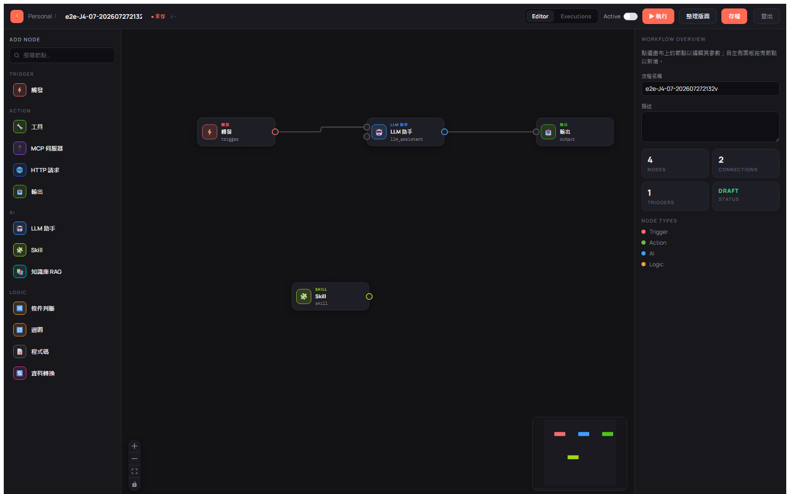


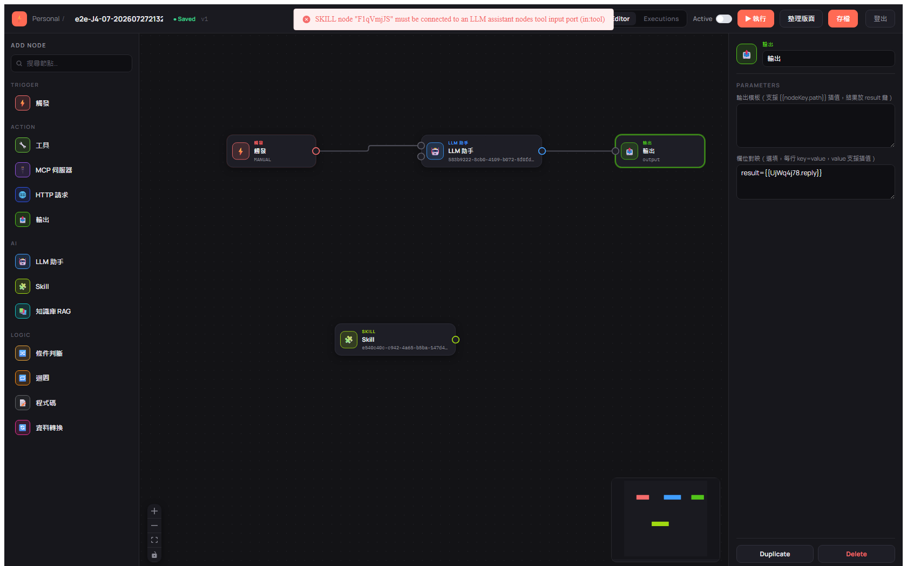
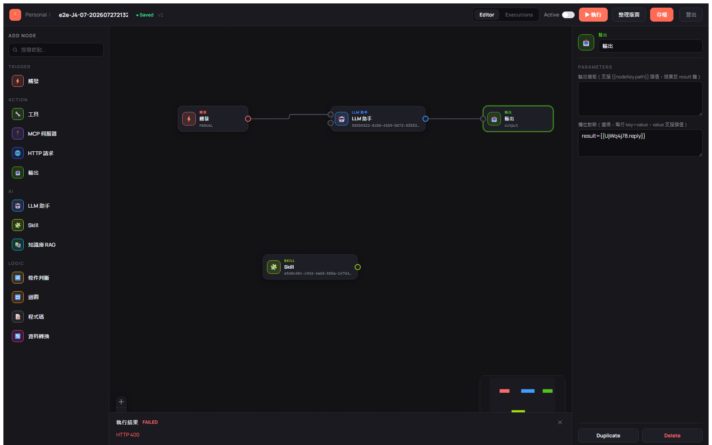

> 修復前的 8 張 `J4-07-*.png` 一併保留作為對照；修復後為 `FIX-J4-07-*.png`（8 張）。
> 額外收穫：**switchStatus 路徑的 UI 會顯示後端完整訊息**（含 nodeKey），
> 與 execute 路徑只顯示「HTTP 400」形成對比——D-04 因此僅限 execute 路徑。

### 追加驗證摘要

| 案例 | 狀態 | 說明 |
|------|:---:|------|
| J4-05 | ✅ | 行為與文件一致；另補對照組證明白名單選擇性放行 |
| J4-07 | ✅ | 修復後符合預期（修復前為 ❌，證據與對照保留於上表） |
| J4-08 | ✅ | 新增對照組（SKILL 已掛載可啟用），由 `WorkflowServiceTest` 案例 19 覆蓋 |
| J5-05 | ⏭️ | 未跑（需有效 MCP / tool 設定） |

---

## 對前次報告（202607252225）的核對

使用者要求確認「是否有正確截圖」。核對結果如下：

| # | 發現 | 說明 |
|---|------|------|
| 1 | **截圖存在但未被引用** | `e2e-shots/202607252225/` 有 9 張 `UI-*.png`（時戳 7/26 18:38–18:39，晚於報告），**報告內文無任何圖片連結**，且明文寫「未跑 webwright 逐步截圖」。證據與敘述不一致。 |
| 2 | **該批截圖顯示執行失敗** | `UI-09-executed.png` 顯示「執行結果 **FAILED** / HTTP 400」，而報告 RAG-03 標 ✅（該 ✅ 來自 API 層貫穿，非 UI）。同一份報告出現兩種相反結果而未說明。 |
| 3 | **UI 圖只有 3 條連線** | `UI-04-edges-intool.png` 顯示 5 NODES / **3** CONNECTIONS，LLM → OUTPUT 未連線（孤兒 OUTPUT）。本次以 4 條連線建圖，未再出現該 400。 |
| 4 | **測試資料未清乾淨** | 報告聲稱「測試 workflow 已刪除」，實際殘留 `e2e-rag-plugin-202607252225`、`e2e-rag-ui-202607252225`（另有 `e2e-rag-202607242258`）。**本次已一併清除**。 |
| 5 | **RAG-05 歸因方向正確，但真因更具體** | 報告歸因「環境層面（Milvus 未運行 / 向量未入庫 / 維度未對齊）」方向正確。本次確認真因為：**Milvus 容器未啟動**（run_1 得到 gRPC `DEADLINE_EXCEEDED`），且啟動後 collection 亦為空（20 個 slice 全失），需重新 embedding。 |

**run_1 診斷證據**（Milvus 未啟動時的 UI 表現）：

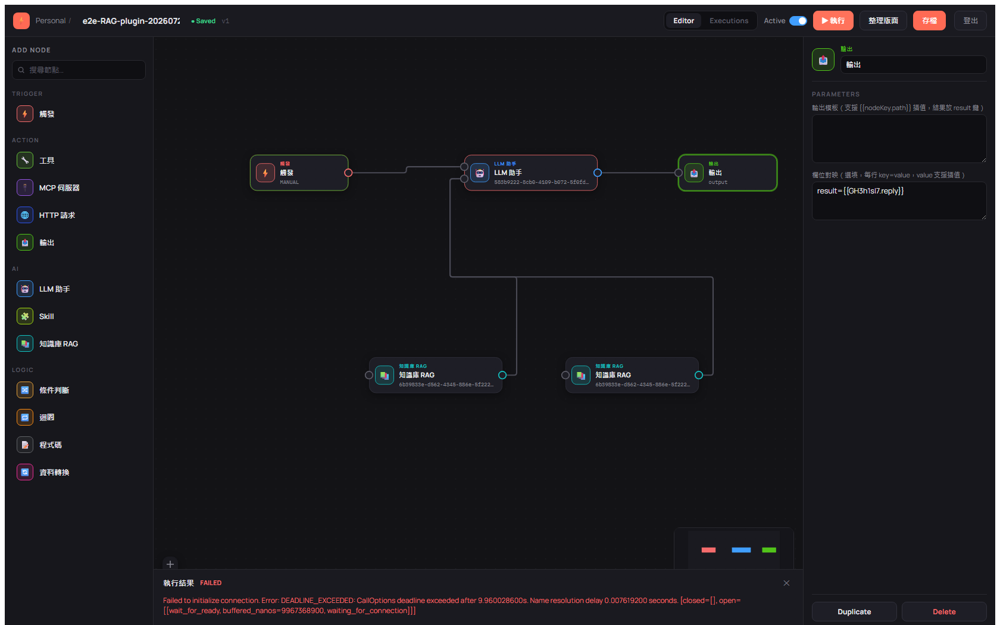

```
Failed to initialize connection. Error: DEADLINE_EXCEEDED: CallOptions deadline exceeded
after 9.960028600s. Name resolution delay 0.007619200 seconds.
```

> 注意：此時 `POST /llm/workflow/execute` 本身是 **HTTP 200**（SSE 已建立），失敗發生在節點執行階段。
> 與前次的 HTTP 400（存檔/驗證階段）是不同問題。

---

## 問題追蹤區

本次專項 5 案例全數通過，無 ❌。以下為**流程與文件面**待處理事項：

| 編號 | 現象 | 期望 | 實際 | 根因 | 狀態 |
|------|------|------|------|------|------|
| D-01 | `docs/e2e-test-plan.md` §J4 仍載「非 TOOL/MCP/SKILL 節點拉線到 LLM `in:tool` 埠 → 拉線即被擋（toast），存檔驗證回 `INCOMPATIBLE_CONNECTION`」 | 應納入 KNOWLEDGE_RAG 為合法 `in:tool` 來源 | 與本次實測（RAG-01 拉線放行、無 toast、console error=0）**矛盾** | 本次改動（KNOWLEDGE_RAG 可掛 `in:tool`）未同步測試計畫；該檔 working tree 的異動僅涉及 J1 登出案例 | **✅ 已修**（見下方「D-01 修正內容」） |
| D-03 | 孤兒 SKILL 節點的 workflow **可以被啟用成 ACTIVE**，但永遠執行不了 | 啟用時就該擋（ACTIVE 應代表「可執行」） | save 200 / switchStatus 200（狀態轉 ACTIVE）；execute 才 400 `workflow.skill.node.not.mounted` | 檢查僅在 `WorkflowEngine.validateNodes`（由 `validateForExecution` 呼叫）；`WorkflowService.switchStatus` 未涵蓋 | **✅ 已修復並實機複驗**（見下方「D-03 修復內容」） |
| D-04 | 執行失敗時 UI 只顯示「HTTP 400」，不帶後端訊息 | 應顯示 nodeKey 與原因 | Drawer 僅 `HTTP 400`，需另打 API 才知是孤兒 SKILL | 前端未解析 `ApiResponse.message` | **既有已知項**（`e2e-test-plan.md` §11 已載），本次再次重現；列為 UI 改善候選 |
| D-02 | `llm_knowledge` 殘留孤兒列 `6b39833e-d562-4345-886e-5f222e6d722c`（`e2e-scb-tnc-0724`），已無對應 `llm_doc` | 知識庫刪除應連鎖 | `DELETE /llm/vector/deleteData` 只刪 `llm_doc` / `llm_doc_slice` 與向量，**未刪 `llm_knowledge`**；再以同 id 上傳會撞 `llm_knowledge_pkey` 唯一鍵而回「Database processing error」 | 缺少知識庫層級的刪除端點 / deleteData 未連鎖 | **待評估** — 本次改以新 knowledgeId 繞過；孤兒列在 `getKnowledgeStore` 不顯示（需 join doc），無功能影響 |

### D-01 修正內容（2026-07-27 同日完成）

**事實來源**：後端 `WorkflowEngine.kt:81` 的 `CAPABILITY_SOURCE_TYPES` ≡ 前端 `useGraphValidation.ts:22` 同名常數
＝ `{TOOL, MCP_SERVER, SKILL, KNOWLEDGE_RAG}`（已逐項核對）。

| 檔案 | 變更 |
|------|------|
| `docs/e2e-test-plan.md` §J3 | 能力掛載案例補上 `MCP_SERVER` / `KNOWLEDGE_RAG`；新增「多個 KNOWLEDGE_RAG 掛同一 LLM」案例 |
| `docs/e2e-test-plan.md` §J4 | 「非 TOOL/MCP/SKILL」改為「非能力來源節點」＋白名單註；新增「外掛模式僅需 knowledgeId 即可啟用」案例；新增**兩模式對照表**（外掛 vs pipeline 的必填欄位與是否獨立執行） |
| `docs/e2e-test-plan.md` §J5 | 新增「外掛型 RAG execute」案例（自動注入、不落主遍歷） |
| `docs/e2e-test-plan.md` §J8 | 拆為 **J8-A（pipeline）／J8-B（外掛）** 兩組，J8-B 為本次 RAG-01~05 的固化；斷言策略補「所選事實須與 LLM 常識不同」的鑑別力要求 |
| `docs/e2e-test-plan.md` §9 | 維護規則新增「白名單異動時須同步 §J3/§J4/§J5/§J8 與 checklist，且前後端兩份常數同時改」 |
| `docs/e2e-test-plan.md` §14 | 新增本週期實測發現 7 項（必填契約相反、UI 斷言點、鑑別力教訓、Milvus 失敗樣態、`deleteData` 不連鎖、collection 隨 volume 清空、無 Python Playwright） |
| `.claude/skills/e2e-test-confirmation/e2e-test-checklist.md` | 同步新增 J3-06/07、J4-05/06、J5-04、J8-06~10；J8 拆 A/B；前置檢查加「Milvus 就緒須以檢索命中判定」；`J1→J7` 筆誤修為 `J1→J8` |
| 同上（順帶補齊既有落差） | 核對時發現 checklist 長期少於計畫兩條 **且都屬 `in:tool` 主題**，一併補上：J4-07（孤兒 SKILL 未掛載 → `workflow.skill.node.not.mounted`）、J5-05（Agent 模式 TOOL/MCP/SKILL 掛載後 execute）。摘要表計數 → **47** |
| `docs-site/docs/api/workflow.md` | 第 122 行能力掛載說明補上 `KNOWLEDGE_RAG` 與「自動注入 vs LLM 自主呼叫」的差別（同檔第 107 行原已正確，屬檔內不一致） |

**驗證**：
- `pwsh ./scripts/harness-drift-scan.ps1` → 基線 5 項、**新漂移 0 項**，exit 0。
- 計畫 ⇄ checklist 逐旅程案例數交叉核對：J1=9 / J2=4 / J3=7 / J4=7 / J5=5 / J6=3 / J7=2 / J8=10，
  **八條全部 1:1 對齊**，合計 47 與摘要表一致。

---

## 未涵蓋範圍

- **全 J1–J8 回歸**：本次為專項，僅順帶覆蓋上表所列既有案例。
- **多知識庫「合併注入」的內容級斷言**：兩個 RAG 節點指向**同一個**知識庫（環境僅此一個已入庫知識庫），故驗證的是「多掛載並存不衝突且執行成功」，未驗證跨不同知識庫的 DefaultQueryRouter 合併結果。
- **pipeline 模式（RAG 節點獨立執行）**：本次只測外掛模式；pipeline 缺 `query` 的錯誤路徑由 `KnowledgeRagExecutorTest` 單元測試覆蓋。
- **firefox / webkit 瀏覽器**：僅 chromium。

---

## 收尾

- ✅ 測試 workflow 已清理：以 `e2e-` 前綴掃描 `workflow/list`，刪除 5 筆（含前次殘留 3 筆），**剩餘 `e2e-*` = 0**。
- ✅ 未建任何備份檔／目錄；證據存於 `e2e-shots/202607272132/`（23 張 run_2 逐步截圖 + 1 張 run_1 診斷圖 + `final_script_log.txt` + `DIAG-run1-milvus-down-log.txt` + `plan.md`）。
- ✅ 服務已關閉（後端 80、前端 4173，listeners = 0）。
- ℹ️ **Milvus 容器保持運行**（`milvus-standalone` / `etcd` / `minio` / `attu`）——本次為修復向量檢索而啟動，非測試服務；如需停止：`cd docs/docker/milvus && docker compose down`。
- ℹ️ 知識庫 `90c4deb7-…`（`e2e-scb-tnc-202607272132`，20 slice）**保留**，作為後續 RAG 測試的可用 fixture；如需清除走 `DELETE /llm/vector/deleteData`。

## 建議後續

1. ~~修正 D-01~~ — **已於同日完成**，見上方「D-01 修正內容」。
2. 評估 D-02：`deleteData` 是否應連鎖刪除 `llm_knowledge`，或提供獨立的知識庫刪除端點；目前以同 knowledgeId 重新上傳必然失敗。
3. 若要納入 CI/常態回歸，可將 `final_runs/run_2/final_script.mjs` 固化為 `bestpartner-ui/e2e/specs/` 下的參考腳本（注意該目錄僅作選擇器/旅程參考，非執行入口）。
