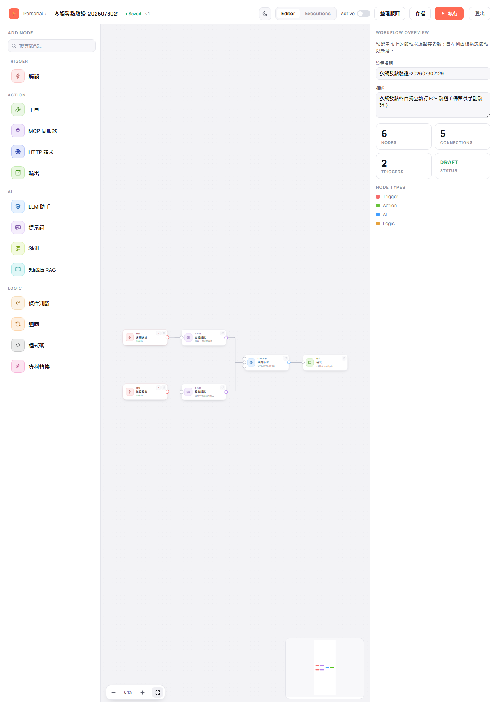
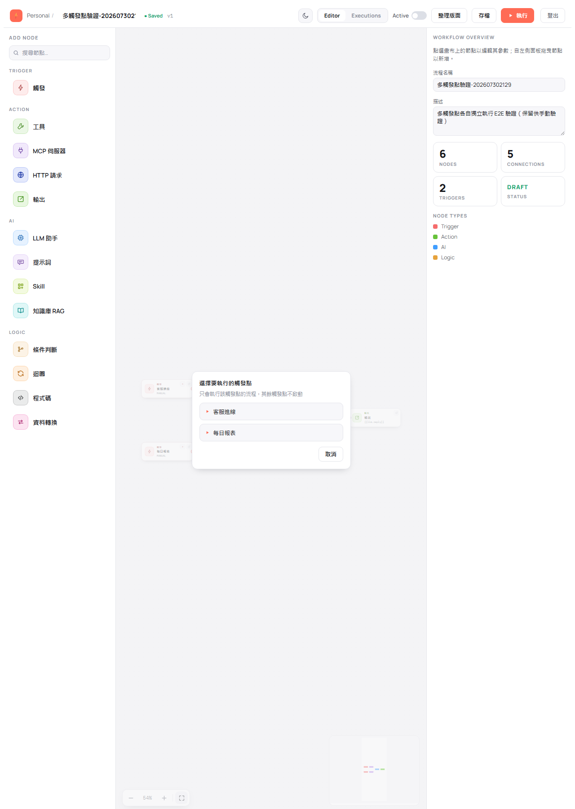
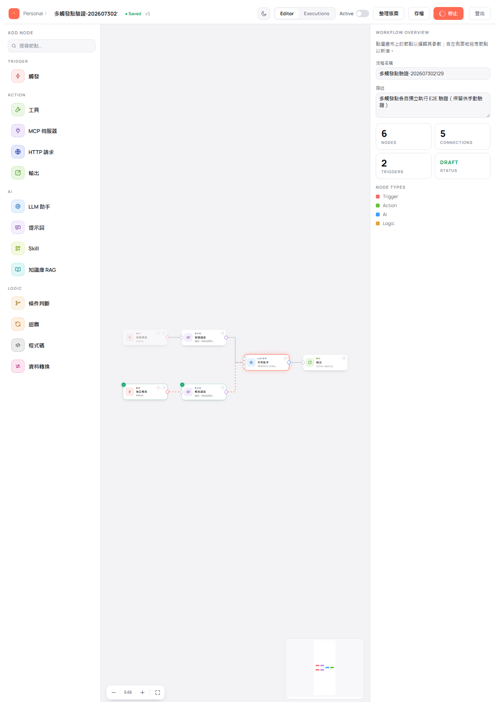
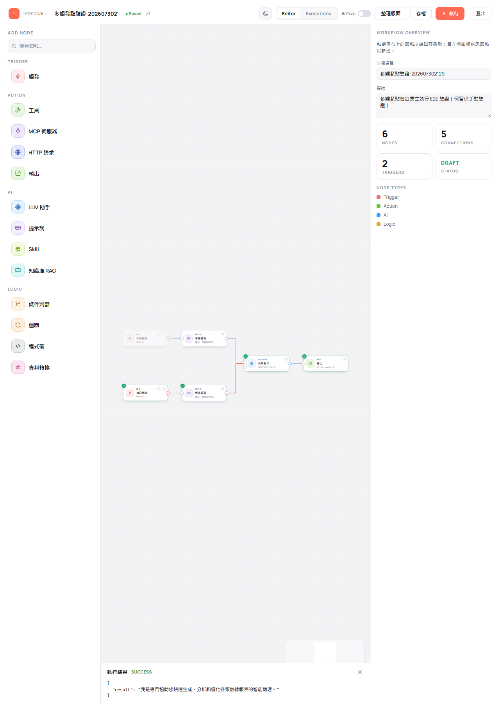
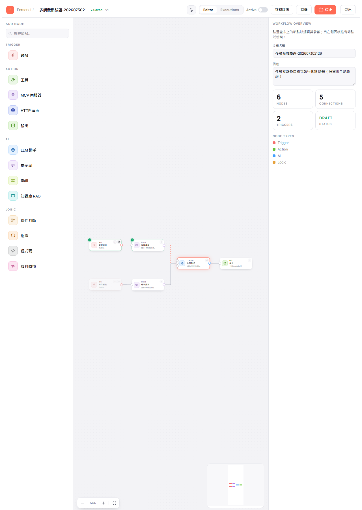
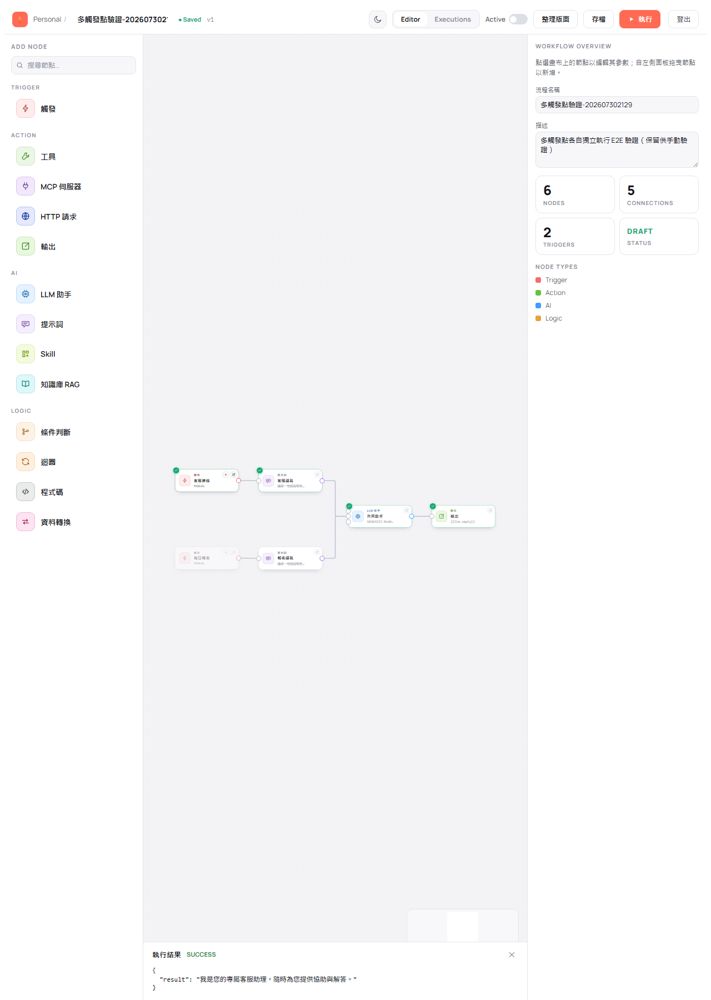

# BestPartner E2E 測試確認表（UI-driven）

> 本文件為 E2E 測試記錄模板，每次測試週期開始前由 `e2e-test-confirmation` skill 複製並填寫。
> 旅程與案例定義的權威來源：`docs/e2e-test-plan.md`。

---

## 使用說明

### 狀態符號

| 符號 | 意義 |
|------|------|
| ✅ | Pass — 案例通過 |
| ❌ | Fail — 案例失敗（請在「問題追蹤區」補充說明） |
| ⏭️ | Skip — 本次略過（請在證據／備註欄說明原因，如缺 E2E_LLM_ID） |
| — | 本次週期不適用 |

### 填寫流程

1. 複製此檔案，重新命名為 `docs/test-confirmations/e2e-test-confirmation-YYYYMMDDHHmm.md`
2. 填寫「測試週期資訊」
3. 完成「前置檢查清單」（任一失敗即停止）
4. 依 J1→J9 逐旅程執行，**先記錄證據再標狀態**
5. 每條旅程完成後立即更新「測試結果摘要」與 Pass 率
6. 所有 ❌ 項目在「問題追蹤區」建立記錄
7. 收尾清理 `e2e-*` 測試資料

### 證據要求

每個案例的「證據 / 備註」欄**必須**包含（不得留佔位符）：

1. **逐步圖片連結（強制，用 Markdown 圖片語法）**：案例每一個操作步驟一張截圖，**在證據欄以圖片連結依序嵌入**，讓報告可直接預覽／點開，不得只放最終畫面、不得只填純文字路徑。
   命名／存放：`docs/test-confirmations/e2e-shots/<報告時間戳>/<caseId>-<步驟序號>-<簡述>.png`
   證據欄寫法（相對報告檔路徑）：
   ```markdown
   
   
   
   ```
2. 另可附：Playwright trace / 錄影檔連結（如 `[trace](test-results/j3/trace.zip)`）、關鍵斷言（如「節點數 3、edge 2、save 後 version=2」）。
3. J5 專用：SSE 事件序列與最終節點狀態（如 `started→node.completed×3→completed(SUCCESS)`），並以圖片連結附各節點狀態轉移截圖。

> ⚠️ 缺少任一步驟圖片連結、或只填純文字路徑未用圖片語法，即視同證據不完整。失敗（❌）案例另附失敗當下截圖與 trace 連結。

---

## 測試週期資訊

| 項目 | 內容 |
|------|------|
| 測試日期 | 2026-07-30 21:29 |
| 服務版本 | 0.1.8-SNAPSHOT |
| 測試環境 | dev |
| 瀏覽器 | chromium |
| 前端 baseURL | `http://localhost:4173`（`npm run preview`） |
| 後端 API URL | `http://localhost:80` |
| LLM 平台（J5） | OPENROUTER（`deepseek/deepseek-v3.2`，alias `openrouter_local_chat_test`） |
| E2E_LLM_ID（J5） | `583b9222-8cb0-4109-b072-5f0fd1e9fed9`（Step 4.5 由 `POST /llm/setting/get` 動態解析，未硬編） |
| 測試結束時間 | 2026-07-30 21:44 |

### 本次範圍（部分回歸）

> 針對「**多觸發點各自獨立執行**」功能的新增案例做定向驗證，非全 J1–J9 貫穿。
> 本次執行：**J5-10 / J5-11 / J5-12**（`docs/e2e-test-plan.md` §J5 新增案例）。
> 其餘旅程與案例本次標「—（本次週期不適用）」。
>
> 受測變更：`execute` 新增選填 `triggerNodeKey`；`WorkflowEngine` 活化閘門擋未選定 TRIGGER；
> 前端節點卡 `node-run-from-here` 與工具列 `trigger-picker` 兩條入口；
> `llm_workflow_execution.trigger_node_key` 落庫。
>
> ⚠️ 後端有 Kotlin 異動，測試前已重編 uber-jar（否則測到的是舊行為）。
> 📌 依使用者指示，本次**保留**測試建立的 workflow 供其手動驗證，故流程名稱**刻意避開 `e2e-` 前綴**
> （避免日後其他輪次的兜底掃描誤刪），保留清單見文末。

---

## 前置檢查清單（測試前必須全部 ✅）

```
☑ 後端服務於 port 80 健康回應（HTTP 200）
     GET /systemSetting/list -> 200；log 確認「Profile dev activated / Listening on http://0.0.0.0:80」
     ⚠️ 本次後端有 Kotlin 異動，已先 `clean build -x test -Dquarkus.package.type=uber-jar
        -Dquarkus.profile=dev` 重編（BUILD SUCCESSFUL，jar 21:31 產出）再啟動
☑ PostgreSQL 已初始化（bestpartner-ddl.sql + bestpartner-init-data.sql）
     另確認本次新增欄位已在位：llm_workflow_execution.trigger_node_key
☑ 種子資料存在：llm_user 3 筆；admin 以 email admin@bestpartner.com.tw 登入成功（JWT 634 chars）
     ⚠️ admin 密碼非預設 admin，本機為使用者提供之密碼
☑ J5 可用：具有效 api_key 的 LLM setting
     E2E_LLM_ID = 583b9222…（openrouter / deepseek-v3.2）；POST /llm/chat 回 200「好的，收到！」
     ⚠️ 首選 1ee80ffa…（gpt-5.5-pro）api_key 有效但**OpenRouter key 額度不足**
        （HTTP 402：requested up to 32768 tokens, can only afford 28785），故改用 deepseek-v3.2
— J8 可用：本次不涉及 RAG 旅程，未檢查
☑ 前端已 build 並可由 baseURL 存取（vite build ✓ 862ms；GET :4173 -> 200，`npm run preview`）
☑ Playwright 瀏覽器已安裝（npx playwright install chromium）
☑ 認證可用：Step 4.5 已完成登入 + llmId 動態解析 + api_key 實測
```

> ⚠️ 任一項未通過即停止測試並回報。

---

## 測試結果摘要

> 每完成一條旅程立即更新本表

> ⚠️ 本次為**定向回歸**（僅 J5-10 / J5-11 / J5-12 + J5-06 附帶覆蓋），非全 J1–J9 貫穿。
> 未執行的案例一律標「—」而非 Skip，不計入 Pass 率分母。

| 旅程 | 優先 | 本次執行 | ✅ Pass | ❌ Fail | ⏭️ Skip | — 未執行 | Pass 率 |
|------|:---:|------|--------|--------|---------|---------|---------|
| J1 認證 | P0/P1/P2 | 0 | — | — | — | 9 | — |
| J2 Workflow 列表 | P0/P1 | 0 | — | — | — | 4 | — |
| J3 畫布編輯 | P0/P1 | 0 | — | — | — | 7 | — |
| J4 驗證與啟用 | P1 | 0 | — | — | — | 8 | — |
| **J5 執行（真實 LLM）** | P0/P1 | **4** | **4** | **0** | 1 | 7 | **100.0%** |
| J6 Inspector 表單 | P0/P1/P2 | 0 | — | — | — | 9 | — |
| J7 契約錯誤 | P2 | 0 | — | — | — | 2 | — |
| J8-A 知識庫 RAG（pipeline） | P1 | 0 | — | — | — | 5 | — |
| J8-B 知識庫 RAG（外掛） | P1 | 0 | — | — | — | 5 | — |
| J9 編輯器外觀與節點編輯頁 | P0/P1/P2 | 0 | — | — | — | 17 | — |
| **合計** | | **4** | **4** | **0** | **1** | **73** | **100.0%** |

> J5 本次執行 4 案（J5-06 附帶覆蓋、J5-10、J5-11、J5-12），全數 Pass；J5-09 標 ⏭️（UI 未驗，
> 但其所依賴的「400 帶業務訊息」契約已於 API 層確認）。P0 案例（J5-10 / J5-11）**100% 通過**。
>
> 另附 3 項 API 層補充驗證（`triggerNodeKey` 參數驗證），亦全數通過——不計入上表旅程統計。

### 通過標準

| 優先級 | 通過標準 | 說明 |
|--------|--------|------|
| P0 | 100% | 任何失敗均為 Release Blocker |
| P1 | ≥ 95% | 已知失敗需有追蹤 Issue |
| P2 | ≥ 80% | 剩餘列為 Tech Debt |

---

## 旅程測試清單

> 案例定義同步自 `docs/e2e-test-plan.md §3`。狀態與證據欄由測試時填寫。

### J1 認證流程（P0）

| 案例 | 優先 | 描述 | 預期 | 狀態 | 證據 / 備註 |
|------|:---:|------|------|:---:|------|
| J1-01 | P0 | 未登入直接訪 `/` | 導向 `/login` | | |
| J1-02 | P0 | admin/admin 登入 | 導向列表 `/`，顯示已登入 | | |
| J1-03 | P1 | 已登入訪 `/login` | 導回首頁 `/` | | |
| J1-04 | P1 | 錯誤帳密登入 | 停留 `/login`，顯示錯誤 | | |
| J1-05 | P1 | 列表頁登出（`logout-button`） | 清 token 導向 `/login`；重訪受保護頁被導回登入 | | |
| J1-06 | P1 | 編輯器工具列登出（無未存，`logout-button`） | 清 token 導向 `/login`；per-user 快取一併清除 | | |
| J1-07 | P1 | 編輯器有未存變更登出 → 確認框選「登出」 | 先跳「尚未存檔」確認；確認後清 token 導向 `/login` | | |
| J1-08 | P1 | 編輯器有未存變更登出 → 確認框選「取消」 | 留在編輯器且仍為登入態（token 未清） | | |
| J1-09 | P2 | token 清除後訪受保護頁 | 導回 `/login` | | |

### J2 Workflow 列表（P0/P1）

| 案例 | 優先 | 描述 | 預期 | 狀態 | 證據 / 備註 |
|------|:---:|------|------|:---:|------|
| J2-01 | P0 | 列表載入 | 顯示既有 workflow 清單 | | |
| J2-02 | P0 | 建立新 workflow | 進 `/editor/:id`，DRAFT、version 1 | | |
| J2-03 | P1 | 點列表項進編輯器 | 載入完整定義 | | |
| J2-04 | P1 | 刪除 workflow | 列表移除，連鎖刪 node/edge | | |

### J3 畫布編輯（P0）

| 案例 | 優先 | 描述 | 預期 | 狀態 | 證據 / 備註 |
|------|:---:|------|------|:---:|------|
| J3-01 | P0 | 拖拉節點入畫布（TRIGGER/LLM_ASSISTANT/OUTPUT） | 節點出現，nodeKey 唯一 | | |
| J3-02 | P0 | 連線 edge | edge 建立，兩端點存在 | | |
| J3-03 | P0 | 選節點於 Inspector 填 config | 表單值寫回節點 | | |
| J3-04 | P0 | save 整張覆寫 | version+1 | | |
| J3-05 | P1 | 重整頁面 get 還原 | 畫布與 Inspector 與存檔一致 | | |
| J3-06 | P1 | 能力掛載：TOOL / MCP_SERVER / SKILL / **KNOWLEDGE_RAG** 的 `out:main` 連 LLM `in:tool` 並 save | edge 建立（`targetHandle=in:tool`）；重載後連線保留 | | |
| J3-07 | P1 | 多個 KNOWLEDGE_RAG 同時掛同一 LLM 的 `in:tool` | 皆放行、無相容性 toast；CONNECTIONS 計數與 edge 數一致 | | |
| J3-08 | P1 | 提示接線：PROMPT 的 `out:main` 連 LLM `in:prompt` 並 save | edge 建立（`targetHandle=in:prompt`）；重載後連線保留 | | |
| J3-09 | P1 | 兩個 PROMPT 各接 CONDITION 的 `out:true`/`out:false`，再同時連同一 LLM 的 `in:prompt` | 皆放行、無相容性 toast；CONNECTIONS 計數與 edge 數一致 | | |

### J4 驗證與啟用（P1）

| 案例 | 優先 | 描述 | 預期 | 狀態 | 證據 / 備註 |
|------|:---:|------|------|:---:|------|
| J4-01 | P1 | 缺 TRIGGER 啟用 | 400，對應訊息 | | |
| J4-02 | P1 | 圖有環啟用 | 400，對應訊息 | | |
| J4-03 | P1 | 缺必填 config 啟用（如缺 llmId） | 400，`workflow.node.config.required.missing`，顯示 nodeKey+欄位 | | |
| J4-04 | P1 | 合法圖 switchStatus 啟用 | 狀態轉 ACTIVE | | |
| J4-05 | P1 | **非能力來源節點**拉線到 LLM `in:tool`（白名單＝TOOL / MCP_SERVER / SKILL / KNOWLEDGE_RAG） | `onConnect` 即擋：toast「僅工具、MCP、Skill、知識庫節點可連到 LLM 的工具埠」，**edge 不建立**（CONNECTIONS 不變）；建議併測對照組（能力來源連同一埠應成功） | | |
| J4-06 | P1 | KNOWLEDGE_RAG 掛 `in:tool`（外掛模式）且 `query` / `embeddingModelId` 留空即啟用 | **啟用成功**（外掛模式僅需 `knowledgeId`） | | |
| J4-07 | P1 | 孤兒 SKILL 節點（未連任何 LLM `in:tool`）save → 啟用 | save 放行；**switchStatus 回 400** `workflow.skill.node.not.mounted`（含 nodeKey），開關維持關閉、狀態仍 DRAFT。⚠️ SKILL 須先填 `skillId`，否則先撞 REQUIRED_MISSING 而測不到本案例 | | |
| J4-08 | P1 | SKILL 已掛載到 LLM `in:tool` 後啟用（J4-07 對照組） | 啟用成功，狀態轉 ACTIVE | | |
| J4-09 | P1 | **非 PROMPT 節點**拉線到 LLM `in:prompt`（如 TRIGGER） | `onConnect` 即擋：toast「僅提示詞節點可連到 LLM 的提示埠」，**edge 不建立**（CONNECTIONS 不變） | | |
| J4-10 | P1 | 孤兒 PROMPT 節點（未連任何 LLM `in:prompt`）save → 啟用 | save 放行；**switchStatus 回 400** `workflow.prompt.node.not.connected`（含 nodeKey），狀態仍 DRAFT。⚠️ PROMPT 須先填 `prompt`，否則先撞 REQUIRED_MISSING | | |
| J4-11 | P1 | LLM `userPrompt` 留空且無 PROMPT 連入時啟用 | **400** `workflow.llm.prompt.required`（含 LLM 的 nodeKey），狀態仍 DRAFT | | |
| J4-12 | P1 | LLM `userPrompt` 留空但已有 PROMPT 連入（J4-10/11 對照組） | 啟用成功，狀態轉 ACTIVE | | |

> ⚠️ **KNOWLEDGE_RAG 兩種模式的必填欄位相反，勿寫反預期**：
> 掛 LLM `in:tool`＝外掛模式，僅需 `knowledgeId`；連一般 `in:main`＝pipeline 模式，另需 `query`。
> 白名單事實來源：後端 `WorkflowEngine.CAPABILITY_SOURCE_TYPES` ≡ 前端 `useGraphValidation.CAPABILITY_SOURCE_TYPES`。

> ⚠️ **`in:prompt` 與 `in:tool` 語義相反，勿寫反預期**：
> `in:tool` 允許 TOOL/MCP_SERVER/SKILL/KNOWLEDGE_RAG，**非資料流**（純能力節點不執行、不落紀錄）；
> `in:prompt` 只允許 PROMPT，**是資料流**（參與活化，來源節點照常執行並落紀錄）。
> 驗證順序：必填欄位 → 孤兒 SKILL → 孤兒 PROMPT → LLM 無提問來源。

### J5 執行 workflow（P0，真實 LLM）

| 案例 | 優先 | 描述 | 預期 | 狀態 | 證據 / 備註 |
|------|:---:|------|------|:---:|------|
| J5-01 | P0 | 合法 workflow（TRIGGER→LLM_ASSISTANT→OUTPUT）execute | SSE `started`→`node.*`→`completed(SUCCESS)`；DB 寫入 `llm_workflow_execution`/`llm_workflow_node_execution` | — | 本次為定向回歸，未執行 |
| J5-02 | P1 | 節點設定錯誤導致失敗 | 該節點 `node.failed` 顯示錯誤，執行標記失敗 | — | 本次為定向回歸，未執行 |
| J5-03 | P1 | 執行中途 client 斷線 | 執行 `CANCELLED`，下游未執行節點 `SKIPPED`（commit b24c128 視覺） | — | 本次為定向回歸，未執行 |
| J5-04 | P1 | 外掛型 RAG：KNOWLEDGE_RAG 以 `out:main → LLM in:tool` 掛載後 execute | 推論前自動檢索注入（非 LLM 主動呼叫）；**不產生**獨立節點事件、`node_execution` 無其紀錄。內容正確性斷言歸 J8-B | — | 本次為定向回歸，未執行 |
| J5-05 | P1 | Agent 模式：TOOL / MCP_SERVER / SKILL 以 `out:main → LLM in:tool` 掛載後 execute | LLM 可自主呼叫掛載工具並回覆；能力節點**不產生**獨立節點事件、`node_execution` 無其紀錄 | — | 本次為定向回歸，未執行 |
| J5-06 | P1 | 提示節點驅動：PROMPT → `LLM in:prompt` → OUTPUT（LLM `userPrompt` 留空）execute | PROMPT **照常**產生 `node.started`/`node.completed` 與 `node_execution` 紀錄（與能力節點相反）；LLM 以該提示提問並成功回覆 | ✅ | **由 J5-11 附帶覆蓋**：受測流程的 LLM 未填 `userPrompt`，提問全由 `in:prompt` 的 PROMPT 節點供給；SSE 中 promptA 照常有 `node.started`/`node.completed`，DB 亦有紀錄（見 J5-11 證據） |
| J5-07 | P1 | 分支擇一：CONDITION 兩分支各接一 PROMPT 匯入同一 LLM 後 execute | 被活化分支的 PROMPT 為 SUCCESS、另一顆 `node_execution` 為 SKIPPED；回覆風格對應被活化那條 | — | 本次為定向回歸，未執行（J5-11/12 以**多觸發點**達成等效的「擇一驅動同一顆 LLM」，機制同源） |
| J5-08 | P1 | 優先序：LLM 同時有 `userPrompt` 與 PROMPT 連入 | 以 PROMPT 輸出為準；刪 `in:prompt` 連線後再執行改用 `userPrompt`。⚠️ 只刪連線會讓 PROMPT 變孤兒而被防線擋下，須連該節點一起刪 | — | 本次為定向回歸，未執行 |
| J5-09 | P1 | execute 被後端擋下時（如含孤兒 PROMPT 節點）檢視執行結果面板 | 顯示**後端業務訊息**（含 nodeKey 與應連往的埠），**不得**只顯示 `HTTP 400`。⚠️ execute 是唯一走原生 `fetch`、不經 axios 攔截器的端點，訊息解析在 `api/workflowExecution.ts` 自行實作，改該檔須重驗本條 | ⏭️ | 本次未經 UI 驗證，但**已於 API 層確認業務訊息可取得**（見下方「API 層補充驗證」）：非法 `triggerNodeKey` 回 400 且 body 帶 `message`，即 `readErrorMessage` 所依賴的契約 |
| J5-10 | P0 | 多觸發點：兩顆 TRIGGER 各接一分支匯流到同一 LLM，點工具列執行鈕 | 出現 `trigger-picker` 列出兩個 `trigger-option-<nodeKey>`（顯示節點名稱），尚未開始執行 | ✅ | 畫布 6 節點、2 顆 TRIGGER 各帶 `node-run-from-here`（其餘型別 0 顆）：<br/><br/>點 `run-button` 後 `trigger-picker` 出現，**此時 execute 請求次數 = 0**（尚未開跑）；選項＝`[{trigger-option-t1,"客服進線"},{trigger-option-t2,"每日報表"}]`，面板文案「只會執行該觸發點的流程，其餘觸發點不啟動」：<br/> |
| J5-11 | P0 | 選定 t1 後執行 | 只有 t1 分支節點亮起；另一顆 TRIGGER 呈 `.is-exec-skipped`（前端預標，後端對 SKIPPED 不發事件）；LLM 取 t1 分支的提問；`llm_workflow_execution.trigger_node_key`=`t1` | ✅ | 送出 body＝`{"id":"6763616b…","triggerNodeKey":"t1"}`；選擇器關閉、t1/promptA 執行、**t2 = `is-exec-skipped`**、llm running：<br/><br/>完成後 t1/promptA/llm/out 皆 `is-exec-success` 且帶 `node-done-badge`，t2 維持 skipped：<br/><br/>結果抽屜 SUCCESS，輸出「我是您的專屬客服助理…」＝**取到 promptA（客服語氣）而非 promptB（報表語氣）**，證明匯流 LLM 取對分支：<br/><br/>**SSE 事件序列**（完全無 t2/promptB 事件）：`execution.started → node.started(t1) → node.completed(t1)=SUCCESS → node.started(promptA) → node.completed(promptA)=SUCCESS → node.started(llm) → node.completed(llm)=SUCCESS → node.started(out) → node.completed(out)=SUCCESS → execution.completed=SUCCESS`<br/>**DB**：`llm_workflow_execution.trigger_node_key = t1`；`node_execution`＝t1 SUCCESS(1)、promptA SUCCESS(2)、**t2 SKIPPED(3)、promptB SKIPPED(4)**、llm SUCCESS(5，恰 1 筆)、out SUCCESS(6) |
| J5-12 | P1 | 改從 t2 執行 / 節點卡 `node-run-from-here` 直接開跑 | 前一輪 skipped 標記不殘留、改為 t1 呈 skipped、`trigger_node_key`=`t2`；節點卡入口不觸發拖曳或取消選取 | ✅ | 改選 t2（body 帶 `"triggerNodeKey":"t2"`）→ **狀態完全對調**：t1 = skipped、promptA 回 `(none)`、t2/promptB SUCCESS：<br/><br/>完成後輸出改為「我是專門協助您快速生成、分析和優化各類數據報表的智能助理」＝取到 promptB：<br/><br/>直接點 t1 節點卡 `node-run-from-here`：**選擇器未出現**（跳過選擇直接開跑）、body 帶 `t1`；節點位置 `translate(40px,80px)` 前後一致、`selected` 前後皆 0 → `@click.stop`/`@mousedown.stop` 生效：<br/><br/><br/>**DB**：3 次執行的 `trigger_node_key` 依序 `t1 / t2 / t1`，且 t2 那次的 SKIPPED 集合與 t1 兩次**完全相反**（t1、promptA SKIPPED） |

> J5 斷言不比對 LLM 輸出文字；只驗事件序列、節點狀態、DB 紀錄。缺 E2E_LLM_ID 時 J5-01/J5-03 標 ⏭️。
>
> 本次 J5-11/J5-12 雖提及 LLM 回覆內容，**並非比對文字正確性**，而是用「回覆語氣對應哪一顆 PROMPT」
> 來斷言**匯流節點取到被選中分支的提示來源**——這是本次變更的核心行為，屬結構性斷言。

#### API 層補充驗證（`triggerNodeKey` 參數驗證，對應 `docs/api-test-plan.md` 新增案例）

| 案例 | 預期 | 狀態 | 實測 |
|------|------|:---:|------|
| execute 帶不存在的 `triggerNodeKey` | 400 `workflow.trigger.node.not.found`，訊息含 nodeKey，不建立執行紀錄 | ✅ | `HTTP 400` + `{"code":400,"message":"Specified trigger node not found: no-such"}` |
| execute 帶非 TRIGGER 型別的 nodeKey | 400 `workflow.trigger.node.invalid`，訊息含 nodeKey 與實際型別，不建立執行紀錄 | ✅ | `HTTP 400` + `{"code":400,"message":"Specified node \"promptA\" is not a TRIGGER node (actual type: PROMPT)"}` |
| 上述兩次呼叫後執行紀錄筆數 | 維持 3 筆（預檢於 request scope 失敗，不留孤兒紀錄） | ✅ | `SELECT count(*) … = 3` |

> 訊息為英文係因 i18n 預設語言為 `en_US`（`MessageUtil`），非缺漏。

### J6 Inspector 表單（P1）

| 案例 | 優先 | 描述 | 預期 | 狀態 | 證據 / 備註 |
|------|:---:|------|------|:---:|------|
| J6-05 | P0 | 自 palette 拖入 TRIGGER 後直接看 Inspector | `trigger-type` 下拉顯示且值已為 `MANUAL`，**無必填警告**（由 `NodeTypeMeta.defaultConfig` 帶入）；WEBHOOK / CRON 停用 | | |
| J6-06 | P1 | 無型別化表單的節點（如 CODE）在 JSON 編輯器**表格模式**新增／移除欄位 | `new-field-key` + `add-field` 可新增（空鍵名／重複鍵顯示 `new-field-error`）、`remove-field-<key>` 可移除；不必切 JSON 模式手打 | | |
| J6-07 | P0 | 選取尚未設定的 OUTPUT 節點 | 顯示 `output-both-empty`（擇一必填）與 `output-ref-suggestions`（chip 顯示為「節點名 › 欄位」）；點 chip 插入後提示消失。⚠️ 建議鍵取自實際執行輸出，未執行則用 `nodeOutputKeys.ts` 的型別預設鍵（手抄後端 executor，改後端須同步） | | |
| J6-08 | P0 | 檢視含引用的輸出模板 | 引用渲染為 `expr-token-<path>` 色塊（文字＝「節點名 › 欄位」、`data-ref`＝原始 `{{...}}`）；節點改名後文字跟著變、`data-ref` 不變；引用不存在節點時帶 `is-unknown`。⚠️ 此欄位是 **contenteditable 不是 textarea**，斷言用 `textContent()` 而非 `inputValue()` | | |
| J6-09 | P1 | 於輸出模板以中文輸入法打字 | 組字不吃字、不寫入半成品；commit 後文字完整且既有色塊不受影響。存檔後 DB 的 `template` 為「原始 `{{...}}` ＋ 中文」，不含畫面顯示文字 | | |
| J6-01 | P1 | LlmAssistantForm 選 llmId | 值寫回並可存檔 | | |
| J6-02 | P1 | Tool/McpServer/KnowledgeRag/Prompt/Output 表單填寫 | config 正確寫回，save 後重載一致（PromptForm 填 `prompt-text`、選填 `output-key`） | | |
| J6-04 | P1 | LLM 接上 PROMPT 後檢視 LlmAssistantForm | 顯示 `prompt-overridden-badge` 與 `prompt-source-hint`；`user-prompt` 仍可編輯（非 disabled） | | |
| J6-03 | P2 | settingSchema 動態表單（sensitive 遮罩） | 依 schema 正確渲染欄位型別 | | |

### J7 契約錯誤（P2）

| 案例 | 優先 | 描述 | 預期 | 狀態 | 證據 / 備註 |
|------|:---:|------|------|:---:|------|
| J7-01 | P2 | save 節點 config 型別錯誤（未知欄位/結構型別錯） | 400，`workflow.node.config.invalid`，含 nodeKey | | |
| J7-02 | P2 | 樂觀鎖 version 衝突 | 400，`workflow.version.conflict`，UI 顯示衝突提示 | | |

### J8 知識庫 RAG 檢索問答（P1，真實 embedding + Milvus + 真實 LLM）

> 前端無向量庫/設定/上傳管理頁（僅 login/列表/編輯器），前置三步走 API 準備，UI 只建 workflow 與執行。
> 與 J5 差異：**有已知來源文件，斷言輸出內容與文件事實相符**（先讀文件挑唯一事實作查詢關鍵字→預期答案）。
> KNOWLEDGE_RAG 有 pipeline / 外掛兩模式，故分 J8-A / J8-B 兩組。詳見 `docs/e2e-test-plan.md` §3-J8、§13（A）、§14（B）。

#### J8-A pipeline 模式：`TRIGGER → KNOWLEDGE_RAG → LLM_ASSISTANT → OUTPUT`

| 案例 | 優先 | 描述 | 預期 | 狀態 | 證據 / 備註 |
|------|:---:|------|------|:---:|------|
| J8-01 | P1 | 前置(API)：建 EMBEDDING 設定 + Milvus 向量庫 + 上傳文件建知識庫 | 取得 embeddingModelId/embeddingStoreId/knowledgeId；`getDataFromEmbeddingStore` 檢索命中目標事實（維度須對齊） | | |
| J8-02 | P1 | UI 建 workflow：拖 TRIGGER/KNOWLEDGE_RAG/LLM_ASSISTANT/OUTPUT，Inspector 選知識庫/embedding/LLM，userPrompt 以 `{{<ragKey>.documents}}` 串接 | 4 節點、3 edge（nodeKey 由 `.vue-flow__node[data-id]` 讀取供插值） | | |
| J8-03 | P1 | 存檔 + switchStatus 啟用 | version 1；KNOWLEDGE_RAG 必填驗證通過（pipeline 需 `query`），狀態 ACTIVE | | |
| J8-04 | P1 | execute（真實 embedding + LLM） | SSE started→node.*→completed(SUCCESS)；4 節點 node_execution 皆 SUCCESS、DB 落庫 | | |
| J8-05 | P1 | **RAG 正確性斷言**：finalOutput 與文件已知事實比對 | LLM 輸出含文件原文事實關鍵字（例：渣打 TNC「年滿二十歲」→ 輸出含「20/二十」） | | |

#### J8-B 外掛模式：KNOWLEDGE_RAG `out:main → LLM in:tool`（自動注入型 RAG）

> 圖形為 `TRIGGER → LLM_ASSISTANT → OUTPUT`，另掛 N 個 KNOWLEDGE_RAG 到 LLM `in:tool`。
> **userPrompt 只寫問題，不做任何 `{{...}}` 知識插值**。

| 案例 | 優先 | 描述 | 預期 | 狀態 | 證據 / 備註 |
|------|:---:|------|------|:---:|------|
| J8-06 | P1 | UI 建圖：5 節點（TRIGGER/LLM_ASSISTANT/OUTPUT/2×KNOWLEDGE_RAG）、4 edge，其中 2 條為 RAG `out:main`→LLM `in:tool` | 拉線放行、無相容性 toast、console error=0；Overview 顯示 5 NODES / 4 CONNECTIONS；存檔成功 | | |
| J8-07 | P1 | **必填契約**：兩個 RAG 只選知識庫，`query`/`embeddingModelId` 皆留空後啟用 | 啟用成功（不回 `workflow.node.config.required.missing`） | | |
| J8-08 | P1 | execute（真實 embedding + LLM） | SSE started→**僅 trigger/llm/output 三節點** node.*→completed(SUCCESS) | | |
| J8-09 | P1 | **純能力節點不落主遍歷**：執行後檢視 RAG 節點 | RAG 節點 Inspector **無**「本次執行」區塊（`data-test="node-exec-section"`）；`llm_workflow_node_execution` 無 `KNOWLEDGE_RAG` 紀錄 | | |
| J8-10 | P1 | **自動注入正確性斷言**：finalOutput 與文件事實比對，且需能與 LLM 常識答案區分 | 輸出為文件事實而非常識（渣打 TNC「年滿二十歲」→「20歲」，而非民法成年「18歲」） | | |

> ⚠️ **J8-10 的鑑別點要求**：所選事實必須**與 LLM 常識答案不同**，否則無法區分「注入生效」與「模型本來就知道」，該案例形同無效。
> 缺有效 embedding 或 CHAT 設定即 J8 全條 skip 並標註。embedding 選型與維度對齊、憑證解密管制等陷阱見 `e2e-test-plan.md` §13；
> 外掛模式的必填契約、Milvus 未啟動樣態、`deleteData` 不連鎖等陷阱見 §14。

### J9 編輯器外觀與節點編輯頁（P0/P1/P2）

> 純 UI 旅程、不需後端資料變更，可沿用 J3 建好的 workflow。詳見 `docs/e2e-test-plan.md` §3-J9。
> ⚠️ Node Designer 是**全屏遮罩**：每次回畫布操作前，先確認 `node-designer-modal` 已消失。
> ⚠️ 主題偏好存於 `localStorage.wf-theme`，會跨案例殘留；驗外觀前先明確設定或清除。

| # | 優先 | 案例 | 預期 | 狀態 | 證據 |
|---|:---:|------|------|:---:|------|
| J9-01 | P1 | 清空 `localStorage` 後進編輯器 | `.wf-editor` 的 `data-wf-theme="light"` | | |
| J9-02 | P1 | 點 `theme-toggle` 兩次 | 深色↔淺色來回無殘留區塊；`localStorage.wf-theme` 同步；重整後保留 | | |
| J9-03 | P1 | 深色下導到 `/login` 與列表頁 | `<html>` 的 `dark` class 已移除，兩頁維持淺色 | | |
| J9-04 | P2 | 深色下觸發 `ElMessageBox`（未存離開／登出確認） | 對話框深色配色且文字可讀 | | |
| J9-05 | P1 | 點 `zoom-in` / `zoom-out` / `zoom-fit` | 畫布縮放改變，`zoom-value` 百分比同步更新 | | |
| J9-06 | P0 | 雙擊節點 | 出現 `node-designer-modal`；header 顯示型別／分類／名稱；該節點同時被選取 | | |
| J9-07 | P1 | 點節點卡右上 `node-open-designer` | 開啟 Designer，且未觸發拖曳或取消選取 | | |
| J9-08 | P1 | 點 Inspector 的 `open-node-designer-button` | 開啟 Designer | | |
| J9-09 | P1 | 三種關閉：Esc、點遮罩、`node-designer-close` | 皆關閉；再開啟時分頁回到 Parameters | | |
| J9-10 | P0 | modal 內改 config → 關閉 | Inspector 與節點副標同步更新；工具列標記未存 | | |
| J9-11 | P1 | 在 `node-designer-name-input` 打字後按 Delete | 節點**不被刪除** | | |
| J9-12 | P1 | 未執行流程時檢視 Input / Output | 兩側皆顯示「尚未執行」空狀態 | | |
| J9-13 | P1 | 執行後開啟中段節點的 Designer | Input 顯示 `node-designer-input-json`（含「來自 <上游名>」）；Output 顯示 JSON 與可引用欄位。⚠️ **不可先關結果抽屜**——關閉鈕綁 `executionStore.reset()`，會清空 `nodeStates` | | |
| J9-14 | P1 | 開啟 TRIGGER 的 Designer | Input 為虛線空狀態「這是觸發節點…」，不顯示 JSON | | |
| J9-15 | P1 | 開啟 SKILL 的 Designer | Input「這是能力提供節點…」；Output「不會產生自己的輸出」。⚠️ SKILL **有** `out:main` 埠（能力掛載用），只看埠數會誤判 | | |
| J9-16 | P1 | 開啟已掛能力節點的 LLM 的 Designer | `node-designer-capability-list` 以 chip 列出 `in:tool` 來源，不顯示其 JSON | | |
| J9-17 | P2 | Settings 與 Docs 分頁（Docs 逐一檢視 13 種型別） | Settings 顯示 nodeKey／型別／分類／必填檢核／本次執行；Docs 皆有內容且連接埠清單與實際 handle 一致 | | |

---

## 旅程完成檢查清單（每完成一條旅程必須立即執行）

> 對應 SKILL.md Step 5.5。進入下一旅程前，逐項勾選並更新摘要表。

**J5（本次唯一執行的旅程）**

```
☑ 所有案例的逐步截圖已擷取並存入 e2e-shots/202607302129/（9 張，每步驟一張）
☑ 所有案例證據已寫入（逐步圖片連結以 Markdown 圖片語法嵌入 + SSE 事件序列 + DB 查核結果）
☑ 所有案例狀態已標記（J5-06/10/11/12 = ✅、J5-09 = ⏭️、其餘 = —）
☑ 失敗案例（❌）已在「問題追蹤區」詳細記錄 —— 本次無 ❌
☑ 摘要表該旅程統計數字已更新（執行 4 / Pass 4 / Fail 0 / Skip 1）
☑ Pass 率已計算並填入（100.0%）
☑ 測試資料處理：依使用者指示**保留**供手動驗證（見「保留資料」節），
   故流程名稱刻意不帶 e2e- 前綴，避免日後其他輪次的兜底掃描誤刪
```

### 嚴格規則

- **不可延後**：完成一條旅程立即更新，不可等全部測完才統一更新
- **即時暫停**：某旅程 Pass 率過低（P0<100% / P1<95% / P2<80%），立即暫停評估
- **計算精確**：Pass 率 = Pass ÷ 總數 × 100%，保留一位小數
- **與問題追蹤同步**：失敗案例先入問題追蹤區，再更新摘要

---

## 測試資料清理規則

- E2E 建立的 workflow 一律以 `e2e-<caseId>-<runTag>` 前綴命名。
- **只刪本次執行自己建立、且記得 id 的資料**：建立後把 id 記在腳本變數中，收尾逐一 `POST /llm/workflow/delete`。
- 收尾可用 `e2e-<runTag>` 前綴掃描兜底，但**必須帶本次的 runTag**，不可只比對 `e2e-` 或其他泛用樣式。
- **不得另建備份檔／目錄**；種子資料（admin、test_user、LLM setting）為前置條件，不刪除。
- 逐步截圖屬**報告證據**，隨報告保留於 `docs/test-confirmations/e2e-shots/<報告時間戳>/`，**不在清理範圍**。

> ⚠️ 收尾後資料庫殘留本次的 `e2e-<runTag>` 資料，視同流程不完整，需補清理。

> 🚫 **絕不可依「使用者也會自然產生的名稱」批次刪除**（實際事故）：
> 曾為了清掉自己腳本的殘留，把清理條件加上 `name === '未命名流程'`——
> 而那正是使用者按「新建 workflow」未命名就存檔時的預設名稱，
> 導致測試輪次的前置清理**刪掉了使用者自己的流程**。
> 名稱樣式無法區分「測試產生」與「使用者資料」；**唯一安全的依據是本次執行記錄下來的 id**。
>
> 同理，`llm_workflow_execution` / `llm_workflow_node_execution` 不會隨 workflow 連鎖刪除，
> 若要清理必須以「本次執行產生的 execution id」為範圍，不可依日期或「孤兒」條件整批刪。

---

## 問題追蹤區

> 失敗（❌）項目在此詳記

| 案例 ID | 現象 | 期望行為 | 實際行為 | 根因 | 狀態 |
|---------|------|---------|---------|------|------|
| | | | | | |

---

## 常見問題排查

| 現象 | 可能原因 | 處理 |
|------|---------|------|
| 前置檢查後端非 200 | 服務未起 / port 80 被占用 | 起服務或釋放 port 後重試 |
| J5 一直逾時 | LLM api_key 無效 / 網路 | 確認 E2E_LLM_ID 有效；逾時放寬至 60–120s |
| 拖拉節點無效 | palette→畫布是 HTML5 原生 DnD，非滑鼠序列 | 合成 `dragstart`/`dragover`/`drop`（共用 `DataTransfer`）；**連線**才用 `mousedown→move→up`。放置後斷言節點數（詳見 `e2e-test-plan.md` §6） |
| 選擇器找不到 | Playwright 預設找 `data-testid`，專案用 `data-test` | config 設 `testIdAttribute:'data-test'` |
| llmId/toolId selectOption 找不到選項 | 運行 DB 的 ID 與種子檔漂移 | 由 global-setup 依 alias/platform 動態解析，勿硬編（詳見 §6） |
| 登入態失效 | storageState 過期 | 重新以 API 登入產生 storageState |
| 殘留 e2e-* 資料 | 清理未執行 | 以前綴掃描 workflow/list 兜底刪除 |

---

## 保留資料（依使用者指示，本次不清理）

使用者要求保留測試流程供手動驗證，故**未執行 Step 6 清理**。名稱刻意避開 `e2e-` 前綴，
避免日後其他輪次的兜底掃描把它當測試殘留刪除。

| 類型 | 識別碼 | 說明 |
|------|--------|------|
| workflow | `6763616b-ba2e-42e8-bd73-c35059fac414` | 名稱「多觸發點驗證-202607302129」，DRAFT / v1，6 節點 5 連線（t1→promptA、t2→promptB，兩條 `in:prompt` 匯入同一顆 llm，llm→out） |
| execution | `643d13be-94a4-4140-b2d7-0d9246a66099` | 第 1 次執行，`trigger_node_key = t1` |
| execution | `058ef1a2-6261-4f21-b0c5-3316ccb62812` | 第 2 次執行，`trigger_node_key = t2` |
| execution | `aabbe408-4ebd-47c3-b989-89e30da27fac` | 第 3 次執行（節點卡入口），`trigger_node_key = t1` |

> 手動驗證方式：開啟 `/editor/6763616b-ba2e-42e8-bd73-c35059fac414`，
> 點工具列「執行」會彈出觸發點選擇器；或直接點任一 TRIGGER 節點卡右上的 ▶ 鈕。
>
> 日後要清理時，**只依上表 id 刪除**，不可依名稱樣式批次刪。

---

## webwright 執行產物

| 項目 | 路徑 |
|------|------|
| workspace | `<scratchpad>/wf-multitrigger/` |
| plan（12 個 CP 全數勾選） | `<scratchpad>/wf-multitrigger/plan.md` |
| final script | `<scratchpad>/wf-multitrigger/final_runs/run_1/final_script.mjs` |
| 操作記錄 | `<scratchpad>/wf-multitrigger/final_runs/run_1/final_script_log.txt` |
| 原始截圖 | `<scratchpad>/wf-multitrigger/final_runs/run_1/screenshots/`（9 張，已複製至 `e2e-shots/202607302129/`） |

> **契約偏離說明**：webwright 契約要求 `final_script.py`，但本機無 Python playwright，
> 且契約明訂不得以 pip 安裝額外套件；本專案 E2E 工具鏈本就是 node + `@playwright/test`，
> 故以 `final_script.mjs` 等價實作（instrumented log、逐步截圖、最終資料印出皆符合契約）。
>
> **測試設計取捨**：受測流程本體以 `POST /llm/workflow/save` 建立，而非以 UI 拖拉節點／連線。
> 理由是節點拖放與連線屬 J3 旅程範圍、本次變更未觸及；把 UI 驗證聚焦在本次真正新增的
> **執行入口（選擇器／節點卡鈕）與 skipped 視覺**，可降低與受測目標無關的脆弱性。
