# BestPartner E2E 測試確認表（UI-driven）

> 本文件為 E2E 測試記錄模板，每次測試週期開始前由 `e2e-test-confirmation` skill 複製並填寫。
> 旅程與案例定義的權威來源：`docs/e2e-test-plan.md`。

---

## 使用說明

### 狀態符號

| 符號 | 意義 |
|------|------|
| ✅ | Pass — 案例通過 |
| ❌ | Fail — 案例失敗（請在「問題追蹤區」補充說明） |
| ⏭️ | Skip — 本次略過（請在證據／備註欄說明原因，如缺 E2E_LLM_ID） |
| — | 本次週期不適用 |

### 填寫流程

1. 複製此檔案，重新命名為 `docs/test-confirmations/e2e-test-confirmation-YYYYMMDDHHmm.md`
2. 填寫「測試週期資訊」
3. 完成「前置檢查清單」（任一失敗即停止）
4. 依 **Step 1.5 選定範圍**逐旅程執行（J 編號由小到大），**先記錄證據再標狀態**；未選旅程整段標 ⏭️「本次範圍外」
5. 每條旅程完成後立即更新「測試結果摘要」與 Pass 率
6. 所有 ❌ 項目在「問題追蹤區」建立記錄，並在「問題分流與修正紀錄」完成前端／後端分流
7. 若使用者核准修正：修完重跑選定範圍全部旅程，結果填入「第二輪重測結果」
8. 收尾清理 `e2e-*` 測試資料、填寫「測試結束時間」

### 證據要求

每個案例的「證據 / 備註」欄**必須**包含（不得留佔位符）：

1. **逐步圖片連結（強制，用 Markdown 圖片語法）**：案例每一個操作步驟一張截圖，**在證據欄以圖片連結依序嵌入**，讓報告可直接預覽／點開，不得只放最終畫面、不得只填純文字路徑。
   命名／存放：`docs/test-confirmations/e2e-shots/<報告時間戳>/<caseId>-<步驟序號>-<簡述>.png`
   證據欄寫法（相對報告檔路徑）：
   ```markdown
   
   
   
   ```
2. 另可附：Playwright trace / 錄影檔連結（如 `[trace](test-results/j3/trace.zip)`）、關鍵斷言（如「節點數 3、edge 2、save 後 version=2」）。
3. J5 專用：SSE 事件序列與最終節點狀態（如 `started→node.completed×3→completed(SUCCESS)`），並以圖片連結附各節點狀態轉移截圖。

> ⚠️ 缺少任一步驟圖片連結、或只填純文字路徑未用圖片語法，即視同證據不完整。失敗（❌）案例另附失敗當下截圖與 trace 連結。

---

## 測試週期資訊

| 項目 | 內容 |
|------|------|
| 測試日期 | 2026-08-19 22:01 |
| 服務版本 | 0.1.8-SNAPSHOT（runner jar 重編於 2026-08-19 22:04，dev profile） |
| runTag（＝報告時間戳） | `202608192201` |
| **本次測試範圍（選定旅程）** | **全部 J1–J10（83 案例）**——使用者於 Step 1.5 選定 |
| **未選旅程與原因** | 無（全範圍） |
| **測試輪次** | **R1 → R2**（R1 發現 2 件前端缺陷，使用者核准修正後依規定重跑全部旅程） |
| 測試環境 | dev |
| 瀏覽器 | chromium（`ms-playwright/chromium-1228`，經 `bestpartner-ui/node_modules/@playwright/test` 驅動） |
| 前端 baseURL | `http://localhost:4173`（dist 重建於 2026-08-19 22:02） |
| 後端 API URL | `http://localhost:80` |
| LLM 平台（J5 / J8 / J10） | OpenRouter · `deepseek/deepseek-v3.2` |
| E2E_LLM_ID（J5 / J8 / J10） | `583b9222-8cb0-4109-b072-5f0fd1e9fed9`（alias `openrouter_local_chat_test`） |
| E2E_EMBEDDING_ID（J8） | `3b624ce5-963f-48d5-9389-e333937c8bc8`（OpenRouter `nvidia/nemotron-3-embed-1b:free`，dim 2048） |
| E2E_KNOWLEDGE_ID（J8） | J8-A `6b39833e-d562-4345-886e-5f222e6d722c`（`e2e-scb-tnc-0724`）／J8-B 併用 `90c4deb7-fa5b-4a99-a510-3294f6bbcd10`（`e2e-scb-tnc-202607272132`）；向量庫 `b8828b60-4080-4422-8ea8-79281e65f6bf`（Milvus `e2e_scb_tnc_0724`，dim 2048） |
| 登入身分（設定擁有者） | `admin@bestpartner.com.tw`（`c88f57c8-ad26-4ea0-9f71-a65995b49357`）——密碼非預設，由使用者提供 |
| J10 資源 ID（mcp/userSetting/tool/toolSetting/skill） | mcpId `7c173def-f3f8-4cc1-90db-5c7ede6a21c8`（google_map）／userSettingId `1e575cec-3229-4da6-94d1-924dc56060cb`（`e2e-j10-googlemap`）／toolId `f95fda5f-4632-4a1a-9a21-2d4facbd4279`（TavilySearch）／toolSettingId `d7f3f706-1a86-477c-a119-4b77e98bf788`（`e2e-j10-tavily`）／skillId `e39a44eb-34f3-44b6-a9c1-36eb969af953`（pdf） |
| 其他解析到的 ID | DateTool `3737ec4a-2c88-490e-8301-ebc611f2433f`；MCP date `4b9ba306-…`／filesystem `182cca55-…`／gmail `d0e0cdfe-…`（三者 jar 為 thin jar，**不可用**） |
| 測試結束時間 | **2026-08-20 00:33**（R2 完成、測試資料清理完畢、服務已關閉） |

---

## 前置檢查清單（測試前必須全部 ✅）

```
☑ 已完成 Step 1.5 旅程範圍選擇（hook 狀態檔 journeys = J1..J10）
☑ 開測前已停掉舊服務並通過實測（80/5173/4173 皆無 listener，phase=services-stopped）
☑ 後端服務於 port 80 健康回應（GET /systemSetting/list → HTTP 200）
☑ PostgreSQL 已初始化（llm_user 13 筆、25 張表齊全）
☑ 種子資料存在：admin、test_user 及其 CHAT/STREAMING_CHAT LLM setting
☑ J5 可用：`583b9222…`（OpenRouter deepseek-v3.2）最小 /llm/chat 回 200 "OK"
☑ J8 可用：Milvus 容器 healthy（19530），`getDataFromEmbeddingStore` 對兩個知識庫皆命中
   Top-1 片段含「立約人應為…年滿二十歲自然人」（非只看 getKnowledgeStore）
☑ J10 可用：google-map jar 為 67MB uber-jar（Main-Class=io.quarkus.runner.GeneratedMain），
   實測 MCP initialize 成功、tools/list 回 7 個工具（後端日誌佐證）；
   TavilySearch toolSetting 實測可查證（決定性題答對「孫淑媚」並附兩個來源 URL）；
   pdf skill 已存在；四者與 LLM setting 同屬 admin
☑ 前端已 build（dist 22:02 重建）並可由 baseURL 存取（HTTP 200）
☑ Playwright chromium 已安裝（ms-playwright/chromium-1228）
☑ 已由 API 登入取得 admin JWT（`POST /login/` 回 200）
```

> ⚠️ 任一項未通過即停止測試並回報。

---

## 測試結果摘要

> 每完成一條旅程立即更新本表

| 旅程 | 優先 | 總數 | ✅ Pass | ❌ Fail | ⏭️ Skip | Pass 率 |
|------|:---:|------|--------|--------|---------|---------|
| J1 認證 | P0/P1/P2 | 9 | 8 | 1 | 0 | 88.9% |
| J2 Workflow 列表 | P0/P1 | 4 | 4 | 0 | 0 | 100% |
| J3 畫布編輯 | P0/P1 | 9 | 9 | 0 | 0 | 100% |
| J4 驗證與啟用 | P1 | 12 | 12 | 0 | 0 | 100% |
| J5 執行（真實 LLM） | P0/P1 | 12 | 12 | 0 | 0 | 100% |
| J6 Inspector 表單 | P0/P1/P2 | 9 | 9 | 0 | 0 | 100% |
| J7 契約錯誤 | P2 | 2 | 2 | 0 | 0 | 100% |
| J8-A 知識庫 RAG（pipeline） | P1 | 5 | 5 | 0 | 0 | 100% |
| J8-B 知識庫 RAG（外掛） | P1 | 5 | 5 | 0 | 0 | 100% |
| J9 編輯器外觀與節點編輯頁 | P0/P1/P2 | 17 | 16 | 1 | 0 | 94.1% |
| J10 複合能力掛載（旅遊行程規劃） | P1/P2 | 8 | 8 | 0 | 0 | 100% |
| **合計** | | **92** | **90** | **2** | **0** | **97.8%** |

### 通過標準

| 優先級 | 通過標準 | 說明 |
|--------|--------|------|
| P0 | 100% | 任何失敗均為 Release Blocker |
| P1 | ≥ 95% | 已知失敗需有追蹤 Issue |
| P2 | ≥ 80% | 剩餘列為 Tech Debt |

---

## 旅程測試清單

> 案例定義同步自 `docs/e2e-test-plan.md §3`。狀態與證據欄由測試時填寫。

### J1 認證流程（P0）

> 執行產物：`final_runs/run_1`（J1-01～J1-09 主測）、`run_2`（J1-04 補證：監看 ElMessage 與硬導航）、
> `run_3`（J1-06 重測：改為「存檔後無未存變更」再登出，符合案例語意）。

| 案例 | 優先 | 描述 | 預期 | 狀態 | 證據 / 備註 |
|------|:---:|------|------|:---:|------|
| J1-01 | P0 | 未登入直接訪 `/` | 導向 `/login` | ✅ | 清空 `localStorage` 後訪 `/`，路由守衛導向 `/login`（實際 URL `http://localhost:4173/login`）。<br> |
| J1-02 | P0 | admin/admin 登入 | 導向列表 `/`，顯示已登入 | ✅ | 以 `admin@bestpartner.com.tw` ＋ 使用者提供密碼登入（email 欄為 `type=email`，須用真實 email）。導向 `/`，`localStorage.token` 已寫入，列表顯示 5 筆流程。<br>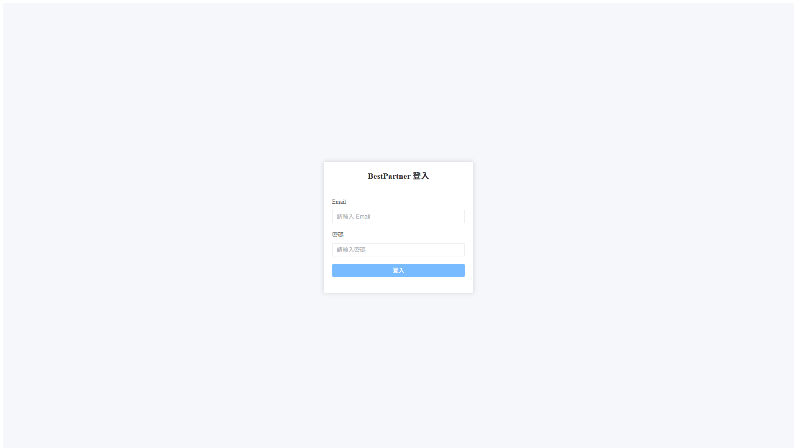<br><br>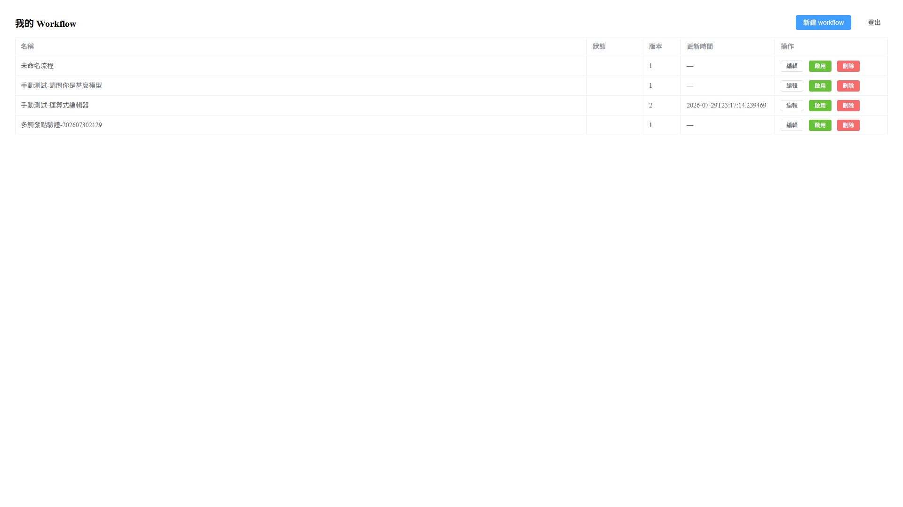 |
| J1-03 | P1 | 已登入訪 `/login` | 導回首頁 `/` | ✅ | 帶 token 直接 `goto /login`，1.2 秒後 URL 為 `http://localhost:4173/`。<br>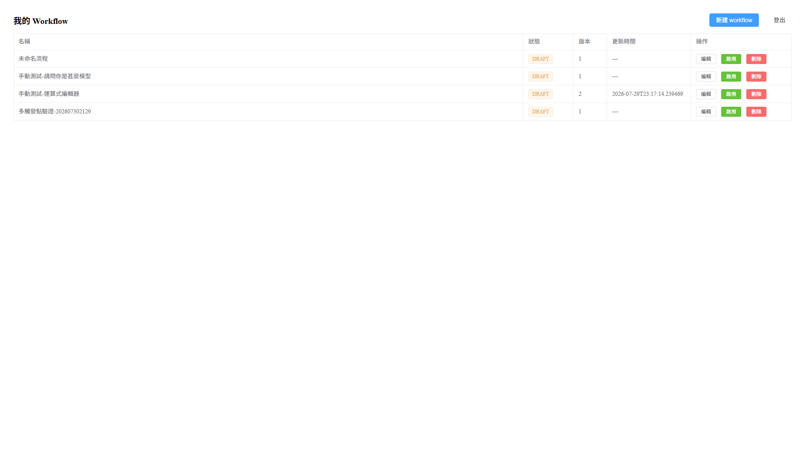 |
| J1-04 | P1 | 錯誤帳密登入 | 停留 `/login`，顯示錯誤 | ❌ | **停留 `/login` 成立，但錯誤訊息從未呈現給使用者。** 送出後 `page.on('framenavigated')` 觀測到 **3 次整頁硬導航**（皆為 `/login`），`.el-message` 在 6 秒等待內**從未出現**（`elMessage=null`），且 email 欄位被清空（`emailFieldAfter=""`）——使用者只看到畫面一閃、欄位清空，得不到任何失敗原因。分流判定：**前端**（詳見「問題分流與修正紀錄」ISSUE-1）。<br><br>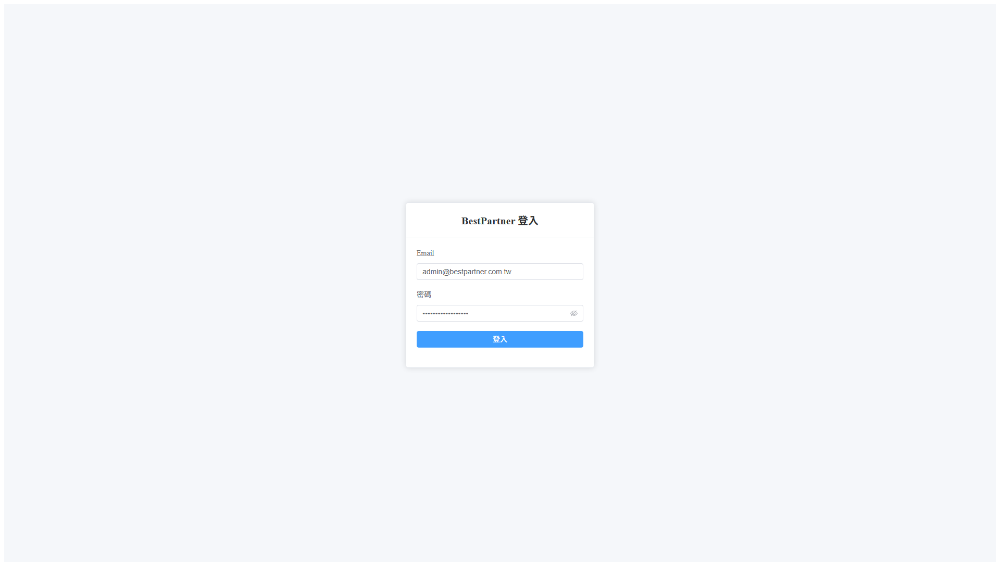<br><br> |
| J1-05 | P1 | 列表頁登出（`logout-button`） | 清 token 導向 `/login`；重訪受保護頁被導回登入 | ✅ | 點列表頁「登出」→ URL 轉 `/login`、`localStorage.token = null`；再訪 `/` 被導回 `/login`。<br><br>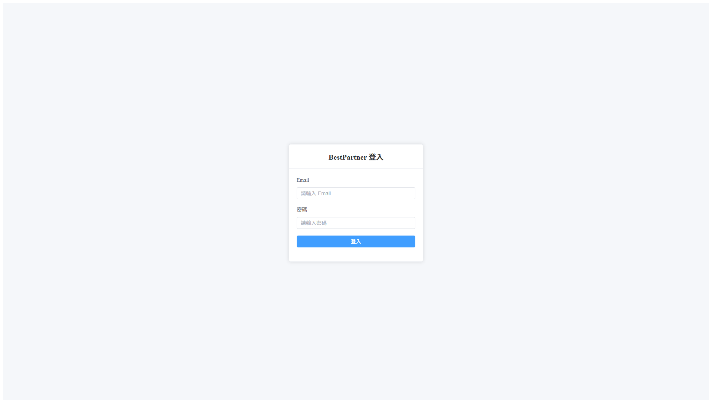<br> |
| J1-06 | P1 | 編輯器工具列登出（無未存，`logout-button`） | 清 token 導向 `/login`；per-user 快取一併清除 | ✅ | 先建 `e2e-J1-06-202608192201` 並**存檔至 `saved-badge` 出現**（確保無未存變更），再由編輯器工具列登出：**未跳確認框**（`confirmDialog=false`）、token 清空、導向 `/login`。per-user 快取斷言：登出前選取 LLM 節點觸發 `/llm/setting/get` **1 次**；重新登入並重開同一流程再選 LLM 節點，**再次發出**該請求（累計 2 次），證明 `clearNodeOptionsCache()` / `invalidateSettingsCache()` 已生效（module-scope 快取被清）。<br><br>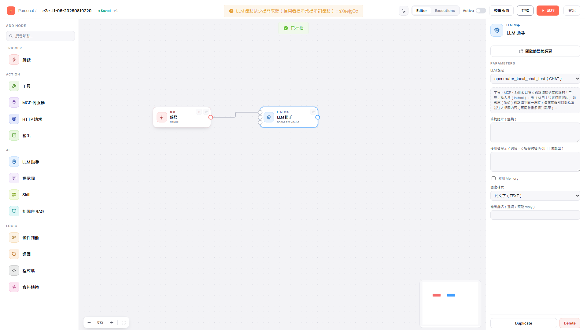<br><br> |
| J1-07 | P1 | 編輯器有未存變更登出 → 確認框選「登出」 | 先跳「尚未存檔」確認；確認後清 token 導向 `/login` | ✅ | 拖入節點後工具列顯示 `dirty-badge` = 「● 未存」；點登出跳出「尚未存檔／有未存變更，確定要登出嗎？」，選「登出」後 token 清空並導向 `/login`。<br><br><br> |
| J1-08 | P1 | 編輯器有未存變更登出 → 確認框選「取消」 | 留在編輯器且仍為登入態（token 未清） | ✅ | 同樣情境選「取消」：URL 仍為 `/editor`、`localStorage.token` 仍在、畫布節點數維持 1，可續編輯。<br><br>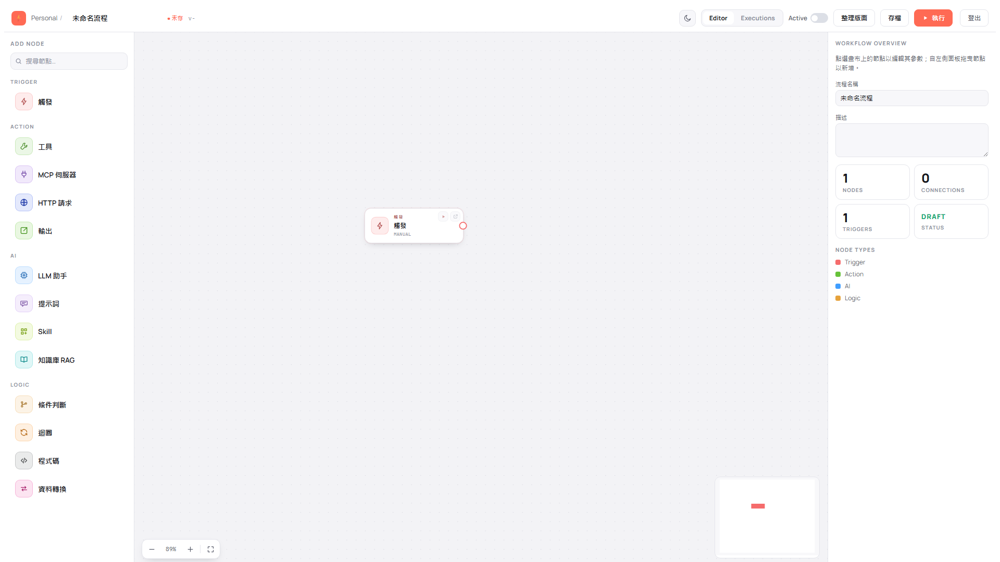<br> |
| J1-09 | P2 | token 清除後訪受保護頁 | 導回 `/login` | ✅ | 於編輯器中直接 `localStorage.removeItem('token')` 後訪 `/`，被導回 `/login`。<br><br> |

### J2 Workflow 列表（P0/P1）

> 執行產物：`final_runs/run_3`。本次建立並於案例內刪除的流程：`e2e-J2-02-202608192201`（`0336ec83-…`）。

| 案例 | 優先 | 描述 | 預期 | 狀態 | 證據 / 備註 |
|------|:---:|------|------|:---:|------|
| J2-01 | P0 | 列表載入 | 顯示既有 workflow 清單 | ✅ | UI 表格 5 列，與 `GET /llm/workflow/list` 回傳 5 筆一致（逐列含名稱／狀態／版本／更新時間／操作鈕）。<br> |
| J2-02 | P0 | 建立新 workflow | 進 `/editor/:id`，DRAFT、version 1 | ✅ | 點 `create-button` → 進入 `/editor`（**無 id**）→ 命名 `e2e-J2-02-202608192201`、拖 TRIGGER＋OUTPUT 並連線 → 存檔後 `saved-badge` 出現。以 API 解析得 id `0336ec83-f9b6-43e9-acc5-4c486d574412`，`GET workflow/get` 回 **status=DRAFT、version=1**。<br>⚠️ **URL 於存檔後仍不帶 id**（`urlHasId=false`）——此為已載於 `e2e-test-plan.md` §14-11／§15-10 的既有行為（`create-button` 不呼叫後端、id 須存檔後再解析），非本次新發現；案例的「進 `/editor/:id`」措辭與現況不符，已列入文件同步待辦。<br><br><br> |
| J2-03 | P1 | 點列表項進編輯器 | 載入完整定義 | ✅ | 由列表點 `edit-0336ec83…` → URL 轉 `/editor/0336ec83-…`，畫布還原 **2 節點、1 edge**，流程名稱欄還原為 `e2e-J2-02-202608192201`。<br><br> |
| J2-04 | P1 | 刪除 workflow | 列表移除，連鎖刪 node/edge | ✅ | 點 `delete-0336ec83…` → 確認框 → 列表由 **6 列降為 5 列**；`POST workflow/get` 對該 id 回 **400 `Workflow not found`**，`workflow/list` 回 5 筆，確認已連鎖刪除。<br><br><br>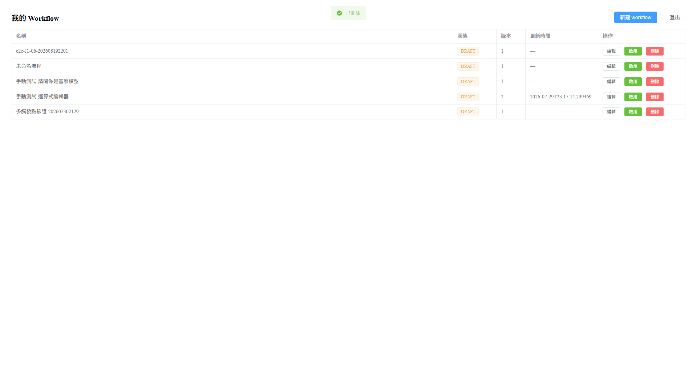 |

### J3 畫布編輯（P0）

> 執行產物：`final_runs/run_4`。建立兩條流程：
> `e2e-J3-202608192201`（`89d35f22-…`，9 節點／8 edge，涵蓋 J3-01～J3-08）與
> `e2e-J3-09-202608192201`（`644781f2-…`，5 節點／5 edge，涵蓋 J3-09，並留作 J5 分支測試用）。
> 連線一律「每連一條就斷言 edge 數」（`before`/`after`），避免競態誤判（§11-4）。

| 案例 | 優先 | 描述 | 預期 | 狀態 | 證據 / 備註 |
|------|:---:|------|------|:---:|------|
| J3-01 | P0 | 拖拉節點入畫布（TRIGGER/LLM_ASSISTANT/OUTPUT） | 節點出現，nodeKey 唯一 | ✅ | HTML5 原生 DnD 合成事件拖入 3 個節點，`.vue-flow__node` 計數 = 3，nodeKey `lBNtr1sz` / `21boVY1N` / `mpFMtjcU` 三者互異。<br> |
| J3-02 | P0 | 連線 edge | edge 建立，兩端點存在 | ✅ | TRIGGER `out:main`→LLM `in:main`（edge 0→1）、LLM `out:main`→OUTPUT `in:main`（1→2）；Overview 顯示 `2 CONNECTIONS`。<br> |
| J3-03 | P0 | 選節點於 Inspector 填 config | 表單值寫回節點 | ✅ | 選 LLM 節點 → `llm-select` 選 `583b9222-…`、`user-prompt` 填字；節點卡副標 `node-subtitle` 同步顯示 `583b9222-…`，證明值已寫回 `node.data.config`。<br>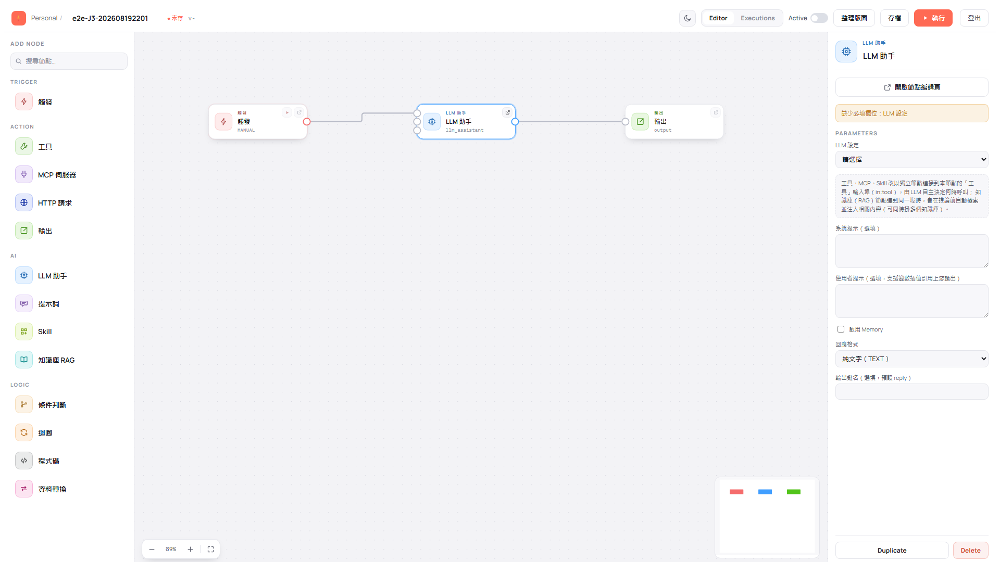<br>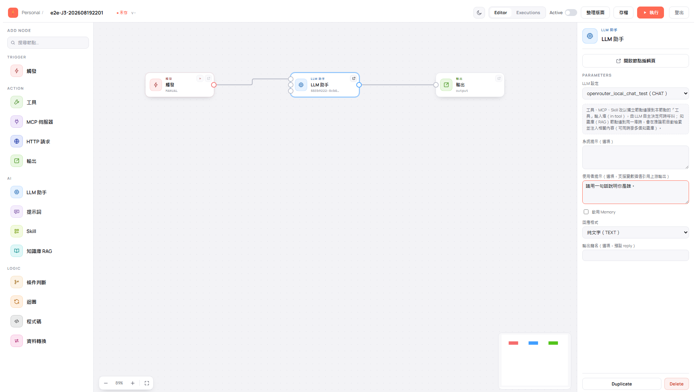 |
| J3-04 | P0 | save 整張覆寫 | version+1 | ✅ | 第一次存檔後 `workflow/get` 回 **version=1**；改動 `userPrompt` 再存 → **version=2**（nodes 3、edges 2 不變），確認樂觀鎖版本遞增與整張覆寫。<br>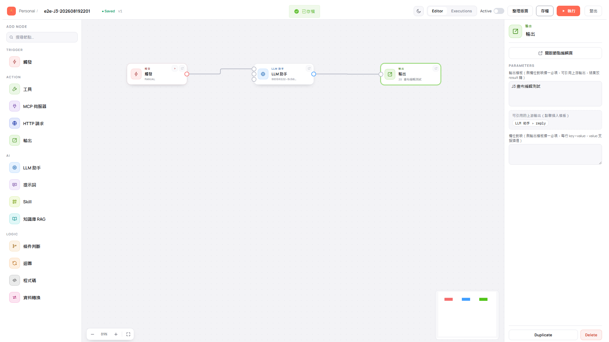<br>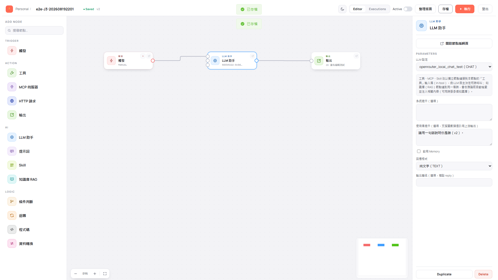 |
| J3-05 | P1 | 重整頁面 get 還原 | 畫布與 Inspector 與存檔一致 | ✅ | 重新 `goto /editor/89d35f22-…`：畫布還原 3 節點／2 edge；選 LLM 節點後 Inspector 的 `llm-select` = `583b9222-…`、`user-prompt` = 「請用一句話說明你是誰（v2）。」與存檔一致。<br><br> |
| J3-06 | P0 | 能力掛載：TOOL / MCP_SERVER / SKILL / **KNOWLEDGE_RAG** 的 `out:main` 連 LLM `in:tool` 並 save | edge 建立（`targetHandle=in:tool`）；重載後連線保留 | ✅ | 四種能力節點各連一條，edge 由 2→6 逐條成立；填妥必填 config（TOOL=TavilySearch＋toolSettingId、MCP=google_map＋`searchPlaces`＋userSettingId、SKILL=pdf、RAG=`e2e-scb-tnc-202607272132`）後存檔。`workflow/get` 回 6 條 edge，其中 **`targetHandle=in:tool` 恰 4 條**（另 2 條為 `in:main`）。重載後畫布 **7 節點／6 edge** 完整還原。<br>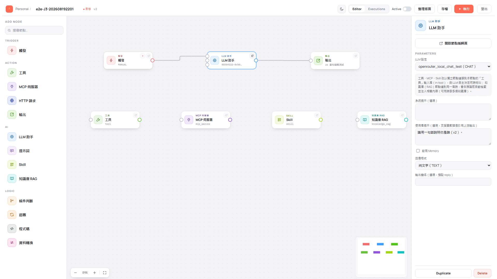<br>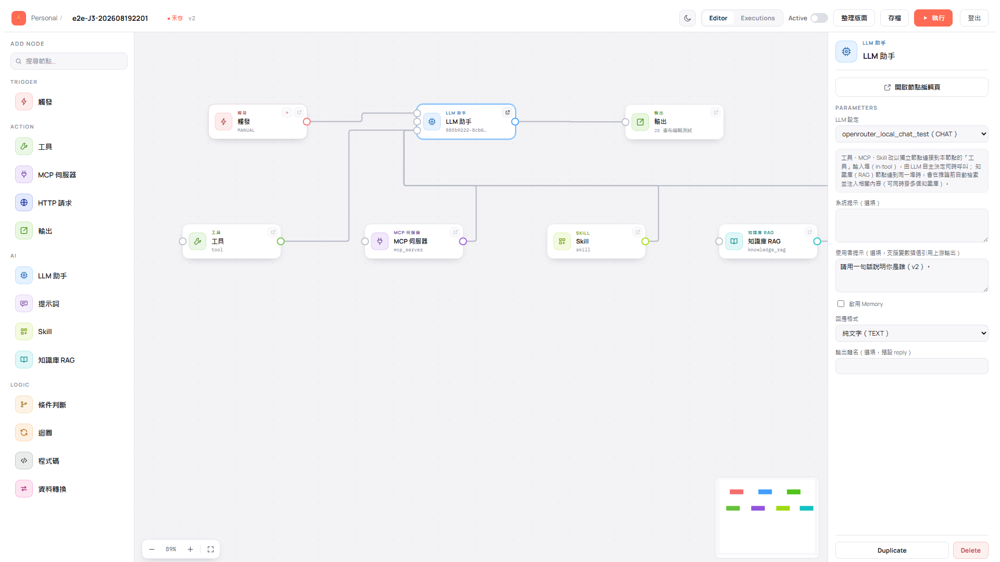<br>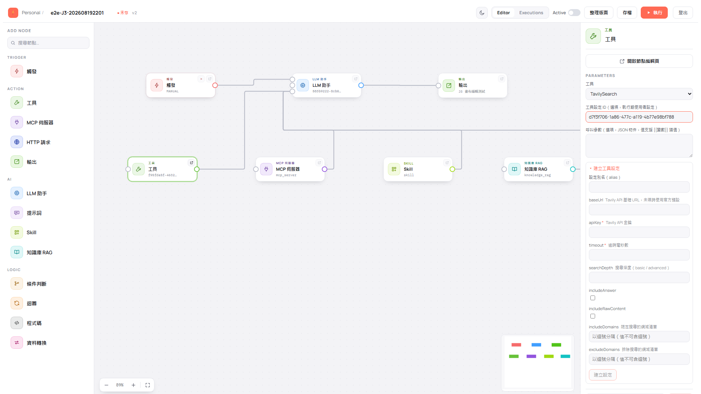<br>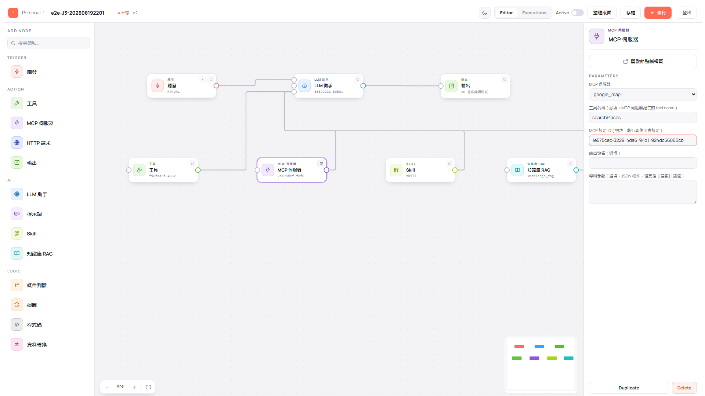<br><br><br><br> |
| J3-07 | P1 | 多個 KNOWLEDGE_RAG 同時掛同一 LLM 的 `in:tool` | 皆放行、無相容性 toast；CONNECTIONS 計數與 edge 數一致 | ✅ | 第 2 個 KNOWLEDGE_RAG 連上同一 `in:tool` 埠：連線成立、**toast 監看陣列為空**（無相容性警告）；Overview `7 CONNECTIONS` ＝ `.vue-flow__edge` 計數 7；存檔後 DB 的 `in:tool` edge 為 **5 條**。<br>⚠️ 本機 `getKnowledgeStore` 目前只列得出 1 個知識庫（`e2e-scb-tnc-202607272132`；另一筆 `e2e-scb-tnc-0724` 無 `llm_doc` 紀錄故不列出），兩個 RAG 節點指向同一知識庫，仍足以驗證「多個 RAG 同掛同一埠」的連線契約。<br><br>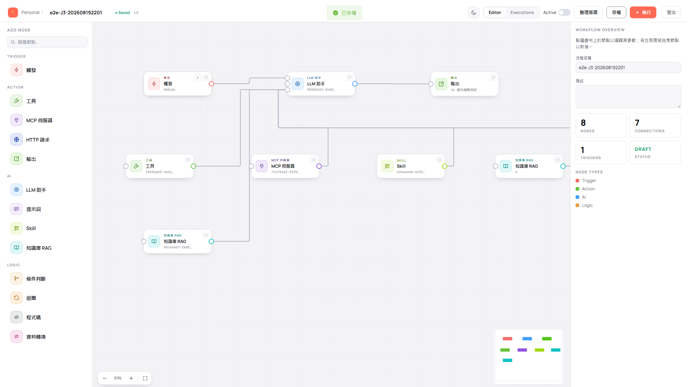 |
| J3-08 | P1 | 提示接線：PROMPT 的 `out:main` 連 LLM `in:prompt` 並 save | edge 建立（`targetHandle=in:prompt`）；重載後連線保留 | ✅ | PROMPT → LLM `in:prompt` 連線成立、無 toast；存檔後 DB 中 `targetHandle=in:prompt` **恰 1 條**；重載後畫布 **9 節點／8 edge** 完整還原。<br><br><br> |
| J3-09 | P1 | 兩個 PROMPT 各接 CONDITION 的 `out:true`/`out:false`，再同時連同一 LLM 的 `in:prompt` | 皆放行、無相容性 toast；CONNECTIONS 計數與 edge 數一致 | ✅ | 另建 `e2e-J3-09-202608192201`：TRIGGER→CONDITION、CONDITION `out:true`→PROMPT1、`out:false`→PROMPT2，兩個 PROMPT 再各連 LLM `in:prompt`——**5 條 edge 逐條成立、toast 為空**；Overview `5 CONNECTIONS` ＝ UI edge 數 5。<br><br><br>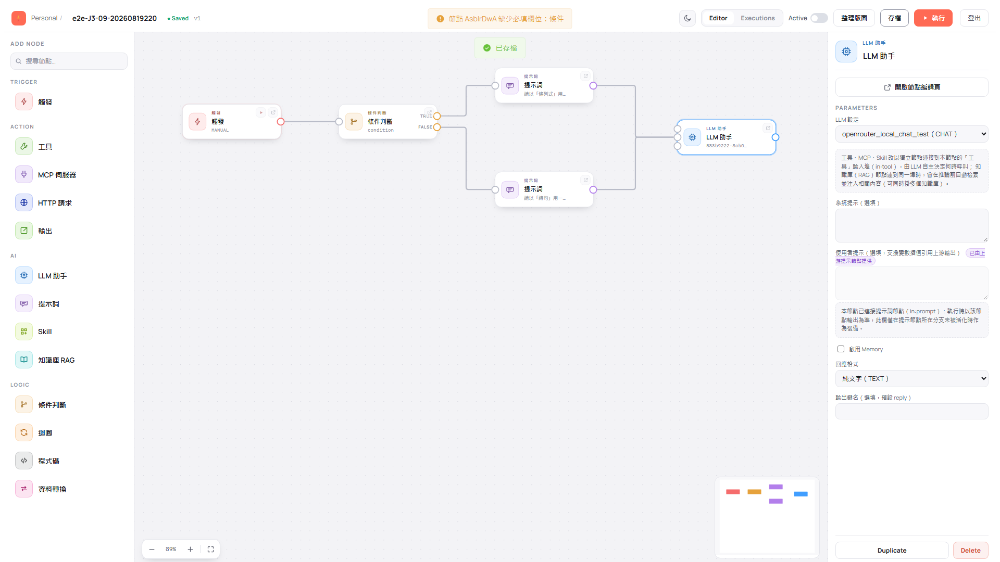 |

### J4 驗證與啟用（P1）

> 執行產物：`final_runs/run_5`（J4-01～J4-04、J4-06～J4-12）、`run_6`（J4-05 重測）。
> 全部在同一條流程 `e2e-J4-202608192201`（`03a6cf4f-…`）上逐步變形驗證；
> 每個案例皆以「UI toast 實際文字 ＋ `workflow/get` 的 status」雙重佐證。

| 案例 | 優先 | 描述 | 預期 | 狀態 | 證據 / 備註 |
|------|:---:|------|------|:---:|------|
| J4-01 | P1 | 缺 TRIGGER 啟用 | 400，對應訊息 | ✅ | 圖為 `LLM→OUTPUT`（無 TRIGGER），存檔成功後切 Active：toast **`An active workflow must contain a Trigger node`**，`workflow/get` 狀態維持 **DRAFT**。<br><br> |
| J4-02 | P1 | 圖有環啟用 | 400，對應訊息 | ✅ | 造環（`LLM→LLM2`＋`LLM2→LLM`，edge 2→3→4 皆成立）後按存檔：**存檔即被擋下**，toast **`畫布存在有向環，請移除循環連線`**，狀態維持 INACTIVE。<br>⚠️ **實際把關點在 `workflow/save` 而非 `switchStatus`**——有環的圖根本存不進 DB，因此「帶環的圖去啟用」在 UI 上不可達（第一道防線更早）。此與 `api-endpoints.md` 對 `save` 的描述（存檔前驗證「無環」）一致；案例文字寫成「啟用時 400」屬計畫措辭與現況的落差，已列入文件同步待辦。移除造環節點後存檔恢復正常。<br><br><br> |
| J4-03 | P1 | 缺必填 config 啟用（如缺 llmId） | 400，`workflow.node.config.required.missing`，顯示 nodeKey+欄位 | ✅ | 把 LLM 節點的 `llm-select` 清空存檔後啟用：toast **`Node RBYJibh4 is missing required config fields: llmId`**——**同時含 nodeKey（`RBYJibh4`）與缺漏欄位名（`llmId`）**，狀態維持 INACTIVE。<br>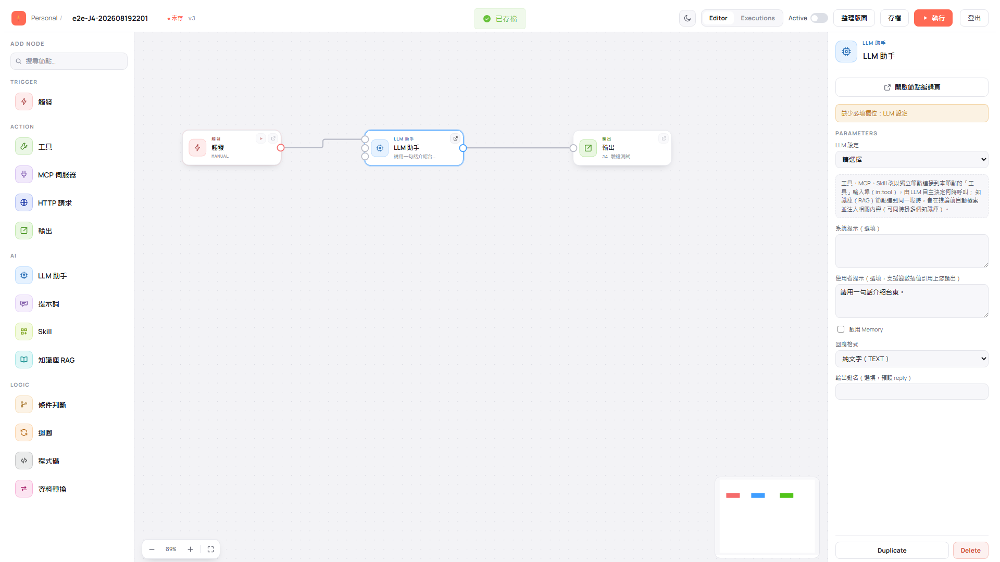<br>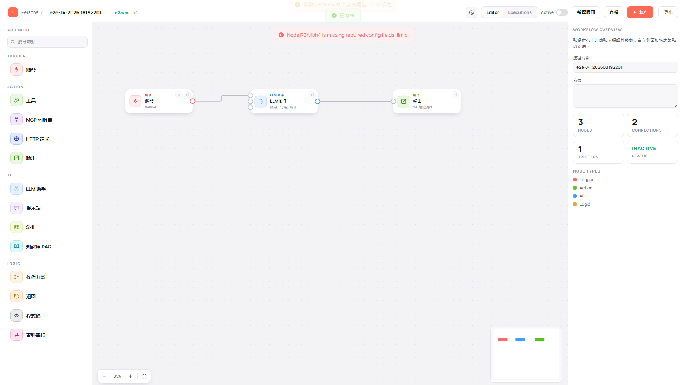 |
| J4-04 | P1 | 合法圖 switchStatus 啟用 | 狀態轉 ACTIVE | ✅ | 補上 TRIGGER 並連線後啟用：toast「流程已啟用」，`workflow/get` 狀態 **ACTIVE**；再切回停用得「流程已停用」、狀態 INACTIVE（停用不跑圖驗證）。<br><br> |
| J4-05 | P1 | **非能力來源節點**拉線到 LLM `in:tool` | `onConnect` 即擋：toast，**edge 不建立**；併測對照組 | ✅ | HTTP_REQUEST → LLM `in:tool`：toast **`僅工具、MCP、Skill、知識庫節點可連到 LLM 的工具埠`**，edge 數 **5→5 不變**（`onConnect` 當下即擋，edge 根本沒建立）。**對照組**：同一 `in:tool` 埠改由 TOOL（TavilySearch）連入 → 成功，edge **5→6**、無任何 toast。<br>⚠️ 首輪（run_5）此案例判 ❌ 為**測試腳本問題**：節點放在 x=1450，其 `out:main` handle 落在右側 Inspector 面板底下取不到 boundingBox（§11-4／§13-7 占位陷阱），連拉線都沒觸發。run_6 改放左側安全區後即通過，**非產品缺陷**。<br>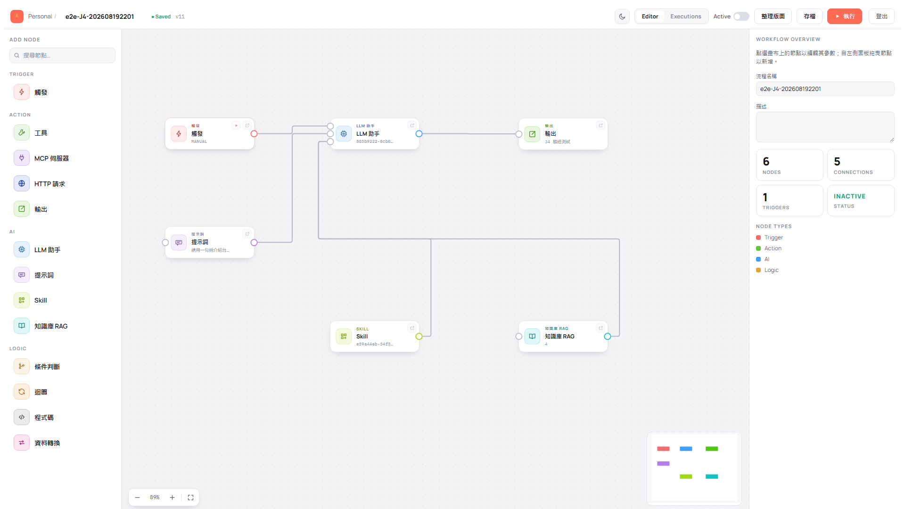<br>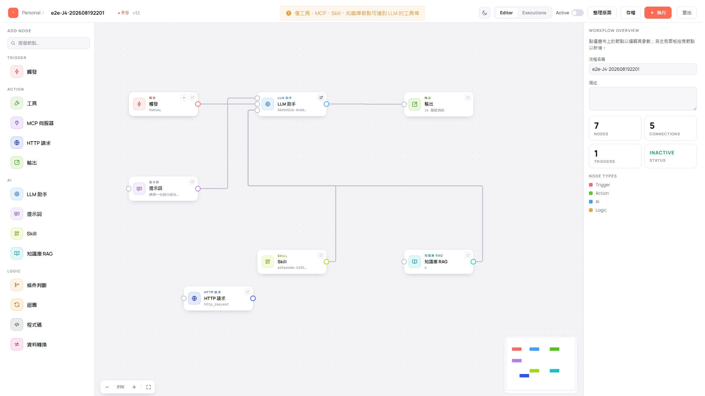<br>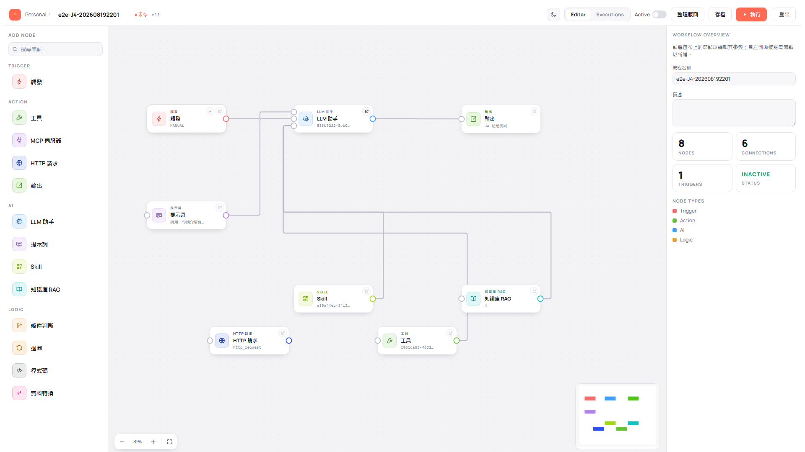 |
| J4-06 | P1 | KNOWLEDGE_RAG 掛 `in:tool`（外掛模式）且 `query` / `embeddingModelId` 留空即啟用 | **啟用成功**（外掛模式僅需 `knowledgeId`） | ✅ | RAG 節點只選 `knowledge-id`，實測 `query` 欄位值 `""`、`embedding-model-select` 值 `""`（皆空）；連 `in:tool` 後啟用 → toast「流程已啟用」、狀態 **ACTIVE**，**未回 `required.missing`**，確認外掛模式必填契約成立。<br><br><br> |
| J4-07 | P1 | 孤兒 SKILL 節點（未連任何 LLM `in:tool`）save → 啟用 | save 放行；switchStatus 回 400 `workflow.skill.node.not.mounted`（含 nodeKey），狀態仍 DRAFT | ✅ | SKILL 節點選好 `skillId`（pdf）但不連線：**存檔放行**（狀態仍 INACTIVE）；啟用被擋，toast **`SKILL node "sVDc9AyK" must be connected to an LLM assistant nodes tool input port (in:tool)`**（含 nodeKey），開關維持關閉、狀態未轉 ACTIVE。<br>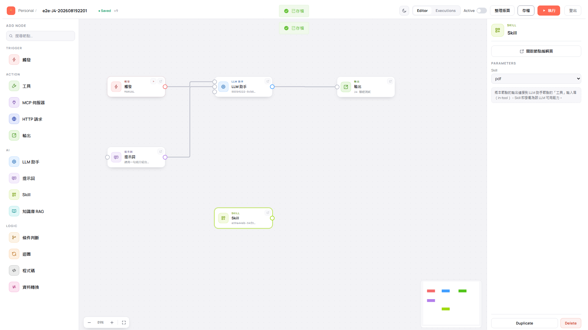<br>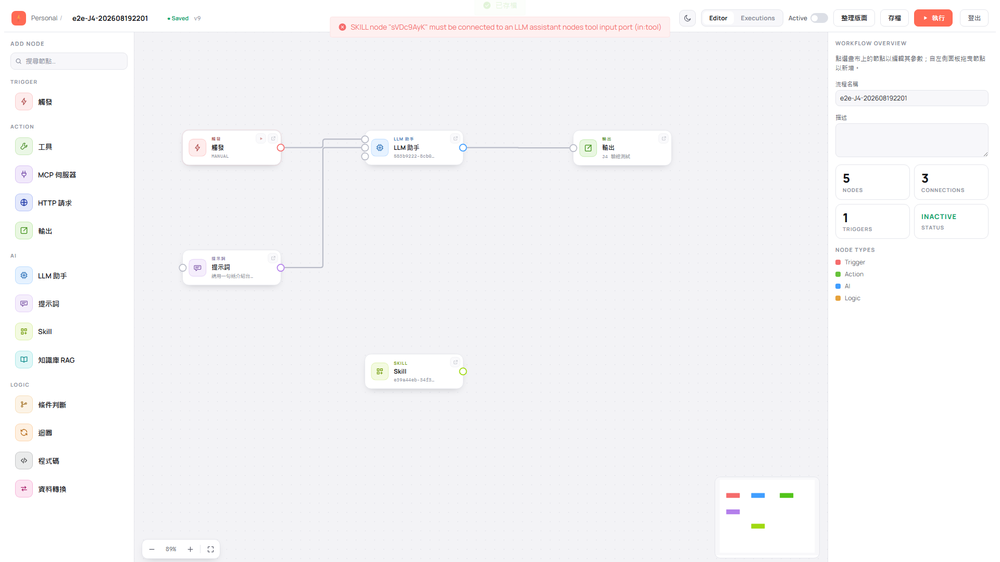 |
| J4-08 | P1 | SKILL 已掛載到 LLM `in:tool` 後啟用（J4-07 對照組） | 啟用成功，狀態轉 ACTIVE | ✅ | 補上 SKILL → LLM `in:tool` 邊後啟用：toast「流程已啟用」、狀態 **ACTIVE**。<br><br> |
| J4-09 | P1 | **非 PROMPT 節點**拉線到 LLM `in:prompt`（如 TRIGGER） | `onConnect` 即擋：toast，**edge 不建立** | ✅ | TRIGGER → LLM `in:prompt`：toast **`僅提示詞節點可連到 LLM 的提示埠`**，edge 數不變（delta = 0）。<br>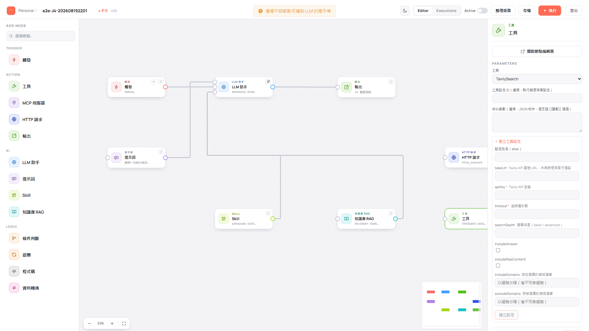 |
| J4-10 | P1 | 孤兒 PROMPT 節點（未連任何 LLM `in:prompt`）save → 啟用 | save 放行；switchStatus 回 400 `workflow.prompt.node.not.connected`（含 nodeKey），狀態仍 DRAFT | ✅ | PROMPT 節點填好 `prompt` 但不連線：**存檔放行**；啟用被擋，toast **`PROMPT node "zPVfNT8T" must be connected to an LLM assistant nodes prompt input port (in:prompt)`**（含 nodeKey），狀態未轉 ACTIVE。<br><br>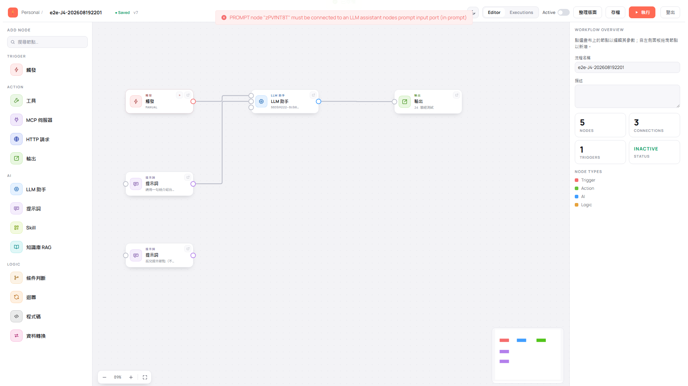 |
| J4-11 | P1 | LLM `userPrompt` 留空且無 PROMPT 連入時啟用 | **400** `workflow.llm.prompt.required`（含 LLM 的 nodeKey），狀態仍 DRAFT | ✅ | 還原 `llmId` 但清空 `user-prompt`、且無 PROMPT 連入：toast **`LLM assistant node "RBYJibh4" must have userPrompt filled, or a PROMPT node connected to its prompt input port (in:prompt)`**（含 LLM 的 nodeKey），狀態維持 INACTIVE。<br>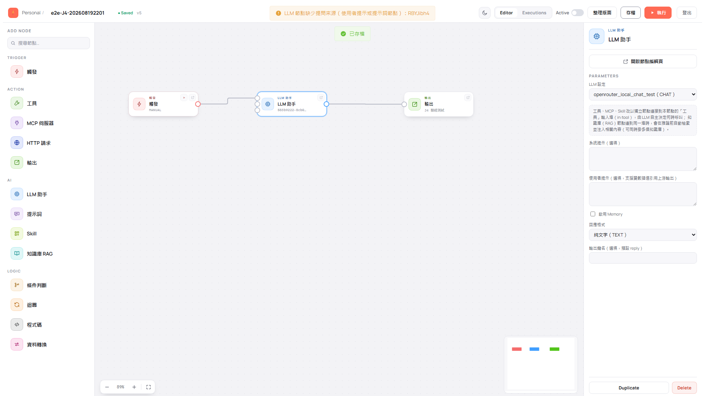<br>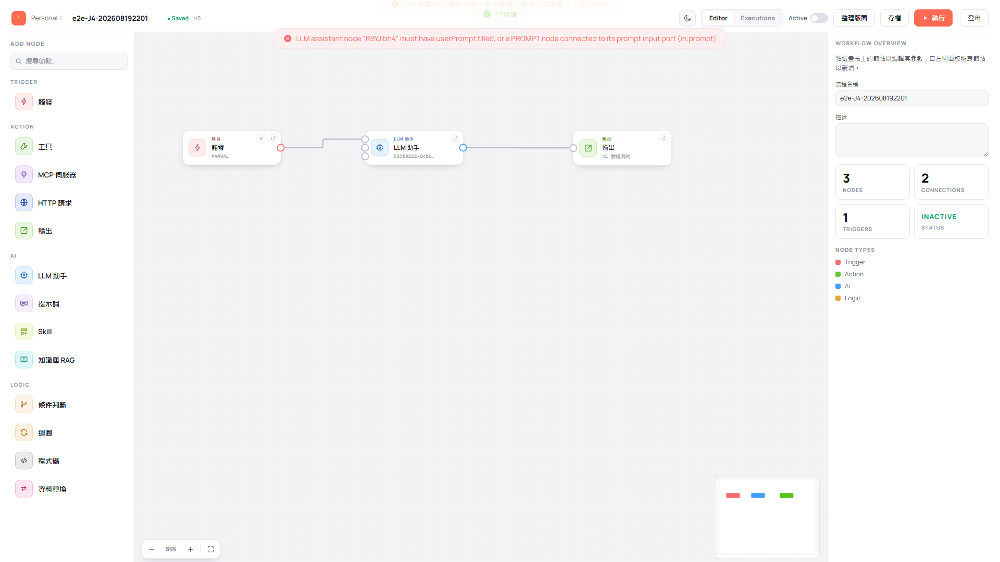 |
| J4-12 | P1 | LLM `userPrompt` 留空但已有 PROMPT 連入（J4-10/11 對照組） | 啟用成功，狀態轉 ACTIVE | ✅ | 在 `user-prompt` 仍為空的前提下加入 PROMPT 並連 `in:prompt`：啟用成功、toast「流程已啟用」、狀態 **ACTIVE**——證明提問來源可完全由 PROMPT 節點提供。<br>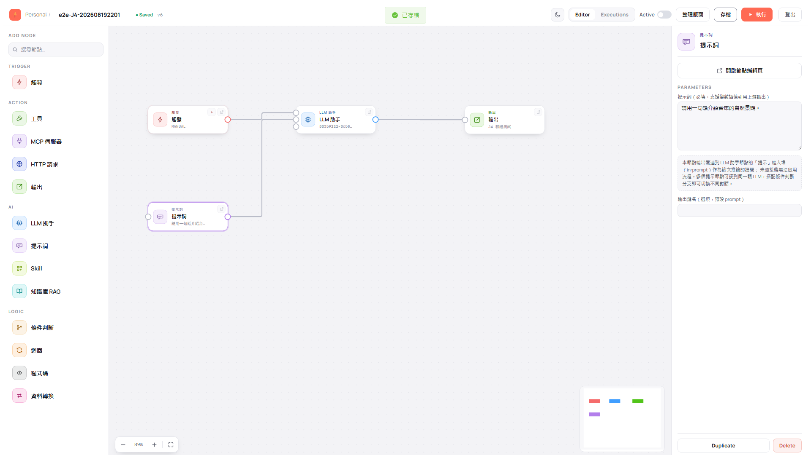<br> |

> ⚠️ **KNOWLEDGE_RAG 兩種模式的必填欄位相反，勿寫反預期**：
> 掛 LLM `in:tool`＝外掛模式，僅需 `knowledgeId`；連一般 `in:main`＝pipeline 模式，另需 `query`。
> 白名單事實來源：後端 `WorkflowEngine.CAPABILITY_SOURCE_TYPES` ≡ 前端 `useGraphValidation.CAPABILITY_SOURCE_TYPES`。

> ⚠️ **`in:prompt` 與 `in:tool` 語義相反，勿寫反預期**：
> `in:tool` 允許 TOOL/MCP_SERVER/SKILL/KNOWLEDGE_RAG，**非資料流**（純能力節點不執行、不落紀錄）；
> `in:prompt` 只允許 PROMPT，**是資料流**（參與活化，來源節點照常執行並落紀錄）。
> 驗證順序：必填欄位 → 孤兒 SKILL → 孤兒 PROMPT → LLM 無提問來源。本輪實測順序與此一致
> （J4-03 缺 `llmId` 時先回 REQUIRED_MISSING，補齊後才輪到 J4-11 的提問來源檢查）。

### J5 執行 workflow（P0，真實 LLM）

> 執行產物：`run_7`（J5-01/06/08/09）、`run_8`（J5-02/03）、`run_9`（J5-04/05）、
> `run_10`（J5-07）、`run_11`（J5-10 與 J5-11/12 功能面）、`run_12`（J5-11/12 視覺 skipped 標記重測）。
> 使用 LLM：OpenRouter `deepseek/deepseek-v3.2`（`583b9222-…`）。
> DB 斷言一律直連 Postgres 查 `llm_workflow_execution` / `llm_workflow_node_execution`。

| 案例 | 優先 | 描述 | 預期 | 狀態 | 證據 / 備註 |
|------|:---:|------|------|:---:|------|
| J5-01 | P0 | 合法 workflow（TRIGGER→LLM_ASSISTANT→OUTPUT）execute | SSE `started`→`node.*`→`completed(SUCCESS)`；DB 寫入 execution / node_execution | ✅ | `e2e-J5-202608192201`（`458d2ad1-…`）執行：Drawer 狀態 **SUCCESS**、輸出 `{"result":"使用者提示"}`。DB：execution `3437a8f5-…` status=**SUCCESS**、`trigger_type=MANUAL`、`trigger_node_key=PN5ovwZx`；`node_execution` **恰 3 筆**（TRIGGER／LLM_ASSISTANT／OUTPUT）皆 SUCCESS。<br><br>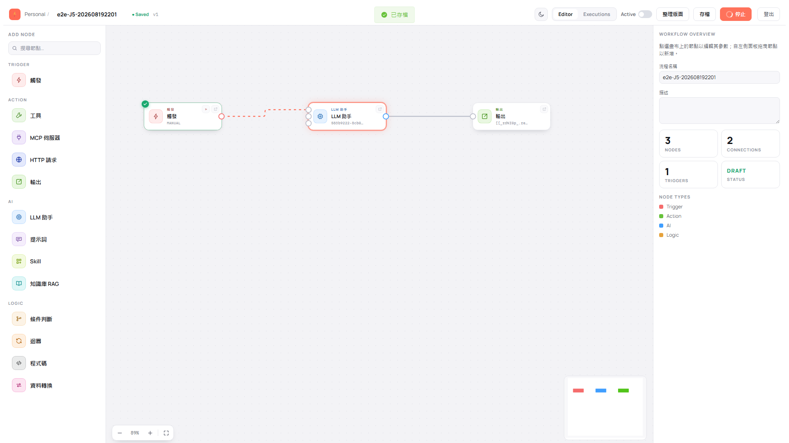<br> |
| J5-02 | P1 | 節點設定錯誤導致失敗 | 該節點 `node.failed` 顯示錯誤，執行標記失敗 | ✅ | `e2e-J5-02-202608192201`：TRIGGER→HTTP_REQUEST（`http://127.0.0.1:9/never-reachable`）→OUTPUT。Drawer 狀態 **FAILED**；DB：HTTP_REQUEST 節點 status=**FAILED**、`error_message=Failed to connect to /127.0.0.1:9`，下游 OUTPUT 為 **SKIPPED**，整體 execution **FAILED**。<br>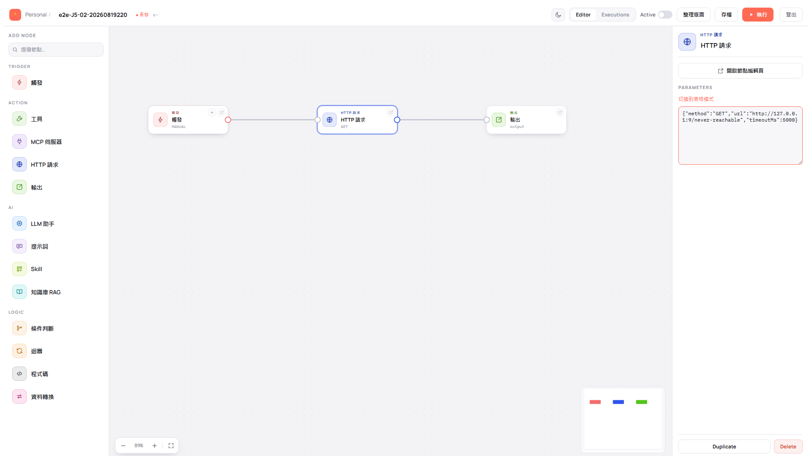<br>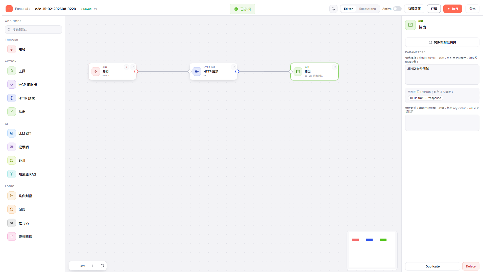<br>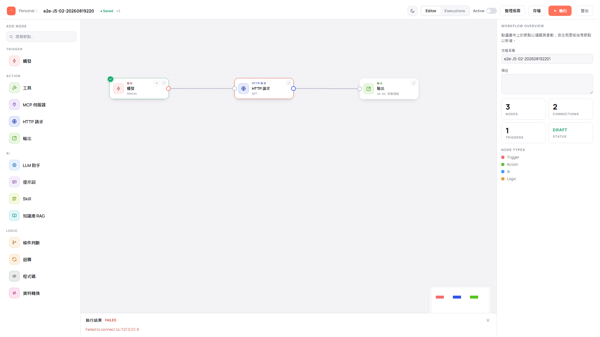 |
| J5-03 | P1 | 執行中途 client 斷線 | 執行 `CANCELLED`，下游未執行節點 `SKIPPED` | ✅ | `e2e-J5-03-202608192201`：以長文提示讓 LLM 節點跑久一點，開跑 2.5 秒後**離開編輯器頁**（`onBeforeUnmount` → `executionStore.stop()` 中止 SSE）。15 秒內 DB 即收斂：execution status=**CANCELLED**，OUTPUT 節點 **SKIPPED**（LLM 節點本身已跑完記 SUCCESS）。<br>ℹ️ 與 202607312223 週期的 ISSUE-4（關瀏覽器致長時間停留 RUNNING）不同：**頁內導航會確實中止 SSE**，狀態立即收斂。<br>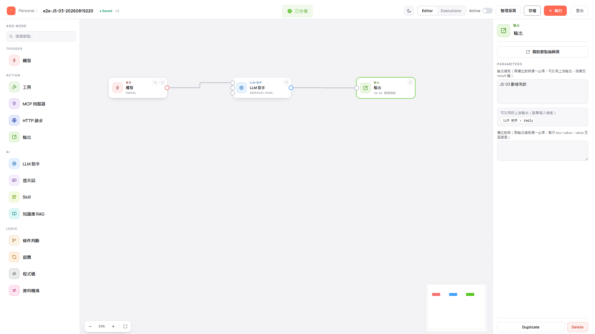<br>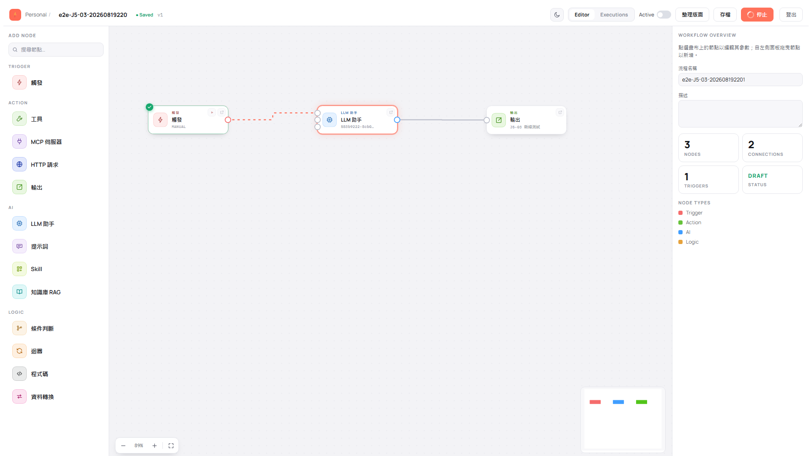<br><br>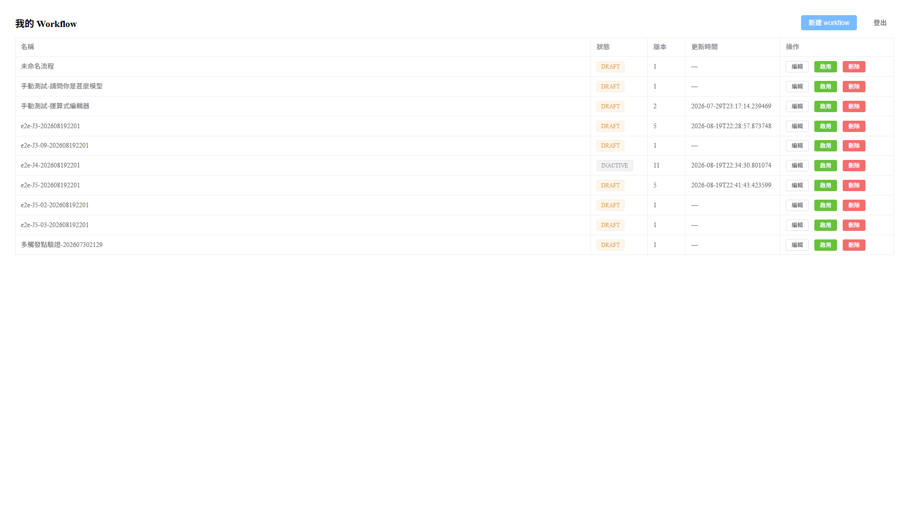 |
| J5-04 | P1 | 外掛型 RAG：KNOWLEDGE_RAG 以 `out:main → LLM in:tool` 掛載後 execute | 推論前自動檢索注入；**不產生**獨立節點事件、`node_execution` 無其紀錄 | ✅ | `e2e-J5-04-202608192201`（`9e1ebc87-…`）：RAG 節點（`oliSlb3W`，僅選 knowledgeId）掛 `in:tool`。執行 SUCCESS，`node_execution` **恰 3 筆**（TRIGGER／LLM／OUTPUT），**無 `KNOWLEDGE_RAG` 型別列**。UI 佐證：點 RAG 節點 Inspector **無** `node-exec-section`（計數 0），點 LLM 節點則有（計數 1）。輸出為 `{"result":"20歲"}`——**文件事實而非民法常識 18 歲**，佐證注入確實生效（正確性斷言歸 J8-B）。<br><br><br><br> |
| J5-05 | P1 | Agent 模式：TOOL / MCP_SERVER / SKILL 以 `out:main → LLM in:tool` 掛載後 execute | LLM 可自主呼叫掛載工具並回覆；能力節點**不產生**獨立節點事件、`node_execution` 無其紀錄 | ✅ | `e2e-J5-05-202608192201`（`bce090f7-…`）：TOOL(DateTool)／MCP_SERVER(google_map＋userSettingId)／SKILL(pdf) **三者同時**掛 `in:tool`（edge 2→3→4→5 逐條成立）。執行 SUCCESS，輸出 `{"result":"2026-08-19 22:47:03"}`——**與執行當下實際時間一致，證明模型真的呼叫了 `getCurrentTime`**（非臆造）。`node_execution` **恰 3 筆**，`capabilityTypesInDb` 為空陣列（無 TOOL／MCP_SERVER／SKILL 列）；點 TOOL 節點 Inspector 無 `node-exec-section`。<br>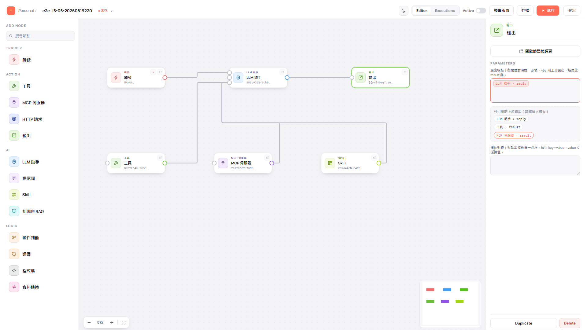<br><br>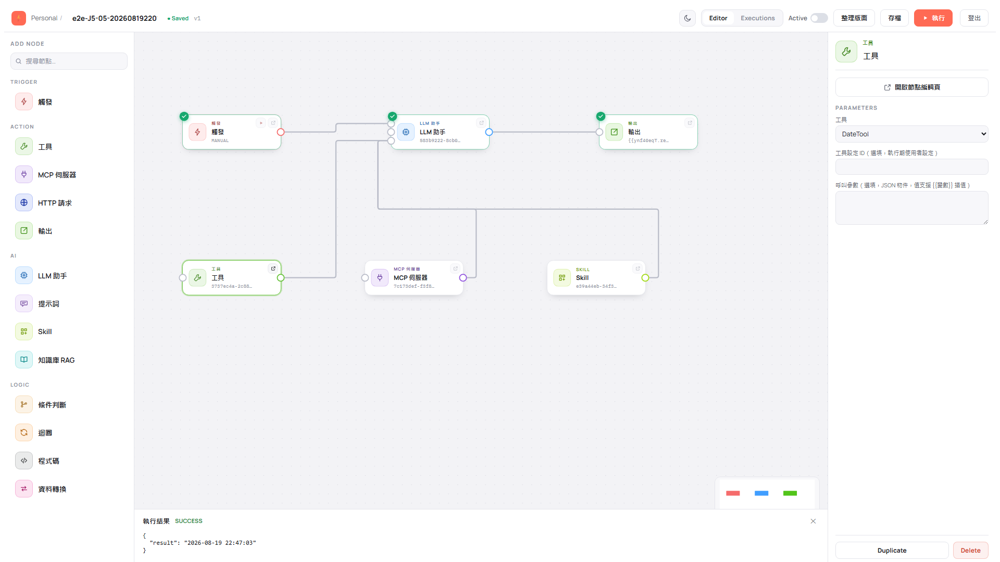 |
| J5-06 | P1 | 提示節點驅動：PROMPT → `LLM in:prompt` → OUTPUT（LLM `userPrompt` 留空）execute | PROMPT **照常**產生節點事件與 `node_execution` 紀錄；LLM 以該提示回覆 | ✅ | 於 `458d2ad1-…` 加 PROMPT（`bOU2lp9m`）連 `in:prompt` 並清空 `user-prompt`：執行 SUCCESS，`node_execution` **4 筆**且含 `PROMPT / bOU2lp9m / SUCCESS`——**與能力節點相反，提示節點確實落紀錄**。輸出 `{"result":"提示節點"}` 對應 PROMPT 內容。<br><br>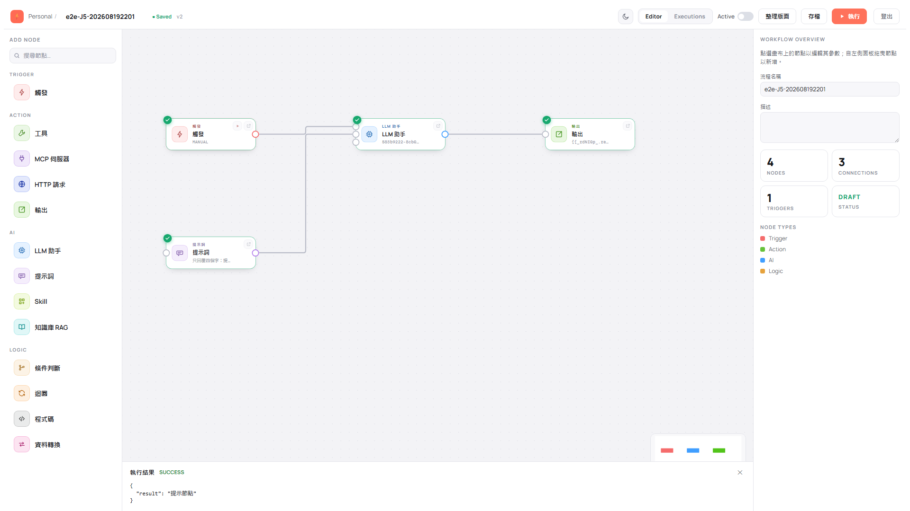 |
| J5-07 | P1 | 分支擇一：CONDITION 兩分支各接一 PROMPT 匯入同一 LLM 後 execute | 被活化分支的 PROMPT SUCCESS、另一顆 `node_execution` SKIPPED；回覆風格對應被活化那條 | ✅ | 沿用 `e2e-J3-09-202608192201`（`644781f2-…`），CONDITION config 設為恆真 `{"conditions":[{"left":"A","operator":"eq","right":"A"}],"logic":"and"}` 並補 OUTPUT。執行 SUCCESS：`node_execution` 中 `out:true` 側 PROMPT（`AByYvIen`）**SUCCESS**、`out:false` 側 PROMPT（`Q8CfvHyb`）**SKIPPED**；輸出 `{"result":"分支為真"}`，與被活化分支的提示一致。<br><br><br><br>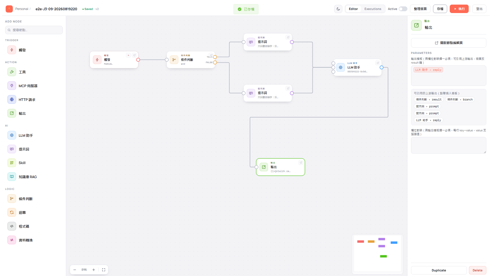<br><br> |
| J5-08 | P1 | 優先序：LLM 同時有 `userPrompt` 與 PROMPT 連入 | 以 PROMPT 輸出為準；刪掉 PROMPT 節點後改用 `userPrompt` | ✅ | 兩個來源刻意用可辨識文案（PROMPT →「提示節點」、userPrompt →「使用者提示」）。同時存在時輸出 `{"result":"提示節點"}`（**PROMPT 勝出**）；把 PROMPT 節點連同連線一起刪除後再執行，輸出轉為 `{"result":"使用者提示"}`。<br>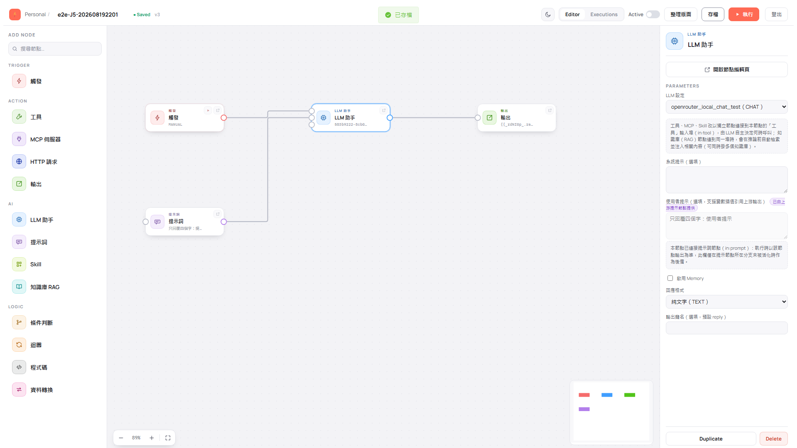<br><br><br> |
| J5-09 | P1 | execute 被後端擋下時檢視執行結果面板 | 顯示**後端業務訊息**（含 nodeKey 與應連往的埠），不得只顯示 `HTTP 400` | ✅ | 加入孤兒 PROMPT（`NyZNjJs6`）存檔後直接執行：Drawer 狀態 **FAILED**，錯誤文字為 **`PROMPT node "NyZNjJs6" must be connected to an LLM assistant nodes prompt input port (in:prompt)`**——含 nodeKey 與 `in:prompt` 埠名，**非**單純 `HTTP 400`。<br>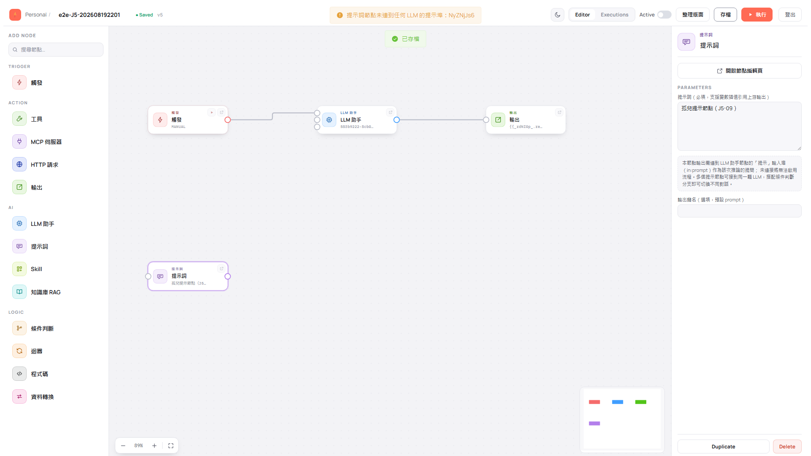<br>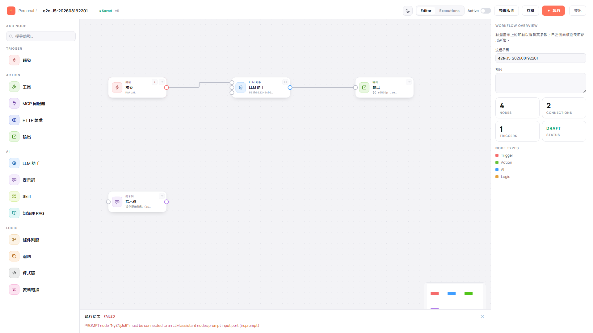 |
| J5-10 | P0 | 多觸發點：兩顆 TRIGGER 各接一分支匯流到同一 LLM，點工具列執行鈕 | 出現 `trigger-picker` 列兩個 `trigger-option-<nodeKey>`（顯示節點名稱），尚未開始執行 | ✅ | `e2e-J5-multi-trigger-202608192201`（`93b4c579-…`，t1=`g19jzgnO`／t2=`K9OLGb4N`）。點執行鈕後 `trigger-picker` 出現，內容為「選擇要執行的觸發點／只會執行該觸發點的流程，其餘觸發點不啟動／**觸發點一**／**觸發點二**／取消」，兩個 `trigger-option-<key>` 各 1 個；此時 `result-drawer` 不存在、DB `llm_workflow_execution` **0 筆**（確實尚未開跑）。另驗 `trigger-picker-cancel`：關閉面板且 execution 仍為 **0 筆**。<br><br><br>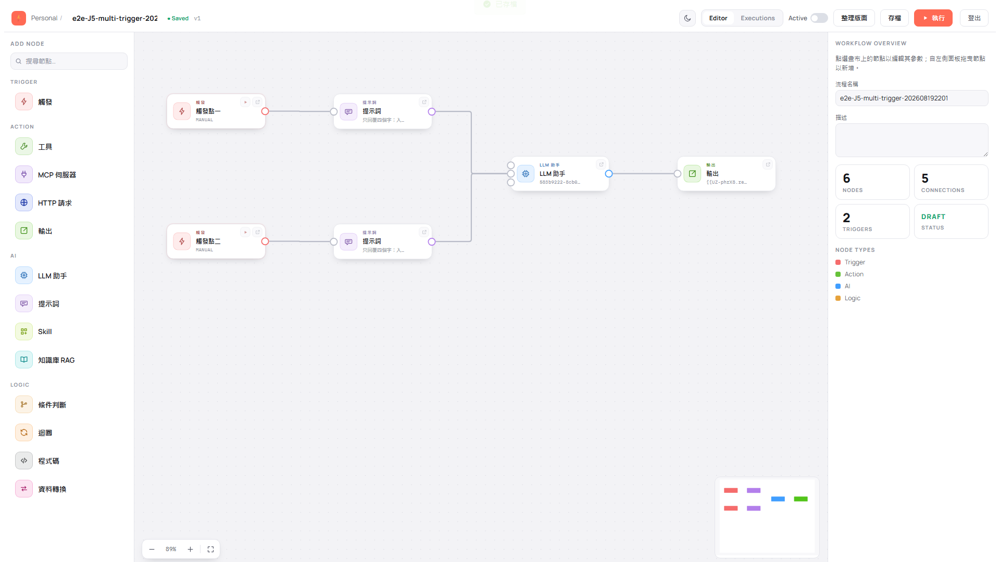 |
| J5-11 | P0 | 選定 t1 後執行 | 只有 t1 分支節點亮起；另一顆 TRIGGER 呈 `.is-exec-skipped`；`trigger_node_key`=t1 | ✅ | 選 `trigger-option-g19jzgnO`：執行中與結束後 t2 節點卡 class 皆為 **`workflow-node is-trigger is-exec-skipped`**、t1 為 `is-exec-success`。DB：`trigger_node_key=g19jzgnO`；`node_execution` 中 t2 與其下游 PROMPT 皆 **SKIPPED**，t1 分支 SUCCESS；輸出 `{"result":"入口為一"}`。<br>⚠️ 首輪（run_11）判 ❌ 為**測試腳本問題**：`is-exec-skipped` 掛在內層 `.workflow-node`（`WorkflowNode.vue:76`）而非外層 `.vue-flow__node`，選擇器寫錯；run_12 更正後通過，**非產品缺陷**。<br><br>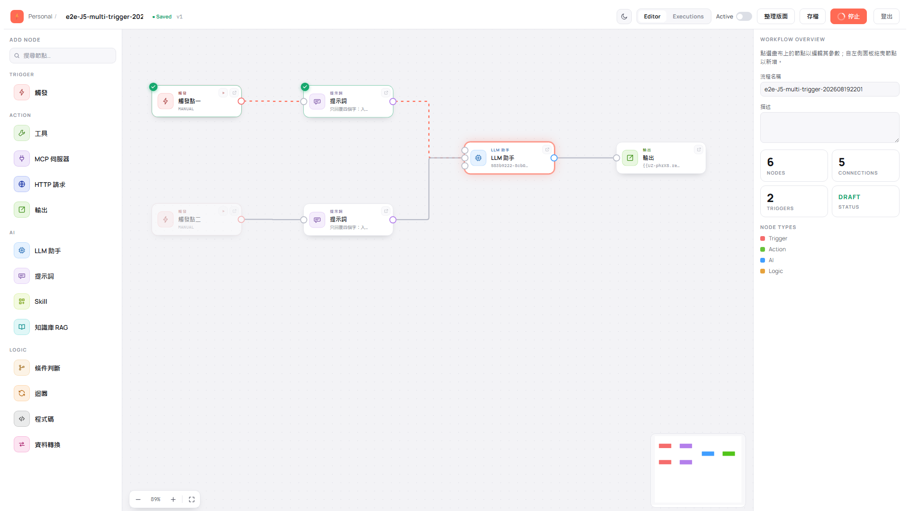<br>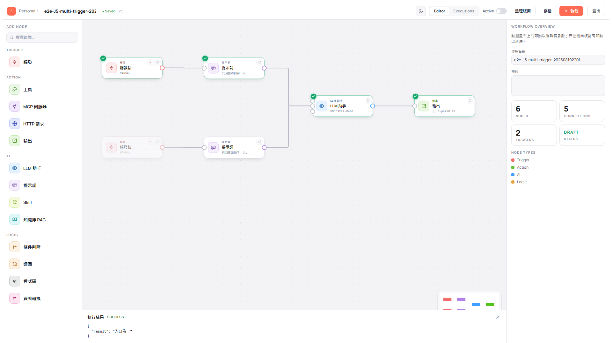 |
| J5-12 | P1 | 改從 t2 執行 / 節點卡 `node-run-from-here` 直接開跑 | 前一輪 skipped 標記不殘留、改為 t1 呈 skipped、`trigger_node_key`=t2；節點卡入口不觸發拖曳或取消選取 | ✅ | 改選 t2：t1 轉為 **`is-exec-skipped`**、**t2 不再帶 skipped**（轉 `is-exec-success`），`trigger_node_key=K9OLGb4N`，輸出 `{"result":"入口為二"}`。再測 `node-run-from-here`：**不彈選擇器**（`trigger-picker` 計數 0）、直接以 t1 開跑（`trigger_node_key=g19jzgnO`），且該節點**仍為選取狀態**（class 保有 `selected`）、**位置完全未移動**（boundingBox 前後相同），證明 `@click.stop` / `@mousedown.stop` 生效。<br><br><br>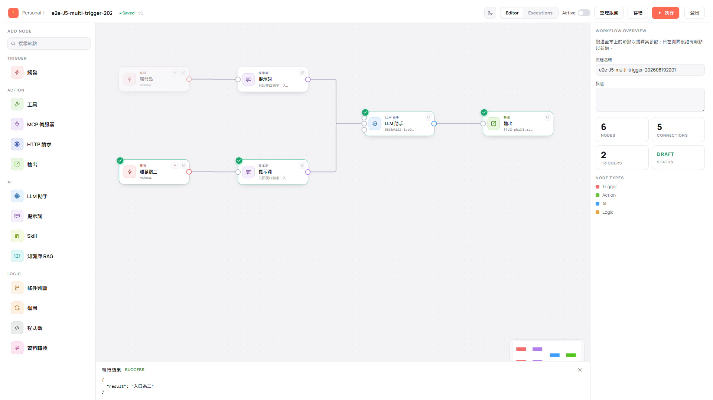<br><br>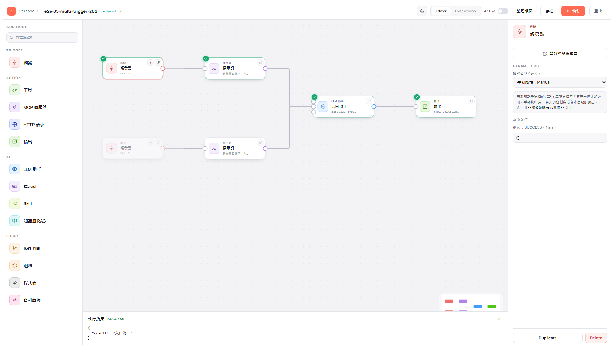 |

> J5 斷言不比對 LLM 輸出文字；只驗事件序列、節點狀態、DB 紀錄。
> 例外：J5-08（提問優先序）與 J5-11/12（入口對應分支）以**刻意可辨識的短文案**作為「採用了哪個來源」的判別依據，
> 屬路由正確性而非模型品質的斷言。

### J6 Inspector 表單（P1）

> 執行產物：`run_13`（J6-05/06/01/07/08/09/04/02）、`run_14`＋`run_15`（J6-03 重測）。
> 使用流程 `e2e-J6-202608192201`（`bcf714cb-…`）。

| 案例 | 優先 | 描述 | 預期 | 狀態 | 證據 / 備註 |
|------|:---:|------|------|:---:|------|
| J6-05 | P0 | 自 palette 拖入 TRIGGER 後直接看 Inspector | `trigger-type` 顯示且值已為 `MANUAL`，**無必填警告**；WEBHOOK / CRON 停用 | ✅ | 拖入後未做任何操作：`trigger-type` 值 = **`MANUAL`**（由 `NodeTypeMeta.defaultConfig` 帶入）、`required-field-warning` 計數 **0**；選項為 `請選擇` / `手動觸發（Manual）` / **`Webhook（即將推出）`（disabled）** / **`排程（Cron，即將推出）`（disabled）**。<br> |
| J6-06 | P1 | 無型別化表單的節點（如 CODE）在 JSON 編輯器**表格模式**新增／移除欄位 | `new-field-key` + `add-field` 可新增（空鍵名／重複鍵顯示 `new-field-error`）、`remove-field-<key>` 可移除 | ✅ | CODE 節點的 config 為空時直接在表格模式操作：空鍵名按新增 → `new-field-error` = **「請輸入欄位名稱」**；新增 `language` 成功（出現 `value-input-language`）並填入 `javascript`；再次新增 `language` → `new-field-error` = **「欄位「language」已存在」**；新增 `source` 後按 `remove-field-source` → `value-input-source` 計數歸 **0**。全程不需切 JSON 模式手打。<br><br>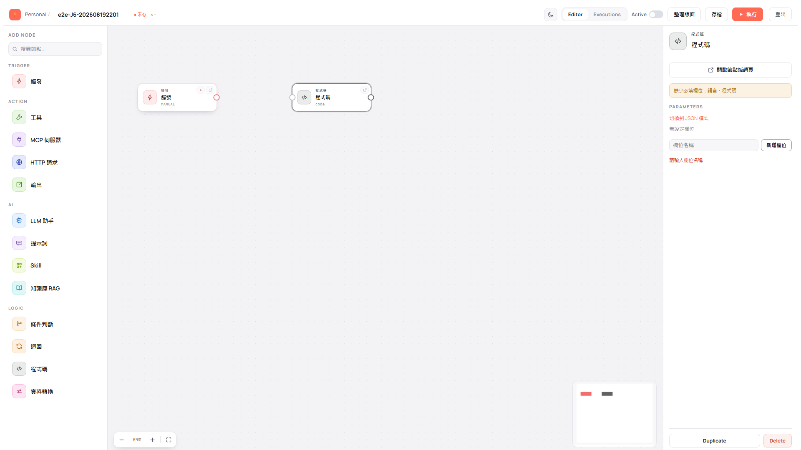<br><br><br> |
| J6-07 | P0 | 選取尚未設定的 OUTPUT 節點 | 顯示 `output-both-empty` 與 `output-ref-suggestions`（chip 顯示為「節點名 › 欄位」）；點 chip 插入後提示消失 | ✅ | 未設定時 `output-both-empty` 計數 **1**、`output-ref-suggestions` 計數 **1**，建議 chip 文字為 **「LLM 助手 › reply」**（節點名 › 欄位）。點 chip 後模板插入該引用，`output-both-empty` 計數轉 **0**。<br><br> |
| J6-08 | P0 | 檢視含引用的輸出模板 | 引用渲染為 `expr-token-<path>` 色塊（文字＝「節點名 › 欄位」、`data-ref`＝原始 `{{...}}`）；改名後文字變、`data-ref` 不變；未知節點帶 `is-unknown` | ✅ | 色塊 `expr-token-fdjYBGhw.reply`：初始文字 **「LLM 助手 › reply」**、`data-ref` = **`{{fdjYBGhw.reply}}`**、class = `expr-token`。把該 LLM 節點改名為「台東導覽助手」後，色塊文字轉 **「台東導覽助手 › reply」** 而 **`data-ref` 完全不變**。再輸入 `{{nosuchnode.reply}}`，該色塊 class = **`expr-token is-unknown`**。（斷言以 `textContent()` 讀取，非 `inputValue()`——此欄位是 contenteditable。）<br><br><br> |
| J6-09 | P1 | 於輸出模板以中文輸入法打字 | 組字不吃字、不寫入半成品；存檔後 DB 的 `template` 為「原始 `{{...}}` ＋ 中文」，不含畫面顯示文字 | ✅ | 以 `compositionstart` → `insertText` → `compositionend` 模擬組字輸入「台東二日遊行程」：畫面文字完整為 `台東導覽助手 › reply nosuchnode.reply　台東二日遊行程`（**既有色塊未被破壞、中文一字未吃**）。存檔後直接查 DB `llm_workflow_node.config`：<br>`{"template":"{{fdjYBGhw.reply}} {{nosuchnode.reply}}　台東二日遊行程"}`——**存的是原始 `{{...}}` ＋ 中文，完全不含畫面顯示用的「› 」文字**。<br> |
| J6-01 | P1 | LlmAssistantForm 選 llmId | 值寫回並可存檔 | ✅ | `llm-select` 選 `583b9222-…` 後值正確寫回；同時確認表單已精簡——`tool-ids` / `mcp-ids` / `skill-ids` / `knowledge-id` **四個舊欄位計數皆為 0**（能力改由 `in:tool` 掛載）。<br> |
| J6-02 | P1 | Tool/McpServer/KnowledgeRag/Prompt/Output 表單填寫 | config 正確寫回，save 後重載一致 | ✅ | 填寫後存檔並**重新載入編輯器**逐欄比對：<br>TOOL → `toolId=f95fda5f-…`、`toolSettingId=d7f3f706-…`；<br>MCP_SERVER → `mcpId=7c173def-…`、`toolName=searchPlaces`、`userSettingId=1e575cec-…`；<br>KNOWLEDGE_RAG → `knowledgeId=90c4deb7-…`、`embeddingModelId=3b624ce5-…`、`query=數位存款帳戶年齡條件`、`topK=3`；<br>PROMPT → `prompt=請用一句話介紹台東。`、`outputKey=myPrompt`；<br>OUTPUT → 模板文字完整還原。**全部一致**。<br><br><br> |
| J6-04 | P1 | LLM 接上 PROMPT 後檢視 LlmAssistantForm | 顯示 `prompt-overridden-badge` 與 `prompt-source-hint`；`user-prompt` 仍可編輯（非 disabled） | ✅ | PROMPT 連上 `in:prompt` 後檢視 LLM 表單：`prompt-overridden-badge` 計數 **1**、`prompt-source-hint` 計數 **1**，`user-prompt` 的 `isDisabled()` = **false**（仍可編輯，作為後備值）。<br> |
| J6-03 | P2 | settingSchema 動態表單（sensitive 遮罩） | 依 schema 正確渲染欄位型別 | ✅ | TOOL(TavilySearch) 的 `settingSchema` 共渲染 **8 個欄位**，型別與後端 schema 完全對應：<br>`baseUrl`→`input[type=text]`、**`apiKey`→`input[type=password]`（sensitive 遮罩）**、`timeout`→`input[type=number]`、`searchDepth`→`text`、`includeAnswer`／`includeRawContent`→`input[type=checkbox]`、`includeDomains`／`excludeDomains`→`text`（placeholder「以逗號分隔（值不可含逗號）」對應 array 型別）。必填欄位標記 `*`（`apiKey*`、`timeout*`）與 schema 的 `required` 一致；實際輸入值後 `type` **仍維持 `password`**（不會回退成明碼）。<br>⚠️ 首輪（run_13）判 ❌ 為**測試腳本問題**：先誤把預設已展開的設定區「按成收合」、再用 `querySelector` 往子層找 input（`[data-test="field-x"]` 本身就是 input）。**非產品缺陷**。<br><br> |

### J7 契約錯誤（P2）

> 執行產物：`run_14`（J7-01）、`run_15`（J7-02）。同樣使用 `e2e-J6-202608192201`（`bcf714cb-…`）。

| 案例 | 優先 | 描述 | 預期 | 狀態 | 證據 / 備註 |
|------|:---:|------|------|:---:|------|
| J7-01 | P2 | save 節點 config 型別錯誤（未知欄位/結構型別錯） | 400，`workflow.node.config.invalid`，含 nodeKey | ✅ | **兩種型別錯誤各驗一次（API 層）**：<br>① 未知欄位 → HTTP **400**、`Config of node jfxid4DV is invalid: Encountered an unknown key 'thisFieldDoesNotExist'…`<br>② 結構性型別錯（`prompt` 傳物件）→ HTTP **400**、`Config of node jfxid4DV is invalid: Expected JsonPrimitive, but had JsonObject as the serialized body of string at element: $.prompt`<br>**兩者訊息皆含 nodeKey**。<br>**UI 佐證**：在 DATA_TRANSFORM 節點的 JSON 編輯器填 `{"template":"ok","notARealField":1}` 後按存檔——存檔被擋（`saved-badge` 未出現），toast 為 `Config of node YB2aty27 is invalid: Encountered an unknown key 'notARealField'…`（含該節點 nodeKey）。<br><br> |
| J7-02 | P2 | 樂觀鎖 version 衝突 | 400，`workflow.version.conflict`，UI 顯示衝突提示 | ✅ | UI 載入時持有 **version 6**；改由 API 以同一 version 搶先存檔成功（HTTP 200），DB version 轉 **7**。此時在 UI 改動 PROMPT 內容並按存檔：**存檔被擋**，前端彈出 `ElMessageBox`「**版本衝突**／此流程已被其他作業修改。重新載入將捨棄目前未存變更，是否繼續？」，提供「取消／重新載入」兩個選項。DB version 維持 **7**（UI 的舊版本未覆蓋）。<br>⚠️ 首輪（run_13/run_14）判 ❌ 皆為**測試腳本問題**：先是把 `workflow/get` 的整包回應直接當 `save` payload（含 `status`/`updatedAt` 等 save 不接受的欄位，先撞 JSON 解析錯而非樂觀鎖），後是 `page.reload()` 摧毀了注入的 toast MutationObserver 因而收不到訊息。**非產品缺陷**。<br><br> |

### J8 知識庫 RAG 檢索問答（P1，真實 embedding + Milvus + 真實 LLM）

> 執行產物：`final_runs/run_16`。使用既有知識庫 `e2e-scb-tnc-202607272132`（`90c4deb7-…`，來源文件
> `docs/rag/doc/scb/tw-online-tnc.pdf` 渣打數位存款帳戶特別約定條款）、embedding `e2e_openrouter_nemotron_embed`
> （OpenRouter `nvidia/nemotron-3-embed-1b:free`，維度 2048）、Milvus 向量庫 `e2e_scb_tnc_0724`（dim 2048）。
> 建立流程：`e2e-J8A-202608192201`（`a9483d19-…`）與 `e2e-J8B-202608192201`（`77dfcdeb` 執行所屬流程）。

#### J8-A pipeline 模式：`TRIGGER → KNOWLEDGE_RAG → LLM_ASSISTANT → OUTPUT`

| 案例 | 優先 | 描述 | 預期 | 狀態 | 證據 / 備註 |
|------|:---:|------|------|:---:|------|
| J8-01 | P1 | 前置(API)：建 EMBEDDING 設定 + Milvus 向量庫 + 上傳文件建知識庫 | 取得三組 ID；`getDataFromEmbeddingStore` 檢索命中目標事實（維度須對齊） | ✅ | 本輪沿用既有資源（無需重建）並以 API 實查驗證：embedding `3b624ce5-…`（`nvidia/nemotron-3-embed-1b:free`，dimensions **2048**）；向量庫 `b8828b60-…`（MILVUS、collection `e2e_scb_tnc_0724`、**dimension 2048**，與 embedding 輸出維度一致）；知識庫清單 1 筆。**檢索命中 3 段，Top-1 原文即為「立約人應為具中華民國國籍…之年滿二十歲自然人」**——依 §14-6 的判準，以「檢索實際命中」而非「列得出知識庫」作為就緒依據。<br><br> |
| J8-02 | P1 | UI 建 workflow，Inspector 選知識庫/embedding/LLM，userPrompt 以 `{{<ragKey>.documents}}` 串接 | 4 節點、3 edge | ✅ | RAG 節點 nodeKey 由 `.vue-flow__node[data-id]` 讀得 `zG1UTtPl`，據以在 userPrompt 寫入 `{{zG1UTtPl.documents}}`。RAG config：knowledgeId `90c4deb7-…`、embeddingModelId `3b624ce5-…`、query「數位存款帳戶開立的年齡條件」、topK 3。Overview 顯示 **4 NODES / 3 CONNECTIONS**，3 條 edge 逐條成立。<br><br><br> |
| J8-03 | P1 | 存檔 + switchStatus 啟用 | version 1；狀態 ACTIVE | ✅ | 存檔後 `workflow/get` 回 **version=1**；切 Active → toast「流程已啟用」、狀態 **ACTIVE**（pipeline 模式已填 `query`，必填驗證通過）。<br> |
| J8-04 | P1 | execute（真實 embedding + LLM） | SSE started→node.*→completed(SUCCESS)；4 節點 node_execution 皆 SUCCESS | ✅ | Drawer 狀態 **SUCCESS**；DB execution `168e4389-…` SUCCESS，`node_execution` **恰 4 筆**（TRIGGER `6yDRBv4J` / **KNOWLEDGE_RAG `zG1UTtPl`** / LLM_ASSISTANT `WUxxqVi0` / OUTPUT `icV205S1`）**皆 SUCCESS**——pipeline 模式的 RAG 節點**會**產生自己的執行紀錄（與 J8-B 外掛模式相反）。<br><br> |
| J8-05 | P1 | **RAG 正確性斷言**：finalOutput 與文件已知事實比對 | 輸出含文件原文事實關鍵字（「20 / 二十」） | ✅ | finalOutput = **`{"result":"20歲"}`**，與來源文件原文「立約人應為…**年滿二十歲**自然人」一致。<br> |

#### J8-B 外掛模式：KNOWLEDGE_RAG `out:main → LLM in:tool`（自動注入型 RAG）

| 案例 | 優先 | 描述 | 預期 | 狀態 | 證據 / 備註 |
|------|:---:|------|------|:---:|------|
| J8-06 | P1 | UI 建圖：5 節點、4 edge（其中 2 條為 RAG `out:main`→LLM `in:tool`） | 拉線放行、無相容性 toast、console error=0；Overview 5 NODES / 4 CONNECTIONS；存檔成功 | ✅ | 4 條 edge 逐條成立（0→1→2→3→4）；**toast 監看陣列為空**、**瀏覽器 console error 計數 0**；Overview 顯示 **5 NODES / 4 CONNECTIONS**；存檔後 DB 中 `targetHandle=in:tool` **恰 2 條**。<br><br> |
| J8-07 | P1 | **必填契約**：兩個 RAG 只選知識庫，`query`/`embeddingModelId` 皆留空後啟用 | 啟用成功（不回 `required.missing`） | ✅ | 兩個 RAG 節點實測 `query` 與 `embedding-model-select` 皆為 `""`；切 Active → toast「流程已啟用」、狀態 **ACTIVE**，**未出現任何 required 相關訊息**。與 J8-A（pipeline 需 `query`）形成對照，確認兩模式必填契約相反。<br><br> |
| J8-08 | P1 | execute（真實 embedding + LLM） | SSE started→**僅 trigger/llm/output 三節點**→completed(SUCCESS) | ✅ | Drawer **SUCCESS**；DB execution `77dfcdeb-…` SUCCESS，`node_execution` **恰 3 筆**（TRIGGER `eoODlmT4` / LLM `qg_KYBtj` / OUTPUT `bi1nyjzP`）皆 SUCCESS。<br><br> |
| J8-09 | P1 | **純能力節點不落主遍歷**：執行後檢視 RAG 節點 | RAG 節點 Inspector 無 `node-exec-section`；DB 無 `KNOWLEDGE_RAG` 紀錄 | ✅ | 兩個 RAG 節點的 Inspector `node-exec-section` 計數皆 **0**；對照 LLM 節點為 **1**。DB `node_execution` 過濾 `KNOWLEDGE_RAG` 得**空陣列**。UI 與 DB 兩路佐證一致（§14-2 的建議作法）。<br><br><br> |
| J8-10 | P1 | **自動注入正確性斷言**：輸出須為文件事實而非常識 | 輸出「20歲」而非民法成年的「18歲」 | ✅ | userPrompt **只寫問題、不做任何 `{{...}}` 插值**（注入由框架在推論前自動完成）。finalOutput = **`{"result":"20歲"}`**——`is20=true`、`is18=false`。此事實與 LLM 常識（台灣民法成年 18 歲）不同，**具鑑別力**，可據以判定注入確實生效（§14-3 的要求）。<br> |

> ⚠️ **本輪限制（環境現況，非缺陷）**：`getKnowledgeStore` 目前只列得出 1 個知識庫
> （`e2e-scb-tnc-202607272132`；另一筆 `e2e-scb-tnc-0724` 在 `llm_doc` 無文件紀錄故不列出），
> 因此 J8-06 的「2×KNOWLEDGE_RAG」兩個節點指向**同一個**知識庫。這仍完整驗證了外掛模式的
> 連線契約、必填契約與「不落主遍歷」行為；若要驗「多知識庫合併注入的內容差異」，需另建第二個含文件的知識庫。

### J9 編輯器外觀與節點編輯頁（P0/P1/P2）

> 執行產物：`run_17`（J9-01～J9-09）、`run_18`（J9-07 重測、J9-10～J9-17）、
> `run_19`／`run_20`（J9-10 失敗深入診斷）。
> 使用流程 `e2e-J9-202608192201`（`204fb4a6-…`，6 節點：TRIGGER／LLM／OUTPUT／PROMPT／TOOL／SKILL，
> 後兩者掛 `in:tool`），J9-17 的 Docs 分頁另在一張**未存檔的暫存畫布**上放齊 13 種型別逐一檢視。

| # | 優先 | 案例 | 預期 | 狀態 | 證據 |
|---|:---:|------|------|:---:|------|
| J9-01 | P1 | 清空 `localStorage` 後進編輯器 | `.wf-editor` 的 `data-wf-theme="light"` | ✅ | 移除 `localStorage.wf-theme` 後重進編輯器：`data-wf-theme` = **`light`**、`localStorage.wf-theme` = `null`（淺色為預設）。<br> |
| J9-02 | P1 | 點 `theme-toggle` 兩次 | 深色↔淺色來回無殘留；`localStorage.wf-theme` 同步；重整後保留 | ✅ | 第一次點擊 → `data-wf-theme=dark`、`<html class="dark">`、`localStorage.wf-theme="dark"`；**重整後仍為 dark**；再點一次 → `light`、`<html>` 的 `dark` class 移除、`localStorage.wf-theme="light"`。<br><br><br> |
| J9-03 | P1 | 深色下導到 `/login` 與列表頁 | `<html>` 的 `dark` class 已移除，兩頁維持淺色 | ✅ | 編輯器處於深色時 `<html class="dark">`；導到列表頁 `/` 與 `/login` 後 `<html>` 的 class 皆為 **`null`**（`dark` 已被 `onScopeDispose` 清掉），兩頁維持 Element Plus 淺色。<br><br><br> |
| J9-04 | P2 | 深色下觸發 `ElMessageBox`（未存離開／登出確認） | 對話框深色配色且文字可讀 | ✅ | 深色狀態下製造未存變更再點登出，`ElMessageBox` 的 computed style：背景 `rgb(20,20,20)`（亮度 20）、文字 `rgb(255,255,255)`（亮度 255），`document.documentElement.classList.contains('dark')` = **true**——teleport 到 body 仍套到深色（EP 深色走 `html.dark`）。<br> |
| J9-05 | P1 | 點 `zoom-in` / `zoom-out` / `zoom-fit` | 畫布縮放改變，`zoom-value` 百分比同步更新 | ✅ | `zoom-value` 依序 **89% → 106%（zoom-in）→ 89%（zoom-out）→ 101%（zoom-fit）**，三個按鈕皆使百分比改變。<br><br><br> |
| J9-06 | P0 | 雙擊節點 | 出現 `node-designer-modal`；header 顯示型別／分類／名稱；該節點同時被選取 | ✅ | 雙擊 LLM 節點 → `node-designer-modal` 計數 1，header 依序為 **「LLM 助手 ｜ AI ｜ LLM 助手」**（型別／分類／名稱），該節點 class 同時帶 `selected`（Inspector 亦切到該節點）。<br> |
| J9-07 | P1 | 點節點卡右上 `node-open-designer` | 開啟 Designer，且未觸發拖曳或取消選取 | ✅ | 先選取節點（class 含 `selected`）再點右上鈕：modal 開啟、**節點仍為 `selected`**、boundingBox 前後完全相同（未被拖動）。<br>⚠️ 首輪（run_17）判 ❌ 為**測試腳本問題**：先 `deselect` 才點按鈕，等於本來就沒選取，無從驗「不取消選取」。**非產品缺陷**。<br> |
| J9-08 | P1 | 點 Inspector 的 `open-node-designer-button` | 開啟 Designer | ✅ | modal 計數 1，且預設顯示 `node-designer-parameters` 分頁。<br> |
| J9-09 | P1 | 三種關閉：Esc、點遮罩、`node-designer-close` | 皆關閉；再開啟時分頁回到 Parameters | ✅ | 三種方式關閉後 modal 計數皆為 **0**。另驗分頁重置：先切到 Docs（`node-designer-docs` 計數 1）→ 點遮罩關閉 → 重新開啟時 **`node-designer-parameters` 計數 1、`node-designer-docs` 計數 0**（`v-if` 卸載重建）。<br><br><br><br><br> |
| J9-10 | P0 | modal 內改 config → 關閉 | Inspector 與節點副標同步更新；工具列標記未存 | ❌ | **三項預期中兩項成立、一項不成立**：<br>· 工具列 `dirty-badge` = 「● 未存」 ✅<br>· **畫布節點副標即時同步** ✅（在 Designer 內把 `llmId` 由 `583b9222…` 改為 `4069f3c2…`，節點副標**當下就跟著變**，關閉後維持）<br>· **Inspector 表單不同步** ❌（Designer 內改 `user-prompt` 為新字串後，Inspector 的同名欄位**在 Designer 開啟中與關閉後都仍顯示舊值**；`llm-select` 同樣停在舊的 `583b9222…`）<br>底層資料其實是對的：**重新選取該節點**或**重整頁面**後 Inspector 即顯示新值，存檔後 DB `llm_workflow_node.config` 也是新值。<br>→ 屬 UI 顯示不同步（前端），詳見「問題分流與修正紀錄」ISSUE-2。<br><br><br><br><br><br><br>**副標同步佐證（run_20）**：<br><br><br><br><br> |
| J9-11 | P1 | 在 `node-designer-name-input` 打字後按 Delete | 節點**不被刪除** | ✅ | 於名稱輸入框填字後連按兩次 <kbd>Delete</kbd>：modal 仍開啟、關閉後畫布節點數 **6 → 6 未變**（Vue Flow 的 `delete-key-code` 綁在 pane 上，modal 在 `.vue-flow` DOM 之外）。<br><br> |
| J9-12 | P1 | 未執行流程時檢視 Input / Output | 兩側皆顯示「尚未執行」空狀態 | ✅ | `node-designer-input-empty` 與 `node-designer-output-empty` 計數各 **1**，`-input-json` / `-output-json` 計數皆 **0**；文字分別為「尚未執行。執行流程後可在此檢視實際輸入資料。」與「…實際輸出資料。」<br> |
| J9-13 | P1 | 執行後開啟中段節點的 Designer | Input 顯示 `node-designer-input-json`（含「來自 <上游名>」）；Output 顯示 JSON 與可引用欄位 | ✅ | 執行成功（`{"result":"外觀測試"}`）後開啟 LLM 的 Designer（**未先關結果抽屜**，避免 `executionStore.reset()` 清空 `nodeStates`）：Input 顯示 **2 組** `node-designer-input-json`——「**來自 觸發** `{}`」與「**來自 提示詞** `{"prompt":"只回覆四個字：外觀測試"}`」（本節點有兩個上游）；Output 顯示 `node-designer-output-status` = **`SUCCESS（6916 ms）`**、可引用欄位 **`{{yjTI9vPG.reply}}` STRING 外觀測試** 與原始 JSON。<br>ℹ️ 首輪腳本把 `input-json` 期望值寫死為 1，實際為 2（兩個上游各一組），已修正為「≥1 且含『來自』標籤」。<br><br> |
| J9-14 | P1 | 開啟 TRIGGER 的 Designer | Input 為虛線空狀態「這是觸發節點…」，不顯示 JSON | ✅ | 即使流程已執行過，TRIGGER 的 Input 仍為空狀態：`node-designer-input-empty` 計數 **1**、`-input-json` 計數 **0**，文字為「**這是觸發節點，它啟動整個流程，因此沒有輸入資料。**」<br> |
| J9-15 | P1 | 開啟 SKILL 的 Designer | Input「這是能力提供節點…」；Output「不會產生自己的輸出」 | ✅ | Input 文字：「**這是能力提供節點，它只作為 LLM 助手的工具來源，沒有輸入資料。**」；Output 文字：「**這是能力提供節點，它不會產生自己的輸出。**」<br> |
| J9-16 | P1 | 開啟已掛能力節點的 LLM 的 Designer | `node-designer-capability-list` 以 chip 列出 `in:tool` 來源，不顯示其 JSON | ✅ | `node-designer-capability-list` 計數 **1**，chip 文字為 **「工具」「Skill」**（對應掛在 `in:tool` 的 TOOL 與 SKILL 兩個節點），下方提示「能力節點不參與資料流，由 LLM 自主決定何時呼叫。」，**未顯示其 JSON**。<br> |
| J9-17 | P2 | Settings 與 Docs 分頁（Docs 逐一檢視 13 種型別） | Settings 顯示 nodeKey／型別／分類／必填檢核／本次執行；Docs 皆有內容且連接埠清單與實際 handle 一致 | ✅ | **Settings**：「節點 key `yjTI9vPG` ＋複製／型別 LLM 助手（LLM_ASSISTANT）／分類 AI／必填檢核『必填欄位皆已填寫。』／本次執行『狀態：SUCCESS（6916 ms）』」，`node-designer-copy-key`／`-duplicate`／`-delete` 各 1 個。<br>**Docs**：13 種型別**逐一開啟檢視皆有說明與「行為要點」＋「連接埠」章節**（字數 127–339）；`CONDITION` 的連接埠含 **`out:true` / `out:false`**、`LLM_ASSISTANT` 含 **`in:prompt` / `in:tool`**，與該型別實際 handle 一致。<br><br><br><br><br><br><br><br><br><br><br><br><br><br> |

### J10 複合能力掛載：旅遊行程規劃（P1，真實 MCP + 真實 Web 搜尋 + 真實 LLM）

> 圖形：`TRIGGER → LLM_ASSISTANT → OUTPUT`，`PROMPT → in:prompt`，
> `MCP_SERVER(google_map)` / `TOOL(TavilySearch)` / `SKILL(pdf)` 三者皆接 LLM 的 `in:tool`。
> ⚠️ MCP 節點**必須填 `userSettingId`**，否則 env 佔位符不替換、工具不可用（§12 第 1 點）。
> ⚠️ LLM／MCP／Tool／Skill 設定必須**同屬登入者**（§12 第 2 點）——本輪四者皆屬 `admin`。
> ⚠️ `searchPlaces` 必填 `query`／`language`／`maxResults`，PROMPT 已明確要求模型帶齊。
>
> 執行產物：`final_runs/run_21`；流程 `e2e-J10-202608192201`（`b7d98da1-…`）。
> **本輪採 7 節點完整配置**（使用者於 Step 1.5 指定），並依 §15 第 5 點把工作量壓到
> 「**2 景點 ＋ 1 次搜尋**」以避開 LLM 節點的 120 秒硬逾時（ISSUE-3）——實測 **60.0 秒**完成。

| 案例 | 優先 | 描述 | 預期 | 狀態 | 證據 / 備註 |
|------|:---:|------|------|:---:|------------|
| J10-01 | P1 | 拖出 7 節點並連線（3 條 `in:tool`、1 條 `in:prompt`、2 條 `out:main`） | 連線皆成立，畫布無驗證紅框 | ✅ | 7 節點（TRIGGER `4iPqb-Gq` / LLM `aYC36Kv6` / OUTPUT `3xTB1k8w` / PROMPT `0XwuJCCR` / MCP_SERVER `Oc207LMA` / TOOL `fIlOgels` / SKILL `KiiDe_MN`）。先接 5 條（SKILL 邊留給 J10-02），edge 0→1→2→3→4→5 逐條成立，Overview 顯示 **7 NODES / 5 CONNECTIONS**。各節點 config：LLM=`583b9222…`＋系統提示「只輸出 JSON」；MCP=google_map＋`searchPlaces`＋userSettingId `1e575cec…`；TOOL=TavilySearch＋toolSettingId `d7f3f706…`；SKILL=pdf；OUTPUT 引用 `{{aYC36Kv6.reply}}`。<br><br><br><br><br><br><br><br><br> |
| J10-02 | P1 | SKILL 未接 `in:tool` 即按啟用 | 擋下並回 `workflow.skill.node.not.mounted`，含 nodeKey | ✅ | toast：**`SKILL node "KiiDe_MN" must be connected to an LLM assistant nodes tool input port (in:tool)`**，`workflow/get` 狀態維持 **DRAFT**。<br> |
| J10-03 | P1 | 補回 SKILL 邊後啟用 | 啟用成功，狀態轉 ACTIVE | ✅ | SKILL `out:main` → LLM `in:tool` 連線成立（edge 5→6），Overview 轉 **6 CONNECTIONS**；切 Active → toast「流程已啟用」、狀態 **ACTIVE**。<br><br> |
| J10-04 | P1 | 執行 workflow，觀察 SSE 與 ExecutionResultDrawer | `execution.started`→`node.*`→`execution.completed`，全節點 SUCCESS（不比對輸出文字） | ✅ | 抽屜由執行中轉 **SUCCESS**，全程 **60.0 秒**（未觸及 120 秒節點逾時）。DB：execution `70c7f0c1-…` **SUCCESS**、`trigger_type=MANUAL`、`trigger_node_key=4iPqb-Gq`；4 筆 node_execution 皆 SUCCESS。<br><br> |
| J10-05 | P1 | deep-verify：景點真實性 | 景點為真實臺東地點（地址含「臺東縣」），每點帶 `place_id` 與經緯度 | ✅ | 兩個景點皆帶回**真實 Google Places 資料**：<br>· Day1 **臺東池上錦新三號道路 伯朗大道** — `ChIJZatyKu4JbzQRyHuSojQ6qQ0`／(23.0988065, 121.2130022)／`958台灣臺東縣池上鄉錦新三號道路`<br>· Day2 **三仙台** — `ChIJ5RcBzEhwbzQRSWjpXLndbWU`／(23.1206279, 121.4027574)／`台灣臺東縣三仙台`<br>兩個 place_id 與 202607312223 週期取得的完全一致，交叉佐證非模型臆造；地址皆含「臺東縣」。<br> |
| J10-06 | P1 | deep-verify：活動查證 | 含 TavilySearch 取得的活動／營業資訊與可追溯來源 URL | ✅ | 取得活動 **「2026臺灣國際熱氣球嘉年華-熱氣球光雕音樂會｜臺東國際地標」（2026-08-13）**，來源 URL **`https://tour.taitung.gov.tw/zh-tw/event-calendar`**（臺東縣政府觀光旅遊處官方活動行事曆，可追溯）。<br> |
| J10-07 | P2 | DB 落庫檢查 | `llm_workflow_execution` 一筆 SUCCESS；`llm_workflow_node_execution` 恰 4 筆（純能力節點不落紀錄） | ✅ | `llm_workflow_execution` **恰 1 筆**、status **SUCCESS**；`llm_workflow_node_execution` **恰 4 筆**（PROMPT `0XwuJCCR` / TRIGGER `4iPqb-Gq` / LLM_ASSISTANT `aYC36Kv6` / OUTPUT `3xTB1k8w`）皆 SUCCESS，**無 MCP_SERVER / TOOL / SKILL 任何一列**（`capabilityRows` 為空陣列），符合純能力節點不落紀錄的設計。<br> |
| J10-08 | P1 | 由 OUTPUT 產出 PDF 行程表 | PDF 含 Day1/Day2 行程、每景點 Google Maps 連結、活動資訊與來源 | ✅ | 以 OUTPUT 的 JSON 產出 **`docs/test-confirmations/e2e-artifacts/202608192201/taitung-2day-itinerary.pdf`（78,428 bytes、A4）**，含 Day1／Day2 各一個景點的名稱、地址、Place ID、座標與 `https://www.google.com/maps/search/?api=1&query=<lat,lng>&query_place_id=<placeId>` 連結，以及在地活動與來源網址。原始 JSON 一併存為同目錄的 `taitung-2day-itinerary.json`。<br>ℹ️ 平台的 SKILL 節點**不執行程式碼**（`SkillService.buildSkills()` 只把 `skill.md` 與 resources 全文注入 LLM），PDF 的實際渲染在平台外完成——本案例對 SKILL 的斷言是「掛載契約成立且內容有進 LLM」，非「平台產出 PDF」。<br> |

> ℹ️ **本輪未複現 202607312223 的 ISSUE-5（腳本型 skill 劫持輸出）**：pdf skill 同樣掛在 `in:tool`，
> 但在 PROMPT 與系統提示同時明確要求「只輸出 JSON、絕對不要輸出任何程式碼」、且工作量壓到 3 次工具呼叫的條件下，
> 模型完整遵守輸出契約（輸出為 ```json 包裹的目標 JSON，無 Python 程式碼）。
> ISSUE-5 仍屬**已知風險**（提示一放鬆或工作量放大即可能重現），未因本輪通過而視為已修復。

## 旅程完成檢查清單（每完成一條旅程必須立即執行）

> 對應 SKILL.md Step 5.5。進入下一旅程前，逐項勾選並更新摘要表。

```
☑ 所有案例的逐步截圖已擷取並存入 e2e-shots/202608192201/（每步驟一張：R1 237 張 ＋ R2 231 張＝468 張，與報告內圖片連結一一對應）
☑ 所有案例證據已寫入（逐步圖片連結以 Markdown 圖片語法嵌入 ＋ 關鍵斷言 / SSE / DB，無佔位符）
☑ 所有案例狀態已標記（R1：✅ 90 / ❌ 2 / ⏭️ 0；R2：✅ 92 / ❌ 0 / ⏭️ 0）
☑ 失敗案例（❌ J1-04、J9-10）已在「問題追蹤區」詳細記錄、完成分流、經核准修正並於 R2 重驗通過
☑ 摘要表各旅程統計數字已於該旅程完成當下更新
☑ Pass 率已計算並填入（保留一位小數）
☑ 本次 e2e-* 測試資料已於 R2 收尾全數清理（R1 14 筆、R2 15 筆，皆依記錄的 id 逐一刪除）
```

### 嚴格規則

- **不可延後**：完成一條旅程立即更新，不可等全部測完才統一更新
- **即時暫停**：某旅程 Pass 率過低（P0<100% / P1<95% / P2<80%），立即暫停評估
- **計算精確**：Pass 率 = Pass ÷ 總數 × 100%，保留一位小數
- **與問題追蹤同步**：失敗案例先入問題追蹤區，再更新摘要

### ⚠️ 本輪發現的模板案例數漂移（需同步）

模板 `e2e-test-checklist.md` 的三處案例數彼此不一致，本輪以**明細表列數**為準執行：

| 來源 | J3 | J4 | 合計 |
|------|:--:|:--:|:----:|
| 模板摘要表（原檔） | 7 | 8 | 標示 83（各列相加實為 86） |
| 模板明細表列數（**本輪採用**） | 9 | 12 | **92** |
| `docs/e2e-test-plan.md` §3 | 9 | 13 | — |

> 三者需一併校正（`e2e-test-plan.md` §J4 比模板多一條「已連 PROMPT 的 LLM 在 Inspector 檢視」，
> 該情境已由本報告的 J6-04 覆蓋）。已列入文件同步待辦，見下方「文件同步待辦」。

---

## 測試資料清理規則

- E2E 建立的 workflow 一律以 `e2e-<caseId>-<runTag>` 前綴命名。
- **只刪本次執行自己建立、且記得 id 的資料**：建立後把 id 記在腳本變數中，收尾逐一 `POST /llm/workflow/delete`。
- 收尾可用 `e2e-<runTag>` 前綴掃描兜底，但**必須帶本次的 runTag**，不可只比對 `e2e-` 或其他泛用樣式。
- **不得另建備份檔／目錄**；種子資料（admin、test_user、LLM setting）為前置條件，不刪除。
- 逐步截圖屬**報告證據**，隨報告保留於 `docs/test-confirmations/e2e-shots/202608192201/`，**不在清理範圍**。

> ⚠️ 收尾後資料庫殘留本次的 `e2e-<runTag>` 資料，視同流程不完整，需補清理。

> 🚫 **絕不可依「使用者也會自然產生的名稱」批次刪除**（實際事故）：
> 曾為了清掉自己腳本的殘留，把清理條件加上 `name === '未命名流程'`——
> 而那正是使用者按「新建 workflow」未命名就存檔時的預設名稱，
> 導致測試輪次的前置清理**刪掉了使用者自己的流程**。
> 名稱樣式無法區分「測試產生」與「使用者資料」；**唯一安全的依據是本次執行記錄下來的 id**。
>
> 同理，`llm_workflow_execution` / `llm_workflow_node_execution` 不會隨 workflow 連鎖刪除，
> 若要清理必須以「本次執行產生的 execution id」為範圍，不可依日期或「孤兒」條件整批刪。

### 本次建立的 workflow 與清理結果

> 皆由腳本記錄 id（`final_runs/run_*/created-ids.json`），清理時**逐一以 id 刪除**。
> 使用者原有的 4 筆（`未命名流程`／`手動測試-請問你是甚麼模型`／`手動測試-運算式編輯器`／`多觸發點驗證-202607302129`）**全程未動**。

| 輪次 | 建立筆數 | 名稱（皆帶 runTag `202608192201`） | 清理 |
|:----:|:-------:|-----------------------------------|------|
| R1 | 14 | `e2e-J1-06` / `e2e-J3` / `e2e-J3-09` / `e2e-J4` / `e2e-J5` / `e2e-J5-02` / `e2e-J5-03` / `e2e-J5-04` / `e2e-J5-05` / `e2e-J5-multi-trigger` / `e2e-J6` / `e2e-J8A` / `e2e-J8B` / `e2e-J9` / `e2e-J10`<br>（`e2e-J2-02` 於 J2-04 案例中即被刪除，不計） | **R2 開始前全數依 id 刪除**（14/14 HTTP 200） |
| R2 | 15 | 同上命名（另含 `e2e-J2-02`，同樣於 J2-04 刪除） | **收尾依 id 全數刪除（15/15 HTTP 200）** |

清理後實測：

```
llm_workflow            = 4   （＝使用者原有的 4 筆，e2e-* 殘留 0）
llm_workflow_node       = 18  （屬使用者原有流程）
llm_workflow_edge       = 14  （屬使用者原有流程）
llm_workflow_execution  = 69  ← 見下方說明
llm_workflow_node_execution = 281 ← 見下方說明
```

> ⚠️ **執行紀錄未一併清除，且這是刻意的**：`llm_workflow_execution` /
> `llm_workflow_node_execution` **不隨 workflow 連鎖刪除**，後端也未提供刪除執行紀錄的端點。
> 依本節清理鐵則，若要清理只能以「本次產生的 execution id」為範圍逐筆刪，
> 但那需要直接下 SQL DELETE（繞過 API），風險高於收益；
> 前一週期（202607312223）同樣保留。這些孤兒紀錄不影響任何功能，
> 若日後要處理，請以各輪 `final_script_log.txt` 中記錄的 execution id 為唯一依據，
> **不可依日期或「孤兒」條件整批刪**。

### 保留資料（刻意不清理）

| 類型 | 識別碼 | 說明 |
|------|--------|------|
| MCP userSetting | `1e575cec-3229-4da6-94d1-924dc56060cb`（alias `e2e-j10-googlemap`） | admin 的 google_map 金鑰設定，屬環境資源，保留供後續重跑 |
| Tool setting | `d7f3f706-1a86-477c-a119-4b77e98bf788`（alias `e2e-j10-tavily`） | 同上 |
| Skill | `e39a44eb-34f3-44b6-a9c1-36eb969af953`（`pdf`） | 上傳的 pdf skill |
| 知識庫 / 向量庫 | `90c4deb7-…`（`e2e-scb-tnc-202607272132`）／`b8828b60-…`（Milvus `e2e_scb_tnc_0724`，dim 2048） | J8 用；重建成本高，保留 |
| LLM / embedding 設定 | `583b9222-…`（OpenRouter deepseek-v3.2）／`3b624ce5-…`（nemotron embed） | 種子與環境資源 |

> ⚠️ 上述設定含**真實金鑰**。若日後要備份到 `docs/sql/bestpartner-init-data.sql`，
> `api_key` / `GOOGLE_MAPS_API_KEY` 必須掩蔽為 `tvly-xxx` / `AIza-xxx`。本次**未**寫入任何 SQL 備份。

## 問題追蹤區

> 失敗（❌）項目在此詳記

| 案例 ID | 現象 | 期望行為 | 實際行為 | 根因 | 狀態 |
|---------|------|---------|---------|------|------|
| **ISSUE-1**<br>（J1-04） | 以錯誤密碼登入時，畫面一閃、欄位被清空，**完全看不到任何錯誤訊息** | 停留 `/login` 並顯示錯誤原因（後端回的是「密碼錯誤」） | 停留 `/login`（✅）但 `.el-message` 在 6 秒內從未出現；`page.on('framenavigated')` 觀測到 **3 次整頁硬導航**，email 欄位被清空 | `src/api/http.ts` 的 response interceptor 對**任何** 401 都呼叫 `handleUnauthorizedResponse()`，其預設 `_redirectHandler` 執行 `window.location.href = '/login'`（整頁導航）。登入端點 `/login/` 帳密錯誤時回的正是 401，於是 `LoginView.handleSubmit` 的 `catch` 雖有呼叫 `ElMessage.error(message)`，但**訊息還沒渲染完，整個頁面就被重新載入沖掉了** | ✅ **已修復並於 R2 重驗通過**（見下方修復紀錄） |
| **ISSUE-2**<br>（J9-10） | 在 Node Designer 的 Parameters 改了設定，關閉後**右側 Inspector 仍顯示舊值** | Inspector 表單與畫布節點副標同步更新（兩處共用同一份 `node.data.config`） | 畫布節點副標**即時同步** ✅、工具列 `dirty-badge` 轉「● 未存」✅、`node.data.config` 與存檔後的 DB 皆為新值 ✅；但**已掛載的 Inspector 表單不更新** ❌（Designer 開啟中與關閉後皆顯示舊值），需**重新選取節點**或**重整頁面**才會刷新 | `src/components/inspector/forms/*.vue` 各型別表單在 `<script setup>` 以 `const xxx = ref(props.config.xxx ?? '')` **只在建立當下讀一次 props**，**沒有 `watch(() => props.config, ...)`**。Node Designer 的 Parameters 面板與 Inspector 走同一份 `typedForms.ts` 分派表、但各自 mount 一個實例；A 實例 emit `update:config` 更新了 `node.data.config`，B 實例的本地 `ref` 不會跟著變 | ✅ **已修復並於 R2 重驗通過**（見下方修復紀錄） |

> ℹ️ 另有數個案例在首輪判 ❌、經分流確認為**測試腳本問題**（不計為產品缺陷），已於同輪修正腳本後重測通過：
> J4-05（節點放在 Inspector 面板底下，handle 取不到 boundingBox）、J5-11/12（`is-exec-skipped` 選擇器層級寫錯）、
> J6-03（誤把預設展開的設定區按成收合＋往子層找 input）、J7-01/02（save payload 帶了 `save` 不接受的欄位；
> `page.reload()` 摧毀 toast 觀察器）、J9-07（先 deselect 才點按鈕，無從驗「不取消選取」）、
> J9-13（`input-json` 期望值寫死 1，實際因有兩個上游而為 2）。詳見各案例證據欄的 ⚠️ 說明。

### 修復紀錄（2026-08-20 00:00，ISSUE-1 / ISSUE-2）

| 檔案 | 變更 |
|------|------|
| `bestpartner-ui/src/api/http.ts` | 新增 `isLoginRequest(url)`（比對路徑尾段 `/login`，baseURL 有無皆適用）；response interceptor 的**成功與失敗兩個分支**都加上 `!isLoginRequest(...)` 判斷——登入端點自身的 401 不再觸發全域登出重導，交由呼叫端顯示錯誤 |
| `bestpartner-ui/src/api/auth.ts` | `login()` 包一層 try/catch：HTTP 401 時 axios 直接 reject（走不到既有的 `body.code` 判斷），原樣往上拋會讓畫面顯示 axios 通用字串「Request failed with status code 401」。改以 `extractApiMessage(err)` 取出後端訊息再拋，`LoginView` 因此顯示「密碼錯誤」 |
| `bestpartner-ui/src/composables/useConfigSync.ts` | **新增**。讓型別化表單的本地 ref 跟隨外部對 `props.config` 的變更；以 `markSelfEmit(next)` ＋ **`toRaw()` 物件參考比對**略過「自身 emit 造成的回流」，避免使用者打字（尤其中文組字）時被自己的值重灌 |
| `bestpartner-ui/src/components/inspector/forms/*.vue`（8 支） | `TriggerForm` / `LlmAssistantForm` / `PromptForm` / `ToolForm` / `McpServerForm` / `SkillForm` / `KnowledgeRagForm` / `OutputForm` 皆接上 `useConfigSync`，並在各自 `emitConfig()` 送出前呼叫 `markSelfEmit(next)`。<br>`SettingSchemaForm` **不在此列**——它走標準 `modelValue`/`update:modelValue` v-model 契約，非節點 config 表單 |
| `bestpartner-ui/src/api/__tests__/http.test.ts` | 新增 `isLoginRequest` 的 9 個案例（登入端點各種寫法皆為 true；`/login/check`、業務端點為 false；`undefined` 為 false） |
| `bestpartner-ui/src/composables/__tests__/useConfigSync.test.ts` | **新增** 4 個案例：外部變更會套用／自身 emit 回流被略過／自身 emit 後下一次外部變更仍正常／config 變 undefined 不拋錯 |

**修復過程中由單元測試抓到的一個實作陷阱**：`useConfigSync` 最初以原生物件參考比對來略過自身回流，
但物件存進 reactive 容器後讀回來的是 **Proxy 而非原物件**，比對永遠不相等，自身回流會被誤判成外部變更
（打字時會被自己的值重灌）。改為 `toRaw()` 後才正確——此行為已由單元測試固定住。

**驗證**：

| 驗證項目 | 結果 |
|---------|------|
| `vue-tsc -b`（型別檢查，CI 的 frontend job 會跑） | ✅ exit 0 |
| `npm run test`（vitest） | ✅ **51 檔 / 478 案例全通過**（修復前為 50 檔 / 464 案例；新增 14 案例） |
| `scripts/harness-drift-scan.ps1`（漂移掃描） | ✅ exit 0，**基線 5 項、新漂移 0 項** |
| E2E R2 全旅程重跑 | ✅ **92 / 92（100%）**，J1-04 與 J9-10 皆轉為通過，其餘 90 案無回歸 |

> ⚠️ 後端（`bestpartner-service`）**完全未改動**，故 R2 未重編 uber-jar，沿用 R1 的 22:04 建置產物。
> 前端已 `npm run build` 重建 dist（23:56）後才開始 R2。

---

## 問題分流與修正紀錄

> 每個 ❌ 都必須在此完成分流（Step 5.7）；未經使用者核准不得修改產品程式碼（Step 5.8）。
> 「分流判定」只能填：`前端` / `後端` / `測試腳本` / `環境`（後兩者不計為產品缺陷）。

| # | 案例 ID | 發現輪次 | 現象 | 分流判定 | 判定依據（API 直呼 / 後端日誌 / console / SSE / DB） | 根因（檔案:函式） | 修正方案 | 使用者決定 | 修正檔案 | 重測輪次 | 重測結果 |
|---|---------|:-------:|------|---------|--------------------------------|-----------------|---------|-----------|---------|:-------:|---------|
| F1 | J1-04 | R1 | 錯誤密碼登入無任何錯誤訊息 | **前端** | **API 直呼**：`POST /login/` 帶錯誤密碼 → HTTP **401**、body `{"code":401,"message":"密碼錯誤"}`（後端訊息正確）。<br>**後端日誌**：`bestpartner_error.log` 僅一筆預期的 `AuthenticationException - 密碼錯誤`，**無非預期 stacktrace**。<br>**瀏覽器 console**：只有 `Failed to load resource: 401`，**無 JS 例外**。<br>**UI**：3 次整頁硬導航、`.el-message` 從未出現、輸入欄被清空。<br>→ 後端正確、前端未把訊息呈現出來 | `api/http.ts`：response interceptor → `handleUnauthorizedResponse()` → 預設 `_redirectHandler` 的 `window.location.href = path` | 讓登入端點自身的 401 不走全域登出重導：interceptor 以 `isLoginRequest(url)` 排除，`auth.ts` 的 `login()` 改拋帶後端訊息的 Error | **同意修正** | `api/http.ts`、`api/auth.ts`、`api/__tests__/http.test.ts` | R2 | ✅ **已修復**：elMessage=「密碼錯誤」、hardNavigations=0、欄位保留 |
| F2 | J9-10 | R1 | Node Designer 改 config 後 Inspector 不同步 | **前端** | **DB**：存檔後 `llm_workflow_node.config` 為新值 → 資料層正確。<br>**UI 對照**：畫布節點副標（直接讀 `node.data.config`）**即時同步**；Inspector 表單（本地 `ref` 複本）不同步；**重新選取節點或重整後即正確**。<br>**console**：無錯誤。<br>**後端日誌**：無相關紀錄（純前端行為）。<br>→ 已掛載表單元件不對 props 變化作出反應 | `components/inspector/forms/*.vue`：`const llmId = ref((props.config.llmId as string) ?? '')` 等，初始化後不再跟隨 `props.config` | **方案 b（治本）**：新增 `composables/useConfigSync.ts`，各表單以 `watch(() => props.config)` 同步本地 ref，並以 `toRaw()` 參考比對略過自身 emit 的回流 | **同意修正（方案 b）** | `composables/useConfigSync.ts`（新增）、`inspector/forms/` 8 支表單、`composables/__tests__/useConfigSync.test.ts`（新增） | R2 | ✅ **已修復**：關閉 Designer 後 Inspector 立即顯示新值；副標、dirty、DB 三者亦正確 |

### 文件同步待辦（本輪發現的計畫／模板漂移，非產品缺陷）

| # | 位置 | 現況 | 建議 |
|---|------|------|------|
| D1 | `e2e-test-checklist.md` 摘要表 | J3 寫 7、J4 寫 8、合計寫 83；但明細表實為 J3=9、J4=12、合計 92（且各列相加為 86，與 83 亦不符） | 三處校正為明細表的實際列數，並同步 skill 的 Step 1.5 範圍選單 |
| D2 | `e2e-test-plan.md` §3-J2 | 案例寫「建立新 workflow → 進 `/editor/:id`」 | 現況為存檔後 URL 仍不帶 id（§14-11／§15-10 已記載），案例措辭應改為「存檔後以 API 解析 id」 |
| D3 | `e2e-test-plan.md` §3-J4 / 模板 J4-02 | 案例寫「圖有環時**啟用** → 400」 | 實測把關點在 **`workflow/save`**（有環的圖存不進 DB，訊息「畫布存在有向環，請移除循環連線」），啟用路徑經 UI 不可達；措辭應改為 save 階段 |
| D4 | `e2e-test-plan.md` §3-J4 | 比模板多一條「已連 PROMPT 的 LLM 在 Inspector 檢視（`prompt-overridden-badge`）」 | 該情境已由模板的 J6-04 覆蓋，兩份擇一並註明對應關係 |

### ⚠️ Harness 觀察：本 session 的 e2e-flow-guard hook 實際上沒有生效

分流過程中發現：`.claude/hooks/e2e-flow-guard.ps1` 的狀態檔以 **session_id** 為檔名，
而本次工作階段（`fbdea1e0-…`）**從未產生對應的狀態檔**——`%LOCALAPPDATA%\Temp\claude\bestpartner-e2e\`
下只有一個屬於前一個 session（`163b83ab-…`，`triggeredAt 2026-08-18T22:57`）的檔案。

後果：

| 事件 | 應有行為 | 本 session 實況 |
|------|---------|----------------|
| UserPromptSubmit | 「重新測試…」建立本 session 狀態並注入流程指示 | **未建立狀態檔**（hook 未觸發） |
| PreToolUse | 未標記 `services-stopped` 就呼叫 webwright → exit 2 擋下 | `Read-State <本 session id>` 回 null → **直接 return，全程未干預** |
| PreToolUse | 未經核准改產品程式碼 → exit 2 擋下 | 同上，**未擋**（本次改碼是靠使用者親自回覆「同意修正」的程序性核准，非機械化把關） |
| `Mark -Field phase -Value fixing` | 使用者核准後由 UserPromptSubmit 自動轉入 | 手動標記被正確拒絕；但因 hook 未觸發，**phase 始終停在 `awaiting-fix`** |

> 亦即：本輪 `Mark` 指令雖然有更新那個舊 session 的狀態檔（CLI 直接執行，會挑最近的一份），
> 但**閘門本身是空轉的**。流程步驟（停服務→標記→開測→分流→提案→等核准→修正→重測）**全部確實執行過**，
> 只是靠人工遵循而非 hook 強制。
>
> 依 `.claude/CLAUDE.md` 所載「改動 `.claude/settings.json` 後需重開 session 才套用」，
> 最可能的原因是本 session 開始時 hook 尚未註冊。建議：
> 1. 重開一個 session 後執行 `.claude/hooks/README.md` 的手動驗證指令，確認 hook 確實會建立本 session 的狀態檔；
> 2. 考慮讓 `Read-State` 在找不到當前 session 的狀態檔時**發出可見警告**（而非靜默 return），
>    否則「閘門沒生效」這件事在測試流程中完全不可觀測。

## 第二輪重測結果

> 使用者於 Step 5.8 核准修正 ISSUE-1 與 ISSUE-2（後者採方案 b「各表單加 watch」治本），
> 並指定 **依規定重跑全部 J1–J10**。截圖存同一個 `e2e-shots/202608192201/`，檔名加 `R2-` 前綴（231 張）。

| 輪次 | 重測範圍 | 觸發原因（修了什麼） | 總數 | ✅ Pass | ❌ Fail | ⏭️ Skip | Pass 率 |
|:----:|---------|-------------------|------|--------|--------|---------|---------|
| R2 | **全部 J1–J10（與 R1 相同的完整範圍）** | ISSUE-1：登入端點自身的 401 不再觸發全域登出重導；ISSUE-2：型別化表單改為跟隨 `props.config` 變更 | **92** | **92** | **0** | **0** | **100%** |

| 旅程 | 總數 | R1 | R2 |
|------|:---:|:---:|:---:|
| J1 認證 | 9 | 8 ✅ / 1 ❌ | **9 ✅** |
| J2 Workflow 列表 | 4 | 4 ✅ | 4 ✅ |
| J3 畫布編輯 | 9 | 9 ✅ | 9 ✅ |
| J4 驗證與啟用 | 12 | 12 ✅ | 12 ✅ |
| J5 執行（真實 LLM） | 12 | 12 ✅ | 12 ✅ |
| J6 Inspector 表單 | 9 | 9 ✅ | 9 ✅ |
| J7 契約錯誤 | 2 | 2 ✅ | 2 ✅ |
| J8-A / J8-B 知識庫 RAG | 5 / 5 | 5 ✅ / 5 ✅ | 5 ✅ / 5 ✅ |
| J9 編輯器外觀與節點編輯頁 | 17 | 16 ✅ / 1 ❌ | **17 ✅** |
| J10 複合能力掛載 | 8 | 8 ✅ | 8 ✅ |
| **合計** | **92** | **90 ✅ / 2 ❌（97.8%）** | **92 ✅ / 0 ❌（100%）** |

### 與第一輪差異對照

| 案例 ID | R1 | R2 | 判定 | R2 實測 |
|---------|:--:|:--:|------|--------|
| J1-04 | ❌ | ✅ | **已修復** | `.el-message` 內容為 **「密碼錯誤」**（後端原文）、**硬導航次數 0**（R1 為 3 次）、email 欄位保留使用者輸入未被清空。<br><br><br><br> |
| J9-10 | ❌ | ✅ | **已修復** | 於 Node Designer 把 `user-prompt` 改為「Designer 同步驗證（J9-10 / R2）」，關閉後 **Inspector 立即顯示新值**（R1 為舊值）；`dirty-badge`＝「● 未存」；存檔後 DB `llm_workflow_node.config.userPrompt` 亦為新值。三項預期全數成立。<br><br><br><br><br> |
| 其餘 90 案 | ✅ | ✅ | 無回歸 | 逐案結果見上方旅程清單；R2 全數維持通過，**未出現 R1 ✅ → R2 ❌ 的新回歸**。 |

### R2 逐案例截圖索引（231 張，全部以 Markdown 圖片連結嵌入）

> 檔名與 R1 同名、加 `R2-` 前綴；步驟序號沿用 R1 的編號，方便兩輪逐張對照。

| 案例 | R2 逐步截圖 |
|------|------------|
| J1-01 |  |
| J1-02 | <br><br> |
| J1-03 |  |
| J1-04 | <br><br><br> |
| J1-05 | <br><br> |
| J1-06 | <br><br><br> |
| J1-07 | <br><br> |
| J1-08 | <br><br> |
| J1-09 | <br> |
| J2-01 |  |
| J2-02 | <br><br> |
| J2-03 | <br> |
| J2-04 | <br><br> |
| J3-01 |  |
| J3-02 |  |
| J3-03 | <br> |
| J3-04 | <br> |
| J3-05 | <br> |
| J3-06 | <br><br><br><br><br><br><br> |
| J3-07 | <br> |
| J3-08 | <br><br> |
| J3-09 | <br><br> |
| J4-01 | <br> |
| J4-02 | <br><br> |
| J4-03 | <br> |
| J4-04 | <br> |
| J4-05 | <br><br> |
| J4-06 | <br><br> |
| J4-07 | <br> |
| J4-08 | <br> |
| J4-09 |  |
| J4-10 | <br> |
| J4-11 | <br> |
| J4-12 | <br> |
| J5-01 | <br><br> |
| J5-02 | <br><br> |
| J5-03 | <br><br><br> |
| J5-04 | <br><br><br> |
| J5-05 | <br><br> |
| J5-06 | <br> |
| J5-07 | <br><br><br><br><br> |
| J5-08 | <br><br><br> |
| J5-09 | <br> |
| J5-10 | <br><br> |
| J5-11 | <br> |
| J5-12 | <br><br><br><br> |
| J6-01 |  |
| J6-02 | <br><br> |
| J6-03 | <br> |
| J6-04 |  |
| J6-05 |  |
| J6-06 | <br><br><br><br> |
| J6-07 | <br> |
| J6-08 | <br><br> |
| J6-09 |  |
| J7-01 | <br> |
| J7-02 | <br> |
| J8-01 | <br> |
| J8-02 | <br><br> |
| J8-03 |  |
| J8-04 | <br> |
| J8-05 |  |
| J8-06 | <br> |
| J8-07 | <br> |
| J8-08 | <br> |
| J8-09 | <br><br> |
| J8-10 |  |
| J9-01 |  |
| J9-02 | <br><br> |
| J9-03 | <br><br> |
| J9-04 |  |
| J9-05 | <br><br> |
| J9-06 |  |
| J9-07 |  |
| J9-08 |  |
| J9-09 | <br><br><br><br> |
| J9-10 | <br><br><br><br> |
| J9-11 | <br> |
| J9-12 |  |
| J9-13 | <br><br> |
| J9-14 |  |
| J9-15 |  |
| J9-16 |  |
| J9-17 | <br><br><br><br><br><br><br><br><br><br><br><br><br> |
| J10-01 | <br><br><br><br><br><br><br><br> |
| J10-02 |  |
| J10-03 | <br> |
| J10-04 | <br> |
| J10-05 |  |
| J10-06 |  |
| J10-07 |  |
| J10-08 |  |


### R2 逐旅程證據（截圖與 R1 同名、加 `R2-` 前綴）

| 旅程 | R2 執行產物 | 關鍵實測值 |
|------|------------|-----------|
| J1 | `run_22` | J1-04 elMessage=「密碼錯誤」、hardNavigations=0；J1-06 settingGet 1→2（快取確實清除） |
| J2 | `run_23` | 列表 UI 5 列 ≡ API 5 筆；建立後 DRAFT/version 1；刪除後 `get` 回 400 |
| J3 | `run_24` | 9 節點／8 edge，`in:tool` 5 條、`in:prompt` 1 條；重載完整還原 |
| J4 | `run_25` ＋ `run_25b` | 12 案例訊息與 R1 逐字相同（含 nodeKey）；J4-05 對照組 edge 5→6 成立 |
| J5 | `run_26`～`run_30` | J5-01 node_execution 3 筆全 SUCCESS；J5-02 HTTP 節點 FAILED＋OUTPUT SKIPPED；J5-03 execution CANCELLED；J5-05 DateTool 回真實時間 `2026-08-20 00:11:54`；J5-11/12 `is-exec-skipped` 正確切換、`trigger_node_key` 對應 |
| J6 / J7 | `run_31` ＋ `run_31b` | J6-09 DB `template` 仍為原始 `{{...}}`＋中文；J7-01 兩種型別錯皆 400 含 nodeKey；J7-02 version 3→4 後 UI 存檔被擋、彈「版本衝突」 |
| J8 | `run_32` | J8-A 4 節點皆 SUCCESS、輸出「20歲」；J8-B 僅 3 節點事件、RAG 無 `node-exec-section`、輸出「20歲」非「18歲」 |
| J9 | `run_33` ＋ `run_33b` | J9-10 已修復（見上）；J9-13 Input 2 組 JSON（來自 觸發／提示詞）、Output `SUCCESS（2059 ms）`；J9-17 十三種型別 Docs 皆有連接埠章節 |
| J10 | `run_34` | 7 節點完整配置、59.0 秒 SUCCESS；伯朗大道 `ChIJZatyKu4JbzQRyHuSojQ6qQ0`、三仙台 `ChIJ5RcBzEhwbzQRSWjpXLndbWU`（與 R1 及 202607312223 週期完全一致）；node_execution 恰 4 筆；PDF 77,339 bytes |

> ⚠️ R2 期間仍出現 4 次**測試腳本層面**的中斷／誤判，皆非產品缺陷，已於同輪修正後補測通過：
> J4-05 對照組（節點座標）、J7-01 UI toast（`page.goto` 摧毀觀察器）、J9-13（前一步為製造未存變更而拖入的空 CODE 節點被存檔，導致執行撞必填檢核）、
> 以及 J5-07／J9 系列改為「依名稱與型別動態解析 id/nodeKey」而非硬編。
> 這些修正已回寫進各 R2 腳本，**下一輪重跑時不會再犯**。

## 服務生命週期紀錄

| 輪次 | 停服務（port 淨空） | 後端啟動 | 前端啟動 | 健康檢查 200 | 測試起訖 | 關閉服務 |
|:----:|------------------|---------|---------|------------|---------|---------|
| R1 | 22:01（80/5173/4173 實測皆無 listener，`phase=services-stopped`） | 22:06（`java -Dquarkus.profile=dev -jar`，jar 重編於 22:04） | 22:06（`npm run preview` → 4173，dist 重建於 22:02） | 22:07（`GET /systemSetting/list` → 200；前端 `/` → 200） | 22:07 ～ 23:23 | — （接續 R2，未關閉） |
| R2 | 23:56（停掉 PID 4036/30684，實測三個 port 淨空後標記 `services-stopped`） | 23:57（**後端未改動、沿用 R1 的 uber-jar**） | 23:57（dist 於 23:56 重建後啟動 preview） | 23:58（後端 200、前端 200、`POST /login/` 200、`/llm/chat` 回 `OK`、RAG 檢索命中 3 段） | 23:59 ～ 00:31 | 00:33（見收尾） |

> R2 前另做了 Step 4.5 資源與認證前置確認（登入取 JWT、LLM 最小 chat、RAG 檢索命中），全數通過。
> R1 與 R2 之間也先把 R1 產生的 14 筆 `e2e-*` workflow 依 id 全數刪除，避免同名流程干擾 R2 的名稱解析。

## webwright 執行產物

工作區：`%TEMP%/claude/D--projects-bestpartner/<session>/scratchpad/e2e-202608192201/`

| 產物 | 說明 |
|------|------|
| `plan.md` | 本輪 critical points 清單（前置 6 項 ＋ J1–J10 ＋ 收尾 3 項） |
| `lib.mjs` | 共用驅動函式（登入、HTML5 DnD 拖放、pointer 連線、toast 監看、`docker exec psql` 直連 DB、執行與結果讀取） |
| `final_runs/run_1` ～ `run_21` | 各輪 `final_script.mjs`、`final_script_log.txt`、`screenshots/`、`created-ids.json` |
| `explore/` | 選擇器與表單欄位探索腳本（e1～e7） |
| `docs/test-confirmations/e2e-artifacts/202608192201/` | J10-08 產物：`taitung-2day-itinerary.pdf`（78,428 bytes）／`.json`／`-preview.png` |
| `sections/` | 各旅程報告區段草稿（供 patch 進本報告） |

> ⚠️ 依 `e2e-test-plan.md` §14-7 的現況，本機無 Python Playwright，
> 改以 `bestpartner-ui/node_modules/@playwright/test` ＋ chromium 驅動，**保留 webwright 工作區契約**
> （`plan.md` / `final_runs/run_<id>/` / 逐步截圖 / `final_script_log.txt`）。

---

## 常見問題排查

| 現象 | 可能原因 | 處理 |
|------|---------|------|
| 前置檢查後端非 200 | 服務未起 / port 80 被占用 | 起服務或釋放 port 後重試 |
| J5 一直逾時 | LLM api_key 無效 / 網路 | 確認 E2E_LLM_ID 有效；逾時放寬至 60–120s |
| 拖拉節點無效 | palette→畫布是 HTML5 原生 DnD，非滑鼠序列 | 合成 `dragstart`/`dragover`/`drop`（共用 `DataTransfer`）；**連線**才用 `mousedown→move→up`。放置後斷言節點數（詳見 `e2e-test-plan.md` §6） |
| 節點連線靜默失敗 | 節點卡右緣落在右側 Inspector / Overview 面板底下，handle 取不到 boundingBox | 節點 x 座標控制在約 1100 以內（1920 視窗），連線前先 `deselect` 收合 Inspector（本輪 J4-05 即因此誤判） |
| 讀 `stat-nodes` / `stat-connections` 讀不到 | 有節點被選取時右側面板切成 Inspector，Overview 不在 DOM | 先點畫布空白處 deselect 再讀 |
| 節點執行狀態 class 找不到 | `is-exec-*` 掛在內層 `.workflow-node`，不在外層 `.vue-flow__node` | 選擇器寫成 `.vue-flow__node[data-id="x"] .workflow-node` |
| Node Designer 開著時點不到工具列 | Designer 是全屏遮罩 | 任何回畫布的操作前先確認 `node-designer-modal` 已消失 |
| toast 監看突然收不到訊息 | `page.reload()` / `goto` 會摧毀注入的 MutationObserver | 每次導航後重新呼叫 `watchToasts(page)` |
| 選擇器找不到 | Playwright 預設找 `data-testid`，專案用 `data-test` | config 設 `testIdAttribute:'data-test'` |
| llmId/toolId selectOption 找不到選項 | 運行 DB 的 ID 與種子檔漂移 | 依 alias/platform/name 動態解析，勿硬編（詳見 §6） |
| 登入態失效 | JWT 30 分鐘到期 | 每支腳本自行以 API 重新登入（本輪各 run 皆獨立登入） |
| 殘留 e2e-* 資料 | 清理未執行 | 以**本次 runTag** 的 id 清單逐一刪除（勿用泛用名稱樣式） |
