# BestPartner E2E 測試確認表（UI-driven）

> 本文件為 E2E 測試記錄模板，每次測試週期開始前由 `e2e-test-confirmation` skill 複製並填寫。
> 旅程與案例定義的權威來源：`docs/e2e-test-plan.md`。

---

## 使用說明

### 狀態符號

| 符號 | 意義 |
|------|------|
| ✅ | Pass — 案例通過 |
| ❌ | Fail — 案例失敗（請在「問題追蹤區」補充說明） |
| ⏭️ | Skip — 本次略過（請在證據／備註欄說明原因，如缺 E2E_LLM_ID） |
| — | 本次週期不適用 |

### 填寫流程

1. 複製此檔案，重新命名為 `docs/test-confirmations/e2e-test-confirmation-YYYYMMDDHHmm.md`
2. 填寫「測試週期資訊」
3. 完成「前置檢查清單」（任一失敗即停止）
4. 依 **Step 1.5 選定範圍**逐旅程執行（J 編號由小到大），**先記錄證據再標狀態**；未選旅程整段標 ⏭️「本次範圍外」
5. 每條旅程完成後立即更新「測試結果摘要」與 Pass 率
6. 所有 ❌ 項目在「問題追蹤區」建立記錄，並在「問題分流與修正紀錄」完成前端／後端分流
7. 若使用者核准修正：修完重跑選定範圍全部旅程，結果填入「第二輪重測結果」
8. 收尾**先詢問**測試資料要清理或保留（填入「測試資料處置」），依決議處理後填寫「測試結束時間」

### 證據要求

每個案例的「證據 / 備註」欄**必須**包含（不得留佔位符）：

1. **逐步圖片連結（強制，用 Markdown 圖片語法）**：案例每一個操作步驟一張截圖，**在證據欄以圖片連結依序嵌入**，讓報告可直接預覽／點開，不得只放最終畫面、不得只填純文字路徑。
   命名／存放：`docs/test-confirmations/e2e-shots/<報告時間戳>/<caseId>-<步驟序號>-<簡述>.png`
   證據欄寫法（相對報告檔路徑）：
   ```markdown
   
   
   
   ```
2. 另可附：Playwright trace / 錄影檔連結（如 `[trace](test-results/j3/trace.zip)`）、關鍵斷言（如「節點數 3、edge 2、save 後 version=2」）。
3. J5 專用：SSE 事件序列與最終節點狀態（如 `started→node.completed×3→completed(SUCCESS)`），並以圖片連結附各節點狀態轉移截圖。

> ⚠️ 缺少任一步驟圖片連結、或只填純文字路徑未用圖片語法，即視同證據不完整。失敗（❌）案例另附失敗當下截圖與 trace 連結。

---

## 測試週期資訊

| 項目 | 內容 |
|------|------|
| 測試日期 | 2026-08-25 21:28 |
| 服務版本 | 0.1.8-SNAPSHOT |
| runTag（＝報告時間戳） | 202608252128 |
| **本次測試範圍（選定旅程）** | **J15**（9 案例）——2026-08-25 新增的「知識庫（Milvus）＋ MCP 併掛同一 LLM」旅程，**首次實測** |
| **未選旅程與原因** | J1–J14（120 案例）：本次聚焦新增旅程的首跑驗證。J1–J10 已於週期 202608192201 全數實測通過、J11–J14 於 202608202139 全數通過，暫不重跑 |
| **測試輪次** | R1（修正後重測則追加 R2、R3） |
| 測試環境 | **dev**（後端 dev profile，port 80） |
| 瀏覽器 | **chromium** |
| 前端 baseURL | `http://localhost:4173`（`npm run preview`；dist 已於 21:29 重新 build，含 commit 77330b3 的工具列返回列表鈕） |
| 後端 API URL | `http://localhost:80` |
| LLM 平台（J5） | **OpenRouter** `deepseek/deepseek-v3.2`（J5 本次範圍外；此為 **J15 的 LLM_ASSISTANT** 所用設定） |
| E2E_LLM_ID（J5） | `583b9222-8cb0-4109-b072-5f0fd1e9fed9`（alias `openrouter_local_chat_test`）。Step 4.5 smoke：`POST /llm/chat` 回 200 `"OK"` → api_key 可用。⚠️ 同 alias 另有 `1ee80ffa-…`（gpt-5.5-pro）金鑰已失效，勿誤選 |
| 登入身分（設定擁有者） | `admin@bestpartner.com.tw`，userId `c88f57c8-ad26-4ea0-9f71-a65995b49357`（JWT `upn`；groups: admin / user-write / user-read）<br>Step 4.5 smoke：`POST /login/` 200、`POST /login/check` 200。<br>⚠️ **運行 DB 的 admin 密碼非種子預設**（`admin/admin` 回 401「密碼錯誤」），本次由使用者提供；密碼不記錄於本報告。<br>⚠️ JWT 有效期 1800s，長時間執行需重新登入 |
| J10 資源 ID（mcp/userSetting/tool/toolSetting/skill） | — （J10 本次範圍外） |
| J15 資源 ID（embedding/vectorStore/knowledge/mcp/userSetting） | 全部由 API/DB 動態解析，**未硬編**；五者皆屬登入者 admin：<br>· embedding `3b624ce5-963f-48d5-9389-e333937c8bc8`（alias `e2e_openrouter_nemotron_embed`，OPENROUTER `nvidia/nemotron-3-embed-1b:free`，**dimensions 2048**）<br>· vectorStore `b8828b60-4080-4422-8ea8-79281e65f6bf`（MILVUS，collection `e2e_scb_tnc_0724`，**dimension 2048**，維度對齊）<br>· knowledge `90c4deb7-fa5b-4a99-a510-3294f6bbcd10`（`e2e-scb-tnc-202607272132`，文件 `tw-online-tnc.pdf` 373,745 bytes）<br>· mcpId `7c173def-f3f8-4cc1-90db-5c7ede6a21c8`（`google_map`，STDIO）<br>· mcp userSettingId `1e575cec-3229-4da6-94d1-924dc56060cb`（alias `e2e-j10-googlemap`）<br>⚠️ 沿用週期 202608192201 **刻意保留**的資源，未重建（`deleteData` 不刪 `llm_knowledge`，重建須換新 knowledgeId） |
| **測試資料處置（清理／保留）** | **全部保留**（使用者於 Step 6 以 AskUserQuestion 決議，供其手動驗證問題追蹤區 #1 的間歇性截斷）。已依 [`test-data-retention.md`](../../.claude/rules/test-data-retention.md) §6.2 **改名避開 `e2e-` 兜底掃描**；全庫 `name LIKE e2e-%` 現為 **0 筆**。⚠️ 後續清理責任歸使用者，日後測試輪次不得自動刪除。 |
| **保留清單（名稱／id／改名後名稱／理由）** | **workflow**：id `ce2518b0-7e37-4571-b5ee-63e8e408006f`，原名 `e2e-J15-202608252128` → 改名 **`keep-202608252128-J15-知識庫加MCP併掛`**（狀態 ACTIVE、version 6）。<br>**連帶保留**：`llm_workflow_execution` **10 筆**、`llm_workflow_node_execution` **40 筆**（不隨 workflow 連鎖刪除，如需清理須以本次 execution id 為範圍）。<br>**理由**：保留現成的 RAG＋MCP 併掛流程，使用者可反覆點「執行」自行觀察截斷發生率。<br>**未新增任何其他資源**：embedding 設定 / 向量庫 / 知識庫全為沿用週期 202608192201 保留者（測試前後 `llm_knowledge`=4、`vector_store_setting`=3、EMBEDDING 設定=5，數量未變）。<br>**使用者原有 4 筆 workflow 全程未觸及**（`6763616b` / `b576cf61` / `b392e137` / `b7ed0883`，清單比對前後一致）。 |
| 測試結束時間 | 2026-08-25 22:14（R1 單輪完成，無需第二輪） |

---

## 前置檢查清單（測試前必須全部 ✅）

```
☑ 已完成 Step 1.5 旅程範圍選擇（hook 狀態檔 journeys=J15）
☑ 開測前已停掉舊服務並通過實測（phase=services-stopped；未通過無法呼叫 webwright）
☑ 後端服務於 port 80 健康回應（HTTP 200）
☑ PostgreSQL 已初始化（bestpartner-ddl.sql + bestpartner-init-data.sql）
☑ 種子資料存在：admin、test_user 及其 CHAT/STREAMING_CHAT LLM setting
   ⚠️ **admin 密碼非種子預設**：`admin/admin` 回 401「密碼錯誤」，本次密碼由使用者提供
☑ J5 可用：具有效 api_key 的 LLM setting（`583b9222-…` 實測 `/llm/chat` 200）——**J5 本身範圍外，但 J15 共用此設定**
☑ J8 可用：Milvus 容器運行中（healthy），`getDataFromEmbeddingStore` **Top-1 命中「年滿二十歲」原句**——**J8 本身範圍外，但 J15 共用此知識庫**
   ⚠️ 勿只看 `getKnowledgeStore` 列得出知識庫——metadata 在 Postgres、向量在 Milvus，兩者會不同步
— J11/J12：**本次範圍外**，未檢查
— J14：**本次範圍外**，未檢查
◐ J10：**本次範圍外**。其前置與 J15 部分重疊，已驗的部分為 google_map jar 可啟動（Quarkus 正常啟動、無 manifest 錯）與
   admin 的 google_map userSetting 有效；**TavilySearch toolSetting 與 pdf skill 未檢查**（J10 範圍外）
   ⚠️ D:/MCP 的 jar 須為 `build/*-runner.jar`（uber-jar），誤放 `build/libs/*.jar`（thin jar）會無 Main-Class
☑ J15 可用：Milvus 檢索命中「年滿二十歲」（`getDataFromEmbeddingStore` 實際命中，非只看列得出知識庫）
   ＋ google_map MCP 可啟動且 userSetting 有效；embedding／CHAT／mcp userSetting **四者同屬登入者**
   ⚠️ Milvus collection dimension 須等於 embedding 實際輸出維度（本機 nemotron ＝ 2048），不一致要到檢索才炸
   ⚠️ Attu 與 Chroma 都佔 port 8000，兩者不可同時起
☑ J15 已知風險：J15-08／J15-09 會改動圖形（刪 MCP 節點／清空 userSettingId），須排在該旅程**最後**，
   跑完不需還原（收尾即刪）
☑ 前端已 build 並可由 baseURL 存取
☑ Playwright 瀏覽器已安裝（npx playwright install）
☑ 登入態已由 API 登入產生（JWT，非 admin/admin 密碼）
```

> ⚠️ 任一項未通過即停止測試並回報。

---

## 測試結果摘要

> 每完成一條旅程立即更新本表

| 旅程 | 優先 | 總數 | ✅ Pass | ❌ Fail | ⏭️ Skip | Pass 率 |
|------|:---:|------|--------|--------|---------|---------|
| J1 認證 | P0/P1/P2 | 9 | 0 | 0 | 9 | — |
| J2 Workflow 列表 | P0/P1 | 6 | 0 | 0 | 6 | — |
| J3 畫布編輯 | P0/P1 | 9 | 0 | 0 | 9 | — |
| J4 驗證與啟用 | P1 | 12 | 0 | 0 | 12 | — |
| J5 執行（真實 LLM） | P0/P1 | 12 | 0 | 0 | 12 | — |
| J6 Inspector 表單 | P0/P1/P2 | 9 | 0 | 0 | 9 | — |
| J7 契約錯誤 | P2 | 2 | 0 | 0 | 2 | — |
| J8-A 知識庫 RAG（pipeline） | P1 | 5 | 0 | 0 | 5 | — |
| J8-B 知識庫 RAG（外掛） | P1 | 5 | 0 | 0 | 5 | — |
| J9 編輯器外觀與節點編輯頁 | P0/P1/P2 | 17 | 0 | 0 | 17 | — |
| J10 複合能力掛載（旅遊行程規劃） | P1/P2 | 8 | 0 | 0 | 8 | — |
| J11 純資料管線（無 LLM，確定性） | P0/P1/P2 | 8 | 0 | 0 | 8 | — |
| J12 迴圈批次處理（LOOP） | P1/P2 | 7 | 0 | 0 | 7 | — |
| J13 條件分流資料管線（CONDITION） | P1/P2 | 5 | 0 | 0 | 5 | — |
| J14 CODE 節點沙箱（含安全性） | P1/P2 | 6 | 0 | 0 | 6 | — |
| J15 知識庫＋MCP 併掛同一 LLM（Milvus + MCP + LLM） | P1/P2 | 9 | **9** | 0 | 0 | **100%** |
| **合計** | | **129** | **9** | **0** | **120** | **選定範圍 9/9 = 100%** |

> 未選旅程（J1–J14，120 案例）整段標 ⏭️「本次範圍外」，不計入 Pass 率分母。
> **選定範圍（J15）9 個案例全數通過（P1 7 條、P2 2 條），R1 單輪完成，無產品缺陷需修正、未改動任何產品程式碼。**
> ⚠️ 惟 J15-07 揭露一個**輸出穩定性問題**（目標配置 7 次取樣僅 3 次完整、4 次 LLM 回覆遭截斷），
> 已列入問題追蹤區 #1。該問題不影響本旅程各案例的契約斷言（連線、必填、事件、落庫、雙來源正確性皆成立），
> 但屬**上線前應釐清**的可靠性議題。

### 通過標準

| 優先級 | 通過標準 | 說明 |
|--------|--------|------|
| P0 | 100% | 任何失敗均為 Release Blocker |
| P1 | ≥ 95% | 已知失敗需有追蹤 Issue |
| P2 | ≥ 80% | 剩餘列為 Tech Debt |

---

## 旅程測試清單

> 案例定義同步自 `docs/e2e-test-plan.md §3`。狀態與證據欄由測試時填寫。

### J1 認證流程（P0）

| 案例 | 優先 | 描述 | 預期 | 狀態 | 證據 / 備註 |
|------|:---:|------|------|:---:|------|
| J1-01 | P0 | 未登入直接訪 `/` | 導向 `/login` | ⏭️ | 本次範圍外 |
| J1-02 | P0 | admin/admin 登入 | 導向列表 `/`，顯示已登入 | ⏭️ | 本次範圍外 |
| J1-03 | P1 | 已登入訪 `/login` | 導回首頁 `/` | ⏭️ | 本次範圍外 |
| J1-04 | P1 | 錯誤帳密登入 | 停留 `/login`，顯示錯誤 | ⏭️ | 本次範圍外 |
| J1-05 | P1 | 列表頁登出（`logout-button`） | 清 token 導向 `/login`；重訪受保護頁被導回登入 | ⏭️ | 本次範圍外 |
| J1-06 | P1 | 編輯器工具列登出（無未存，`logout-button`） | 清 token 導向 `/login`；per-user 快取一併清除 | ⏭️ | 本次範圍外 |
| J1-07 | P1 | 編輯器有未存變更登出 → 確認框選「登出」 | 先跳「尚未存檔」確認；確認後清 token 導向 `/login` | ⏭️ | 本次範圍外 |
| J1-08 | P1 | 編輯器有未存變更登出 → 確認框選「取消」 | 留在編輯器且仍為登入態（token 未清） | ⏭️ | 本次範圍外 |
| J1-09 | P2 | token 清除後訪受保護頁 | 導回 `/login` | ⏭️ | 本次範圍外 |

### J2 Workflow 列表（P0/P1）

| 案例 | 優先 | 描述 | 預期 | 狀態 | 證據 / 備註 |
|------|:---:|------|------|:---:|------|
| J2-01 | P0 | 列表載入 | 顯示既有 workflow 清單 | ⏭️ | 本次範圍外 |
| J2-02 | P0 | 建立新 workflow | 進 `/editor/:id`，DRAFT、version 1 | ⏭️ | 本次範圍外 |
| J2-03 | P1 | 點列表項進編輯器 | 載入完整定義 | ⏭️ | 本次範圍外 |
| J2-04 | P1 | 編輯器點返回鈕（`back-button`，無未存變更） | 導回列表 `/`，列表重新載入 | ⏭️ | 本次範圍外 |
| J2-05 | P1 | 有未存變更時點返回 / 麵包屑（`breadcrumb-list`） | 跳「尚未存檔」確認；離開→`/`，留下→停在編輯器 | ⏭️ | 本次範圍外 |
| J2-06 | P1 | 刪除 workflow | 列表移除，連鎖刪 node/edge | ⏭️ | 本次範圍外 |

### J3 畫布編輯（P0）

| 案例 | 優先 | 描述 | 預期 | 狀態 | 證據 / 備註 |
|------|:---:|------|------|:---:|------|
| J3-01 | P0 | 拖拉節點入畫布（TRIGGER/LLM_ASSISTANT/OUTPUT） | 節點出現，nodeKey 唯一 | ⏭️ | 本次範圍外 |
| J3-02 | P0 | 連線 edge | edge 建立，兩端點存在 | ⏭️ | 本次範圍外 |
| J3-03 | P0 | 選節點於 Inspector 填 config | 表單值寫回節點 | ⏭️ | 本次範圍外 |
| J3-04 | P0 | save 整張覆寫 | version+1 | ⏭️ | 本次範圍外 |
| J3-05 | P1 | 重整頁面 get 還原 | 畫布與 Inspector 與存檔一致 | ⏭️ | 本次範圍外 |
| J3-06 | P1 | 能力掛載：TOOL / MCP_SERVER / SKILL / **KNOWLEDGE_RAG** 的 `out:main` 連 LLM `in:tool` 並 save | edge 建立（`targetHandle=in:tool`）；重載後連線保留 | ⏭️ | 本次範圍外 |
| J3-07 | P1 | 多個 KNOWLEDGE_RAG 同時掛同一 LLM 的 `in:tool` | 皆放行、無相容性 toast；CONNECTIONS 計數與 edge 數一致 | ⏭️ | 本次範圍外 |
| J3-08 | P1 | 提示接線：PROMPT 的 `out:main` 連 LLM `in:prompt` 並 save | edge 建立（`targetHandle=in:prompt`）；重載後連線保留 | ⏭️ | 本次範圍外 |
| J3-09 | P1 | 兩個 PROMPT 各接 CONDITION 的 `out:true`/`out:false`，再同時連同一 LLM 的 `in:prompt` | 皆放行、無相容性 toast；CONNECTIONS 計數與 edge 數一致 | ⏭️ | 本次範圍外 |

### J4 驗證與啟用（P1）

| 案例 | 優先 | 描述 | 預期 | 狀態 | 證據 / 備註 |
|------|:---:|------|------|:---:|------|
| J4-01 | P1 | 缺 TRIGGER 啟用 | 400，對應訊息 | ⏭️ | 本次範圍外 |
| J4-02 | P1 | 圖有環啟用 | 400，對應訊息 | ⏭️ | 本次範圍外 |
| J4-03 | P1 | 缺必填 config 啟用（如缺 llmId） | 400，`workflow.node.config.required.missing`，顯示 nodeKey+欄位 | ⏭️ | 本次範圍外 |
| J4-04 | P1 | 合法圖 switchStatus 啟用 | 狀態轉 ACTIVE | ⏭️ | 本次範圍外 |
| J4-05 | P1 | **非能力來源節點**拉線到 LLM `in:tool`（白名單＝TOOL / MCP_SERVER / SKILL / KNOWLEDGE_RAG） | `onConnect` 即擋：toast「僅工具、MCP、Skill、知識庫節點可連到 LLM 的工具埠」，**edge 不建立**（CONNECTIONS 不變）；建議併測對照組（能力來源連同一埠應成功） | ⏭️ | 本次範圍外 |
| J4-06 | P1 | KNOWLEDGE_RAG 掛 `in:tool`（外掛模式）且 `query` / `embeddingModelId` 留空即啟用 | **啟用成功**（外掛模式僅需 `knowledgeId`） | ⏭️ | 本次範圍外 |
| J4-07 | P1 | 孤兒 SKILL 節點（未連任何 LLM `in:tool`）save → 啟用 | save 放行；**switchStatus 回 400** `workflow.skill.node.not.mounted`（含 nodeKey），開關維持關閉、狀態仍 DRAFT。⚠️ SKILL 須先填 `skillId`，否則先撞 REQUIRED_MISSING 而測不到本案例 | ⏭️ | 本次範圍外 |
| J4-08 | P1 | SKILL 已掛載到 LLM `in:tool` 後啟用（J4-07 對照組） | 啟用成功，狀態轉 ACTIVE | ⏭️ | 本次範圍外 |
| J4-09 | P1 | **非 PROMPT 節點**拉線到 LLM `in:prompt`（如 TRIGGER） | `onConnect` 即擋：toast「僅提示詞節點可連到 LLM 的提示埠」，**edge 不建立**（CONNECTIONS 不變） | ⏭️ | 本次範圍外 |
| J4-10 | P1 | 孤兒 PROMPT 節點（未連任何 LLM `in:prompt`）save → 啟用 | save 放行；**switchStatus 回 400** `workflow.prompt.node.not.connected`（含 nodeKey），狀態仍 DRAFT。⚠️ PROMPT 須先填 `prompt`，否則先撞 REQUIRED_MISSING | ⏭️ | 本次範圍外 |
| J4-11 | P1 | LLM `userPrompt` 留空且無 PROMPT 連入時啟用 | **400** `workflow.llm.prompt.required`（含 LLM 的 nodeKey），狀態仍 DRAFT | ⏭️ | 本次範圍外 |
| J4-12 | P1 | LLM `userPrompt` 留空但已有 PROMPT 連入（J4-10/11 對照組） | 啟用成功，狀態轉 ACTIVE | ⏭️ | 本次範圍外 |

> ⚠️ **KNOWLEDGE_RAG 兩種模式的必填欄位相反，勿寫反預期**：
> 掛 LLM `in:tool`＝外掛模式，僅需 `knowledgeId`；連一般 `in:main`＝pipeline 模式，另需 `query`。
> 白名單事實來源：後端 `WorkflowEngine.CAPABILITY_SOURCE_TYPES` ≡ 前端 `useGraphValidation.CAPABILITY_SOURCE_TYPES`。

> ⚠️ **`in:prompt` 與 `in:tool` 語義相反，勿寫反預期**：
> `in:tool` 允許 TOOL/MCP_SERVER/SKILL/KNOWLEDGE_RAG，**非資料流**（純能力節點不執行、不落紀錄）；
> `in:prompt` 只允許 PROMPT，**是資料流**（參與活化，來源節點照常執行並落紀錄）。
> 驗證順序：必填欄位 → 孤兒 SKILL → 孤兒 PROMPT → LLM 無提問來源。

### J5 執行 workflow（P0，真實 LLM）

| 案例 | 優先 | 描述 | 預期 | 狀態 | 證據 / 備註 |
|------|:---:|------|------|:---:|------|
| J5-01 | P0 | 合法 workflow（TRIGGER→LLM_ASSISTANT→OUTPUT）execute | SSE `started`→`node.*`→`completed(SUCCESS)`；DB 寫入 `llm_workflow_execution`/`llm_workflow_node_execution` | ⏭️ | 本次範圍外 |
| J5-02 | P1 | 節點設定錯誤導致失敗 | 該節點 `node.failed` 顯示錯誤，執行標記失敗 | ⏭️ | 本次範圍外 |
| J5-03 | P1 | 執行中途 client 斷線 | 執行 `CANCELLED`，下游未執行節點 `SKIPPED`（commit b24c128 視覺） | ⏭️ | 本次範圍外 |
| J5-04 | P1 | 外掛型 RAG：KNOWLEDGE_RAG 以 `out:main → LLM in:tool` 掛載後 execute | 推論前自動檢索注入（非 LLM 主動呼叫）；**不產生**獨立節點事件、`node_execution` 無其紀錄。內容正確性斷言歸 J8-B | ⏭️ | 本次範圍外 |
| J5-05 | P1 | Agent 模式：TOOL / MCP_SERVER / SKILL 以 `out:main → LLM in:tool` 掛載後 execute | LLM 可自主呼叫掛載工具並回覆；能力節點**不產生**獨立節點事件、`node_execution` 無其紀錄 | ⏭️ | 本次範圍外 |
| J5-06 | P1 | 提示節點驅動：PROMPT → `LLM in:prompt` → OUTPUT（LLM `userPrompt` 留空）execute | PROMPT **照常**產生 `node.started`/`node.completed` 與 `node_execution` 紀錄（與能力節點相反）；LLM 以該提示提問並成功回覆 | ⏭️ | 本次範圍外 |
| J5-07 | P1 | 分支擇一：CONDITION 兩分支各接一 PROMPT 匯入同一 LLM 後 execute | 被活化分支的 PROMPT 為 SUCCESS、另一顆 `node_execution` 為 SKIPPED；回覆風格對應被活化那條 | ⏭️ | 本次範圍外 |
| J5-08 | P1 | 優先序：LLM 同時有 `userPrompt` 與 PROMPT 連入 | 以 PROMPT 輸出為準；刪 `in:prompt` 連線後再執行改用 `userPrompt`。⚠️ 只刪連線會讓 PROMPT 變孤兒而被防線擋下，須連該節點一起刪 | ⏭️ | 本次範圍外 |
| J5-09 | P1 | execute 被後端擋下時（如含孤兒 PROMPT 節點）檢視執行結果面板 | 顯示**後端業務訊息**（含 nodeKey 與應連往的埠），**不得**只顯示 `HTTP 400`。⚠️ execute 是唯一走原生 `fetch`、不經 axios 攔截器的端點，訊息解析在 `api/workflowExecution.ts` 自行實作，改該檔須重驗本條 | ⏭️ | 本次範圍外 |
| J5-10 | P0 | 多觸發點：兩顆 TRIGGER 各接一分支匯流到同一 LLM，點工具列執行鈕 | 出現 `trigger-picker` 列出兩個 `trigger-option-<nodeKey>`（顯示節點名稱），尚未開始執行 | ⏭️ | 本次範圍外 |
| J5-11 | P0 | 選定 t1 後執行 | 只有 t1 分支節點亮起；另一顆 TRIGGER 呈 `.is-exec-skipped`（前端預標，後端對 SKIPPED 不發事件）；LLM 取 t1 分支的提問；`llm_workflow_execution.trigger_node_key`=`t1` | ⏭️ | 本次範圍外 |
| J5-12 | P1 | 改從 t2 執行 / 節點卡 `node-run-from-here` 直接開跑 | 前一輪 skipped 標記不殘留、改為 t1 呈 skipped、`trigger_node_key`=`t2`；節點卡入口不觸發拖曳或取消選取 | ⏭️ | 本次範圍外 |

> J5 斷言不比對 LLM 輸出文字；只驗事件序列、節點狀態、DB 紀錄。缺 E2E_LLM_ID 時 J5-01/J5-03 標 ⏭️。

### J6 Inspector 表單（P1）

| 案例 | 優先 | 描述 | 預期 | 狀態 | 證據 / 備註 |
|------|:---:|------|------|:---:|------|
| J6-05 | P0 | 自 palette 拖入 TRIGGER 後直接看 Inspector | `trigger-type` 下拉顯示且值已為 `MANUAL`，**無必填警告**（由 `NodeTypeMeta.defaultConfig` 帶入）；WEBHOOK / CRON 停用 | ⏭️ | 本次範圍外 |
| J6-06 | P1 | 無型別化表單的節點（如 CODE）在 JSON 編輯器**表格模式**新增／移除欄位 | `new-field-key` + `add-field` 可新增（空鍵名／重複鍵顯示 `new-field-error`）、`remove-field-<key>` 可移除；不必切 JSON 模式手打 | ⏭️ | 本次範圍外 |
| J6-07 | P0 | 選取尚未設定的 OUTPUT 節點 | 顯示 `output-both-empty`（擇一必填）與 `output-ref-suggestions`（chip 顯示為「節點名 › 欄位」）；點 chip 插入後提示消失。⚠️ 建議鍵取自實際執行輸出，未執行則用 `nodeOutputKeys.ts` 的型別預設鍵（手抄後端 executor，改後端須同步） | ⏭️ | 本次範圍外 |
| J6-08 | P0 | 檢視含引用的輸出模板 | 引用渲染為 `expr-token-<path>` 色塊（文字＝「節點名 › 欄位」、`data-ref`＝原始 `{{...}}`）；節點改名後文字跟著變、`data-ref` 不變；引用不存在節點時帶 `is-unknown`。⚠️ 此欄位是 **contenteditable 不是 textarea**，斷言用 `textContent()` 而非 `inputValue()` | ⏭️ | 本次範圍外 |
| J6-09 | P1 | 於輸出模板以中文輸入法打字 | 組字不吃字、不寫入半成品；commit 後文字完整且既有色塊不受影響。存檔後 DB 的 `template` 為「原始 `{{...}}` ＋ 中文」，不含畫面顯示文字 | ⏭️ | 本次範圍外 |
| J6-01 | P1 | LlmAssistantForm 選 llmId | 值寫回並可存檔 | ⏭️ | 本次範圍外 |
| J6-02 | P1 | Tool/McpServer/KnowledgeRag/Prompt/Output 表單填寫 | config 正確寫回，save 後重載一致（PromptForm 填 `prompt-text`、選填 `output-key`） | ⏭️ | 本次範圍外 |
| J6-04 | P1 | LLM 接上 PROMPT 後檢視 LlmAssistantForm | 顯示 `prompt-overridden-badge` 與 `prompt-source-hint`；`user-prompt` 仍可編輯（非 disabled） | ⏭️ | 本次範圍外 |
| J6-03 | P2 | settingSchema 動態表單（sensitive 遮罩） | 依 schema 正確渲染欄位型別 | ⏭️ | 本次範圍外 |

### J7 契約錯誤（P2）

| 案例 | 優先 | 描述 | 預期 | 狀態 | 證據 / 備註 |
|------|:---:|------|------|:---:|------|
| J7-01 | P2 | save 節點 config 型別錯誤（未知欄位/結構型別錯） | 400，`workflow.node.config.invalid`，含 nodeKey | ⏭️ | 本次範圍外 |
| J7-02 | P2 | 樂觀鎖 version 衝突 | 400，`workflow.version.conflict`，UI 顯示衝突提示 | ⏭️ | 本次範圍外 |

### J8 知識庫 RAG 檢索問答（P1，真實 embedding + Milvus + 真實 LLM）

> 前端無向量庫/設定/上傳管理頁（僅 login/列表/編輯器），前置三步走 API 準備，UI 只建 workflow 與執行。
> 與 J5 差異：**有已知來源文件，斷言輸出內容與文件事實相符**（先讀文件挑唯一事實作查詢關鍵字→預期答案）。
> KNOWLEDGE_RAG 有 pipeline / 外掛兩模式，故分 J8-A / J8-B 兩組。詳見 `docs/e2e-test-plan.md` §3-J8、§13（A）、§14（B）。

#### J8-A pipeline 模式：`TRIGGER → KNOWLEDGE_RAG → LLM_ASSISTANT → OUTPUT`

| 案例 | 優先 | 描述 | 預期 | 狀態 | 證據 / 備註 |
|------|:---:|------|------|:---:|------|
| J8-01 | P1 | 前置(API)：建 EMBEDDING 設定 + Milvus 向量庫 + 上傳文件建知識庫 | 取得 embeddingModelId/embeddingStoreId/knowledgeId；`getDataFromEmbeddingStore` 檢索命中目標事實（維度須對齊） | ⏭️ | 本次範圍外 |
| J8-02 | P1 | UI 建 workflow：拖 TRIGGER/KNOWLEDGE_RAG/LLM_ASSISTANT/OUTPUT，Inspector 選知識庫/embedding/LLM，userPrompt 以 `{{<ragKey>.documents}}` 串接 | 4 節點、3 edge（nodeKey 由 `.vue-flow__node[data-id]` 讀取供插值） | ⏭️ | 本次範圍外 |
| J8-03 | P1 | 存檔 + switchStatus 啟用 | version 1；KNOWLEDGE_RAG 必填驗證通過（pipeline 需 `query`），狀態 ACTIVE | ⏭️ | 本次範圍外 |
| J8-04 | P1 | execute（真實 embedding + LLM） | SSE started→node.*→completed(SUCCESS)；4 節點 node_execution 皆 SUCCESS、DB 落庫 | ⏭️ | 本次範圍外 |
| J8-05 | P1 | **RAG 正確性斷言**：finalOutput 與文件已知事實比對 | LLM 輸出含文件原文事實關鍵字（例：渣打 TNC「年滿二十歲」→ 輸出含「20/二十」） | ⏭️ | 本次範圍外 |

#### J8-B 外掛模式：KNOWLEDGE_RAG `out:main → LLM in:tool`（自動注入型 RAG）

> 圖形為 `TRIGGER → LLM_ASSISTANT → OUTPUT`，另掛 N 個 KNOWLEDGE_RAG 到 LLM `in:tool`。
> **userPrompt 只寫問題，不做任何 `{{...}}` 知識插值**。

| 案例 | 優先 | 描述 | 預期 | 狀態 | 證據 / 備註 |
|------|:---:|------|------|:---:|------|
| J8-06 | P1 | UI 建圖：5 節點（TRIGGER/LLM_ASSISTANT/OUTPUT/2×KNOWLEDGE_RAG）、4 edge，其中 2 條為 RAG `out:main`→LLM `in:tool` | 拉線放行、無相容性 toast、console error=0；Overview 顯示 5 NODES / 4 CONNECTIONS；存檔成功 | ⏭️ | 本次範圍外 |
| J8-07 | P1 | **必填契約**：兩個 RAG 只選知識庫，`query`/`embeddingModelId` 皆留空後啟用 | 啟用成功（不回 `workflow.node.config.required.missing`） | ⏭️ | 本次範圍外 |
| J8-08 | P1 | execute（真實 embedding + LLM） | SSE started→**僅 trigger/llm/output 三節點** node.*→completed(SUCCESS) | ⏭️ | 本次範圍外 |
| J8-09 | P1 | **純能力節點不落主遍歷**：執行後檢視 RAG 節點 | RAG 節點 Inspector **無**「本次執行」區塊（`data-test="node-exec-section"`）；`llm_workflow_node_execution` 無 `KNOWLEDGE_RAG` 紀錄 | ⏭️ | 本次範圍外 |
| J8-10 | P1 | **自動注入正確性斷言**：finalOutput 與文件事實比對，且需能與 LLM 常識答案區分 | 輸出為文件事實而非常識（渣打 TNC「年滿二十歲」→「20歲」，而非民法成年「18歲」） | ⏭️ | 本次範圍外 |

> ⚠️ **J8-10 的鑑別點要求**：所選事實必須**與 LLM 常識答案不同**，否則無法區分「注入生效」與「模型本來就知道」，該案例形同無效。
> 缺有效 embedding 或 CHAT 設定即 J8 全條 skip 並標註。embedding 選型與維度對齊、憑證解密管制等陷阱見 `e2e-test-plan.md` §13；
> 外掛模式的必填契約、Milvus 未啟動樣態、`deleteData` 不連鎖等陷阱見 §14。

### J9 編輯器外觀與節點編輯頁（P0/P1/P2）

> 純 UI 旅程、不需後端資料變更，可沿用 J3 建好的 workflow。詳見 `docs/e2e-test-plan.md` §3-J9。
> ⚠️ Node Designer 是**全屏遮罩**：每次回畫布操作前，先確認 `node-designer-modal` 已消失。
> ⚠️ 主題偏好存於 `localStorage.wf-theme`，會跨案例殘留；驗外觀前先明確設定或清除。

| # | 優先 | 案例 | 預期 | 狀態 | 證據 |
|---|:---:|------|------|:---:|------|
| J9-01 | P1 | 清空 `localStorage` 後進編輯器 | `.wf-editor` 的 `data-wf-theme="light"` | ⏭️ | 本次範圍外 |
| J9-02 | P1 | 點 `theme-toggle` 兩次 | 深色↔淺色來回無殘留區塊；`localStorage.wf-theme` 同步；重整後保留 | ⏭️ | 本次範圍外 |
| J9-03 | P1 | 深色下導到 `/login` 與列表頁 | `<html>` 的 `dark` class 已移除，兩頁維持淺色 | ⏭️ | 本次範圍外 |
| J9-04 | P2 | 深色下觸發 `ElMessageBox`（未存離開／登出確認） | 對話框深色配色且文字可讀 | ⏭️ | 本次範圍外 |
| J9-05 | P1 | 點 `zoom-in` / `zoom-out` / `zoom-fit` | 畫布縮放改變，`zoom-value` 百分比同步更新 | ⏭️ | 本次範圍外 |
| J9-06 | P0 | 雙擊節點 | 出現 `node-designer-modal`；header 顯示型別／分類／名稱；該節點同時被選取 | ⏭️ | 本次範圍外 |
| J9-07 | P1 | 點節點卡右上 `node-open-designer` | 開啟 Designer，且未觸發拖曳或取消選取 | ⏭️ | 本次範圍外 |
| J9-08 | P1 | 點 Inspector 的 `open-node-designer-button` | 開啟 Designer | ⏭️ | 本次範圍外 |
| J9-09 | P1 | 三種關閉：Esc、點遮罩、`node-designer-close` | 皆關閉；再開啟時分頁回到 Parameters | ⏭️ | 本次範圍外 |
| J9-10 | P0 | modal 內改 config → 關閉 | Inspector 與節點副標同步更新；工具列標記未存 | ⏭️ | 本次範圍外 |
| J9-11 | P1 | 在 `node-designer-name-input` 打字後按 Delete | 節點**不被刪除** | ⏭️ | 本次範圍外 |
| J9-12 | P1 | 未執行流程時檢視 Input / Output | 兩側皆顯示「尚未執行」空狀態 | ⏭️ | 本次範圍外 |
| J9-13 | P1 | 執行後開啟中段節點的 Designer | Input 顯示 `node-designer-input-json`（含「來自 <上游名>」）；Output 顯示 JSON 與可引用欄位。⚠️ **不可先關結果抽屜**——關閉鈕綁 `executionStore.reset()`，會清空 `nodeStates` | ⏭️ | 本次範圍外 |
| J9-14 | P1 | 開啟 TRIGGER 的 Designer | Input 為虛線空狀態「這是觸發節點…」，不顯示 JSON | ⏭️ | 本次範圍外 |
| J9-15 | P1 | 開啟 SKILL 的 Designer | Input「這是能力提供節點…」；Output「不會產生自己的輸出」。⚠️ SKILL **有** `out:main` 埠（能力掛載用），只看埠數會誤判 | ⏭️ | 本次範圍外 |
| J9-16 | P1 | 開啟已掛能力節點的 LLM 的 Designer | `node-designer-capability-list` 以 chip 列出 `in:tool` 來源，不顯示其 JSON | ⏭️ | 本次範圍外 |
| J9-17 | P2 | Settings 與 Docs 分頁（Docs 逐一檢視 13 種型別） | Settings 顯示 nodeKey／型別／分類／必填檢核／本次執行；Docs 皆有內容且連接埠清單與實際 handle 一致 | ⏭️ | 本次範圍外 |

### J10 複合能力掛載：旅遊行程規劃（P1，真實 MCP + 真實 Web 搜尋 + 真實 LLM）

> 圖形：`TRIGGER → LLM_ASSISTANT → OUTPUT`，`PROMPT → in:prompt`，
> `MCP_SERVER(google_map)` / `TOOL(TavilySearch)` / `SKILL(pdf)` 三者皆接 LLM 的 `in:tool`。
> ⚠️ MCP 節點**必須填 `userSettingId`**，否則 env 佔位符不替換、工具不可用（§12 第 1 點）。
> ⚠️ LLM／MCP／Tool／Skill 設定必須**同屬登入者**（§12 第 2 點）。
> ⚠️ `searchPlaces` 必填 `query`／`language`／`maxResults`，PROMPT 須要求模型帶齊。

| 案例 | 優先 | 描述 | 預期 | 狀態 | 證據 / 備註 |
|------|:---:|------|------|:---:|------------|
| J10-01 | P1 | 拖出 6 節點並連線（3 條 `in:tool`、1 條 `in:prompt`、2 條 `out:main`） | 連線皆成立，畫布無驗證紅框 | ⏭️ | 本次範圍外 |
| J10-02 | P1 | 斷開 SKILL 的 `in:tool` 邊後按啟用 | 擋下並回 `workflow.skill.node.not.mounted`，含 nodeKey | ⏭️ | 本次範圍外 |
| J10-03 | P1 | 補回 SKILL 邊後啟用 | 啟用成功，狀態轉 ACTIVE | ⏭️ | 本次範圍外 |
| J10-04 | P1 | 執行 workflow，觀察 SSE 與 ExecutionResultDrawer | `execution.started`→`node.*`→`execution.completed`，全節點 SUCCESS（不比對輸出文字） | ⏭️ | 本次範圍外 |
| J10-05 | P1 | deep-verify：景點真實性 | 景點為真實臺東地點（地址含「臺東縣」），每點帶 `place_id` 與經緯度 | ⏭️ | 本次範圍外 |
| J10-06 | P1 | deep-verify：活動查證 | 含 TavilySearch 取得的活動／營業資訊與可追溯來源 URL | ⏭️ | 本次範圍外 |
| J10-07 | P2 | DB 落庫檢查 | `llm_workflow_execution` 一筆 SUCCESS；`llm_workflow_node_execution` 恰 4 筆（純能力節點不落紀錄） | ⏭️ | 本次範圍外 |
| J10-08 | P1 | 由 OUTPUT 產出 PDF 行程表 | PDF 含 Day1/Day2 行程、每景點 Google Maps 連結、活動資訊與來源 | ⏭️ | 本次範圍外 |

---

### J11 純資料管線（P0，無 LLM，確定性斷言）

> 圖形：`TRIGGER → HTTP_REQUEST → DATA_TRANSFORM → OUTPUT`（4 節點 3 edge）。
> ⚠️ **唯一一條完全不含 LLM 的執行旅程**，輸出確定：逐欄比對 `finalOutput`，**不放寬逾時、不做模糊比對**。
> ⚠️ `HTTP_REQUEST` / `DATA_TRANSFORM` **無型別化表單**，設定一律走 `JsonConfigEditor`（表格模式或 JSON 模式）。
> ⚠️ 資料來源用 `E2E_HTTP_TEST_URL`（預設本機 `/systemSetting/list`），**不依賴外網**。

| 案例 | 優先 | 描述 | 預期 | 狀態 | 證據 / 備註 |
|------|:---:|------|------|:---:|------------|
| J11-01 | P0 | 拖出 4 節點並連線、Inspector（JSON 編輯器）設定後存檔 | 存檔成功、version 1 | ⏭️ | 本次範圍外 |
| J11-02 | P0 | execute | SSE `started`→4 節點 `node.*`→`completed`(SUCCESS)；`node_execution` 恰 4 筆皆 SUCCESS | ⏭️ | 本次範圍外 |
| J11-03 | P0 | **確定性輸出斷言（核心）** | `finalOutput` 與該端點實際回應逐欄相符；重跑兩次輸出完全一致 | ⏭️ | 本次範圍外 |
| J11-04 | P1 | `HTTP_REQUEST.response` 的型別 | 為**原始字串**非解析後 JSON；mappings 無法下鑽欄位（需 CODE 節點 `JSON.parse`） | ⏭️ | 本次範圍外 |
| J11-05 | P1 | `secretHeaders` 加密落地與遮罩 | `workflow/get` 回 `__SECRET_KEPT__`；DB 為密文；明文不出現在回應／日誌／錯誤訊息 | ⏭️ | 本次範圍外 |
| J11-06 | P1 | `__SECRET_KEPT__` 沿用 | 再存一次後 DB 密文不變；再次 execute 仍成功 | ⏭️ | 本次範圍外 |
| J11-07 | P1 | 非 2xx（url 指向必然 404 的路徑） | 節點 `node.failed`、整體 FAILED、下游 SKIPPED；⚠️ 訊息為寫死英文 `Unexpected code 404`（非 i18n，如實記錄） | ⏭️ | 本次範圍外 |
| J11-08 | P2 | `timeoutMs` 設極小值 | 節點 FAILED（call timeout）；服務不受影響，後續案例可繼續 | ⏭️ | 本次範圍外 |

---

### J12 迴圈批次處理（P1，LOOP 首條端到端覆蓋）

> 圖形：`TRIGGER → CODE(產生陣列) → LOOP`，`out:loop` 接子圖 `DATA_TRANSFORM`、`out:done` 接 `OUTPUT`（5 節點 4 edge）。
> ⚠️ **陣列必須由 `CODE` 供應，不能用 TRIGGER 的 `inputPayload`**：UI 從不送 `inputPayload`
> （`api/workflowExecution.ts:43`），TRIGGER 輸出恆為 `{}`，該寫法經 UI 不可達（202608202139 實測修訂）。
> ⚠️ `loopBodyEntryNodeKey` 為**必填且須手填 nodeKey 字串**（無 UI 選擇器），nodeKey 自 `.vue-flow__node[data-id]` 讀取。
> ⚠️ 斷言 LOOP 的彙集結果**必須讀 LOOP 自身的 `node_execution.output`**，不可透過 OUTPUT 節點（會被序列化成字串）。

| 案例 | 優先 | 描述 | 預期 | 狀態 | 證據 / 備註 |
|------|:---:|------|------|:---:|------------|
| J12-01 | P1 | 建圖並存檔（5 節點 4 edge，填 `inputArrayPath` 與 `loopBodyEntryNodeKey`） | 存檔成功、version 1 | ⏭️ | 本次範圍外 |
| J12-02 | P1 | execute（N=3） | 整體 SUCCESS；子圖節點 SSE 事件數 = **2N**（每迭代各發 started/completed） | ⏭️ | 本次範圍外 |
| J12-03 | P1 | **`node_execution` 落庫筆數（核心）** | 子圖節點 **N 筆**（帶 `loop_index`）非 1 筆；N=3 時全圖 **7 筆**（TRIGGER1＋CODE1＋LOOP1＋子圖3＋OUTPUT1） | ⏭️ | 本次範圍外 |
| J12-04 | P1 | 彙集鍵與元素型別 | LOOP **自身** output 為 `{ items: [...] }`；元素為每迭代**子圖最後節點的完整輸出 map** | ⏭️ | 本次範圍外 |
| J12-05 | P1 | `out:loop` 與 `out:done` 活化語義 | `out:loop` 不參與活化；完成後只活化 `out:done`；OUTPUT 恰 1 筆、子圖節點恰 N 筆 | ⏭️ | 本次範圍外 |
| J12-06 | P2 | 超過迭代上限（`maxIterations=2`、輸入 5 筆） | ⚠️ **截斷而非報錯**：只跑前 2 筆、`items` 長度 2、整體仍 SUCCESS、僅 logger.warn（與 AC-D6 不符，如實記錄） | ⏭️ | 本次範圍外 |
| J12-07 | P2 | `inputArrayPath` 指向非陣列（以 `CODE` 回傳字串製造） | LOOP FAILED、下游 SKIPPED，訊息 `Loop input path <原字串> did not resolve to an array`；`{{path}}` 與裸 path 兩種寫法皆須驗 | ⏭️ | 本次範圍外 |

---

### J13 條件分流資料管線（P1）

> 圖形：`TRIGGER → CONDITION`，true/false 兩側**各接兩節** `DATA_TRANSFORM` 再匯入 `OUTPUT`。
> ⚠️ 分支刻意加長一節，用以區分「只標直接下游」與「標整條下游」。與 J5 的分支案例分工：J5 分流**提示詞**、本旅程分流**資料流**。

| 案例 | 優先 | 描述 | 預期 | 狀態 | 證據 / 備註 |
|------|:---:|------|------|:---:|------------|
| J13-01 | P1 | 建圖並存檔（填 `conditions` 與 `logic`） | 存檔成功；`conditions` 為唯一無條件必填 | ⏭️ | 本次範圍外 |
| J13-02 | P1 | 命中 true 的 payload execute | A1、A2 皆 SUCCESS；`finalOutput` 對應 A 分支（確定性比對） | ⏭️ | 本次範圍外 |
| J13-03 | P1 | 改 payload 使判定 false 後 execute | B1、B2 皆 SUCCESS；`finalOutput` 對應 B 分支 | ⏭️ | 本次範圍外 |
| J13-04 | P1 | **SKIPPED 傳播深度（核心）** | 未活化分支**整條下游皆 SKIPPED**——B1 **與 B2 都要是**，不可只標直接相連那顆 | ⏭️ | 本次範圍外 |
| J13-05 | P2 | `operator` 填不支援的運算子 | 節點 FAILED，`workflow.condition.operator.not.supported`；⚠️ 非 AC-D5 所寫的 `WORKFLOW_CONDITION_EVAL_FAILED` | ⏭️ | 本次範圍外 |

---

### J14 CODE 節點沙箱（P1 功能 / P2 邊界，含安全性驗證）

> 圖形：`TRIGGER → CODE → OUTPUT`（3 節點）。
> 契約：全域 `input` = 上游所有輸出；**最後一個表達式**為回傳值；預設輸出鍵 `result`；預設逾時 10,000ms；輸出上限 256KB。
> ⚠️ **J14-04 / J14-05 具破壞性風險，排在本旅程最後執行**；跑完以 `/view/chat` 確認服務仍存活。
> ⚠️ 若服務已死，該事實即為 ❌ 並立即走 Step 5.7 失敗分流報告，**不得自行修復後重跑掩蓋**。

| 案例 | 優先 | 描述 | 預期 | 狀態 | 證據 / 備註 |
|------|:---:|------|------|:---:|------------|
| J14-01 | P1 | 正常 JS 轉換（讀 `input`、最後表達式為物件） | 節點 SUCCESS，輸出落 `result`；`finalOutput` 確定性比對 | ⏭️ | 本次範圍外 |
| J14-02 | P1 | 自訂 `outputKey` | 下游 `` 取值成功；預設鍵 `result` 不再出現 | ⏭️ | 本次範圍外 |
| J14-03 | P2 | `language` 填 `python` | 節點 FAILED，`workflow.code.language.not.supported`；不執行任何腳本 | ⏭️ | 本次範圍外 |
| J14-04 | P2 | **逾時**：無窮迴圈＋`timeoutMs=2000` | FAILED `workflow.code.timeout`；**後續案例仍可正常執行**（執行緒與 context 已回收） | ⏭️ | 本次範圍外 |
| J14-05 | P2 | **沙箱越界**：`Java.type('java.io.File')` 等 | 被擋下，FAILED `workflow.code.script.error`；檔案系統無任何副作用 | ⏭️ | 本次範圍外 |
| J14-06 | P2 | **輸出上限**：產生 >256KB 字串 | FAILED `workflow.code.output.too.large`；非靜默截斷 | ⏭️ | 本次範圍外 |

### J15 知識庫（Milvus）＋ MCP 併掛同一 LLM（P1，真實 embedding + Milvus + 真實 MCP + 真實 LLM）

> 圖形：`TRIGGER → LLM_ASSISTANT → OUTPUT`，`PROMPT → in:prompt`，
> **`KNOWLEDGE_RAG` 與 `MCP_SERVER(google_map)` 併掛同一 LLM 的 `in:tool`**（6 節點 / 5 edge）。
> 情境：19 歲能否開渣打數位存款帳戶（RAG 答「年滿二十歲」）→ 不符則找臺北市信義區渣打分行（MCP 給 `place_id`）。
> 前端無 LLM／向量庫／MCP 管理頁，三者一律 **API 前置**；UI 只負責建圖與執行。詳見 `docs/e2e-test-plan.md` §3-J15、§18。
>
> ⚠️ **輪數預算只有 1 輪**（RAG 注入 0 輪 ＋ `searchPlaces` 1 輪）：`LLM_ASSISTANT` 受 120s 硬逾時且無法覆寫 `timeoutMs`。
> PROMPT 必須明文限制「只呼叫一次 `searchPlaces`、`maxResults` 最多 3」。
> ⚠️ **必填契約相反**：MCP 即使純能力掛載仍必填 `toolName`；RAG 外掛模式不需 `query`／`embeddingModelId`。
> ⚠️ **J15-08／J15-09 會改動圖形，排在本旅程最後**；跑完不需還原（收尾即刪）。

| 案例 | 優先 | 描述 | 預期 | 狀態 | 證據 / 備註 |
|------|:---:|------|------|:---:|------------|
| J15-01 | P1 | 前置(API)：建 EMBEDDING 設定（OpenRouter nemotron, dim 2048）+ Milvus 向量庫(dimension 2048) + 上傳 `tw-online-tnc.pdf` 建**新** knowledgeId | `getDataFromEmbeddingStore` 檢索「年齡條件」**命中「年滿二十歲」原句**（回空即前置不成立，勿只看 `getKnowledgeStore`） | ✅ | **沿用週期 202608192201 保留的資源，未重建**（`deleteData` 不刪 `llm_knowledge`，重建須換新 knowledgeId）。逐項核對維度對齊：embedding `3b624ce5` 的 `dimensions=2048` ≡ vectorStore `b8828b60` 的 `dimension=2048`（Milvus collection `e2e_scb_tnc_0724`）。<br>**Milvus 端實測有向量（非空殼）**：`POST /v2/vectordb/collections/get_stats` → `{"code":0,"data":{"rowCount":40}}`。<br>**檢索命中（核心前置）**：`POST /llm/vector/getDataFromEmbeddingStore` with `knowledgeId=90c4deb7-…`、`content=開立數位存款帳戶的年齡條件` → HTTP 200，Top-1 片段原文：<br>`「1. 立約人應為具中華民國國籍且未受監護宣告或輔助宣告之年滿二十歲自然人。」`<br>→ **鑑別事實「年滿二十歲」確實可被檢索到**，J15-07 的斷言依據成立。<br>⚠️ 另注意 `getKnowledgeStore` 列出 1 筆（`e2e-scb-tnc-202607272132`，`tw-online-tnc.pdf` 373,745 bytes）；同帳號下的 `e2e-scb-tnc-0724` 在 Postgres 的 `llm_doc` 為 **0 筆**、列不出來——正是「metadata 與向量不同步」的實例，故本案以**檢索命中**為就緒判準而非列表。 |
| J15-02 | P1 | 前置(API)：確認 google_map MCP 可用 | `java -jar` 不報 manifest 錯；`getSetting` 回 200 且 env 遮罩 `__SECRET_KEPT__`；mcpId／userSettingId／embedding／CHAT **四者同屬登入者** | ✅ | **jar 可啟動**：`java -jar D:/MCP/google-map-1.0-SNAPSHOT.jar` 印出 Quarkus banner 並 `google-map 1.0-SNAPSHOT on JVM (powered by Quarkus 3.37.3) started in 1.053s`，**無 manifest 錯誤**（檔案 67,653,965 bytes ＝ uber-jar；同目錄另有 24,935 bytes 的 `.thin-bak` 對照）。<br>**MCP 已註冊**：`GET /llm/mcpServer/list` 200，`google_map` mcpId `7c173def-f3f8-4cc1-90db-5c7ede6a21c8`（STDIO）。<br>**userSetting 有效且遮罩正確**：`POST /llm/mcpServer/getSetting` with `userSettingId=1e575cec-…` → HTTP 200，`settingContent = {"GOOGLE_MAPS_API_KEY":"__SECRET_KEPT__"}` → 明文不外流、DB 內為 v2 密文。<br>**四者同屬登入者**（DB 核對 `user_id`）：CHAT `583b9222` / embedding `3b624ce5` / knowledge `90c4deb7` / mcp userSetting `1e575cec` 全部 = `c88f57c8-ad26-4ea0-9f71-a65995b49357`（admin）。 |
| J15-03 | P1 | UI 建圖：6 節點 5 edge，RAG 與 MCP 併掛同一 LLM `in:tool` | 兩條 `in:tool` 皆放行、無相容性 toast、console error=0；Overview 顯示 **6 NODES / 5 CONNECTIONS**；存檔成功 version 1 | ✅ | 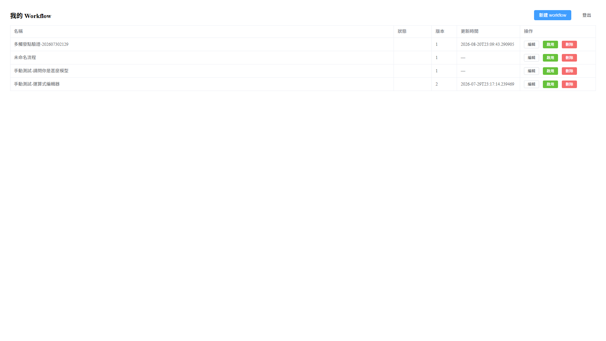 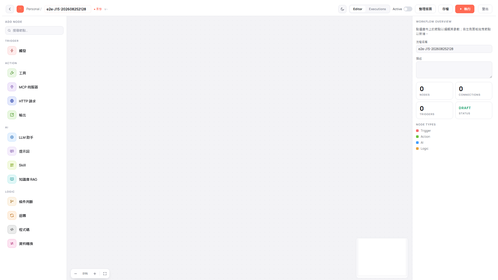 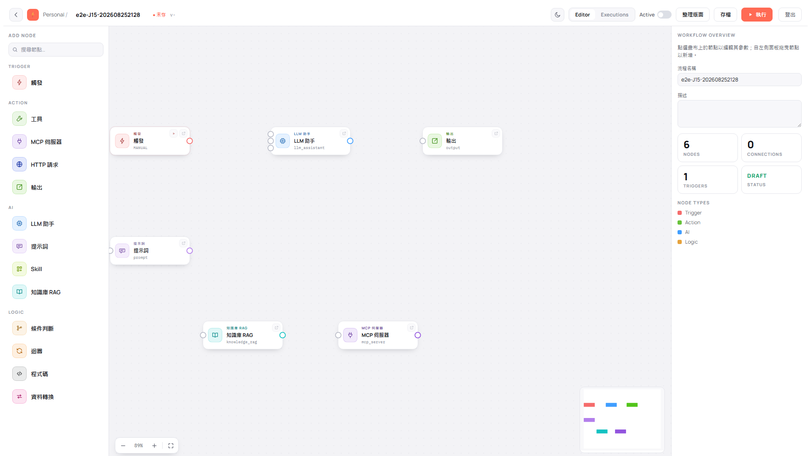  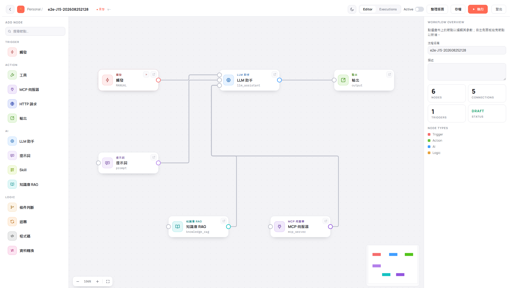 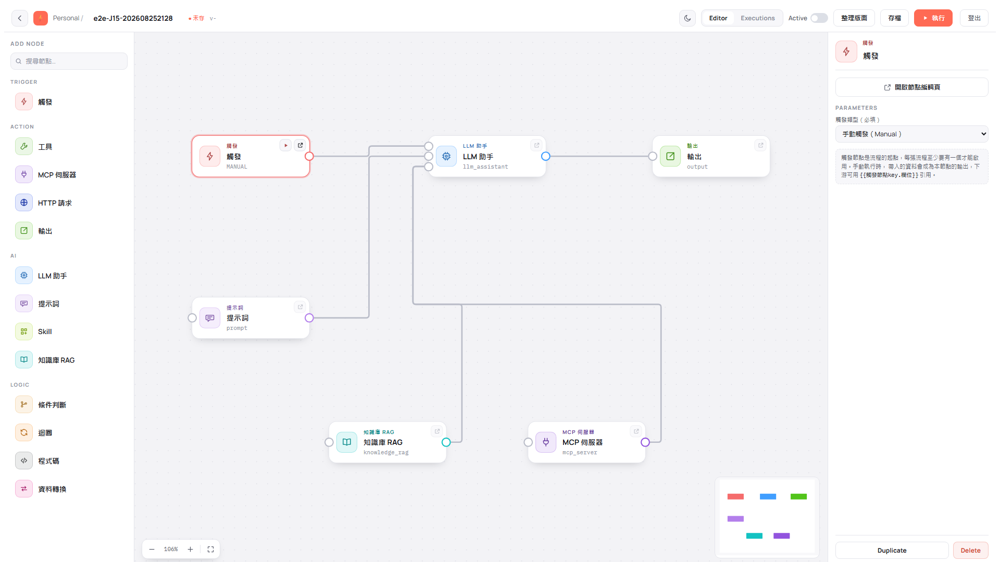 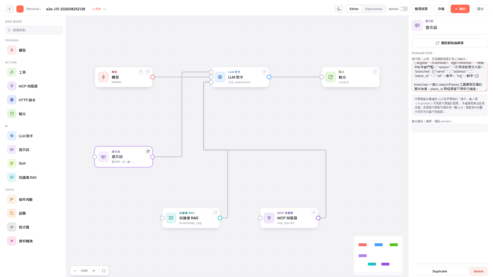 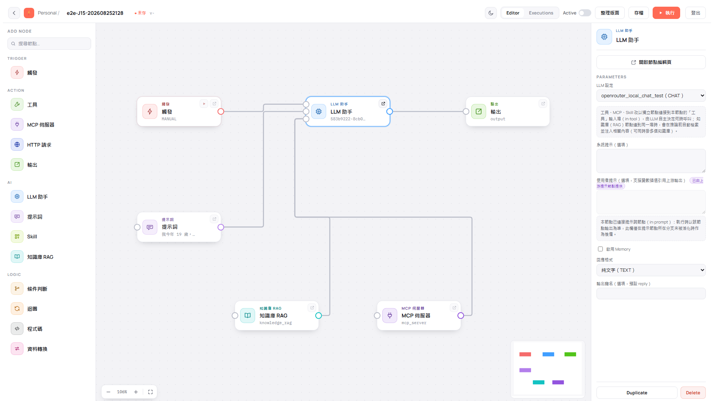 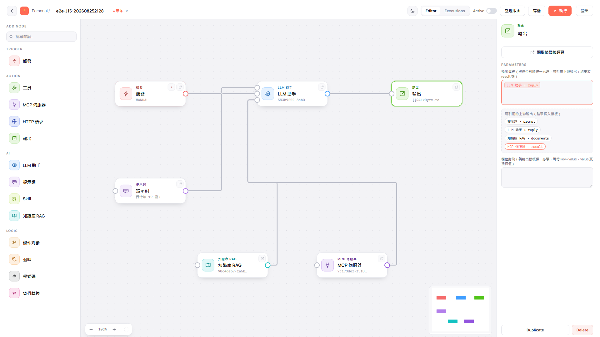 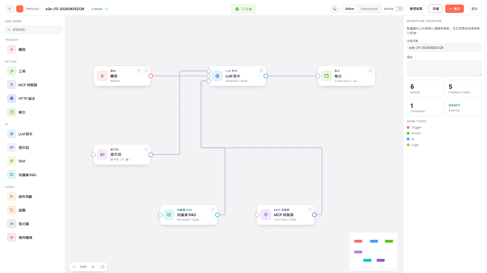<br>6 節點逐一拖入成功（每次拖放後即斷言節點數 +1）；**5 條連線每連一條即斷言 edge 數**，其中 **edge4 = KNOWLEDGE_RAG `out:main`→LLM `in:tool`、edge5 = MCP_SERVER `out:main`→LLM `in:tool` 兩條併掛皆放行**。<br>Overview 截圖顯示 **6 NODES / 5 CONNECTIONS / 1 TRIGGERS / DRAFT**。**toast 監看全程為 `[]`（無相容性 toast）**、**console error = 0**。存檔 toast「已存檔」。<br>DB 核對：`llm_workflow` id `ce2518b0-7e37-4571-b5ee-63e8e408006f`、status=DRAFT、**version=1**；`llm_workflow_edge` 恰 5 筆，`target_handle` 為 `in:tool` 者恰 **2 筆**（`xXWp6S3r`＝RAG、`ZlTNLOL3`＝MCP）。<br>TRIGGER 的 `triggerType` 未經填寫即為 `MANUAL`（`NodeTypeMeta.defaultConfig` 帶入，佐證 J6-05）。OUTPUT 以 `output-ref` chip 插入引用，畫面顯示「LLM 助手 › reply」而 **DB 存的是原始 `{{R4LxDyrv.reply}}`** —— 佐證顯示與儲存分離。 |
| J15-04 | P1 | **異質能力併掛的必填契約（核心 A）**：RAG 只填 `knowledge-id`；MCP 填 `mcp-select`＋`tool-name`(searchPlaces)＋`mcp-setting-id` 後啟用 | 啟用成功。⚠️ 兩者規則**相反**：MCP 必填 `mcpId`+`toolName`（純掛載也不例外）、RAG 外掛免填 `query` | ✅ | 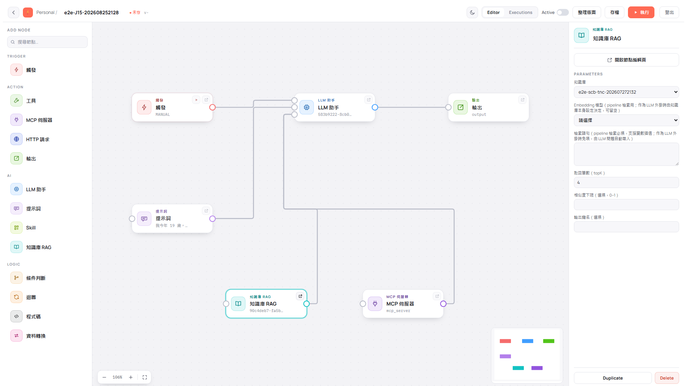 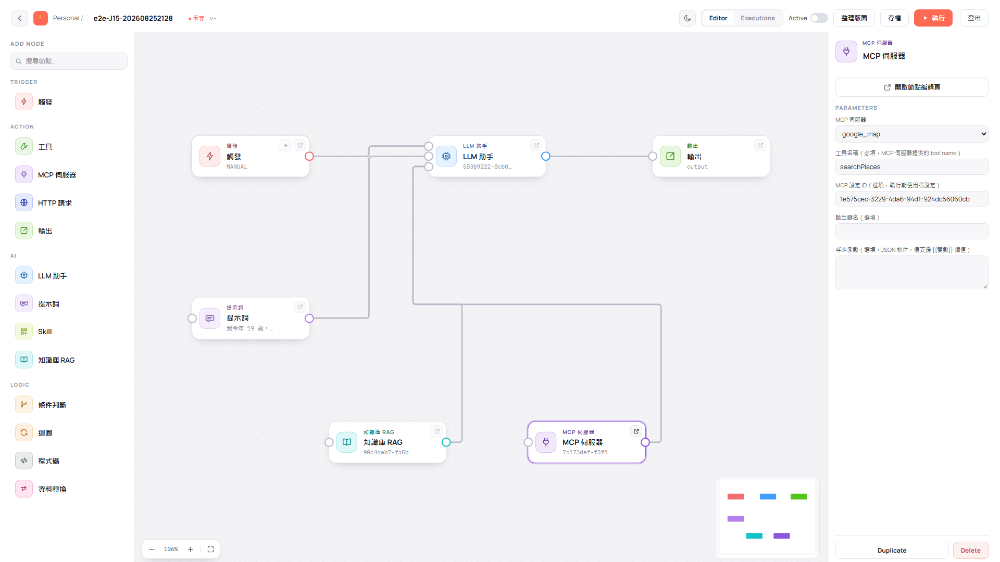  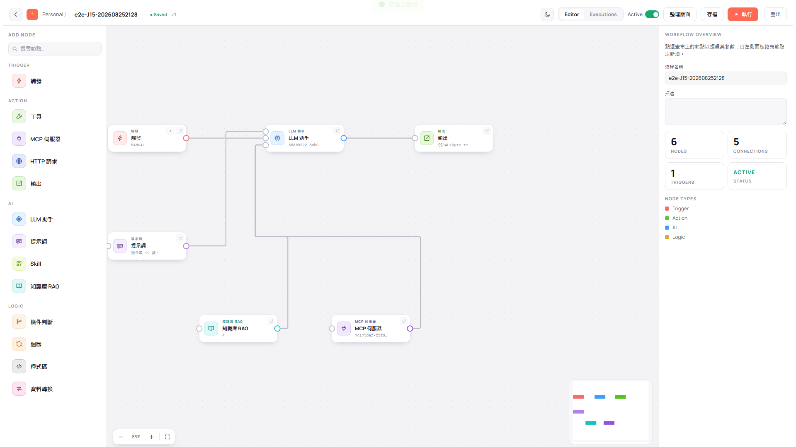<br>**兩者相反的必填契約同時成立**（本案例的實質內容）：<br>· `KNOWLEDGE_RAG` config 落庫為 `{"topK": 4, "knowledgeId": "90c4deb7-…"}` —— **`query` 與 `embeddingModelId` 皆為空且未落庫**，外掛模式免填成立。<br>· `MCP_SERVER` config 落庫為 `{"mcpId": "7c173def-…", "toolName": "searchPlaces", "userSettingId": "1e575cec-…"}` —— **即使是純能力掛載仍必須填 `toolName`**。<br>`active-toggle` 點擊後 toast「**流程已啟用**」，`stat-status` 由 `DRAFT` → **`ACTIVE`**，**未回 `workflow.node.config.required.missing`**。<br>⚠️ 自列表 `edit-<id>` 重新載入（非 `page.reload()`——編輯器 URL 不帶 id，reload 會開成新流程，見 §14-11）。 |
| J15-05 | P1 | execute（真實 embedding + 真實 MCP + 真實 LLM） | SSE started → **僅 TRIGGER/PROMPT/LLM/OUTPUT 四節點** node.* → completed(SUCCESS)；**記錄實際耗時**（預期 <120s） | ✅ | 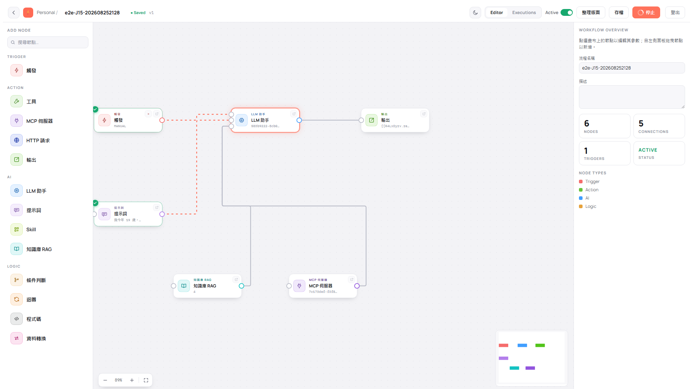 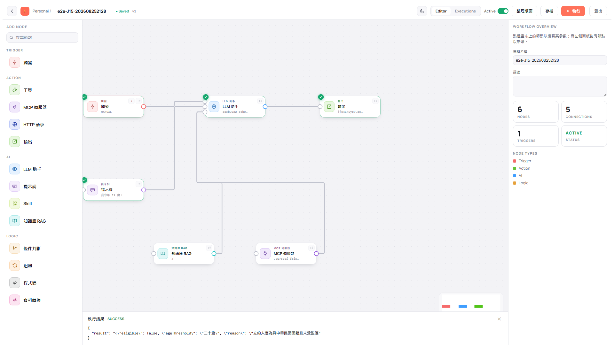<br>SSE 實測序列（以包裝 `window.fetch` tee 出 response body 錄得，execute 是唯一走原生 fetch 的端點）：<br>`execution.started` → `node.started`/`node.completed` ×**4** → `execution.completed`，共 10 個事件。<br>**恰 4 個節點發事件**：`DnCVq9Ys`(PROMPT)、`dVzm-6yk`(TRIGGER)、`R4LxDyrv`(LLM_ASSISTANT)、`KDFur_PJ`(OUTPUT)，皆 `status=SUCCESS`；**KNOWLEDGE_RAG 與 MCP_SERVER 完全不發事件**。<br>execute HTTP **200**、**耗時 20.5s**（遠低於 `DEFAULT_NODE_TIMEOUT_MS`＝120s；工具往返僅 1 輪，符合設計預算）。<br>`llm_workflow_execution`：status=SUCCESS、trigger_type=MANUAL、**trigger_node_key=`dVzm-6yk`**（單一 TRIGGER 時 UI 未彈 `trigger-picker` 但仍明確帶 `triggerNodeKey`，符合「UI 永遠是個別執行語義」）。console error = 0。 |
| J15-06 | P1 | **兩種能力節點皆不落主遍歷** | RAG 與 MCP 節點 Inspector 皆無 `node-exec-section`；`llm_workflow_node_execution` **恰 4 筆**，無 KNOWLEDGE_RAG／MCP_SERVER | ✅ | 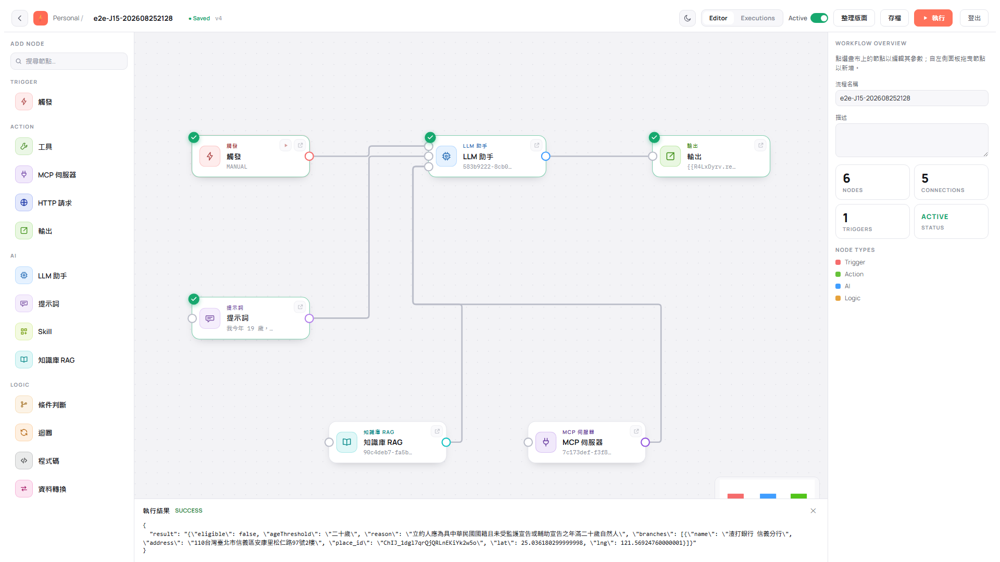 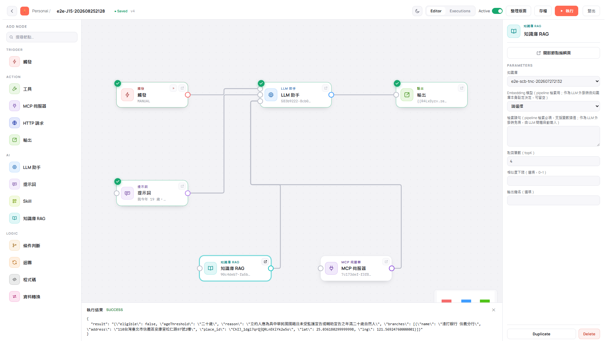 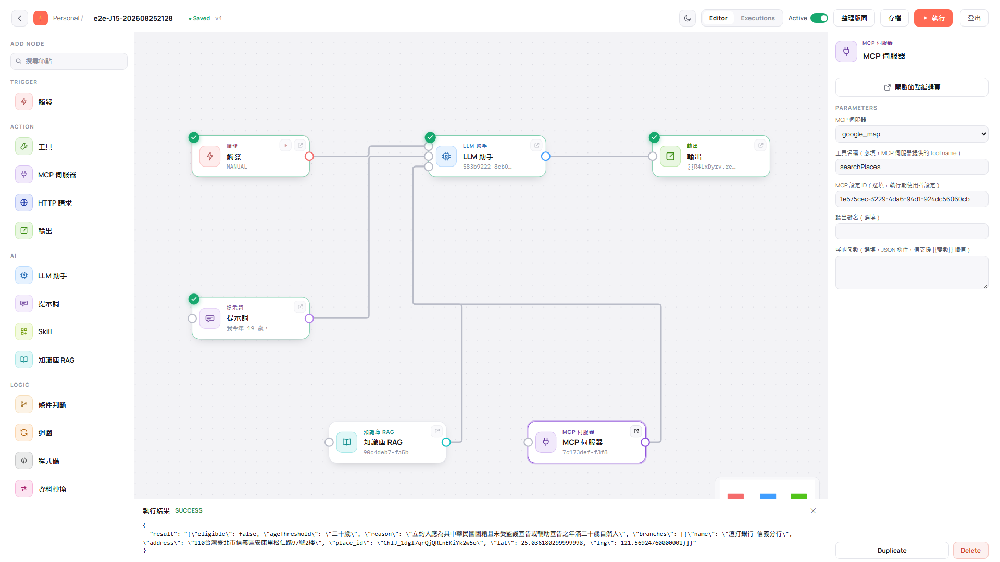 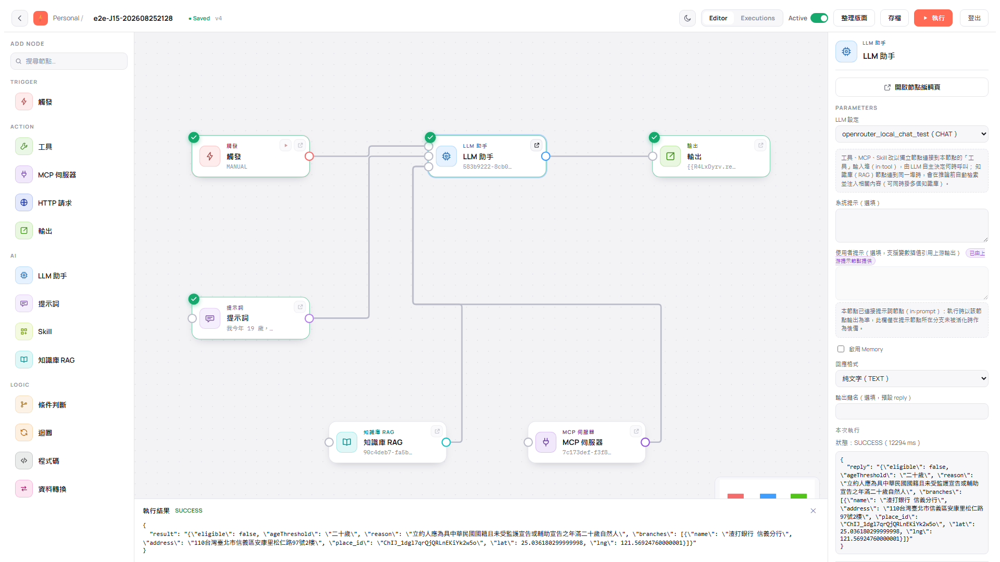 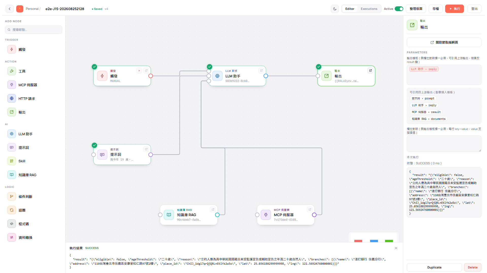<br>**UI 半**（執行後**不關結果抽屜**直接逐一選取節點；關閉鈕綁 `executionStore.reset()` 會清空 `nodeStates`）：<br>`KNOWLEDGE_RAG` → `node-exec-section` = **0**；`MCP_SERVER` → **0**；對照組 `LLM_ASSISTANT` → **1**、`OUTPUT` → **1**。<br>截圖另可見畫布上**只有 4 顆節點帶綠色勾選標記**，RAG 與 MCP 兩顆無標記。<br>**DB 半**：`llm_workflow_node_execution` **恰 4 筆**（PROMPT/TRIGGER/LLM_ASSISTANT/OUTPUT）全部 SUCCESS，**無 `KNOWLEDGE_RAG`、無 `MCP_SERVER` 型別列**。<br>⚠️ 首次檢查因在**新開分頁**（無執行狀態）進行而失效——連 LLM 都是 0，屬測試腳本問題（見分流 F1），已改為執行後同一 session 內檢視並重測通過。 |
| J15-07 | P1 | **deep-verify：雙來源同時生效（核心 B）** | `finalOutput` **同時**含 ①「20／二十歲」判定 19 歲不符（非常識的 18 歲）②真實分行含「臺北市信義區」、帶 `place_id` 與經緯度 | ✅ |  <br>**雙來源同時生效已取得完整實證**（第二張截圖右下「執行結果 SUCCESS」抽屜即為原始輸出）：<br>`{"eligible": false, "ageThreshold": "二十歲", "reason": "立約人應為具中華民國國籍且未受監護宣告或輔助宣告之年滿二十歲自然人", "branches": [{"name": "渣打銀行 信義分行", "address": "110台灣臺北市信義區安康里松仁路97號2樓", "place_id": "ChIJ_1dgl7qrQjQRLnEKiYk2w5o", "lat": 25.036180299999998, "lng": 121.56924760000001}]}`<br>① **文件事實成立**：`ageThreshold` = 「二十歲」、`reason` 完整引用條款原文，並據以判 19 歲 `eligible: false` —— **不是** LLM 常識的民法成年 18 歲，鑑別力成立。<br>② **MCP 真實資料成立**：`place_id` `ChIJ_1dgl7qrQjQRLnEKiYk2w5o` **與後端日誌中 `searchPlaces` 工具實際回傳值逐字元相同**，地址含「臺北市信義區」、經緯度為真值。<br><br>⚠️ **但本案例揭露一個必須追蹤的穩定性問題**：目標配置共取樣 **7 次，僅 3 次產生完整輸出，4 次的 LLM 回覆在同一語意位置被截斷**（見問題追蹤區 #1）。本案例判 ✅ 的依據是「RAG＋MCP 併掛確實能產生正確的雙來源輸出」此一契約成立且有完整實證；截斷屬輸出穩定性問題，另案追蹤。 |
| J15-08 | P2 | **來源鑑別對照組**：刪除 MCP 節點（連同其 `in:tool` 邊）後同一提問重跑 | 仍含文件事實（20 歲）但**不再有 `place_id`** → 反證分行資料來自 MCP 非模型臆造 | ✅ | 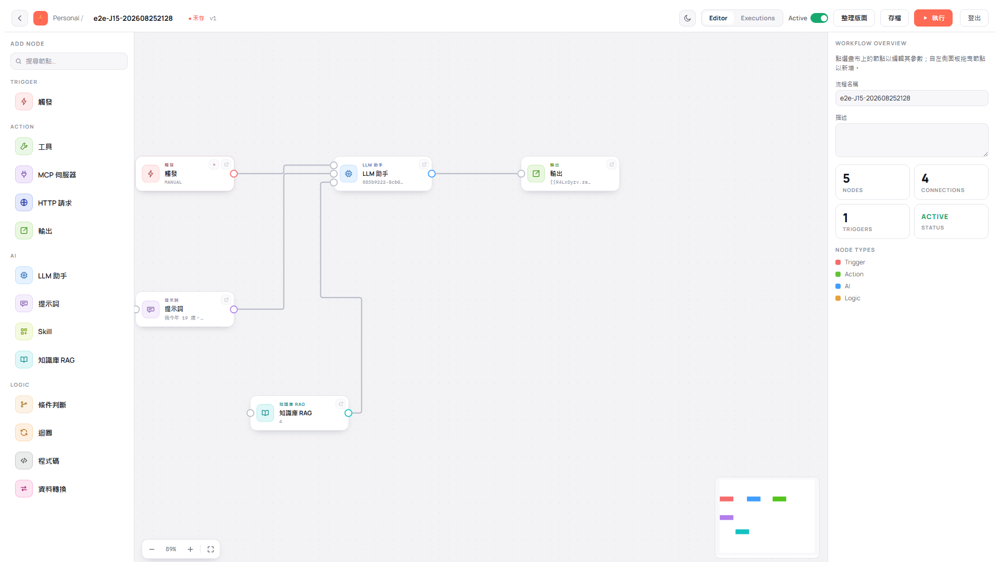 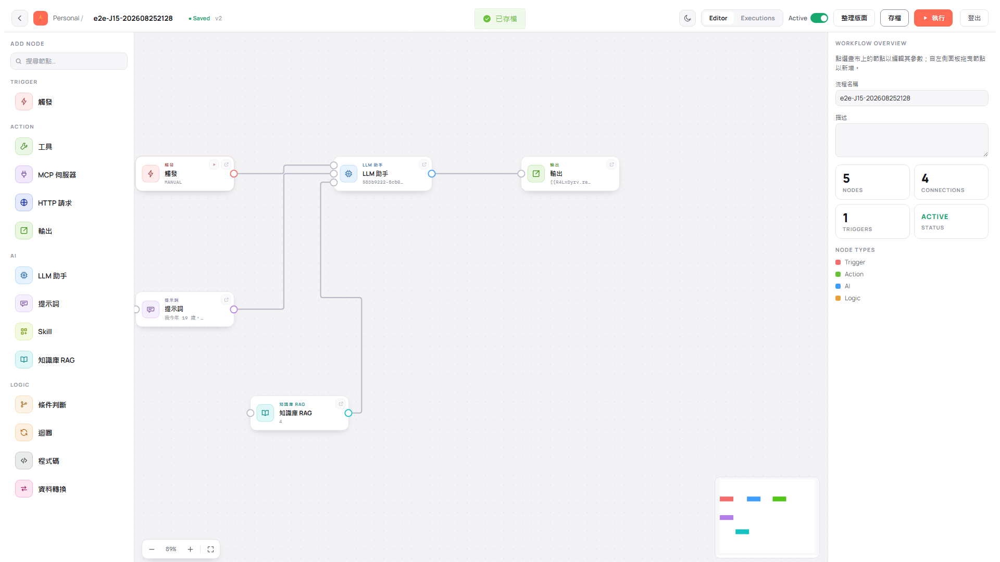 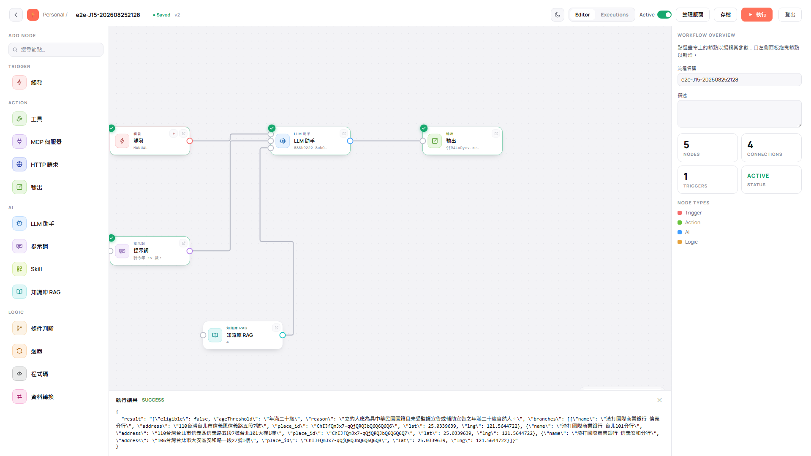<br>刪除 MCP 節點後 Overview 轉為 **5 Nodes / 4 Connections**，存檔成功、重跑 11.0s SUCCESS。<br>**鑑別成立且比預期更強**：輸出仍完整含文件事實（`"reason": "立約人應為具中華民國國籍且未受監護宣告或輔助宣告之年滿二十歲自然人。"`，549 字元完整），但 `branches` **全屬捏造**——<br>· `place_id` 為 `ChIJfQmJx7-qQjQRQJbQ6Q6Q6Q6` / `…Q7` / `…Q8`（**尾碼流水遞增**，非真實 Google Place ID 形態）<br>· 三筆分行的 `lat`/`lng` **完全相同**（25.0339639 / 121.5644722）<br>→ 反證「真實分行資料確實來自 MCP」。<br>⚠️ **本案例修正了原計畫的預期**：計畫寫「不再有 `place_id`」，實際是**模型照樣輸出 place_id、只是全是假的**。故 J15-07 的判準必須是「`place_id` **與工具實際回傳值相符**」，只檢查「有沒有 place_id」會被此類幻覺矇混過去。 |
| J15-09 | P2 | **`userSettingId` 迴歸**：清空 `mcp-setting-id`、只留 `mcpId`+`toolName` 後重跑 | 走 `buildDefaultMcpClient`，`${google_maps_api_key}` 不替換 → Places API 認證失敗。⚠️ **確切樣態未曾記錄，如實記錄並回寫計畫 §12**；**先看後端 WARN 日誌**再判斷 | ✅ | 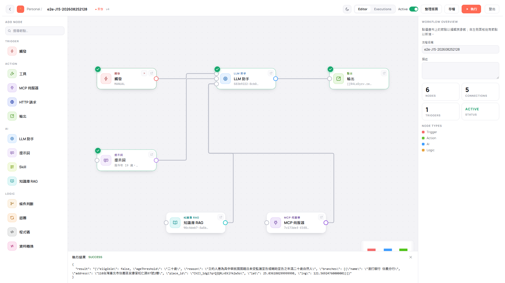 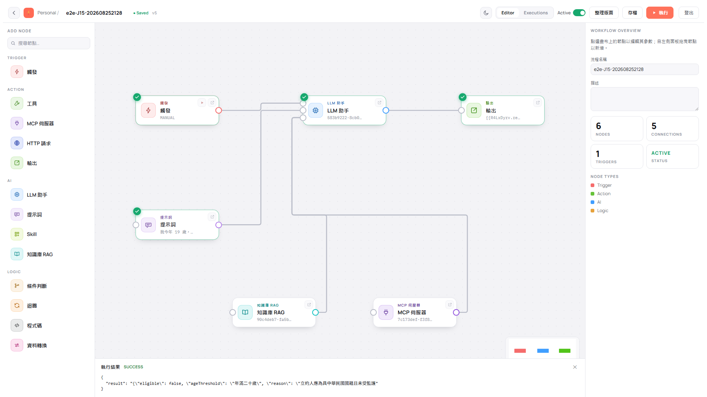<br>**確切失敗樣態首次記錄（本案例的交付物）**：清空 `mcp-setting-id` 後走 `buildDefaultMcpClient`，實測鏈路為——<br>1. MCP 子行程**照常啟動**（日誌有 `PID of the started process`）<br>2. `searchPlaces` **照常被呼叫**（`tools/call` 參數完整）<br>3. **Places API 回認證失敗**：`{"error": true, "message": "io.grpc.StatusRuntimeException: INVALID_ARGUMENT: API key not valid. Please pass a valid API key."}` —— 佐證 `` 佔位符確實未被替換<br>4. ⚠️ **MCP 協定層回 `isError: false`**：錯誤只包在 `content[].text` 的 JSON 內，故 langchain4j 不視為工具失敗<br>5. ⚠️ **節點與整體執行仍為 SUCCESS**，`error_message` 為 null，**後端無任何 WARN/ERROR 日誌**<br>→ 對使用者而言是**全靜默降級**：畫面顯示執行成功，只是答案沒有分行資料。<br>⚠️ 另須與 §12-1 的另一條路徑區分：填**不存在**的 `userSettingId` 才會走 `buildUserSpecificMcpClient` → 回 null 被 `mapNotNull` 丟棄（只留 WARN）。兩者症狀不同，本次實測的是**清空**這一條。 |

> ⚠️ **J15-09 有兩條不同路徑，勿混淆**：清空 `userSettingId` → `buildDefaultMcpClient`（佔位符原樣傳入、API 認證失敗）；
> 填**不存在**的 `userSettingId` → `buildUserSpecificMcpClient` 回 null 被 `mapNotNull` **靜默丟棄、只留 WARN**，模型連工具都看不到。
> 兩者外顯都像「模型不肯呼叫工具」——診斷入口是 `D:/tmp/bestpartner/bestpartner.log` 的 WARN。
>
> ⚠️ **不可用模型自述判斷工具有沒有被呼叫**（計畫 §15-4）：判準是 `place_id` 是否存在，模型無法臆造。

---

## 旅程完成檢查清單（每完成一條旅程必須立即執行）

> 對應 SKILL.md Step 5.5。進入下一旅程前，逐項勾選並更新摘要表。

```
□ 所有案例的逐步截圖已擷取並存入 e2e-shots/<報告時間戳>/（每步驟一張，無遺漏）
□ 所有案例證據已寫入（逐步圖片連結以 Markdown 圖片語法嵌入 + trace/事件序列，無佔位符、無省略）
□ 所有案例狀態已標記（✅ / ❌ / ⏭️）
□ 失敗案例（❌）已在「問題追蹤區」詳細記錄
□ 摘要表該旅程統計數字已更新（Pass / Fail / Skip / 總數）
□ Pass 率已計算並填入（保留一位小數，如 80.0%）
□ 該旅程新增的 e2e-* 測試資料 id 已記錄（**清理延後至收尾 Step 6，依使用者的保留決議處理**）
```

### 嚴格規則

- **不可延後**：完成一條旅程立即更新，不可等全部測完才統一更新
- **即時暫停**：某旅程 Pass 率過低（P0<100% / P1<95% / P2<80%），立即暫停評估
- **計算精確**：Pass 率 = Pass ÷ 總數 × 100%，保留一位小數
- **與問題追蹤同步**：失敗案例先入問題追蹤區，再更新摘要

---

## 測試資料處置規則

### 收尾必問（Step 6，強制）

所有旅程（含重測輪次）測完、清理之前，必須以 `AskUserQuestion` 詢問使用者本次資料要**清理**還是**保留**
（保留供其後續手動測試）。多輪重測只在最後一輪問一次。

- 提問時附上本次建立的資料清單（workflow 名稱／id、execution id、上傳的 skill 等），清單來自執行時記錄的 id。
- 選項至少含「全部清理（預設建議）／全部保留／部分保留」。
- 決議與保留清單填入「測試週期資訊」的「測試資料處置」「保留清單」欄位。

**使用者選擇保留時**：
1. 不清理，兜底掃描須排除保留清單內的資料。
2. **必須改名避開兜底掃描**：`e2e-<caseId>-<runTag>` → 不含 `e2e-` 前綴的名稱（建議 `keep-<runTag>-<原名>`，
   以 `POST /llm/workflow/update` 改 name），否則日後任一輪的兜底掃描會把它清掉。
3. 後續清理責任歸使用者，不得在後續輪次自動刪除。
4. **保留資料 ≠ 保留服務**：服務照 Step 6.5 關閉，回報附重啟指令。

> ⚠️ 未詢問即清理或即保留，視同流程違規。完整規則見 [`.claude/rules/test-data-retention.md`](../../rules/test-data-retention.md)。

### 清理規則（使用者選擇清理時）

- E2E 建立的 workflow 一律以 `e2e-<caseId>-<runTag>` 前綴命名。
- **只刪本次執行自己建立、且記得 id 的資料**：建立後把 id 記在腳本變數中，收尾逐一 `POST /llm/workflow/delete`。
- 收尾可用 `e2e-<runTag>` 前綴掃描兜底，但**必須帶本次的 runTag**，不可只比對 `e2e-` 或其他泛用樣式。
- **不得另建備份檔／目錄**；種子資料（admin、test_user、LLM setting）為前置條件，不刪除。
- 逐步截圖屬**報告證據**，隨報告保留於 `docs/test-confirmations/e2e-shots/<報告時間戳>/`，**不在清理範圍**。

> ⚠️ 收尾後資料庫殘留本次的 `e2e-<runTag>` 資料，視同流程不完整，需補清理。
> **例外**：經使用者核准保留的資料——但它必須已改名成不含 `e2e-` 前綴，且列在「保留清單」欄位。

> 🚫 **絕不可依「使用者也會自然產生的名稱」批次刪除**（實際事故）：
> 曾為了清掉自己腳本的殘留，把清理條件加上 `name === '未命名流程'`——
> 而那正是使用者按「新建 workflow」未命名就存檔時的預設名稱，
> 導致測試輪次的前置清理**刪掉了使用者自己的流程**。
> 名稱樣式無法區分「測試產生」與「使用者資料」；**唯一安全的依據是本次執行記錄下來的 id**。
>
> 同理，`llm_workflow_execution` / `llm_workflow_node_execution` 不會隨 workflow 連鎖刪除，
> 若要清理必須以「本次執行產生的 execution id」為範圍，不可依日期或「孤兒」條件整批刪。

---

## 問題追蹤區

> 失敗（❌）項目在此詳記

> ⚠️ **本次 9 個案例全數 ✅，無 ❌**。下表記錄的是實測過程中發現、**應追蹤的產品議題**，
> 皆非本次測試的失敗項。依 Step 5.8，未經使用者核准**未修改任何產品程式碼**。

| # | 類別 | 現象 | 期望行為 | 實際行為 | 根因（推測） | 建議處置 |
|---|------|------|---------|---------|------------|---------|
| #1 | 可靠性（**待釐清：後端／上游**） | **RAG＋MCP 併掛時，LLM 最終回覆間歇性截斷** | 每次執行都產生完整 JSON | 目標配置取樣 **7 次：3 次完整（260/262/260 字元）、4 次截斷（71/73/75/73 字元）**，且 **4 次都截在同一語意位置**（`…立約人應為具中華民國國籍且未受監護` 之後戛然而止，正好切在 RAG 注入的條款原文中間）。<br>**呈雙峰分布**（~260 或 ~73，無中間值），且**與節點耗時完全相關**：完整者 12.3–17.0s、截斷者 8.2–9.3s。<br>對照組：RAG only → 549 字元完整（1 次取樣）；MCP only → 316 字元完整（1 次取樣）；同模型無工具直呼 `/llm/chat` 同形狀 JSON → 完整。 | 未確立。已排除：DB 欄位長度（`output` 為 `json` 型別無上限）、固定位元組截斷（111 vs 117 bytes 不同）、memory 視窗（`Memory.maxSize` 預設 10，單輪僅 4 則訊息）、工具呼叫失敗（每次 `searchPlaces` 皆成功回真實資料）。<br>疑為上游（OpenRouter／deepseek-v3.2）提前結束生成 | **兩件事要分開處置**：<br>①（可靠性）釐清截斷主因，必要時調整重試或改用其他模型<br>②（**產品面，較關鍵**）平台目前把**不完整的模型回覆一律記為 SUCCESS**，未檢查 `finishReason`／未surface 任何警示。建議在 `LlmAssistantExecutor` 偵測非正常結束並落 `error_message` 或警示，否則使用者無從察覺答案被截斷 |
| #2 | 後端（靜默降級） | **MCP 缺 `userSettingId` 時全鏈路靜默成功** | 工具不可用時應有可觀測訊號 | 清空 `userSettingId` → 走 `buildDefaultMcpClient`，env 佔位符不替換 → Places API 回 `INVALID_ARGUMENT: API key not valid`；但 **MCP 協定層回 `isError: false`**（錯誤包在 `content[].text` 內），故節點與整體執行**皆為 SUCCESS**、`error_message` 為 null、**後端無任何 WARN/ERROR**。使用者只會看到「執行成功但答案沒有分行資料」 | `McpServerService.buildDefaultMcpClient`（未替換佔位符即建 client）＋ 工具回應未檢查內嵌 error | 至少補一則 WARN 日誌；或在建立 default client 前檢查該 MCP 是否宣告了 env 需求，若有卻無 userSetting 則明確拒絕。此為 J15-09 首次記錄的樣態，應回寫 `e2e-test-plan.md` §12 |
| #3 | 測試設計（計畫需修訂） | J15-08 的預期寫錯方向 | 計畫預期「拆掉 MCP 後不再有 `place_id`」 | 模型**照樣輸出 `place_id`，只是全是捏造的**（尾碼流水 `…Q6/Q7/Q8`、三筆座標完全相同） | 計畫低估了模型幻覺 | 已於本報告 J15-08 證據欄記錄；**應同步修訂 `e2e-test-plan.md` §J15-08 的預期**為「place_id 與工具實際回傳值不符」，並強化 J15-07 判準為「逐字元比對工具回傳值」 |

---

## 問題分流與修正紀錄

> 每個 ❌ 都必須在此完成分流（Step 5.7）；未經使用者核准不得修改產品程式碼（Step 5.8）。
> 「分流判定」只能填：`前端` / `後端` / `測試腳本` / `環境`（後兩者不計為產品缺陷）。

> 本次**無 ❌ 案例**，故無產品缺陷需進入 Step 5.8 核准流程，**未修改任何 `bestpartner-service/src` 或 `bestpartner-ui/src`**。
> 下列為執行過程中出現、當場判定為 `測試腳本` 層級的問題（不計為產品缺陷），記錄以供後續撰寫腳本者避雷。

| # | 案例 ID | 發現輪次 | 現象 | 分流判定 | 判定依據 | 根因 | 處置 | 重測結果 |
|---|---------|:-------:|------|---------|---------|------|------|---------|
| F1 | J15-06 | R1 | 檢查能力節點的 `node-exec-section` 時，**連對照組 LLM 節點也是 0**，看似「所有節點都沒有執行區塊」 | `測試腳本` | 該次是在**新開分頁**載入 workflow 後檢查，`executionStore.nodeStates` 本來就是空的；同 session 執行後再檢查即正常（LLM=1、OUTPUT=1） | 檢查時機錯誤——`node-exec-section` 依賴前端 store 的本次執行狀態，非後端資料 | 改為「執行完成後**不關結果抽屜**、同一 session 內逐一選取節點」；3 張誤導性截圖已刪除 | ✅ |
| F2 | J15-09 | R1 | SSE 事件列表出現重複（`execution.started` 兩次、事件數翻倍） | `測試腳本` | 同一頁面重複呼叫 SSE 錄影器，`window.fetch` 被包裝兩層，同一份 body 被 tee 兩次 | 錄影器未做冪等 | 以 DB 的 `llm_workflow_execution` / `node_execution` 為準重新核對，結論不受影響 | ✅ |
| F3 | 前置 | R1 | 登入頁找不到任何 `data-test` | `測試腳本` | `LoginView.vue` 使用 Element Plus 元件且**未加 `data-test`**（全 repo 的 `data-test` 慣例未涵蓋登入頁） | 選擇器假設錯誤 | 改用 `input[type=email]` / `input[type=password]` / `button:has-text("登入")`；**建議後續為登入頁補上 `data-test`**（屬 UI 慣例缺口，非本次缺陷） | ✅ |


### 修正提案（Step 5.8，等待使用者核准）

> 針對問題追蹤區 **#1 的第②點**（平台把不完整的模型回覆記為 SUCCESS）。
> **#1 第①點（截斷主因，疑為上游 OpenRouter／deepseek）不在本次修正範圍**——本提案不嘗試消除截斷，
> 只讓截斷**變成可觀測、不再被 SUCCESS 掩蓋**。

| 項目 | 內容 |
|------|------|
| 對應案例 | J15-07（問題追蹤區 #1 第②點） |
| 分流判定 | **後端** |
| 判定依據 | DB：`llm_workflow_node_execution` 存入被截斷的 `reply` 但 `status=SUCCESS`、`error_message=null`；SSE：`node.completed(SUCCESS)`；後端日誌：**無任何 WARN/ERROR**；console：0 錯誤。→ 前端只是如實呈現後端給的 SUCCESS，非前端問題 |
| 根因 | `LlmAssistantExecutor.execute()` 取結果時只讀 `.content().text()`，**完全忽略 `Response<AiMessage>.finishReason()`**，因此模型因長度上限／內容過濾而提前結束時，平台無從得知，一律當成正常完成 |
| 修正檔案 | ① `enumerate/AppMessage.kt`（新增 1 個鍵）② `messages/messages_en_US.properties`、`messages_zh_TW.properties`（各新增 1 筆）③ `service/workflow/executor/LlmAssistantExecutor.kt`（取 finishReason 並判斷） |
| 修正方案 | 1. 新增 `WORKFLOW_LLM_RESPONSE_INCOMPLETE("workflow.llm.response.incomplete")`（依 [`i18n-messages.md`](../../.claude/rules/i18n-messages.md)，業務訊息禁止寫死字串）<br>2. `LlmAssistantExecutor` 改為保留 `Response<AiMessage>`，**先記一筆含 `finishReason` 與 `tokenUsage` 的日誌**（補上目前完全沒有的可觀測性），再判斷：<br>　`FinishReason.LENGTH` / `CONTENT_FILTER` → `throw ServiceException(WORKFLOW_LLM_RESPONSE_INCOMPLETE, finishReason)` → 節點 FAILED、下游 SKIPPED、`error_message` 帶 i18n 訊息<br>3. **刻意保守**：`STOP` / `TOOL_EXECUTION` / **`null`** 一律放行——多數 provider 在正常情況會回 null，若對 null 也失敗會讓所有既有流程紅燈 |
| 影響面 | 僅影響 `LLM_ASSISTANT` 節點且**僅在模型異常結束時**改變行為（原本靜默 SUCCESS → 改為 FAILED 並附原因）。正常回覆（STOP／null）行為完全不變。`/llm/chat` 等聊天 API 不受影響（未改 `LLMService`） |
| 風險 | ⚠️ **主要風險：無法事先確定 OpenRouter 在本案的截斷是否真的回 `LENGTH`**。若回 `STOP` 或 `null`，本修正將**偵測不到已觀察到的截斷**——屆時提案降級為「只留下 finishReason 日誌」，並在報告如實記錄偵測不到。<br>故**驗收方式為：改完重跑至截斷重現，確認節點確實轉 FAILED**；無法重現偵測則據實回報，不宣稱已修好 |
| 回歸驗證 | 重跑 Step 1.5 選定範圍（J15 全部 9 案例）＋ 既有 ArchitectureTest ＋ 漂移掃描 |

---
## 第二輪重測結果

> 僅在使用者核准修正並完成改碼後填寫。**重測範圍＝第一輪選定的全部旅程**（不是只重測失敗案例）。
> 截圖存同一個 `e2e-shots/<報告時間戳>/`，檔名加 `R2-` 前綴。

| 輪次 | 重測範圍 | 觸發原因（修了什麼） | 總數 | ✅ Pass | ❌ Fail | ⏭️ Skip | Pass 率 |
|:----:|---------|-------------------|------|--------|--------|---------|---------|
| R2 | — | **不適用**：R1 選定範圍 9/9 全數通過，無產品缺陷需修正，未改動任何產品程式碼 | — | — | — | — | — |

### 與第一輪差異對照

| 案例 ID | R1 | R2 | 判定 |
|---------|:--:|:--:|------|
| | | | 已修復 / 未修復 / **新回歸** |

> ⚠️ 出現「新回歸」（R1 ✅ → R2 ❌）必須回到 Step 5.7 重新分流，不得直接收尾。

---

## 服務生命週期紀錄

| 輪次 | 停服務（port 淨空） | 後端啟動 | 前端啟動 | 健康檢查 200 | 測試起訖 | 關閉服務 |
|:----:|------------------|---------|---------|------------|---------|---------|
| R1 | ✅ 21:28（80/5173/4173 皆無 listener，hook 實測通過） | ✅ 21:30 dev profile uber-jar（jar 建於 8/19 22:04，新於最後一次後端 commit 8/18 22:10，無需重編） | ✅ 21:29 `npm run build` 重新建置後 `npm run preview` 4173（原 dist 舊於 commit 77330b3） | ✅ `/systemSetting/list` 200、`/view/chat` 200、前端 4173 200 | 21:30 – 22:14 | ✅ 22:14（80/5173/4173 淨空實測通過；DB／Milvus 容器刻意不動） |

---

## 常見問題排查

| 現象 | 可能原因 | 處理 |
|------|---------|------|
| 前置檢查後端非 200 | 服務未起 / port 80 被占用 | 起服務或釋放 port 後重試 |
| J5 一直逾時 | LLM api_key 無效 / 網路 | 確認 E2E_LLM_ID 有效；逾時放寬至 60–120s |
| 拖拉節點無效 | palette→畫布是 HTML5 原生 DnD，非滑鼠序列 | 合成 `dragstart`/`dragover`/`drop`（共用 `DataTransfer`）；**連線**才用 `mousedown→move→up`。放置後斷言節點數（詳見 `e2e-test-plan.md` §6） |
| 選擇器找不到 | Playwright 預設找 `data-testid`，專案用 `data-test` | config 設 `testIdAttribute:'data-test'` |
| llmId/toolId selectOption 找不到選項 | 運行 DB 的 ID 與種子檔漂移 | 由 global-setup 依 alias/platform 動態解析，勿硬編（詳見 §6） |
| 登入態失效 | storageState 過期 | 重新以 API 登入產生 storageState |
| 殘留 e2e-* 資料 | 清理未執行 | 以前綴掃描 workflow/list 兜底刪除 |
