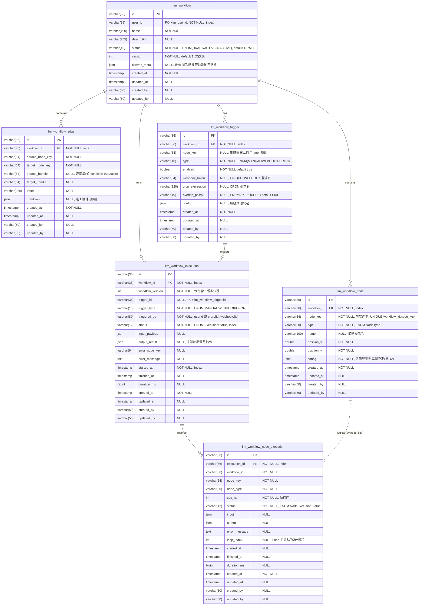
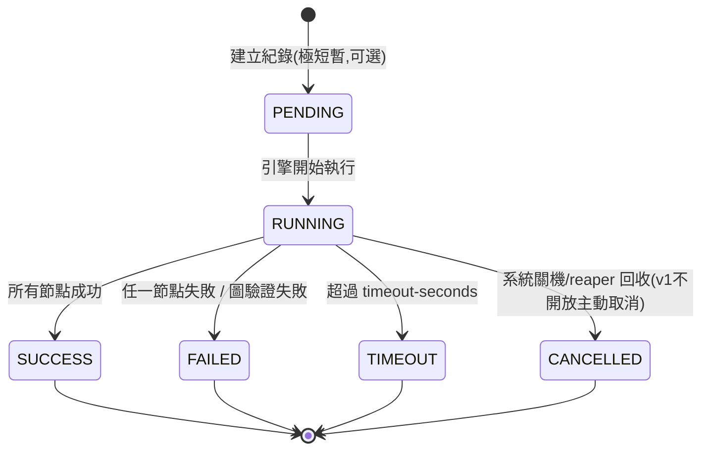
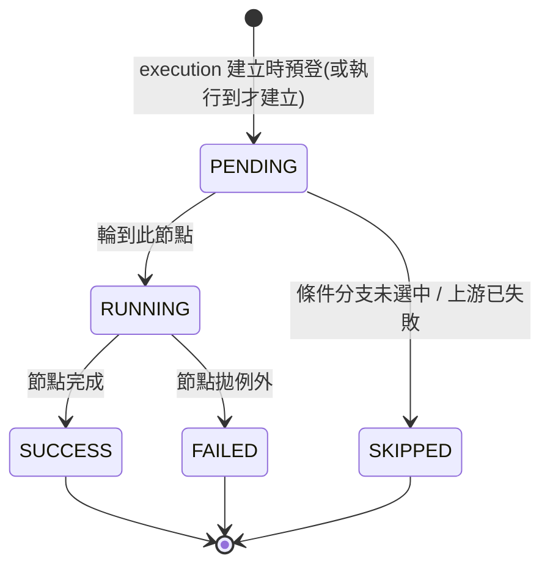

# BestPartner 視覺化 Workflow 引擎 v1 — 系統設計（system-design.md）

> 對齊技術棧：Quarkus 3.21 + Kotlin 2.1 + PostgreSQL + JDK 21 ｜ 套件根：`tw.zipe.bastpartner`
> 對齊既有風格：entity 繼承 `BaseEntity`（提供 `created_at` / `updated_at` / `created_by` / `updated_by`）、PK 為 `varchar(36)` UUID（`@GeneratedValue(strategy = GenerationType.UUID)`）、JSON 欄位以 `@JdbcTypeCode(SqlTypes.JSON)` 儲存、enum 以 `@Enumerated(EnumType.STRING)` 存字串、API 回應包 `ApiResponse<T>`、JWT 權限以 `@Authenticated` / `@RolesAllowed`。
> 業務 AC 見同目錄 `requirements.md`。

---

## 0. 命名與對應規劃

| 層 | 檔名（建議） | 套件路徑 | 標註 |
|----|------------|---------|------|
| Entity | `WorkflowEntity.kt` 等（見下） | `tw.zipe.bastpartner.entity` | `@Entity` 繼承 `BaseEntity` |
| Repository | `WorkflowRepository.kt` 等 | `tw.zipe.bastpartner.repository` | `@ApplicationScoped` 繼承 `BaseRepository` |
| Service | `WorkflowService.kt`、`WorkflowExecutionService.kt`、`WorkflowEngine.kt` | `tw.zipe.bastpartner.service` | `@ApplicationScoped` |
| Resource | `WorkflowResource.kt` | `tw.zipe.bastpartner.resource` | `@Path("/llm/workflow")` |
| DTO | `WorkflowDTO.kt`、`WorkflowNodeDTO.kt`、`WorkflowEdgeDTO.kt`、`WorkflowExecutionDTO.kt` 等 | `tw.zipe.bastpartner.dto` | `@Serializable` |
| Enum | `WorkflowStatus.kt`、`NodeType.kt`、`TriggerType.kt`、`ExecutionStatus.kt`、`NodeExecutionStatus.kt` | `tw.zipe.bastpartner.enumerate` | — |
| Model（JSON config 結構） | `model/workflow/*.kt` | `tw.zipe.bastpartner.model.workflow` | — |
| Scheduler | `WorkflowCronScheduler.kt` | `tw.zipe.bastpartner.service` | Quarkus Scheduler |

> 資料表名稱統一前綴 `llm_workflow`（與既有 `llm_*` 表一致）。

---

## 1. Mermaid ERD



### 1.1 索引與約束建議

| 資料表 | 約束 / 索引 |
|--------|------------|
| `llm_workflow` | PK(`id`)；index(`user_id`)；index(`status`) |
| `llm_workflow_node` | PK(`id`)；**UNIQUE(`workflow_id`,`node_key`)**；index(`workflow_id`) |
| `llm_workflow_edge` | PK(`id`)；index(`workflow_id`)；index(`workflow_id`,`source_node_key`) |
| `llm_workflow_trigger` | PK(`id`)；**UNIQUE(`webhook_token`)**；index(`workflow_id`)；index(`type`,`enabled`)（cron 掃描用） |
| `llm_workflow_execution` | PK(`id`)；index(`workflow_id`,`started_at`)；index(`status`) |
| `llm_workflow_node_execution` | PK(`id`)；index(`execution_id`)；index(`execution_id`,`seq_no`) |

> FK 在 PostgreSQL DDL 中可顯式宣告（既有專案多以邏輯關聯為主、未必每張表都建實體 FK；建議至少對 `execution_id`、`workflow_id` 建索引）。刪除 workflow 時於 service 層交易內手動連鎖刪除（對齊既有作法）。

### 1.2 DDL 草稿（PostgreSQL，置於 `docs/sql/bestpartner-ddl.sql`）

```sql
DROP TABLE IF EXISTS "llm_workflow_node_execution";
DROP TABLE IF EXISTS "llm_workflow_execution";
DROP TABLE IF EXISTS "llm_workflow_trigger";
DROP TABLE IF EXISTS "llm_workflow_edge";
DROP TABLE IF EXISTS "llm_workflow_node";
DROP TABLE IF EXISTS "llm_workflow";

CREATE TABLE "llm_workflow" (
    "id"          varchar(36)  NOT NULL,
    "user_id"     varchar(36)  NOT NULL,
    "name"        varchar(100) NOT NULL,
    "description" varchar(255) DEFAULT NULL,
    "status"      varchar(10)  NOT NULL DEFAULT 'DRAFT',
    "version"     int          NOT NULL DEFAULT 1,
    "canvas_meta" json         DEFAULT NULL,
    "created_at"  timestamp    NOT NULL,
    "updated_at"  timestamp    NULL DEFAULT NULL,
    "created_by"  varchar(50)  DEFAULT NULL,
    "updated_by"  varchar(50)  DEFAULT NULL,
    PRIMARY KEY ("id")
);
CREATE INDEX "idx_workflow_user" ON "llm_workflow" ("user_id");
CREATE INDEX "idx_workflow_status" ON "llm_workflow" ("status");

CREATE TABLE "llm_workflow_node" (
    "id"          varchar(36)  NOT NULL,
    "workflow_id" varchar(36)  NOT NULL,
    "node_key"    varchar(64)  NOT NULL,
    "type"        varchar(30)  NOT NULL,
    "name"        varchar(100) DEFAULT NULL,
    "position_x"  double precision NOT NULL,
    "position_y"  double precision NOT NULL,
    "config"      json         NOT NULL,
    "created_at"  timestamp    NOT NULL,
    "updated_at"  timestamp    NULL DEFAULT NULL,
    "created_by"  varchar(50)  DEFAULT NULL,
    "updated_by"  varchar(50)  DEFAULT NULL,
    PRIMARY KEY ("id"),
    UNIQUE ("workflow_id", "node_key")
);
CREATE INDEX "idx_workflow_node_wf" ON "llm_workflow_node" ("workflow_id");

CREATE TABLE "llm_workflow_edge" (
    "id"              varchar(36)  NOT NULL,
    "workflow_id"     varchar(36)  NOT NULL,
    "source_node_key" varchar(64)  NOT NULL,
    "target_node_key" varchar(64)  NOT NULL,
    "source_handle"   varchar(64)  DEFAULT NULL,
    "target_handle"   varchar(64)  DEFAULT NULL,
    "label"           varchar(255) DEFAULT NULL,
    "condition"       json         DEFAULT NULL,
    "created_at"      timestamp    NOT NULL,
    "updated_at"      timestamp    NULL DEFAULT NULL,
    "created_by"      varchar(50)  DEFAULT NULL,
    "updated_by"      varchar(50)  DEFAULT NULL,
    PRIMARY KEY ("id")
);
CREATE INDEX "idx_workflow_edge_wf" ON "llm_workflow_edge" ("workflow_id");

CREATE TABLE "llm_workflow_trigger" (
    "id"              varchar(36)  NOT NULL,
    "workflow_id"     varchar(36)  NOT NULL,
    "node_key"        varchar(64)  DEFAULT NULL,
    "type"            varchar(10)  NOT NULL,
    "enabled"         boolean      NOT NULL DEFAULT true,
    "webhook_token"   varchar(64)  DEFAULT NULL,
    "cron_expression" varchar(120) DEFAULT NULL,
    "overlap_policy"  varchar(10)  DEFAULT 'SKIP',
    "config"          json         DEFAULT NULL,
    "created_at"      timestamp    NOT NULL,
    "updated_at"      timestamp    NULL DEFAULT NULL,
    "created_by"      varchar(50)  DEFAULT NULL,
    "updated_by"      varchar(50)  DEFAULT NULL,
    PRIMARY KEY ("id"),
    UNIQUE ("webhook_token")
);
CREATE INDEX "idx_workflow_trigger_wf" ON "llm_workflow_trigger" ("workflow_id");
CREATE INDEX "idx_workflow_trigger_scan" ON "llm_workflow_trigger" ("type", "enabled");

CREATE TABLE "llm_workflow_execution" (
    "id"               varchar(36) NOT NULL,
    "workflow_id"      varchar(36) NOT NULL,
    "workflow_version" int         NOT NULL,
    "trigger_id"       varchar(36) DEFAULT NULL,
    "trigger_type"     varchar(10) NOT NULL,
    "triggered_by"     varchar(80) NOT NULL,
    "status"           varchar(12) NOT NULL,
    "input_payload"    json        DEFAULT NULL,
    "output_result"    json        DEFAULT NULL,
    "error_node_key"   varchar(64) DEFAULT NULL,
    "error_message"    text        DEFAULT NULL,
    "started_at"       timestamp   NOT NULL,
    "finished_at"      timestamp   NULL DEFAULT NULL,
    "duration_ms"      bigint      DEFAULT NULL,
    "created_at"       timestamp   NOT NULL,
    "updated_at"       timestamp   NULL DEFAULT NULL,
    "created_by"       varchar(50) DEFAULT NULL,
    "updated_by"       varchar(50) DEFAULT NULL,
    PRIMARY KEY ("id")
);
CREATE INDEX "idx_workflow_exec_wf" ON "llm_workflow_execution" ("workflow_id", "started_at");
CREATE INDEX "idx_workflow_exec_status" ON "llm_workflow_execution" ("status");

CREATE TABLE "llm_workflow_node_execution" (
    "id"            varchar(36) NOT NULL,
    "execution_id"  varchar(36) NOT NULL,
    "workflow_id"   varchar(36) NOT NULL,
    "node_key"      varchar(64) NOT NULL,
    "node_type"     varchar(30) NOT NULL,
    "seq_no"        int         NOT NULL,
    "status"        varchar(12) NOT NULL,
    "input"         json        DEFAULT NULL,
    "output"        json        DEFAULT NULL,
    "error_message" text        DEFAULT NULL,
    "loop_index"    int         DEFAULT NULL,
    "started_at"    timestamp   NULL DEFAULT NULL,
    "finished_at"   timestamp   NULL DEFAULT NULL,
    "duration_ms"   bigint      DEFAULT NULL,
    "created_at"    timestamp   NOT NULL,
    "updated_at"    timestamp   NULL DEFAULT NULL,
    "created_by"    varchar(50) DEFAULT NULL,
    "updated_by"    varchar(50) DEFAULT NULL,
    PRIMARY KEY ("id")
);
CREATE INDEX "idx_workflow_nodeexec_exec" ON "llm_workflow_node_execution" ("execution_id", "seq_no");
```

### 1.3 資料表用途一句話

| 資料表 | 用途 |
|--------|------|
| `llm_workflow` | workflow 定義主檔（名稱、擁有者、狀態、版本、畫布視口）。 |
| `llm_workflow_node` | 畫布上的節點（type + 座標 + config JSON），以 `node_key` 在 workflow 內唯一識別。 |
| `llm_workflow_edge` | 節點間的連線（source/target node_key + handle），承載分支關係。 |
| `llm_workflow_trigger` | 觸發來源設定（manual / webhook token / cron 表達式）。 |
| `llm_workflow_execution` | 每次執行的整體紀錄（狀態、觸發者、起訖、輸入輸出、錯誤定位）。 |
| `llm_workflow_node_execution` | 單次執行中每個節點的逐筆紀錄（input/output/耗時/狀態/錯誤），供 UI 回放。 |

---

## 2. 節點類型目錄（NodeType）與 config schema

> `type` 存於 `llm_workflow_node.type`（enum string）；`config` 存於 `llm_workflow_node.config`（JSON 欄位，`@JdbcTypeCode(SqlTypes.JSON)`）。所有 config 內字串值支援 `{{nodeKey.outputPath}}` 變數插值（引用上游 node_execution.output）。

`enum class NodeType { TRIGGER, LLM_ASSISTANT, TOOL, MCP_SERVER, KNOWLEDGE_RAG, CONDITION, LOOP, CODE, HTTP_REQUEST, DATA_TRANSFORM }`

### 2.1 TRIGGER（觸發節點，子型 manual / webhook / cron）

用途：標記流程入口，決定誰啟動 execution。實際 webhook token / cron 表達式落在 `llm_workflow_trigger`，節點 config 僅描述子型與輸入 schema。

```json
{
  "triggerType": "WEBHOOK",
  "inputSchema": { "userMessage": "string", "lang": "string" },
  "webhook": { "method": "POST" },
  "cron": { "expression": "0 0 9 * * ?", "overlapPolicy": "SKIP" }
}
```

### 2.2 LLM_ASSISTANT（LLM / 自定義助手）

用途：呼叫既有 `LLMService` 的 customAssistant 能力（同步），支援 Memory / Tool / MCP / Skill 整合。

```json
{
  "llmId": "a1b2c3d4-...",
  "systemPrompt": "你是客服助手",
  "userPrompt": "請回覆：{{trigger.userMessage}}",
  "enableMemory": false,
  "memoryId": null,
  "toolIds": ["tool-uuid-1"],
  "mcpServerIds": ["mcp-uuid-1"],
  "skillIds": ["skill-uuid-1"],
  "outputKey": "reply"
}
```

### 2.3 TOOL（內建工具節點）

用途：呼叫 `ToolService` 既有內建工具（Google / Tavily / Date / Text2SQL）。

```json
{
  "toolId": "tool-uuid",
  "toolSettingId": "user-tool-setting-uuid",
  "arguments": { "query": "{{trigger.userMessage}}" },
  "outputKey": "searchResult"
}
```

### 2.4 MCP_SERVER（MCP 伺服器節點）

用途：呼叫 `McpServerService` 已註冊之 MCP server 的某工具。

```json
{
  "mcpId": "mcp-uuid",
  "userSettingId": "mcp-user-setting-uuid",
  "toolName": "list_files",
  "arguments": { "path": "/data" },
  "outputKey": "files"
}
```

### 2.5 KNOWLEDGE_RAG（向量 / RAG 檢索節點）

用途：呼叫 `EmbeddingService` 依 knowledgeId + query 做向量相似度檢索。

```json
{
  "knowledgeId": "knowledge-uuid",
  "embeddingModelId": "emb-uuid",
  "query": "{{trigger.userMessage}}",
  "topK": 5,
  "minScore": 0.6,
  "outputKey": "contexts"
}
```

### 2.6 CONDITION（條件分支 if-else）

用途：評估條件運算式，決定走 `sourceHandle = "true"` 或 `"false"` 的 edge。

```json
{
  "conditions": [
    { "left": "{{tool.searchResult.length}}", "operator": "GT", "right": "0" }
  ],
  "logic": "AND",
  "trueHandle": "true",
  "falseHandle": "false"
}
```
> operator 列舉建議：EQ / NEQ / GT / GTE / LT / LTE / CONTAINS / IS_EMPTY / IS_NOT_EMPTY / REGEX。

### 2.7 LOOP（迴圈 / 陣列迭代）

用途：對指定陣列逐筆迭代執行 loop body 子圖；以 `loopBodyEntryNodeKey` 標示子圖入口，子節點 node_execution 以 `loop_index` 標記。

```json
{
  "inputArrayPath": "{{rag.contexts}}",
  "itemAlias": "item",
  "loopBodyEntryNodeKey": "node_llm_summarize",
  "maxIterations": 1000,
  "collectOutputKey": "summaries"
}
```

### 2.8 CODE（自訂程式碼節點，v1 預設停用）

用途：執行使用者自訂 script。**v1 僅設計資料模型，feature flag `workflow.node.code.enabled=false` 時拒絕執行（回 `WORKFLOW_CODE_NODE_DISABLED`）。** 沙箱方案為高風險未決項。

```json
{
  "language": "JS",
  "source": "return { doubled: input.value * 2 };",
  "timeoutMs": 3000,
  "outputKey": "result"
}
```
> ⚠️ 風險：未受控執行使用者程式碼等同 RCE。啟用前必須有沙箱（GraalVM Polyglot 受限 context / 子行程隔離 + 資源限制），見 [LOGIC CONFLICT-2]。

### 2.9 HTTP_REQUEST（HTTP 請求節點）

用途：以既有 `OkHttpUtil` 發出外部 REST 請求。敏感 header（Authorization）以 `PasswordEncryptConverter` 加密儲存、回應遮罩。

```json
{
  "method": "POST",
  "url": "https://api.example.com/v1/notify",
  "headers": { "Content-Type": "application/json" },
  "secretHeaders": { "Authorization": "Bearer ***encrypted***" },
  "body": { "text": "{{llm.reply}}" },
  "timeoutMs": 10000,
  "outputKey": "httpResponse"
}
```

### 2.10 DATA_TRANSFORM（資料轉換 / 格式化）

用途：對上游輸出做欄位映射 / 取值 / 字串模板，產生下游可用結構。

```json
{
  "mappings": [
    { "targetKey": "title", "expression": "{{rag.contexts.0.text}}" },
    { "targetKey": "count", "expression": "{{tool.searchResult.length}}" }
  ],
  "template": null,
  "outputKey": "transformed"
}
```

---

## 3. Mermaid 執行流程圖（一次 execution）

```mermaid
flowchart TD
    A[觸發來源: manual/webhook/cron] --> B[建立 workflow_execution\nstatus=RUNNING, started_at=now]
    B --> C[載入 workflow + nodes + edges]
    C --> D{圖驗證: 無環? 有 Trigger?\n節點數<=上限?}
    D -- 否 --> E[execution=FAILED\n寫 error_message] --> Z[回傳結果/落地]
    D -- 是 --> F[拓樸排序 nodes]
    F --> G[依序取下一個 node]
    G --> H[解析 input: 套用 {{變數}} 引用上游 output]
    H --> I[寫 node_execution\nstatus=RUNNING, started_at]
    I --> J{節點類型分派\nLLM/Tool/MCP/RAG/Condition/Loop/Code/HTTP/Transform}
    J --> K{執行成功?}
    K -- 否 --> L[node_execution=FAILED\n記 error_message]
    L --> M[execution=FAILED\nerror_node_key, error_message\n後續節點標 SKIPPED] --> Z
    K -- 是 --> N[node_execution=SUCCESS\noutput, duration_ms]
    N --> O{Condition?}
    O -- 是 --> P[依結果挑選 true/false 分支 edge\n未走分支節點標 SKIPPED]
    O -- 否 --> Q{Loop?}
    Q -- 是 --> R[對陣列逐筆執行子圖\n各輪寫 node_execution loop_index]
    Q -- 否 --> S{逾時? 全程 > timeout?}
    P --> S
    R --> S
    S -- 逾時 --> T[execution=TIMEOUT\n當前節點 FAILED] --> Z
    S -- 否 --> U{還有未執行節點?}
    U -- 有 --> G
    U -- 無 --> V[彙整末端節點 output\nexecution=SUCCESS\nfinished_at, duration_ms] --> Z
    Z[落地 execution 與所有 node_execution\n回傳 ApiResponse]
```

---

## 4. Mermaid 狀態機

### 4.1 workflow_execution（ExecutionStatus）


> `enum class ExecutionStatus { PENDING, RUNNING, SUCCESS, FAILED, TIMEOUT, CANCELLED }`
> v1：cron 重疊跳過時另記一筆 `SKIPPED`（可併入此 enum 或獨立旗標，建議併入：`SKIPPED`）。

### 4.2 node_execution（NodeExecutionStatus）


> `enum class NodeExecutionStatus { PENDING, RUNNING, SUCCESS, FAILED, SKIPPED }`

---

## 5. API 契約基礎（路徑前綴 `/llm/workflow`）

> 類別層級建議 `@Authenticated`；webhook 端點獨立 `@PermitAll`。回應一律 `ApiResponse<T>`。多數為 POST（對齊既有專案慣例）。

| # | HTTP | 路徑 | 用途 | Request 主要欄位 | Response 主要欄位 | RBAC |
|---|------|------|------|-----------------|------------------|------|
| 1 | POST | `/llm/workflow/save` | 新增或整張覆寫 workflow（含 nodes/edges） | `id?`, `name`, `description?`, `canvasMeta?`, `nodes[]`, `edges[]`, `triggers[]`, `version?`(樂觀鎖) | `WorkflowDTO`(含新 id、version) | `@Authenticated`（service 檢核擁有權；admin 可代管） |
| 2 | POST | `/llm/workflow/get` | 取得單一 workflow 完整定義 | `id` | `WorkflowDTO` + `nodes[]` + `edges[]` + `triggers[]` | `@Authenticated`（擁有者或 admin） |
| 3 | GET | `/llm/workflow/list` | 列出當前使用者的 workflow | （JWT userId） | `List<WorkflowSummaryDTO>` | `@Authenticated` |
| 4 | POST | `/llm/workflow/update` | 僅更新 meta（name/description/canvasMeta） | `id`, `name?`, `description?`, `canvasMeta?` | `WorkflowDTO` | `@Authenticated`（擁有者或 admin） |
| 5 | POST | `/llm/workflow/delete` | 刪除 workflow（連鎖刪 node/edge/trigger/execution） | `id` | success 訊息 | `@Authenticated`（擁有者或 admin） |
| 6 | POST | `/llm/workflow/switchStatus` | 啟用 / 停用 workflow | `id`, `active`(bool) | `WorkflowDTO` | `@Authenticated`（擁有者或 admin） |
| 7 | POST | `/llm/workflow/execute` | 手動同步執行 | `id`, `inputPayload?`(JSON) | `WorkflowExecutionDTO`(executionId, status, output, nodeExecutions) | `@Authenticated`（擁有者或 admin） |
| 8 | POST | `/llm/workflow/webhook/{token}` | Webhook 觸發（外部系統） | path `token`；body = inputPayload | 同步回傳執行結果（200） | `@PermitAll` + token 驗證 |
| 9 | POST | `/llm/workflow/trigger/save` | 新增 / 更新 trigger（webhook 產 token、cron 設表達式） | `workflowId`, `type`, `nodeKey?`, `cronExpression?`, `overlapPolicy?`, `enabled` | `WorkflowTriggerDTO`(含 webhookToken) | `@Authenticated`（擁有者）；**CRON 設定 `@RolesAllowed("admin")`** |
| 10 | POST | `/llm/workflow/trigger/delete` | 刪除 trigger | `triggerId` | success 訊息 | `@Authenticated`（擁有者）；CRON `@RolesAllowed("admin")` |
| 11 | POST | `/llm/workflow/execution/list` | 查詢執行紀錄列表（分頁/篩選） | `workflowId`, `status?`, `page?`, `size?` | `PageDTO<WorkflowExecutionSummaryDTO>` | `@Authenticated`（擁有者或 admin） |
| 12 | POST | `/llm/workflow/execution/get` | 查詢單次執行詳情（含各節點） | `executionId` | `WorkflowExecutionDTO` + `nodeExecutions[]` | `@Authenticated`（擁有者或 admin） |

> 備註：`save`（#1）負責「整張畫布無損覆寫」；`update`（#4）僅輕量改 meta，兩者分離可降低誤覆寫風險。**v1 webhook 一律同步回傳結果（200），不提供 202 非同步受理模式**（已拍板，見 requirements.md §7）。

### 5.1 主要 DTO 結構（`@Serializable`）

```kotlin
// WorkflowDTO.kt
@Serializable
data class WorkflowDTO(
    var id: String? = null,
    var name: String? = null,
    var description: String? = null,
    var status: WorkflowStatus? = null,
    var version: Int = 1,
    var canvasMeta: JsonElement? = null,           // 對應 json 欄位
    var nodes: List<WorkflowNodeDTO> = emptyList(),
    var edges: List<WorkflowEdgeDTO> = emptyList(),
    var triggers: List<WorkflowTriggerDTO> = emptyList()
)

@Serializable
data class WorkflowNodeDTO(
    var id: String? = null,
    var nodeKey: String,                            // 前端產生, workflow 內唯一
    var type: NodeType,
    var name: String? = null,
    var positionX: Double,
    var positionY: Double,
    var config: JsonElement                         // 各節點型別專屬 config
)

@Serializable
data class WorkflowEdgeDTO(
    var id: String? = null,
    var sourceNodeKey: String,
    var targetNodeKey: String,
    var sourceHandle: String? = null,
    var targetHandle: String? = null,
    var label: String? = null
)

@Serializable
data class WorkflowTriggerDTO(
    var id: String? = null,
    var type: TriggerType,
    var nodeKey: String? = null,
    var enabled: Boolean = true,
    var webhookToken: String? = null,               // 回應時可遮罩 / 僅擁有者可見
    var cronExpression: String? = null,
    var overlapPolicy: String? = "SKIP"
)

@Serializable
data class WorkflowExecutionDTO(
    var id: String? = null,
    var workflowId: String? = null,
    var status: ExecutionStatus? = null,
    var triggerType: TriggerType? = null,
    var triggeredBy: String? = null,
    var inputPayload: JsonElement? = null,
    var outputResult: JsonElement? = null,
    var errorNodeKey: String? = null,
    var errorMessage: String? = null,
    var startedAt: String? = null,
    var finishedAt: String? = null,
    var durationMs: Long? = null,
    var nodeExecutions: List<NodeExecutionDTO> = emptyList()
)

@Serializable
data class NodeExecutionDTO(
    var nodeKey: String,
    var nodeType: NodeType,
    var seqNo: Int,
    var status: NodeExecutionStatus,
    var input: JsonElement? = null,
    var output: JsonElement? = null,
    var errorMessage: String? = null,
    var loopIndex: Int? = null,
    var durationMs: Long? = null
)
```

---

## 6. 資料型別建議（Kotlin / JPA，對齊 BaseEntity 風格）

| 欄位語意 | PostgreSQL | Kotlin / JPA 對應 | 備註 |
|---------|-----------|-------------------|------|
| 主鍵 id | `varchar(36)` | `var id: String? = null` + `@Id @GeneratedValue(strategy = GenerationType.UUID)` | 與既有 entity 完全一致 |
| 外鍵 / 關聯 id | `varchar(36)` | `var workflowId: String = ""` | 邏輯關聯，service 層維護一致性 |
| node_key | `varchar(64)` | `var nodeKey: String = ""` | workflow 內唯一 |
| 列舉（status/type） | `varchar(n)` | `@Enumerated(EnumType.STRING) var type: NodeType` | 對齊 `LLMSettingEntity.type` |
| JSON config / payload / output | `json` | `@JdbcTypeCode(SqlTypes.JSON) @Column(columnDefinition="json") var config: SomeModel`（或泛用 `Map<String,Any?>` / `JsonNode`） | 對齊 `LLMSettingEntity.modelSetting`、`LLMMcpServerEntity.commandSetting` |
| 座標 | `double precision` | `var positionX: Double = 0.0` | Vue Flow 座標 |
| 版本（樂觀鎖） | `int` | `@Version var version: Int = 1`（或手動比對） | 防並發覆寫 |
| 時間戳 | `timestamp` | `LocalDateTime`（稽核欄位由 `BaseEntity` 提供） | 不重複宣告 created_at 等 |
| 耗時 | `bigint` | `var durationMs: Long? = null` | 毫秒 |
| 敏感欄位（HTTP Authorization 等） | `varchar` | `@Convert(converter = PasswordEncryptConverter::class)` | 對齊 `LLMSettingEntity.apiKey`（AES-GCM） |
| webhook_token | `varchar(64)` | `var webhookToken: String? = null` | UUID/隨機字串、UNIQUE |
| cron 表達式 | `varchar(120)` | `var cronExpression: String? = null` | 由 Quarkus Scheduler 解析 |

> Entity 一律 `class XxxEntity : BaseEntity()`、`@Entity @Table(name="llm_workflow_...")`；稽核欄位（created_at/by、updated_at/by）由 `BaseEntity` 的 `@PrePersist` / `@PreUpdate` 自動填入，**新表勿重複宣告**。

---

## 7. 執行引擎與排程器設計重點

- **WorkflowEngine（核心，同步）**：輸入 `(workflow, inputPayload, triggerContext)`，輸出落地的 `executionId`。內部：圖驗證 → 拓樸排序 → 序列走訪 → 變數插值 → 節點分派器（`NodeExecutor` 介面，每種 NodeType 一個實作）→ 逐節點 flush `node_execution` → 收斂 execution 終態。逾時以 `CompletableFuture` + `orTimeout(timeoutSeconds)` 或 Quarkus `@Timeout` 包裹整體執行。
- **NodeExecutor 分派**：建議 `interface NodeExecutor { fun supports(): NodeType; fun execute(ctx: NodeExecContext): NodeExecResult }`，以 CDI `@ApplicationScoped` 多實例注入，依 type 路由；LLM/Tool/MCP/RAG executor 直接委派既有 `LLMService` / `ToolService` / `McpServerService` / `EmbeddingService`。
- **變數插值上下文**：以 `Map<nodeKey, output>` 累積；`{{nodeKey.path}}` 以 JSON path 解析。
- **WorkflowCronScheduler**：Quarkus `@Scheduled`（或動態 `Scheduler` API）週期掃描 `llm_workflow_trigger`（type=CRON, enabled=true）並比對 cron；命中即於背景 worker 執行緒呼叫同一 `WorkflowEngine`。背景執行緒池與 HTTP worker 隔離（NFR-7）。重疊以 `overlap_policy=SKIP` 控制（查同 workflow 是否有 RUNNING execution）。

---

## 8. [LOGIC CONFLICT] 區塊

### [LOGIC CONFLICT-1] 同步執行語意 vs Cron 排程觸發（使用者已指定）

- **衝突**：v1 定義為「同步請求-回應式執行」，但 Cron 觸發沒有 HTTP 呼叫端等待回應，本質與「請求-回應」矛盾。
- **採用解法（對齊使用者拍板）**：**將「執行引擎」與「觸發來源」解耦。**
  - 引擎 `WorkflowEngine` 永遠是同步語意：一次呼叫把所有節點依拓樸順序跑到終態並落地。
  - 觸發來源只決定「誰啟動一次 execution」：
    - `MANUAL` / `WEBHOOK`：由 HTTP 請求執行緒直接呼叫引擎，呼叫端同步等待結果（v1 一律同步，無 202 受理模式）。
    - `CRON`：由 `WorkflowCronScheduler` 在背景執行緒呼叫同一引擎；無人等待回應，execution 狀態與 node_execution 全數落地，前端事後以 `/execution/list`、`/execution/get` 查詢。
  - ERD 以 `llm_workflow_trigger.type` + `llm_workflow_execution.trigger_type` / `triggered_by` 抽象化三種來源，引擎不感知來源差異。
- **效果**：同步語意一致、三種觸發共用同一套執行與紀錄，無需引入 MQ / 非同步事件（符合 v1 不做 N1）。

### [LOGIC CONFLICT-2] Code 節點執行 vs 系統安全（RCE 風險）

- **衝突**：Code 節點需執行使用者程式碼，等同遠端程式碼執行（RCE）風險，與平台安全要求衝突。
- **採用解法（已拍板）**：v1 完整設計資料模型與 config schema，但以 feature flag `workflow.node.code.enabled=false` **預設停用實際執行**，執行時回 `WORKFLOW_CODE_NODE_DISABLED`。沙箱技術選型（GraalVM Polyglot 受限 context、或子行程隔離 + CPU/記憶體/網路限制）延後至正式啟用時再決策（見 requirements.md §7）。

### [LOGIC CONFLICT-3] 同步逾時 vs 長流程（LLM / HTTP 串接）

- **衝突**：同步等待整條流程完成，但 LLM、外部 HTTP 可能很慢，HTTP 連線可能被前端 / 反向代理逾時切斷。
- **採用解法（已拍板）**：設定整體 `workflow.execution.timeout-seconds`（預設 300，可設定）；逾時落地 `TIMEOUT` 並中止。**v1 manual 與 webhook 一律同步等待結果，不提供 202 非同步受理模式**（`responseMode=ASYNC_ACCEPTED` 列入後續版本，見 requirements.md §7）。

### [LOGIC CONFLICT-4] save 整張覆寫 vs 並發編輯

- **衝突**：兩個使用者 / 分頁同時編輯同一 workflow，後存者整張覆寫前存者。
- **採用解法**：`llm_workflow.version` 作樂觀鎖；`save` 須帶當前 `version`，不一致回 `WORKFLOW_VERSION_CONFLICT`（code 409），要求重新載入。是否需完整版本控制列為開放問題 2。

---

## 9. 需新增的 i18n 訊息鍵（`AppMessage` + properties）

| Key | 類別 | 用途 |
|-----|------|------|
| `workflow.not.found` | WORKFLOW_NOT_FOUND | workflow 不存在 |
| `workflow.forbidden` | WORKFLOW_FORBIDDEN | 非擁有者存取 |
| `workflow.node.key.duplicated` | WORKFLOW_NODE_KEY_DUPLICATED | nodeKey 重複 |
| `workflow.edge.node.not.found` | WORKFLOW_EDGE_NODE_NOT_FOUND | edge 參照不存在的 node |
| `workflow.graph.has.cycle` | WORKFLOW_GRAPH_HAS_CYCLE | 圖含非法環 |
| `workflow.trigger.node.required` | WORKFLOW_TRIGGER_NODE_REQUIRED | 啟用需 trigger 節點 |
| `workflow.node.limit.exceeded` | WORKFLOW_NODE_LIMIT_EXCEEDED | 超過節點數上限 |
| `workflow.execution.timeout` | WORKFLOW_EXECUTION_TIMEOUT | 執行逾時 |
| `workflow.execution.not.found` | WORKFLOW_EXECUTION_NOT_FOUND | 執行紀錄不存在 |
| `workflow.inactive` | WORKFLOW_INACTIVE | workflow 已停用 |
| `workflow.webhook.token.invalid` | WORKFLOW_WEBHOOK_TOKEN_INVALID | webhook token 無效 |
| `workflow.cron.expression.invalid` | WORKFLOW_CRON_EXPRESSION_INVALID | cron 表達式非法 |
| `workflow.version.conflict` | WORKFLOW_VERSION_CONFLICT | 樂觀鎖版本衝突 |
| `workflow.variable.resolve.failed` | WORKFLOW_VARIABLE_RESOLVE_FAILED | 變數插值解析失敗 |
| `workflow.condition.eval.failed` | WORKFLOW_CONDITION_EVAL_FAILED | 條件評估失敗 |
| `workflow.loop.input.not.array` | WORKFLOW_LOOP_INPUT_NOT_ARRAY | Loop 輸入非陣列 |
| `workflow.loop.limit.exceeded` | WORKFLOW_LOOP_LIMIT_EXCEEDED | 超過迭代上限 |
| `workflow.http.request.failed` | WORKFLOW_HTTP_REQUEST_FAILED | HTTP 節點失敗 |
| `workflow.code.node.disabled` | WORKFLOW_CODE_NODE_DISABLED | Code 節點停用 |
| `workflow.delete.while.running` | WORKFLOW_DELETE_WHILE_RUNNING | 執行中不可刪除 |

---

## 10. 新增設定項（`application.properties`）

| 設定鍵 | 預設值 | 說明 |
|--------|--------|------|
| `workflow.execution.timeout-seconds` | `300` | 單次 execution 全程逾時上限 |
| `workflow.max-nodes` | `100` | 單一 workflow 節點數上限 |
| `workflow.max-loop-iterations` | `1000` | Loop 節點迭代上限 |
| `workflow.node.output.max-bytes` | `1048576` | 單節點 output JSON 上限（1MB） |
| `workflow.node.code.enabled` | `false` | Code 節點執行開關（v1 預設停用） |
| `workflow.cron.scan-interval` | `30s` | Cron 掃描間隔 |

> 上述設定異動需依 `documentation-update-policy` 同步至相關文件。
